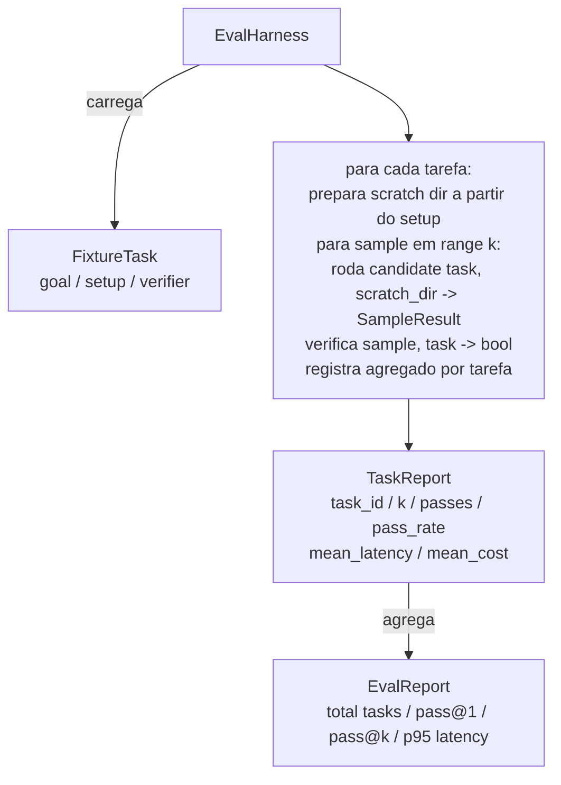

# Capstone Aula 27: Eval Harness com Fixture Tasks

> Um coding agente é tão bom quanto a suíte de tarefas contra a qual você o mede. Esta aula constrói um eval harness que pega uma pasta de fixture tasks, roda cada uma através de um candidate agent, pontua pass ou fail através de um verificador determinístico, e agrega os resultados em pass@1, pass@k, latência média e custo médio. O harness é a fonte de verdade que te permite distinguir uma regressão de um refactor.

**Tipo:** Build
**Linguagens:** Python (stdlib)
**Pré-requisitos:** Fase 19 · 25 (verification gates), Fase 19 · 26 (sandbox runner), Fase 14 · 30 (desenvolvimento de agente guiado por eval), Fase 14 · 19 (benchmarks SWE-bench e GAIA)
**Tempo:** ~90 minutos

## Objetivos de Aprendizado

- Definir uma fixture task como uma terna de objetivo, setup e verificador.
- Pontuar múltiplas execuções por tarefa e computar pass@1 e pass@k.
- Agregar latência e custo em métricas de média e percentil 95.
- Conectar verificadores determinísticos (diff de arquivo, exit code, casamento de regex) em funções reutilizáveis.
- Emitir um relatório JSON estruturado que um script de rastreamento de regressão pode ingerir.

## O Problema

Três modos de falha assolam benchmarks de agente construídos sem um eval harness.

A primeira é pass não verificado. O agente diz que corrigiu o bug, o humano dá uma olhada no diff, a suíte é marcada verde, e três semanas depois o teste de regressão revela o mesmo bug. O agente raciocinou plausivelmente sem realmente corrigir nada.

A segunda é regressão não detectada. Uma mudança no template do prompt torna o agente 4% melhor na tarefa barulhenta e 14% pior na quieta. Sem um goldset e uma pontuação por tarefa, a regressão entra no main e aparece só quando um cliente reclama.

A terceira é deriva por tarefa. O eval foi rodado na segunda com 100 tarefas e na sexta com 95 delas, porque alguém renomeou cinco fixtures. A taxa de pass parece uma melhoria de 5%. Não é.

O harness é o programa que transforma essas falhas em fatos. Roda cada fixture, toda vez, em ordem reproduzível, contra um verificador que retorna true ou false em uma verificação determinística.

## O Conceito

```mermaid
flowchart LR
  F1[fixtures/task_001/<br/>task.json + expected/] --> Harness
  F2[fixtures/task_002/<br/>...] --> Harness
  Harness[Harness<br/>para cada tarefa:<br/>setup / roda agente k amostras /<br/>verifica cada amostra /<br/>registra latência, custo]
  Harness --> Report[EvalReport<br/>pass@1 / pass@k<br/>ms médio / p95 ms<br/>custo médio]
```

Uma `FixtureTask` é um pequeno arquivo JSON mais um diretório opcional `expected/`. O JSON declara um `id`, um `goal` (o prompt alimentado ao agent), um bloco `setup` (arquivos para colocar no diretório scratch), e um bloco `verifier`. O bloco nomeia uma função no registry de verificadores do harness e fornece seus argumentos.

Três formas de verificador cobrem a maioria das tarefas úteis.

A primeira é `file_equals`. Depois que o agente roda, compara um arquivo nomeado contra um conteúdo esperado. Isso apanha tarefas de "corrija este bug desta forma exata".

A segunda é `regex_match`. O conteúdo do arquivo nomeado é casado contra uma regex. Isso apanha tarefas onde "a função deve existir e retornar X" com muitas soluções aceitáveis.

A terceira é `shell_exit_zero`. O harness roda um comando shell (através do sandbox da aula 26) e passa a tarefa apenas se o comando sai com zero. Isso apanha tarefas onde "os testes devem passar".

O harness roda cada tarefa `k` vezes. Pass@k é `1 - (1 - p)^k` onde p é a taxa de pass empírica; o harness também reporta contagens brutas para você identificar variância. Latência é wall-clock por amostra. Custo é o que o agente autoreporta (contagem de tokens, USD, ou ambos); o harness soma entre amostras e apresenta números por tarefa e agregados.

## Arquitetura



O candidate é um callable: `Callable[[FixtureTask, str], SampleResult]`. O harness cria o diretório scratch via `tempfile.mkdtemp()` e passa seu caminho como string pura. O harness não se importa como o candidate funciona. O candidate pode ser um aplicador de patch determinístico (útil para auto-testes do harness), um agente LLM real, um fuzzer. O contrato é o SampleResult.

## O que você vai construir

`main.py` fornece:

1. Dataclass `FixtureTask`.
2. Dataclass `SampleResult`: success_self_reported, latency_ms, cost_units, edits.
3. Dataclasses `TaskReport`, `EvalReport` com `to_dict()`.
4. `VerifierRegistry` mapeando nome do verificador para função. Verificadores embutidos: file_equals, regex_match, shell_exit_zero.
5. Classe `EvalHarness`. Roda um diretório de tarefas contra um candidate. Retorna EvalReport.
6. Cinco fixture tasks empacotadas em `tasks/`:
   - off-by-one em `fizzbuzz`
   - return faltando em `factorial`
   - typo na mensagem de erro
   - corpo de função vazio
   - off-by-one em traversal de linked list
7. Um candidate de referência determinístico (`apply_known_fixes`) que o harness usa para demonstrar um pass@1 limpo de 1.0.
8. Demo imprime o EvalReport em JSON e sai com zero.

As fixture tasks são empacotadas como arquivos JSON em `tasks/` mais arquivos fonte pareados em `tasks/<id>/buggy/` e `tasks/<id>/expected/`. O harness copia buggy para um diretório scratch, entrega ao candidate, e verifica contra expected.

## Por que pass@k e não apenas pass@1

Agents LLM reais são estocásticos. Um pass@1 de 0.6 parece uma falha. Um pass@5 de 0.95 diz que o agente obtém a resposta certa na maioria das vezes mas está errando nas primeiras amostras. A correção é amostrar e ranquear, não sempre mais treinamento. Pass@k torna isso visível.

Pass@k é reportado junto com pass@1 porque pass@k mascara uma falha real: se o model obtém a resposta certa uma em vinte tentativas você não tem um agente útil. O harness mostra ambos.

## Como isso compõe com o resto da Trilha A

A aula 25 produziu a cadeia de gates. A aula 26 produziu o sandbox. O harness usa o sandbox para qualquer verificador `shell_exit_zero`. A aula 28 envolve cada execução do harness em um trace OTel. A aula 29 roda a demo ponta a ponta contra uma das fixtures empacotadas e asserção pass@1 = 1.0 para o candidate de referência.

## Rodando

```bash
cd phases/19-capstone-projects/27-eval-harness-fixture-tasks
python3 code/main.py
python3 -m pytest code/tests/ -v
```

A demo imprime o EvalReport em JSON, incluindo pass@1, pass@5, latência média e detalhamento por tarefa. O exit code é zero. Os testes cobrem as funções de verificação, a matemática de pass@k, o carregamento de fixtures, e o harness ponta a ponta contra o candidate de referência empacotado.
