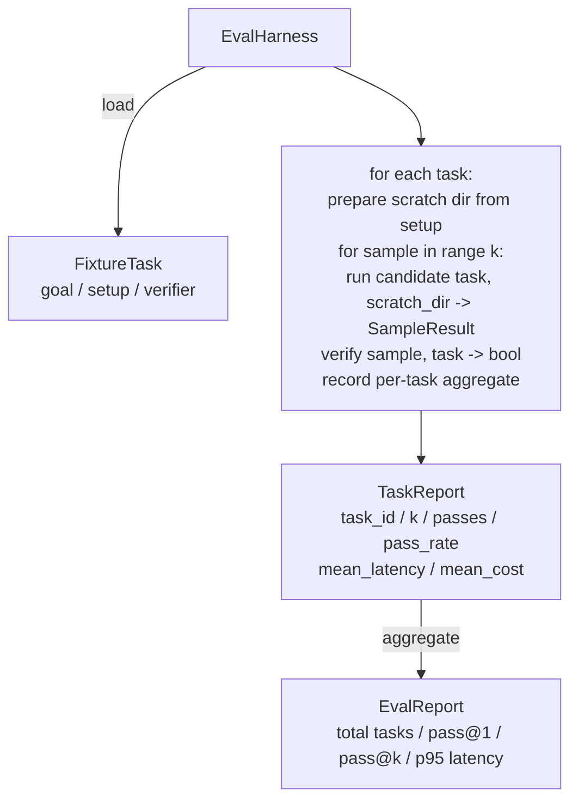

# Bitirme Dersi 27: Demirbaş Görevleriyle Değerlendirilmesi

> Bir agent kodlaması yalnızca onu ölçtüğünüz görev paketi kadar iyidir. Bu ders, fikstür görevlerinden oluşan bir klasör alan, her birini bir aday agent aracılığıyla çalıştıran, deterministik bir doğrulayıcı aracılığıyla başarılı veya başarısız puanları alan ve sonuçları pass@1, pass@k, ortalama gecikme ve ortalama maliyet olarak toplayan bir değerlendirme sistemi oluşturur. Koşum takımı, bir refactor'dan bir regresyonu anlamanızı sağlayan gerçeğin kaynağıdır.

**Tür:** Yapım
**Diller:** Python (stdlib)
**Önkoşullar:** Aşama 19 · 25 (doğrulama kapıları), Aşama 19 · 26 (korumalı alan koşucusu), Aşama 14 · 30 (değerlendirme odaklı agent geliştirme), Aşama 14 · 19 (SWE tezgahı ve GAIA benchmark'lar)
**Süre:** ~90 dakika

## Öğrenme Hedefleri

- Bir fikstür görevini hedef, kurulum ve doğrulayıcıdan oluşan üçlü bir görev olarak tanımlayın.
- Görev başına birden fazla örnek çalıştırmayı puanlayın ve pass@1 ve pass@k'yi hesaplayın.
- Gecikme ve maliyeti ortalama ve yüzde 95'lik metriklere göre toplayın.
- Belirleyici doğrulayıcıları (dosya farkı, çıkış kodu, normal ifade eşleşmesi) yeniden kullanılabilir işlevlere bağlayın.
- Bir regresyon izleme komut dosyasının alabileceği yapılandırılmış bir JSON raporu yayınlayın.

## Sorun

Üç arıza modu, değerlendirme donanımı olmadan inşa edilen agent benchmark'ı rahatsız ediyor.

Birincisi doğrulanmamış geçiş. agent hatayı düzelttiğini söylüyor, insan farka bakıyor, paket yeşil olarak işaretleniyor ve üç hafta sonra regresyon testi aynı hatayı ortaya çıkarıyor. agent aslında hiçbir şeyi düzeltmeden makul bir şekilde mantık yürütmüştü.

İkincisi ise tespit edilemeyen gerilemedir. prompt şablonunda yapılan bir değişiklik, agent'ı gürültülü görevde %4 daha iyi ve sessiz görevde %14 daha kötü yapar. Goldset ve görev başına puan olmadığında, regresyon ana sisteme giriyor ve yalnızca müşteri şikayet ettiğinde yüzeye çıkıyor.

Üçüncüsü görev başına sapmadır. Değerlendirme Pazartesi günü 100 görevle ve Cuma günü 95 görevle gerçekleştirildi çünkü birisi beş fikstürü yeniden adlandırdı. Geçiş oranı %5'lik bir iyileşme gibi görünüyor. Değil.

Koşum takımı bu başarısızlıkları gerçeklere dönüştüren programdır. Her fikstürü, her seferinde tekrarlanabilir bir sırayla, deterministik bir kontrolde doğru veya yanlış döndüren bir doğrulayıcıya karşı çalıştırır.

## Konsept

```mermaid
flowchart LR
  F1[fixtures/task_001/<br/>task.json + expected/] --> Harness
  F2[fixtures/task_002/<br/>...] --> Harness
  Harness[Harness<br/>for each task:<br/>setup / run agent k samples /<br/>verify each sample /<br/>record latency, cost]
  Harness --> Report[EvalReport<br/>pass@1 / pass@k<br/>mean ms / p95 ms<br/>mean cost]
```

`FixtureTask` , küçük bir JSON dosyasına ek olarak isteğe bağlı bir `expected/` dizinidir. JSON bir `id`, bir `goal` (agent'a beslenen prompt), bir `setup` bloğu (çizik dizinine bırakılacak dosyalar) ve bir `verifier` bloğu bildirir. Doğrulayıcı bloğu, donanımın doğrulayıcı kaydındaki bir fonksiyonu adlandırır ve argümanlarını sağlar.

Üç doğrulayıcı şekli, yararlı görevlerin çoğunu kapsar.

İlki `file_equals`. agent çalıştırıldıktan sonra, adlandırılmış dosyayı beklenen içerikle karşılaştırın. Bu, "bu hatayı tam olarak bu şekilde düzelt" görevlerini yakalar.

İkincisi `regex_match`. Adlandırılmış dosyanın içeriği bir normal ifadeyle eşleştirilir. Bu, birçok kabul edilebilir çözümün olduğu "işlev var olmalı ve X'i döndürmelidir" görevlerini yakalar.

Üçüncüsü `shell_exit_zero`'dur. Kablo demeti bir kabuk komutunu çalıştırır (ders 26'daki sanal alan aracılığıyla) ve yalnızca komut sıfırdan çıkarsa görevi geçer. Bu, "testlerin geçmesi gerekir" görevlerini yakalar.

Emniyet kemeri her görevi `k` kez çalıştırır. Pass@k `1 - (1 - p)^k` 'dir; burada p ampirik geçiş hızıdır; koşum ayrıca ham sayımları da rapor eder, böylece farklılıkları tespit edebilirsiniz. Gecikme, örnek başına duvar saatidir. Maliyet, agent öz raporu ne olursa olsun (token sayısı, USD veya her ikisi); koşum bunu örnekler arasında toplar ve göreve özel ve toplam sayıları sunar.

```figure
pass-at-k
```

## Mimarlık



Aday aranabilir: `Callable[[FixtureTask, str], SampleResult]`. Kablo demeti, `tempfile.mkdtemp()` aracılığıyla karalama dizinini oluşturur ve yolunu düz bir dize olarak geçirir. Koşum adayının nasıl çalıştığı umurunda değil. Aday, deterministik bir yama uygulayıcısı (kendi kendine koşum testleri için yararlı), gerçek bir LLM agent, bir fuzzer olabilir. Sözleşme SampleResult'tur.

## Ne inşa edeceksiniz

`main.py` gemileri:

1. `FixtureTask` veri sınıfı.
2. `SampleResult` veri sınıfı: Success_self_reported, latency_ms, cost_units, edits.
3. `TaskReport`, `EvalReport` veri sınıfları ile `to_dict()`.
4. Doğrulayıcı adını işlevle eşleyen `VerifierRegistry` . Yerleşik doğrulayıcılar: file_equals, regex_match, Shell_exit_zero.
5. `EvalHarness` sınıfı. Bir adaya karşı bir görev dizini çalıştırır. EvalReport'u döndürür.
6. `tasks/`'da paketlenmiş beş fikstür görevi:
- `fizzbuzz`'da tek tek
- `factorial`'da eksik dönüş
- hata mesajında ​​yazım hatası
- boş fonksiyon gövdesi
- bağlantılı liste geçişinde tek tek
7. Koşumun 1,0'lık temiz bir pass@1 göstermek için kullandığı deterministik bir referans adayı (`apply_known_fixes`) .
8. Demo, EvalReport JSON'u yazdırır ve sıfırdan çıkar.

Fikstür görevleri, `tasks/` içinde JSON dosyaları ve ayrıca `tasks/<id>/buggy/` ve `tasks/<id>/expected/` içinde eşleştirilmiş kaynak dosyaları olarak paketlenir. Koşum takımı arabayı bir çizik dizinine kopyalar, onu adaya verir ve beklenene göre doğrular.

## Neden sadece pass@1 değil de pass@k

Gerçek Yüksek Lisans agent'lar stokastiktir. Pass@1'in 0,6 olması bir başarısızlık gibi görünüyor. 0,95 üzerinden pass@5, agent'ın çoğu zaman doğru cevabı aldığını ancak ilk örneklerde yanlışı seçtiğini söylüyor. Çözüm, her zaman daha fazla eğitim değil, örnekleme ve sıralamadır. Pass@k bunu görünür kılıyor.

Pass@k, pass@1 ile birlikte raporlanır çünkü pass@k gerçek bir başarısızlık hakkında bilgi verir: eğer model yirmi denemede bir doğru cevabı alırsa kullanışlı bir agent'a sahip olmazsınız. Koşum takımı her ikisini de gösterir.

## Bunun A Parçasının geri kalanıyla nasıl birleştiği

Ders 25 kapı zincirini oluşturdu. Ders 26 korumalı alanı oluşturdu. Kablo demeti herhangi bir `shell_exit_zero` doğrulayıcı için korumalı alanı kullanır. Ders 28, her bir koşum koşumunu bir OTel izinde sarar. Ders 29, uçtan uca demoyu paket donanımlardan birine karşı çalıştırır ve referans adayı için pass@1 = 1,0 değerini ileri sürer.

## Çalıştırıyorum

```bash
cd phases/19-capstone-projects/27-eval-harness-fixture-tasks
python3 code/main.py
python3 -m pytest code/tests/ -v
```

Demo, pass@1, pass@5, ortalama gecikme ve görev başına döküm dahil olmak üzere EvalReport'u JSON'da yazdırır. Çıkış kodu sıfırdır. Testler, doğrulama işlevlerini, pass@k matematiğini, fikstür yüklemeyi ve paket halindeki referans adayına karşı uçtan uca kablo demetini kapsar.
