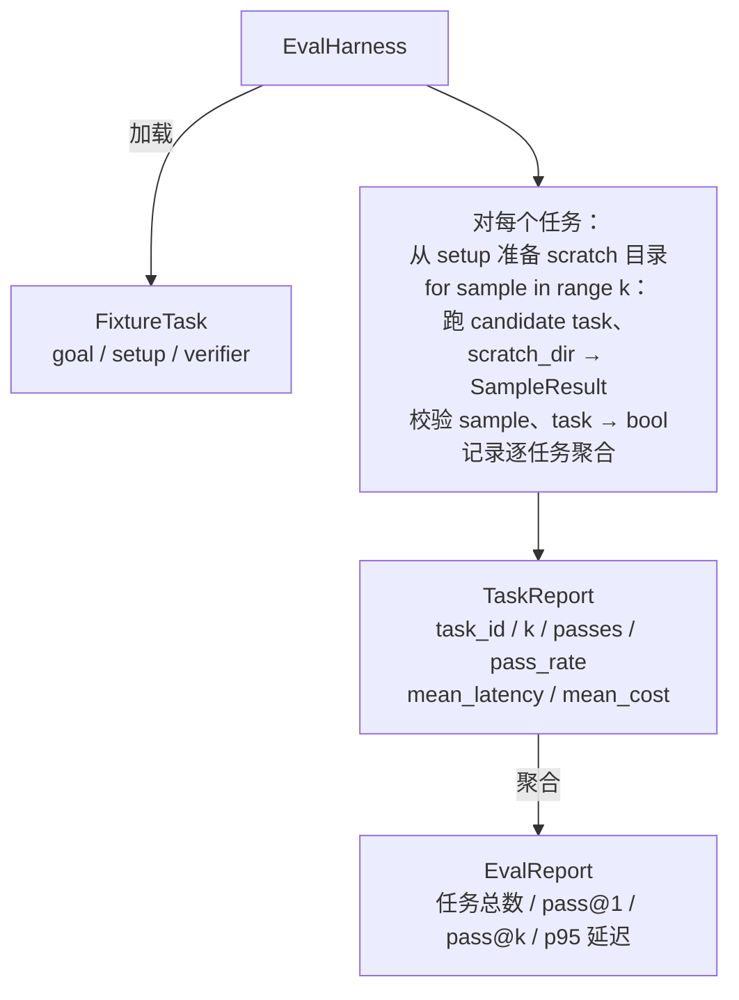

# Capstone 第 27 课：带 fixture 任务的评估 harness（Eval Harness with Fixture Tasks）

> 译注：本文译自同目录 [`en.md`](./en.md)。术语遵循仓根 [TRANSLATION_GUIDE.md](../../../../TRANSLATION_GUIDE.md)。

> 一个编码 agent 的好坏，取决于你拿来衡量它的那套任务集。本课构建一个评估 harness：吃下一个装满 fixture 任务的目录，把每个任务交给候选 agent 跑一遍，通过确定性 verifier（验证器）打出 pass / fail，再把结果聚合成 pass@1、pass@k、平均延迟和平均成本。这套 harness 就是真理之源——靠它你才能分清是真实回归，还是只是一次重构。

**Type:** Build
**Languages:** Python (stdlib)
**Prerequisites:** Phase 19 · 25（验证 gate）、Phase 19 · 26（沙箱 runner）、Phase 14 · 30（评估驱动的 agent 开发）、Phase 14 · 19（SWE-bench 与 GAIA 基准）
**Time:** ~90 minutes

## 学习目标（Learning Objectives）

- 把 fixture 任务定义为「目标 + 准备 + verifier」三元组。
- 对每个任务运行多次采样，并计算 pass@1 与 pass@k。
- 把延迟和成本聚合成均值与 95 百分位指标。
- 把确定性 verifier（文件 diff、退出码、正则匹配）封装成可复用函数。
- 输出一份结构化的 JSON 报告，让回归追踪脚本可以直接吃下去。

## 问题（Problem）

不带评估 harness 的 agent 基准测试，往往会被三种失败模式拖垮。

第一种是「未经验证的通过」。agent 说自己修好了 bug，人扫一眼 diff，就把这套测试标绿，然后三周之后回归测试又把同一个 bug 暴出来。agent 只是推理得貌似合理，实际什么都没修。

第二种是「未被发现的回归」。改了一下 prompt 模板，agent 在「热闹」的任务上好了 4%，在「安静」的任务上差了 14%。没有 goldset，没有逐任务打分，回归就这样混进 main 分支，直到客户投诉才被发现。

第三种是「逐任务漂移」。周一跑 eval 用了 100 个任务，周五只跑了 95 个——因为有人重命名了 5 个 fixture。看上去通过率提高了 5%，其实没有。

harness 就是把这些失败转成事实的程序。它每次都按可复现的顺序跑每一个 fixture，对着一个返回 true / false 的确定性检查 verifier。

## 概念（Concept）

```mermaid
flowchart LR
  F1[fixtures/task_001/<br/>task.json + expected/] --> Harness
  F2[fixtures/task_002/<br/>...] --> Harness
  Harness[Harness<br/>对每个任务：<br/>setup / 跑 agent k 次采样 /<br/>校验每次采样 /<br/>记录延迟、成本]
  Harness --> Report[EvalReport<br/>pass@1 / pass@k<br/>mean ms / p95 ms<br/>平均成本]
```

一个 `FixtureTask` 就是一个小 JSON 文件加上可选的 `expected/` 目录。JSON 里声明 `id`、`goal`（喂给 agent 的 prompt）、`setup` 块（要丢进 scratch 目录的文件）和 `verifier` 块。verifier 块指定 harness 的 verifier 注册表里的某个函数名，并提供它的参数。

三种 verifier 形态足以覆盖大部分有用任务。

第一种是 `file_equals`。agent 跑完后，拿一个指定文件去和期望内容比对。这能抓住「按这个固定方式修这个 bug」的任务。

第二种是 `regex_match`。指定文件的内容用正则去匹配。这能抓住「这个函数必须存在且返回 X」这种有多个可接受解的任务。

第三种是 `shell_exit_zero`。harness 跑一个 shell 命令（通过第 26 课的沙箱），只有命令退出码为零任务才算通过。这能抓住「测试必须通过」的任务。

harness 对每个任务跑 `k` 次。Pass@k 等于 `1 - (1 - p)^k`，其中 p 是经验通过率；harness 还会输出原始计数，方便你观察方差。延迟是每次采样的 wall-clock。成本是 agent 自己上报的任何指标（token 数、美元，或两者皆有）；harness 把它们在所有采样上累加，再呈现逐任务和聚合数字。

## 架构（Architecture）



候选（candidate）就是一个 callable：`Callable[[FixtureTask, str], SampleResult]`。harness 通过 `tempfile.mkdtemp()` 创建 scratch 目录，把它的路径作为普通字符串传进去。harness 不关心 candidate 内部怎么工作。candidate 可以是一个确定性补丁器（在 harness 自测时很有用）、一个真正的 LLM agent，或者一个 fuzzer。它们之间唯一的契约就是 SampleResult。

## 你将构建什么（What you will build）

`main.py` 提供：

1. `FixtureTask` dataclass。
2. `SampleResult` dataclass：success_self_reported、latency_ms、cost_units、edits。
3. `TaskReport`、`EvalReport` dataclass，带 `to_dict()`。
4. `VerifierRegistry`：把 verifier 名映射到函数。内置 verifier：file_equals、regex_match、shell_exit_zero。
5. `EvalHarness` 类。在某个目录下针对 candidate 跑全部任务，返回 EvalReport。
6. 五个打包在 `tasks/` 里的 fixture 任务：
   - `fizzbuzz` 里的 off-by-one
   - `factorial` 里缺失的 return
   - 错误信息里的 typo
   - 空函数体
   - 链表遍历里的 off-by-one
7. 一个确定性的参考 candidate（`apply_known_fixes`），harness 用它来演示 pass@1 干净地跑到 1.0。
8. demo 打印 EvalReport JSON 然后退出零。

fixture 任务以 JSON 文件形式打包在 `tasks/` 下，配套的源文件分别放在 `tasks/<id>/buggy/` 和 `tasks/<id>/expected/`。harness 把 buggy 拷进 scratch 目录，交给 candidate，再用 expected 去校验。

## 为什么用 pass@k 而不只是 pass@1

真实的 LLM agent 是随机的。pass@1 = 0.6 看起来像失败；pass@5 = 0.95 则告诉你 agent 大多数时候能给出正确答案，只是早期采样里挑错了。修复方式是采样加排序，而不是一味多训练。pass@k 把这件事可视化出来。

报告 pass@k 的同时也要报告 pass@1，因为 pass@k 会粉饰一个真实的失败：如果模型在二十次里只对一次，你拿到的并不是一个有用的 agent。harness 两个都展示。

## 它如何与 Track A 的其他部分组合

第 25 课产出了 gate 链。第 26 课产出了沙箱。harness 在任何 `shell_exit_zero` verifier 里都会用沙箱。第 28 课把每一次 harness 运行包进一个 OTel trace。第 29 课跑端到端 demo，针对其中一个打包好的 fixture 验证参考 candidate 的 pass@1 = 1.0。

## 如何运行（Running it）

```bash
cd phases/19-capstone-projects/27-eval-harness-fixture-tasks
python3 code/main.py
python3 -m pytest code/tests/ -v
```

demo 会以 JSON 打印 EvalReport，包含 pass@1、pass@5、平均延迟以及逐任务明细。退出码为零。测试覆盖 verifier 函数、pass@k 数学、fixture 加载，以及 harness 在打包的参考 candidate 上的端到端运行。
