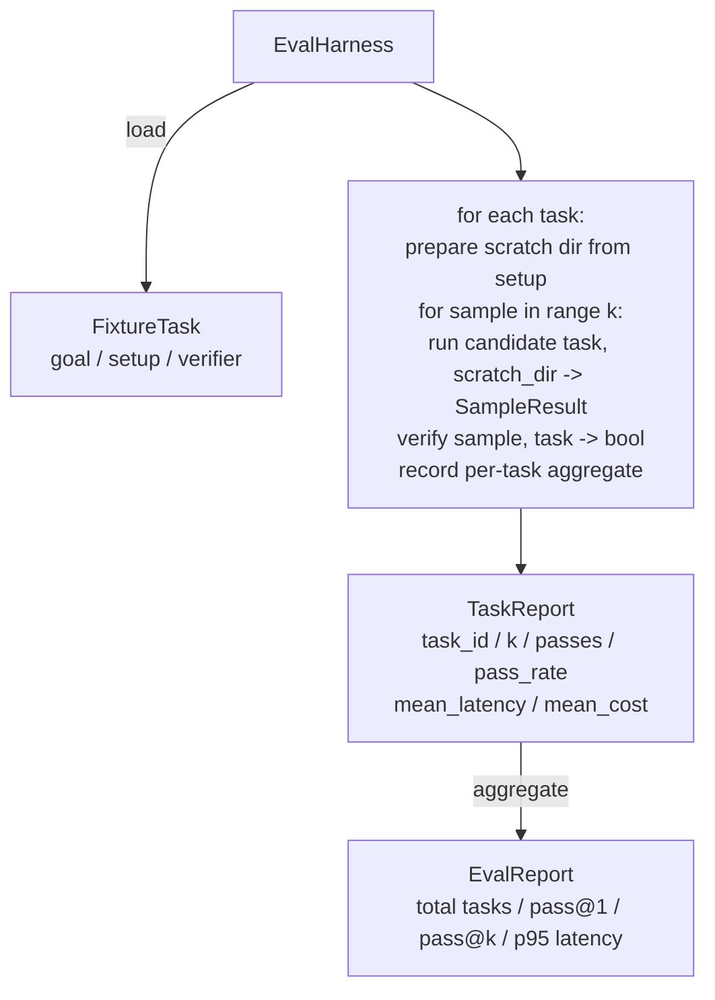

# 27 · 评估测试工具与夹具任务

> 一个编程智能体的能力上限，取决于你用来衡量它的任务集的质量。本课构建一个评估测试工具（eval harness）：接收一个夹具任务（fixture task）文件夹，逐个交由候选智能体执行，通过确定性验证器（verifier）判定通过或失败，最终汇总出 pass@1、pass@k、平均延迟和平均成本等指标。这个测试工具就是真相来源（source of truth），让你能区分什么是一次回归，什么是一次重构。

**类型：** 构建
**语言：** Python（标准库）
**前置：** 阶段 19 · 25（验证门控）、阶段 19 · 26（沙箱运行器）、阶段 14 · 30（评估驱动的智能体开发）、阶段 14 · 19（SWE-bench 与 GAIA 基准）
**时长：** 约 90 分钟

## 学习目标

- 将夹具任务定义为一个三元组：目标（goal）、准备（setup）和验证器（verifier）。
- 对每个任务采集多次运行样本，计算 pass@1 和 pass@k。
- 将延迟和成本汇总为平均值和 P95 指标。
- 将确定性验证器（文件比对、退出码、正则匹配）封装为可复用函数。
- 输出一份结构化 JSON 报告，可供回归跟踪脚本直接读取。

## 问题所在

没有评估测试工具的情况下构建的智能体基准测试，通常会遭遇三类典型的失败模式。

第一类是**未经验证的"通过"**。智能体声称修复了 bug，开发者扫了一眼 diff，测试套件被标为绿色，三周后回归测试又翻出了同一个 bug。智能体推理得头头是道，实际上什么都没改。

第二类是**未检测到的回归**。提示模板的某次改动让智能体在热门任务上提升了 4%，却在冷门任务上退步了 14%。没有黄金集（goldset）和逐任务评分，这次回归就悄悄进了主分支，直到客户投诉才会被发现。

第三类是**逐任务漂移**。周一用 100 个任务跑的评测，周五只剩下 95 个——因为有人重命名了五个夹具。通过率看起来提升了 5%，实际上是假的。

测试工具就是把这些失败模式转化为事实的程序。它每次运行全部夹具，按可复现的顺序，交给一个返回 true 或 false 确定性检查的验证器。

## 核心概念

```mermaid
flowchart LR
  F1[fixtures/task_001/<br/>task.json + expected/] --> Harness
  F2[fixtures/task_002/<br/>...] --> Harness
  Harness[Harness<br/>for each task:<br/>setup / run agent k samples /<br/>verify each sample /<br/>record latency, cost]
  Harness --> Report[EvalReport<br/>pass@1 / pass@k<br/>mean ms / p95 ms<br/>mean cost]
```

一个 `FixtureTask` 由一个小型 JSON 文件加上一个可选的 `expected/` 目录组成。JSON 声明一个 `id`、一个 `goal`（传给智能体的提示词）、一个 `setup` 块（放入临时目录的文件），以及一个 `verifier` 块。verifier 块指定测试工具验证器注册表中的函数名并提供其参数。

三种验证器形态覆盖了大多数实用任务场景。

第一种是 `file_equals`。智能体运行结束后，将指定文件与预期内容进行比对。这适用于"用这种精确方式修复这个 bug"类型的任务。

第二种是 `regex_match`。将指定文件的内容与一个正则表达式进行匹配。这适用于"该函数必须存在并返回 X 值"类型的任务，这类任务通常存在多种可接受的解法。

第三种是 `shell_exit_zero`。测试工具通过第 26 课的沙箱执行一条 shell 命令，仅当命令以零退出码结束时才判定任务通过。这适用于"测试必须全部通过"类型的任务。

测试工具对每个任务运行 `k` 次。pass@k 的计算公式为 `1 - (1 - p)^k`，其中 p 是经验通过率；测试工具同时报告原始计数，以便你发现方差。延迟是每个样本的墙上时间（wall-clock）。成本是智能体自行上报的数据（token 数、美元成本或两者兼有）；测试工具在样本间求和，给出逐任务和汇总数据。

## 架构



候选者（candidate）是一个可调用对象：`Callable[[FixtureTask, str], SampleResult]`。测试工具通过 `tempfile.mkdtemp()` 创建临时目录，并将其路径以纯字符串形式传入。测试工具不关心候选者内部如何工作。候选者可以是一个确定性补丁应用器（用于测试工具自身的自测）、一个真实的 LLM 智能体，或者一个模糊测试器。契约只有一条：SampleResult。

## 你将构建的内容

`main.py` 提供：

1. `FixtureTask` 数据类。
2. `SampleResult` 数据类：success_self_reported、latency_ms、cost_units、edits。
3. `TaskReport`、`EvalReport` 数据类，附带 `to_dict()` 方法。
4. `VerifierRegistry`，将验证器名称映射到函数。内置验证器：file_equals、regex_match、shell_exit_zero。
5. `EvalHarness` 类。对一个目录中的任务逐一运行，交给候选者执行，返回 EvalReport。
6. 五个夹具任务，捆绑在 `tasks/` 目录中：
   - `fizzbuzz` 中的差一错误（off-by-one）
   - `factorial` 中缺失的 return 语句
   - 错误消息中的拼写错误
   - 空函数体
   - 链表遍历中的差一错误
7. 一个确定性参考候选者（`apply_known_fixes`），测试工具用它来演示完美的 pass@1 = 1.0。
8. 演示程序打印 EvalReport 的 JSON 并以零退出码结束。

夹具任务以 JSON 文件形式捆绑在 `tasks/` 中，配套的源文件位于 `tasks/<id>/buggy/` 和 `tasks/<id>/expected/`。测试工具将 buggy 内容复制到临时目录中，交给候选者，然后对照 expected 进行验证。

## 为什么需要 pass@k 而不仅仅是 pass@1

真实的 LLM 智能体是随机的。pass@1 为 0.6 看起来像是一次失败，而 pass@5 为 0.95 则说明智能体大多数情况下能给出正确答案，只是在早期采样中选错了。修复方案是多次采样然后排序，而不总是增加训练。pass@k 让这一点变得可见。

pass@k 与 pass@1 并列报告，因为 pass@k 可能掩盖一种真正的失败：如果模型在二十次尝试中只有一次得到正确答案，那你拥有的并不是一个可用的智能体。测试工具同时展示两者。

## 与 Track A 其余课程的衔接

第 25 课产出了门控链（gate chain）。第 26 课产出了沙箱（sandbox）。测试工具对任何 `shell_exit_zero` 验证器使用沙箱。第 28 课将每次测试工具运行包装进 OTel 追踪。第 29 课针对某个捆绑的夹具运行端到端演示，并断言参考候选者的 pass@1 = 1.0。

## 运行方式

```bash
cd phases/19-capstone-projects/27-eval-harness-fixture-tasks
python3 code/main.py
python3 -m pytest code/tests/ -v
```

演示程序以 JSON 格式打印 EvalReport，包括 pass@1、pass@5、平均延迟和逐任务细分。退出码为零。测试覆盖了验证器函数、pass@k 的数学计算、夹具加载，以及测试工具针对捆绑参考候选者的端到端运行。
