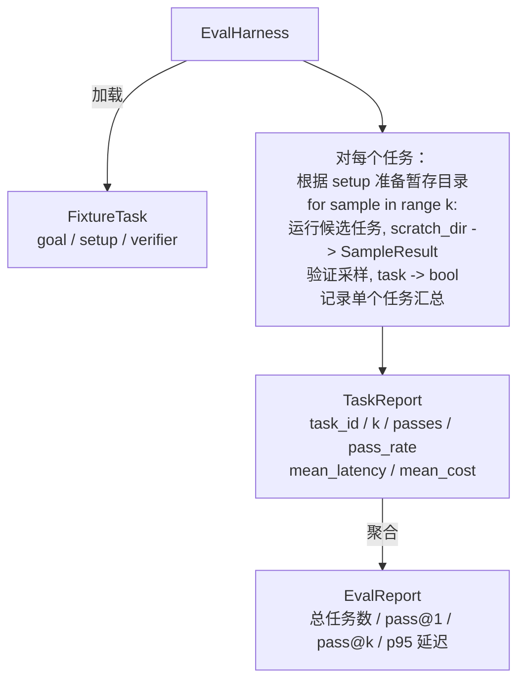

# 顶点课程 27：使用 Fixture 任务的评估框架

> 一个编程智能体的优劣，取决于你用来衡量它的任务集。本课程构建了一个评估框架：接收一个 fixture 任务文件夹，对每个任务通过候选智能体运行，使用确定性验证器判定通过或失败，并将结果汇总为 pass@1、pass@k、平均延迟和平均成本。这个评估框架是真相之源，让你能够区分代码重构与性能回退。

**类型：** 构建  
**语言：** Python（标准库）  
**前置课程：** 阶段 19 · 25（验证门）、阶段 19 · 26（沙箱运行器）、阶段 14 · 30（评估驱动的智能体开发）、阶段 14 · 19（SWE-bench 和 GAIA 基准）  
**时长：** 约 90 分钟

## 学习目标

- 将 fixture 任务定义为目标、设置和验证器的三元组。
- 对每个任务进行多次采样，计算 pass@1 和 pass@k。
- 将延迟和成本聚合为平均值和第 95 百分位指标。
- 将确定性验证器（文件差异、退出码、正则匹配）封装为可复用的函数。
- 输出结构化的 JSON 报告，可供回归跟踪脚本消费。

## 问题所在

没有评估框架的智能体基准测试存在三种失效模式。

第一种是**未经验证的通过**。智能体说它修复了 bug，人类扫了一眼差异，测试套件标记为绿色，三周后回归测试发现了同样的 bug。智能体只是做出了看似合理的推理，实际上什么也没修复。

第二种是**未被检测到的回退**。对提示模板的一次修改，使智能体在显眼任务上提升了 4%，却在安静任务上下降了 14%。没有黄金数据集和每个任务的得分，这种回退就混进了主分支，直到客户投诉才被发现。

第三种是**单个任务漂移**。周一用 100 个任务运行了评估，周五只剩 95 个，因为有人重命名了五个 fixture。通过率看起来提升了 5%。实际上并没有。

评估框架就是将这些失效模式转化为事实的程序。它以可重现的顺序，每次运行每一个 fixture，并使用基于确定性检查返回真或假的验证器。

## 核心概念

```mermaid
flowchart LR
  F1[fixtures/task_001/<br/>task.json + expected/] --> Harness
  F2[fixtures/task_002/<br/>...] --> Harness
  Harness[评估框架<br/>对每个任务：<br/>设置 / 运行智能体 k 次采样 /<br/>验证每个采样 /<br/>记录延迟、成本]
  Harness --> Report[EvalReport<br/>pass@1 / pass@k<br/>平均毫秒 / p95 毫秒<br/>平均成本]
```

一个 `FixtureTask` 是一个小型的 JSON 文件加上一个可选的 `expected/` 目录。JSON 中声明了 `id`、`goal`（提供给智能体的提示）、`setup` 块（需要放入暂存目录的文件）和 `verifier` 块。验证器块指定了评估框架验证器注册表中的一个函数及其参数。

三种验证器形态覆盖了大多数有用的任务。

第一种是 `file_equals`。在智能体运行后，将指定文件与预期内容进行比较。这适用于"以这种确切方式修复这个 bug"的任务。

第二种是 `regex_match`。将指定文件的内容与正则表达式进行匹配。这适用于"函数必须存在并返回 X"的任务，其中存在多种可接受的解决方案。

第三种是 `shell_exit_zero`。评估框架运行一个 shell 命令（通过第 26 课的沙箱），只有命令以零退出码退出时任务才算通过。这适用于"测试必须通过"的任务。

评估框架对每个任务运行 `k` 次。Pass@k 为 `1 - (1 - p)^k`，其中 p 是经验通过率；评估框架还会报告原始计数，以便你发现方差。延迟是每个采样的挂钟时间。成本则是智能体自行报告的内容（token 数量、美元金额或两者皆有）；评估框架将所有采样的成本累加，并展示每个任务和汇总的数据。

```figure
pass-at-k
```

## 架构


```mermaid
flowchart TD
  Harness[EvalHarness] -->|加载| Task[FixtureTask<br/>goal / setup / verifier]
  Harness --> Loop[对每个任务：<br/>根据 setup 准备暂存目录<br/>for sample in range k:<br/>运行候选任务, scratch_dir -> SampleResult<br/>验证采样, task -> bool<br/>记录单个任务汇总]
  Loop --> TaskReport[TaskReport<br/>task_id / k / passes / pass_rate<br/>mean_latency / mean_cost]
  TaskReport -->|聚合| EvalReport[EvalReport<br/>总任务数 / pass@1 / pass@k / p95 延迟]
```

候选者是一个可调用对象：`Callable[[FixtureTask, str], SampleResult]`。评估框架通过 `tempfile.mkdtemp()` 创建暂存目录，并将其路径作为普通字符串传递。评估框架不关心候选者如何工作。候选者可以是一个确定性的补丁应用器（适用于评估框架的自测试）、一个真正的 LLM 智能体，或者一个模糊测试器。契约就是 SampleResult。

## 你将构建的内容

`main.py` 提供：

1. `FixtureTask` 数据类。
2. `SampleResult` 数据类：success_self_reported、latency_ms、cost_units、edits。
3. `TaskReport`、`EvalReport` 数据类，附带 `to_dict()` 方法。
4. `VerifierRegistry` 将验证器名称映射到对应的函数。内置验证器：file_equals、regex_match、shell_exit_zero。
5. `EvalHarness` 类。对候选者运行一个任务目录，返回 EvalReport。
6. 在 `tasks/` 中打包的五个 fixture 任务：
   - `fizzbuzz` 中的差一错误
   - `factorial` 中缺少 return 语句
   - 错误信息中的拼写错误
   - 空的函数体
   - 链表遍历中的差一错误
7. 一个确定性的参考候选者（`apply_known_fixes`），评估框架用它来演示 pass@1 为 1.0 的完美通过率。
8. 演示程序打印 EvalReport JSON 并以零退出。

fixture 任务以 JSON 文件的形式打包在 `tasks/` 中，并在 `tasks/<id>/buggy/` 和 `tasks/<id>/expected/` 中包含配对的源文件。评估框架将 buggy 文件复制到暂存目录，交给候选者，然后对照 expected 进行验证。

## 为什么用 pass@k 而不仅仅是 pass@1

真正的 LLM 智能体是随机的。pass@1 为 0.6 看起来像是失败。而 pass@5 为 0.95 则说明智能体大多数时候能得到正确答案，只是在早期采样时选错了。解决方法是采样和排序，而不是一味增加训练量。Pass@k 让这一点变得可见。

Pass@k 与 pass@1 同时报告，因为 pass@k 可能会掩盖真正的失败：如果模型在二十次尝试中只有一次正确，那你并没有一个有用的智能体。评估框架同时展示两者。

## 如何与 Track A 的其他部分组合

第 25 课构建了门链。第 26 课构建了沙箱。评估框架在进行任何 `shell_exit_zero` 验证时使用沙箱。第 28 课将每次评估框架运行包装在 OTel 跟踪中。第 29 课针对其中一个捆绑的 fixture 运行端到端演示，并断言参考候选者的 pass@1 为 1.0。

## 运行方式

```bash
cd phases/19-capstone-projects/27-eval-harness-fixture-tasks
python3 code/main.py
python3 -m pytest code/tests/ -v
```

演示程序以 JSON 格式打印 EvalReport，包括 pass@1、pass@5、平均延迟和每个任务的细分数据。退出码为零。测试覆盖了验证器函数、pass@k 数学计算、fixture 加载，以及针对捆绑参考候选者的端到端评估框架测试。
