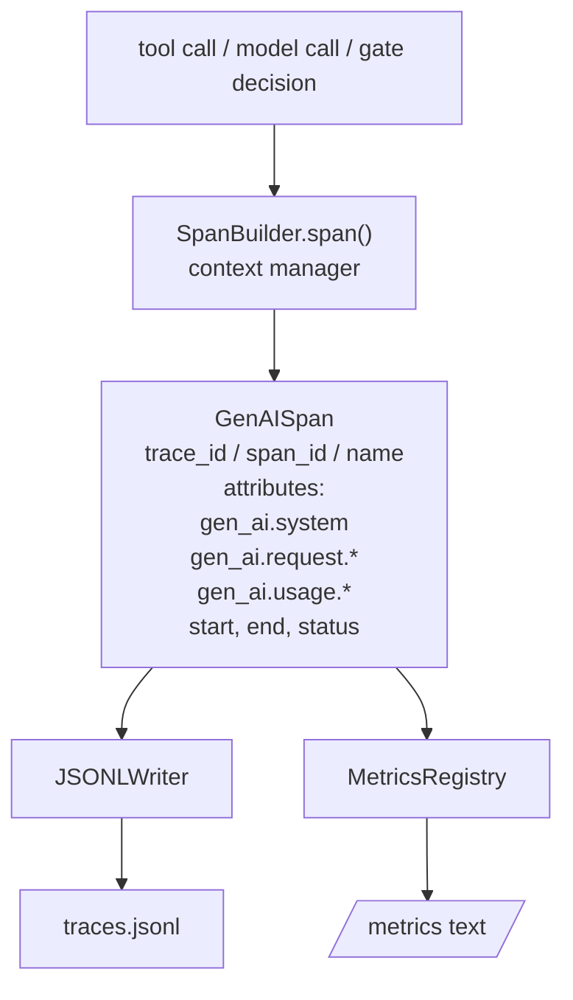
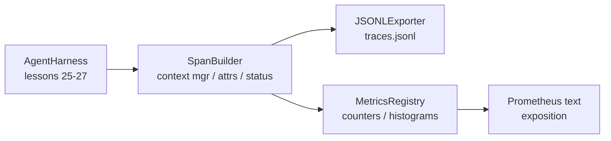

# Capstone Lesson 28: OTel GenAI Span と Prometheus Metrics による Observability

> observability のない agent harness は、費用のかかる black box です。この lesson では OpenTelemetry GenAI semantic conventions に準拠した record を emit する span builder を hand-roll し、1 span 1 line の JSON-Lines file に書き、Prometheus text format で counter と histogram を expose します。すべて stdlib Python で、offline に動きます。

**種別:** 構築
**言語:** Python (stdlib)
**前提条件:** Phase 19 · 25 (verification gates), Phase 19 · 26 (sandbox), Phase 19 · 27 (eval harness), Phase 13 · 20 (OpenTelemetry GenAI), Phase 14 · 23 (OTel GenAI conventions)
**所要時間:** 約90分

## 学習目標

- OpenTelemetry GenAI semantic conventions に沿った span data class を作る。
- self-contained な span を 1 line ずつ書く JSONL exporter を実装する。
- label つき counter と histogram、および Prometheus text-format exposition を作る。
- 任意の callable を span context manager で wrap し、duration、status、exception を記録する。
- emit された span が `json.loads` を roundtrip し、spec shape に合うことを検証する。

## 問題

production の coding agent は各 turn で 3 種類の artifact を生みます。model call、tool execution、verification gate decision です。structured telemetry がなければ、どれも役に立ちません。

1 つ目の failure mode は missing trace です。火曜日に何かが壊れたが、記録は 500 行の chat log だけです。どの tool が走ったのか、どれだけ時間がかかったのか、prompt に何 token 入ったのか、gate が何かを拒否したのか、記録がありません。agent author は推測するしかありません。

2 つ目は unparseable trace です。harness は span を書きましたが、独自の ad-hoc field name を使いました。Grafana、Honeycomb、Jaeger、local CLI のどれも読めません。team の stack にある tooling は、span が non-standard なため無駄になります。

3 つ目は unaggregated metric です。trace 上で 1 つの遅い tool call は見えますが、「直近 1 時間の read_file call の p95 latency は？」には答えられません。metric がなく、trace しかないからです。

OpenTelemetry GenAI semantic conventions はまさにこのためにあります。LLM framework 間で span emitter が共有する standard attribute の小さな set を定義します。harness がそれらの attribute を書けば、すべての OTel-compatible backend が読めます。

## コンセプト



harness 内のすべての operation が span を生みます。span には trace id（agent invocation 全体）、span id（この 1 operation）、name（例: `gen_ai.chat`, `gen_ai.tool.execution`）、GenAI conventions に従う attributes、start/end time、status があります。

GenAI conventions は attribute key を standardize します。`gen_ai.system`（provider、例: `anthropic`, `openai`）、`gen_ai.request.model`（model id）、`gen_ai.request.max_tokens`、`gen_ai.usage.input_tokens`、`gen_ai.usage.output_tokens`、`gen_ai.response.model`、`gen_ai.response.id`、`gen_ai.operation.name`、tool-specific key の `gen_ai.tool.name` と `gen_ai.tool.call.id` です。

exporter は JSONL を書きます。1 line に 1 JSON object。downstream tooling が stream、grep、import できる最も単純な format です。real OTel exporter は OTLP gRPC を話します。この lesson の JSONL exporter は offline equivalent で、どの workstation でも exit zero します。

metric は trace の隣にあります。tool call ごとに counter が increment します。`tools_called_total{tool="read_file"}` です。histogram は observed latency を記録します。`tool_latency_ms{tool="read_file"}` です。どちらも Prometheus text exposition format に serialize します。これは pull-based metrics の事実上の standard です。

## アーキテクチャ



span builder は `span(name, attrs)` method を持つ小さな class です。この method は context manager を返します。context manager は enter 時に start time を記録し、exit 時に end time を記録し、exception が raised されていれば attach し、finalized span を exporter に push します。

metrics registry は 2 つの dict です。Counters は `{(name, frozen_labels): int}`。Histograms は raw sample list を保持し、exposition 時に Prometheus histogram bucket に serialize します。

## 作るもの

`main.py` には以下が入っています。

1. `GenAISpan` dataclass: trace_id, span_id, parent_span_id, name, attributes, start_unix_nano, end_unix_nano, status, status_message, events。
2. `SpanBuilder` class と `span(name, attrs, parent=None)` context manager。
3. `export(span)` が 1 line append する `JSONLExporter` class。
4. `Counter` と `Histogram` class、そして `MetricsRegistry`。
5. text-format output を生成する `prometheus_exposition(registry)`。
6. span を emit して metrics を更新する `wrap_tool_call(name)` decorator。
7. demo: complete agent invocation（tool span を内包する gen_ai.chat span）を合成し、traces.jsonl を書き、Prometheus exposition を print し、exit zero する。

span id と trace id は `os.urandom` 由来の 16-byte hex string です。これは OTel の W3C trace context に合います。exporter は throw しません。IO error は surface しますが、harness は走り続けます。

histogram は fixed bucket set を持ちます（millisecond latency の OTel default: 5, 10, 25, 50, 100, 250, 500, 1000, 2500, 5000, 10000, +Inf）。sample は list として保存し、exposition は demand に応じて per-bucket count を計算します。

## なぜ opentelemetry-sdk ではなく hand-rolled なのか

OTel Python SDK は本物の dependency です。数千行の code、OTLP exporter のための複数 process、lesson budget を圧迫する runtime cost もあります。hand-rolled version は wire format を教えます。production では同じ attribute を real SDK に wire し、OTLP exporter、batching、resource detection をそのまま得ます。

conventions は stable です。この lesson が emit する wire format は 2030 年にも parse できます。OTel は GenAI attribute name を壊しません。新しいものを追加するだけです。

## Track A の他 lesson との合成

Lesson 25 は gate chain を作りました。Lesson 26 は sandbox を作りました。Lesson 27 は eval harness を作りました。Lesson 28 はその 3 つを observable にします。Lesson 29 は end-to-end demo の各 step を span で wrap し、最後に Prometheus text を print します。

## 実行方法

```bash
cd phases/19-capstone-projects/28-observability-otel-traces
python3 code/main.py
python3 -m pytest code/tests/ -v
```

demo は lesson working dir に `traces.jsonl` を emit し（最後に cleanup）、3 span の sample を print し、counter と histogram の Prometheus exposition を print します。tests は span が round-trip serialize されること、canonical GenAI attributes が存在すること、counter が正しく increment すること、histogram exposition が expected bucket count を含むことを検証します。
