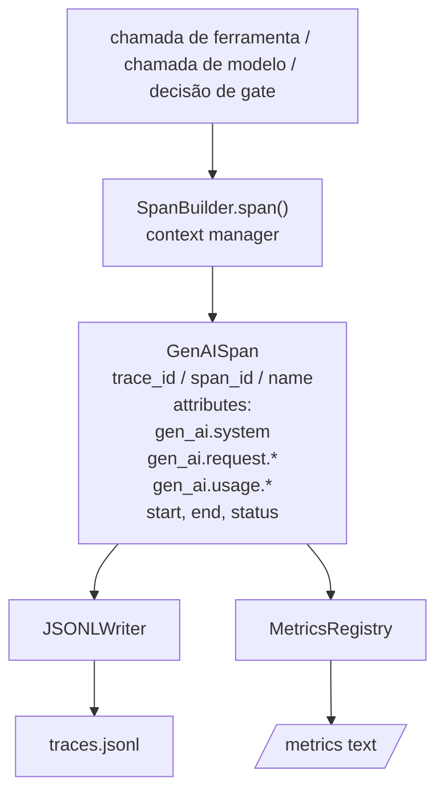
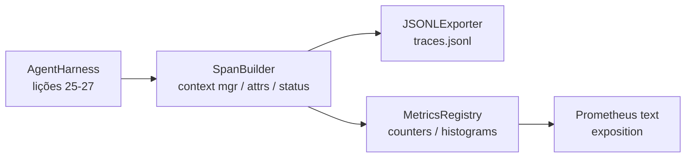

# Lição Capstone 28: Observabilidade com Spans OTel GenAI e Métricas Prometheus

> Um agente harness sem observabilidade é uma caixa preta que gasta dinheiro. Esta aula constrói manualmente um construtor de spans que emite registros compatíveis com as convenções semânticas OpenTelemetry GenAI, escreve-os em um arquivo JSON-Lines um span por linha, e expõe contadores e histogramas em formato de texto Prometheus. Tudo é Python stdlib e roda offline.

**Tipo:** Build
**Linguagens:** Python (stdlib)
**Pré-requisitos:** Fase 19 · 25 (verification gates), Fase 19 · 26 (sandbox), Fase 19 · 27 (eval harness), Fase 13 · 20 (OpenTelemetry GenAI), Fase 14 · 23 (convenções OTel GenAI)
**Tempo:** ~90 minutos

## Objetivos de Aprendizagem

- Construir uma classe de dados de span formatada conforme as convenções semânticas OpenTelemetry GenAI.
- Implementar um exportador JSONL que escreve um span autocontido por linha.
- Construir contadores e histogramas com rótulos e exposição em formato de texto Prometheus.
- Envolver qualquer callable em um context manager de span que registra duração, status e exceções.
- Verificar que os spans emitidos fazem roundtrip por `json.loads` e combinam com a forma da especificação.

## O Problema

Um agente de código em produção produz três classes de artefato a cada turno: uma chamada de modelo, uma execução de ferramenta, e uma decisão de verification gate. Nenhuma dessas é útil sem telemetria estruturada.

O primeiro modo de falha é o trace faltando. Algo deu errado na terça mas o único registro é um log de chat de 500 linhas. Não há registro de qual ferramenta rodou, quanto tempo levou, quantos tokens foram para o prompt, ou se o gate recusou algo. O autor do agente tem que adivinhar.

O segundo modo de falha é o trace não-parsável. O harness escreveu spans mas usou seus próprios nomes de campo ad-hoc. Nada no Grafana, Honeycomb, Jaeger, ou CLI local pode ler. Qualquer tooling existente na stack do time é desperdiçado porque os spans não são padrão.

O terceiro modo de falha é a métrica não-agregada. Você pode ver uma chamada de ferramenta lenta no trace, mas não pode responder "qual é a latência p95 das chamadas de read_file na última hora?" porque não há métricas, apenas traces.

As convenções semânticas OpenTelemetry GenAI existem exatamente para isso. Elas definem um pequeno conjunto de atributos padrão que emissores de spans de frameworks LLM compartilham. Se seu harness escreve esses atributos, cada backend compatível com OTel pode ler.

## O Conceito



Toda operação no harness produz um span. Um span tem um trace id (a invocação inteira do agent), um span id (esta operação eespecificaçãoífica), um nome (ex: `gen_ai.chat`, `gen_ai.tool.execution`), atributos que seguem as convenções GenAI, um tempo de início e fim, e um status.

As convenções GenAI padronizam essas chaves de atributo: `gen_ai.system` (qual provedor, ex: `anthropic`, `openai`), `gen_ai.request.model` (o id do modelo), `gen_ai.request.max_tokens`, `gen_ai.usage.input_tokens`, `gen_ai.usage.output_tokens`, `gen_ai.response.model`, `gen_ai.response.id`, `gen_ai.operation.name`, mais chaves eespecificaçãoíficas de ferramenta `gen_ai.tool.name` e `gen_ai.tool.call.id`.

O exportador escreve JSONL. Um objeto JSON por linha. É o formato mais simples possível que tooling downstream pode streamar, grep e importar. Um exportador OTel real falaria OTLP gRPC; o exportador JSONL da aula é o equivalente offline e sai zero em qualquer workstation.

Métricas vivem ao lado dos traces. Um contador incrementa a cada chamada de ferramenta: `tools_called_total{tool="read_file"}`. Um histograma registra a latência observada: `tool_latency_ms{tool="read_file"}`. Ambos serializam no formato de exposição de texto Prometheus, que é o padrão de fato para métricas baseadas em pull.

## Arquitetura



O construtor de spans é uma pequena classe com um método `span(name, attrs)` que retorna um context manager. O context manager registra o tempo de início na entrada, registra o tempo de fim na saída, anexa uma exceção se uma foi levantada, e envia o span finalizado para o exportador.

O registro de métricas é dois dicts. Contadores são `{(name, frozen_rótulos): int}`. Histogramas mantêm amostras brutas em uma lista e serializam para buckets de histograma Prometheus no momento da exposição.

## O que você vai construir

`main.py` entrega:

1. `GenAISpan` dataclass: trace_id, span_id, parent_span_id, name, attributes, start_unix_nano, end_unix_nano, status, status_message, events.
2. Classe `SpanBuilder` com `span(name, attrs, parent=None)` context manager.
3. Classe `JSONLExporter` com `export(span)` que acrescenta uma linha.
4. Classes `Counter` e `Histogram` mais `MetricsRegistry`.
5. `prometheus_exposition(registry)` que produz saída em formato de texto.
6. Decorador `wrap_tool_call(name)` que emite um span e atualiza métricas.
7. Demo: sintetiza uma invocação completa de agente (span gen_ai.chat ao redor de spans de ferramenta), escreve traces.jsonl, imprime a exposição Prometheus, sai zero.

O span id e trace id são strings hex de 16 bytes, geradas de `os.urandom`. Isso combina com o W3C trace context do OTel. O exportador nunca lança exceção; erros de IO são mostrados mas o harness continua rodando.

O histograma tem um conjunto fixo de buckets (o padrão OTel para latência em milissegundos: 5, 10, 25, 50, 100, 250, 500, 1000, 2500, 5000, 10000, +Inf). Amostras são armazenadas como lista; a exposição computa contagens por bucket sob demanda.

## Por que construir manualmente em vez de usar opentelemetry-sdk

O SDK Python do OTel é uma dependência real. Também são vários milhares de linhas de código, múltiplos processos para o exportador OTLP, e um custo de runtime que sobrepula o orçamento de uma aula. A versão manual ensina o formato de rede. Em produção você conecta os mesmos atributos no SDK real e ganha o exportador OTLP, batching e detecção de recursos de graça.

As convenções são estáveis. O formato de rede que a aula emite continua parseando em 2030 porque o OTel nunca quebra nomes de atributos GenAI; só adiciona novos.

## Como isso compõe com o resto da Trilha A

A lição 25 produziu a cadeia de gates. A lição 26 produziu o sandbox. A lição 27 produziu o eval harness. A lição 28 torna todos observáveis. A lição 29 envolve cada passo da demo de ponta a ponta em spans e imprime o texto Prometheus no final.

## Rodando

```bash
cd phases/19-capstone-projects/28-observability-otel-traces
python3 code/main.py
python3 -m pytest code/tests/ -v
```

A demo emite um `traces.jsonl` no diretório de trabalho da aula (limpo no final), então imprime uma amostra de três spans, e então imprime a exposição Prometheus para contadores e histogramas. Os testes verificam que spans serializam no round-trip, que os atributos GenAI canônicos estão presentes, que contadores incrementam corretamente, e que a exposição do histograma contém as contagens de bucket esperadas.
