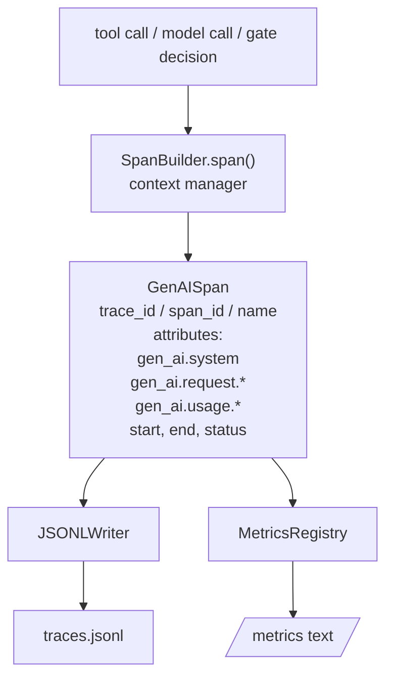
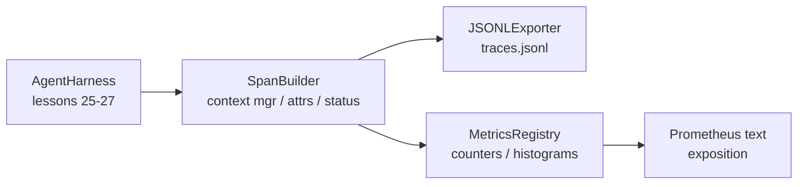

# Bitirme Dersi 28: OTel GenAI Spans ve Prometheus Metrikleri ile Observability

> observability'sız bir agent koşum takımı, paraya mal olan bir kara kutudur. Bu ders, OpenTelemetry GenAI semantik kurallarına uygun kayıtlar yayan, bunları satır başına bir yayılma alanı olacak şekilde JSON-Lines dosyasına yazan ve Prometheus metin formatında sayaçları ve histogramları ortaya çıkaran bir yayılma oluşturucuyu elle yuvarlar. Her şey stdlib Python'dur ve çevrimdışı çalışır.

**Tür:** Yapım
**Diller:** Python (stdlib)
**Önkoşullar:** Aşama 19 · 25 (doğrulama kapıları), Aşama 19 · 26 (korumalı alan), Aşama 19 · 27 (değerlendirme koşum takımı), Aşama 13 · 20 (OpenTelemetry GenAI), Aşama 14 · 23 (OTel GenAI kuralları)
**Süre:** ~90 dakika

## Öğrenme Hedefleri

- OpenTelemetry GenAI semantik kurallarına göre şekillendirilmiş bir yayılma veri sınıfı oluşturun.
- Her satıra bağımsız bir yayılma alanı yazan bir JSONL dışa aktarıcı uygulayın.
- Etiketler ve Prometheus metin formatındaki gösterimle sayaçlar ve histogramlar oluşturun.
- Çağrılabilir herhangi bir şeyi süreyi, durumu ve istisnaları kaydeden bir yayılma bağlam yöneticisine sarın.
- Yayılan dalganın `json.loads` boyunca gidiş dönüşünü kapsadığını ve spesifikasyon şekliyle eşleştiğini doğrulayın.

## Sorun

Üretimdeki bir agent kodlaması, her dönüşte üç artifact sınıfı üretir: bir model çağrısı, bir araç yürütme ve bir doğrulama kapısı kararı. Bunların hiçbiri yapılandırılmış telemetri olmadan kullanışlı değildir.

İlk arıza modu eksik izdir. Salı günü bir şeyler ters gitti ama tek kayıt 500 satırlık bir sohbet günlüğü. Hangi aracın çalıştığına, ne kadar sürdüğüne, prompt'a kaç tane token girdiğine ya da kapının herhangi bir şeyi reddedip reddetmediğine dair bir kayıt yok. agent yazarının tahmin etmesi gerekiyor.

İkinci arıza modu ayrıştırılamaz izlemedir. Koşum aralıkları yazdı ancak kendi özel alan adlarını kullandı. Grafana, Honeycomb, Jaeger veya yerel CLI'deki hiçbir şey bunları okuyamaz. Takımın yığınında bulunan takımlar, açıklıklar standart olmadığı için boşa gidiyor.

Üçüncü başarısızlık modu, toplanmamış ölçümdür. İzlemede bir yavaş araç çağrısı görebilirsiniz ancak "son saatteki read_file çağrılarının p95 gecikmesi nedir?" sorusunu yanıtlayamazsınız. çünkü ölçü yoktur, yalnızca izler vardır.

OpenTelemetry GenAI anlam kuralları tam da bunun için var. LLM framework paylaşımındaki yayıcıları kapsayan küçük bir standart özellikler kümesini tanımlarlar. Eğer koşum takımınız bu nitelikleri yazıyorsa, OTel uyumlu her arka uç bunları okuyabilir.

## Konsept



Emniyet kemerindeki her işlem bir açıklık oluşturur. Bir yayılmanın bir izleme kimliği (agent çağrısının tamamı), bir yayılma kimliği (bu bir işlem), bir adı (e.g. `gen_ai.chat`, `gen_ai.tool.execution`), GenAI kurallarına uyan nitelikleri, bir başlangıç ​​ve bitiş zamanı ve bir durumu vardır.

GenAI kuralları şu nitelik anahtarlarını standartlaştırır: `gen_ai.system` (hangi sağlayıcı, e.g. `anthropic`, `openai`), `gen_ai.request.model` (model kimliği), `gen_ai.request.max_tokens`, `gen_ai.usage.input_tokens`, `gen_ai.usage.output_tokens`, `gen_ai.response.model`, `gen_ai.response.id`, `gen_ai.operation.name`, artı araca özel anahtarlar `gen_ai.tool.name` ve `gen_ai.tool.call.id`.

İhracatçı JSONL yazıyor. Satır başına bir JSON nesnesi. Bu, aşağı akış araçlarının akış, grep ve içe aktarabileceği mümkün olan en basit formattır. Gerçek bir OTel ihracatçısı OTLP gRPC'yi konuşacaktır; dersin JSONL aktarıcısı çevrimdışı eşdeğerdir ve her iş istasyonunda sıfırdan çıkar.

Metrikler izlerin yanında yaşar. Her araç çağrısında bir sayaç artar: `tools_called_total{tool="read_file"}`. Bir histogram gözlemlenen gecikmeyi kaydeder: `tool_latency_ms{tool="read_file"}`. Her ikisi de, çekme tabanlı ölçümler için fiili standart olan Prometheus metin açıklama formatında serileştirilir.

```figure
trace-spans
```

## Mimarlık



Yayılma oluşturucu, içerik yöneticisi döndüren `span(name, attrs)` yöntemine sahip küçük bir sınıftır. Bağlam yöneticisi girişte başlangıç ​​zamanını kaydeder, çıkışta bitiş zamanını kaydeder, bir istisna oluşturulmuşsa bir istisna ekler ve sonlandırılmış aralığı dışa aktarıcıya iletir.

Metrik kaydı iki dizeden oluşur. Sayaçlar `{(name, frozen_labels): int}`'dır. Histogramlar ham örnekleri bir listede tutar ve gösterim zamanında Prometheus histogram demetlerine serileştirilir.

## Ne inşa edeceksiniz

`main.py` gemileri:

1. `GenAISpan` veri sınıfı: trace_id, span_id, parent_span_id, ad, nitelikler, start_unix_nano, end_unix_nano, durum, status_message, olaylar.
2. `span(name, attrs, parent=None)` içerik yöneticisi ile `SpanBuilder` sınıfı.
3. Bir satır ekleyen `export(span)` ile `JSONLExporter` sınıfı.
4. `Counter` ve `Histogram` sınıfları artı `MetricsRegistry`.
5. Metin formatında çıktı üreten `prometheus_exposition(registry)` .
6. Bir yayılma yayan ve metrikleri güncelleyen `wrap_tool_call(name)` dekoratörü.
7. Demo: tam bir agent çağrısını sentezler (araç aralıkları etrafında gen_ai.chat yayılma), traces.jsonl yazar, Prometheus açıklamasını yazdırır, sıfırdan çıkar.

Yayılma kimliği ve izleme kimliği, `os.urandom`'dan oluşturulan 16 baytlık onaltılık dizelerdir. Bu, OTel'in W3C izleme bağlamıyla eşleşiyor. İhracatçı asla atmaz; GÇ hataları ortaya çıkıyor ancak donanım çalışmaya devam ediyor.

Histogramın sabit bir grup kümesi vardır (milisaniye cinsinden gecikme için OTel varsayılanı: 5, 10, 25, 50, 100, 250, 500, 1000, 2500, 5000, 10000, +Inf). Numuneler bir liste halinde saklanır; sergi, isteğe bağlı olarak paket başına sayımları hesaplar.

## Neden opentelemetry-sdk yerine elle yuvarlanıyor?

OTel Python SDK gerçek bir bağımlılıktır. Bu aynı zamanda birkaç bin satırlık kod, OTLP aktarıcısı için birden fazla süreç ve ders bütçesini boşa harcayan çalışma zamanı maliyeti demektir. Elle haddelenmiş versiyon tel formatını öğretir. Üretimde aynı özellikleri gerçek SDK'ya bağlarsınız ve OTLP dışa aktarıcı, toplu işlem ve kaynak tespitine ücretsiz olarak sahip olursunuz.

Konvansiyonlar sabittir. Dersin yaydığı bağlantı formatı 2030'da ayrıştırılmaya devam edecek çünkü OTel, GenAI özellik adlarını asla bozmaz; sadece yenilerini ekliyorlar.

## Bunun A Parçasının geri kalanıyla nasıl birleştiği

Ders 25 kapı zincirini oluşturdu. Ders 26 korumalı alanı oluşturdu. Ders 27 değerlendirme koşum takımını üretti. Ders 28 üçünü de gözlemlenebilir kılıyor. Ders 29, uçtan uca demonun her adımını aralıklar halinde sarar ve sonunda Prometheus metnini yazdırır.

## Çalıştırıyorum

```bash
cd phases/19-capstone-projects/28-observability-otel-traces
python3 code/main.py
python3 -m pytest code/tests/ -v
```

Demo, dersin çalışma dizininde bir `traces.jsonl` yayınlar (sonunda temizlenir), ardından üç aralıktan oluşan bir örnek yazdırır, ardından sayaçlar ve histogramlar için Prometheus açıklamasını yazdırır. Testler, yayılmaların gidiş dönüşleri seri hale getirdiğini, kanonik GenAI niteliklerinin mevcut olduğunu, sayaçların doğru şekilde arttığını ve histogram gösteriminin beklenen kova sayılarını içerdiğini doğrular.
