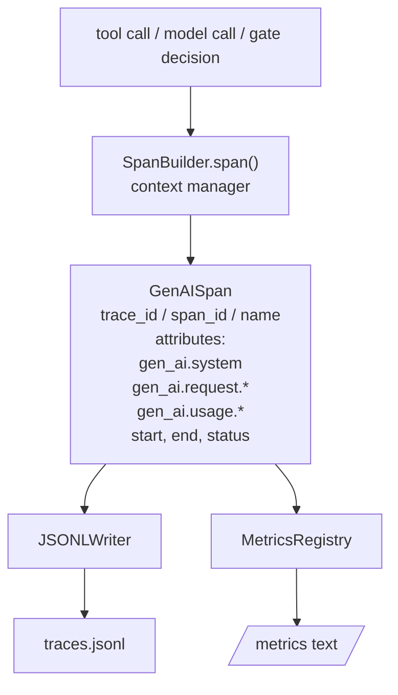
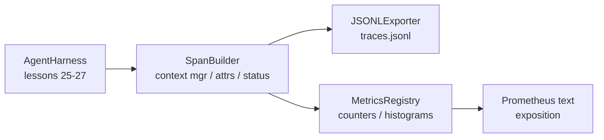

# 28 · 使用 OTel GenAI Span 与 Prometheus 指标实现可观测性

> 一个没有可观测性（Observability）的 Agent 主控程序就是一个烧钱的黑盒。本课手写一个 Span 构建器，发出符合 OpenTelemetry GenAI 语义约定（Semantic Conventions）的记录，将其按每行一个 Span 写入 JSONL 文件，并以 Prometheus 文本格式暴露计数器与直方图。全部使用 Python 标准库实现，并可离线运行。

**类型：** 构建
**语言：** Python（标准库）
**前置：** 阶段 19 · 25（验证关卡）、阶段 19 · 26（沙箱）、阶段 19 · 27（评估框架）、阶段 13 · 20（OpenTelemetry GenAI）、阶段 14 · 23（OTel GenAI 约定规范）
**时长：** 约 90 分钟

## 学习目标

- 构建一个符合 OpenTelemetry GenAI 语义约定的 Span 数据类。
- 实现一个 JSONL 导出器（Exporter），每行写入一个自包含的 Span。
- 构建带标签的计数器（Counter）和直方图（Histogram），并以 Prometheus 文本格式暴露。
- 将一个 Span 上下文管理器（Context Manager）包裹到任意可调用对象上，记录耗时、状态和异常。
- 验证发出的 Span 能通过 `json.loads` 无损往返，且与规范形态匹配。

## 问题所在

一个生产环境中的编程 Agent 每次执行产生三类产物：模型调用、工具执行和验证关卡决策。如果没有结构化的遥测数据，这些产物全都无法发挥价值。

第一种失败模式是“缺失的追踪（Trace）”。某个星期二出了问题，但唯一的记录是 500 行的聊天日志。没有记录哪个工具运行了、花了多长时间、提示词中包含了多少 token，也没有记录关卡是否做了什么拒止。Agent 作者只能靠猜。

第二种失败模式是“无法解析的追踪”。主控程序写了 Span，但用的是自定义的字段名。无论是 Grafana、Honeycomb、Jaeger 还是本地 CLI，什么都读不了。团队技术栈中已有的任何工具都浪费了，因为 Span 不标准。

第三种失败模式是“无法聚合的指标”。你可以在追踪中看到一个慢的工具调用，但无法回答“最近一小时内 read_file 调用的 p95 延迟是多少？”——因为没有指标（Metrics），只有追踪。

OpenTelemetry GenAI 语义约定正是为此而存在的。它们定义了一小组标准属性，LLM 框架的 Span 发出者都共享这些属性。如果你的主控程序写了这些属性，所有与 OTel 兼容的后端就都能读取它们。

## 概念



主控程序中的每一次操作都产生一个 Span。每个 Span 都有追踪 ID（trace id，代表整个 Agent 调用）、Span ID（代表这一次操作）、名称（如 `gen_ai.chat`、`gen_ai.tool.execution`）、遵循 GenAI 约定的属性、开始和结束时间以及状态。

GenAI 约定统一了这些属性键：`gen_ai.system`（供应商，如 `anthropic`、`openai`）、`gen_ai.request.model`（模型 ID）、`gen_ai.request.max_tokens`、`gen_ai.usage.input_tokens`、`gen_ai.usage.output_tokens`、`gen_ai.response.model`、`gen_ai.response.id`、`gen_ai.operation.name`，以及工具专用键 `gen_ai.tool.name` 和 `gen_ai.tool.call.id`。

导出器写的是 JSONL 格式，一行一个 JSON 对象。这是下游工具能够流式读取、grep 和导入的最简单格式。真正的 OTel 导出器会走 OTLP gRPC 协议；本课中的 JSONL 导出器是离线等价方案，可在任何工作站上正常退出（exit 0）。

指标与追踪并存。每次工具调用递增一个计数器：`tools_called_total{tool="read_file"}`。用直方图记录观察到的延迟：`tool_latency_ms{tool="read_file"}`。两者均序列化为 Prometheus 文本暴露格式，这是基于拉取（pull）的指标的事实标准。

## 架构



Span 构建器是一个小类，提供一个 `span(name, attrs)` 方法，返回一个上下文管理器。上下文管理器在进入时记录开始时间，在退出时记录结束时间，若发生异常则附加异常信息，并将封装的 Span 推送到导出器。

指标注册表（MetricsRegistry）就是两个字典。计数器是 `{(name, frozen_labels): int}` 的形式。直方图将原始样本保存在列表中，在暴露时序列化为 Prometheus 直方图分桶（buckets）。

## 你将构建的内容

`main.py` 包含：

1. `GenAISpan` 数据类：trace_id、span_id、parent_span_id、name、attributes、start_unix_nano、end_unix_nano、status、status_message、events。
2. `SpanBuilder` 类，提供 `span(name, attrs, parent=None)` 上下文管理器。
3. `JSONLExporter` 类，提供 `export(span)` 方法，追加一行。
4. `Counter` 和 `Histogram` 类，以及 `MetricsRegistry`。
5. `prometheus_exposition(registry)`，生成文本格式输出。
6. `wrap_tool_call(name)` 装饰器（Decorator），发出 Span 并更新指标。
7. 演示：合成一个完整的 Agent 调用（gen_ai.chat span 包裹工具 span），写入 traces.jsonl，打印 Prometheus 暴露内容，然后正常退出（exit 0）。

Span ID 和追踪 ID 是通过 `os.urandom` 生成的 16 字节十六进制字符串，与 OTel 的 W3C 追踪上下文（Trace Context）一致。导出器永不抛出异常；I/O 错误会被暴露出来，但主控程序继续运行。

直方图使用固定的分桶集合（OTel 延迟（毫秒）的默认分桶：5、10、25、50、100、250、500、1000、2500、5000、10000、+∞）。样本以列表形式存储；暴露时按需计算每个桶的计数。

## 为什么手写而非使用 opentelemetry-sdk

OTel Python SDK 是一个真实的依赖。它也有数千行代码，OTLP 导出器需要多个进程，运行时开销会远远超出本课的预算。手写版本教的是传输格式（wire format）。在生产环境中，你将相同的属性接入真正的 SDK，就能免费获得 OTLP 导出器、批处理和资源检测。

约定是稳定的。本课发出的传输格式到 2030 年仍然可读，因为 OTel 从不破坏 GenAI 属性名称；它们只会新增。

## 与 Track A 其余部分的组合

第 25 课产出了关卡链。第 26 课产出了沙箱。第 27 课产出了评估框架。第 28 课让这三者都变得可观测。第 29 课会将端到端演示中每一步都包裹在 Span 中，并在最后打印 Prometheus 文本。

## 运行方式

```bash
cd phases/19-capstone-projects/28-observability-otel-traces
python3 code/main.py
python3 -m pytest code/tests/ -v
```

演示会在课程工作目录中生成 `traces.jsonl`（运行结束后清理），然后打印三个 Span 的样本，再打印计数器和直方图的 Prometheus 暴露内容。测试验证 Span 的序列化往返、规范的 GenAI 属性是否齐全、计数器递增是否正确，以及直方图暴露内容是否包含预期的分桶计数。
