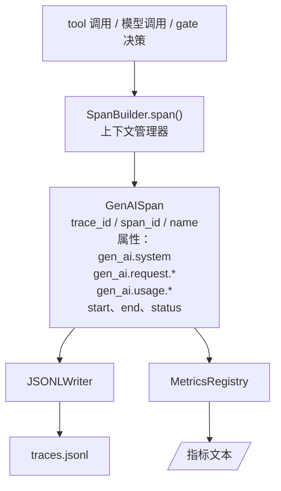
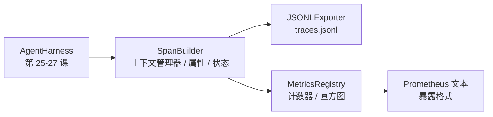

# Capstone 第 28 课：用 OTel GenAI Span 与 Prometheus 指标做 Observability（可观测性）

> 译注：本文译自同目录 [`en.md`](./en.md)。术语遵循仓根 [TRANSLATION_GUIDE.md](../../../../TRANSLATION_GUIDE.md)。

> 没有 observability（可观测性）的 agent harness 就是个烧钱的黑盒。这节课手撸一个 span builder，发出符合 OpenTelemetry GenAI 语义约定的记录，以「一行一个 span」的形式写入 JSON-Lines 文件，并以 Prometheus 文本格式暴露 counter 和 histogram。整套东西全部用 stdlib Python，离线即可运行。

**Type:** Build
**Languages:** Python (stdlib)
**Prerequisites:** Phase 19 · 25（verification gates）、Phase 19 · 26（sandbox）、Phase 19 · 27（eval harness）、Phase 13 · 20（OpenTelemetry GenAI）、Phase 14 · 23（OTel GenAI 约定）
**Time:** ~90 minutes

## 学习目标（Learning Objectives）

- 构建一个符合 OpenTelemetry GenAI 语义约定形状的 span 数据类。
- 实现一个 JSONL exporter，每行写入一个自包含的 span。
- 构建带 label 的 counter 与 histogram，并以 Prometheus 文本格式暴露。
- 用一个 span 上下文管理器包住任意 callable，记录耗时、状态与异常。
- 验证发出的 span 能通过 `json.loads` 来回往返（roundtrip）并匹配 spec 形状。

## 问题（The Problem）

生产环境里的 coding agent 每一轮都会产生三类 artifact：一次模型调用、一次工具执行、一次 verification gate（验证关卡）裁决。这些东西没有结构化的遥测数据，根本没法用。

第一种失败模式是 trace 缺失。周二出了点问题，但唯一的记录是一份 500 行的聊天日志。没有任何信息表明跑了哪个工具、跑了多久、prompt 里塞了多少 token，或者 gate 是不是拒了什么。agent 作者只能靠猜。

第二种失败模式是 trace 解析不出来。harness 写了 span，但用了自己临时拍脑袋的字段名。Grafana、Honeycomb、Jaeger 或本地 CLI 没一个读得懂。团队技术栈里现成的工具全都白搭，因为 span 不符合标准。

第三种失败模式是指标没聚合。你能在 trace 里看到一次慢工具调用，但没法回答「过去一小时 read_file 调用的 p95 延迟是多少？」——因为只有 trace，没有 metrics。

OpenTelemetry GenAI 语义约定就是为这件事而生的。它定义了一小套标准属性，供各 LLM 框架的 span 发射方共用。只要你的 harness 写这些属性，任何兼容 OTel 的后端都能读。

## 概念（The Concept）



harness 里每一次操作都产出一个 span。一个 span 有：trace id（整次 agent 调用）、span id（这一次操作）、name（例如 `gen_ai.chat`、`gen_ai.tool.execution`）、遵循 GenAI 约定的 attributes、起止时间、状态。

GenAI 约定把这些 attribute key 标准化了：`gen_ai.system`（哪个 provider，例如 `anthropic`、`openai`）、`gen_ai.request.model`（模型 id）、`gen_ai.request.max_tokens`、`gen_ai.usage.input_tokens`、`gen_ai.usage.output_tokens`、`gen_ai.response.model`、`gen_ai.response.id`、`gen_ai.operation.name`，加上工具相关的 `gen_ai.tool.name` 与 `gen_ai.tool.call.id`。

exporter 写的是 JSONL：一行一个 JSON 对象。这是下游工具能流式读、能 grep、能导入的最简单格式。真正的 OTel exporter 会说 OTLP gRPC；本课的 JSONL exporter 是它的离线等价物，在任何工作机上都能干净退出（exit 0）。

Metrics 与 trace 并列存在。每次工具调用 counter 自增一次：`tools_called_total{tool="read_file"}`。histogram 记录观察到的延迟：`tool_latency_ms{tool="read_file"}`。两者都序列化为 Prometheus 文本暴露格式（text exposition format），这是 pull-based 指标的事实标准。

## 架构（Architecture）



span builder 是一个小类，带 `span(name, attrs)` 方法返回一个上下文管理器。进入时记录开始时间，退出时记录结束时间；如果抛了异常就把它挂上去；最后把定型后的 span 推给 exporter。

metrics registry 就是两个 dict。counter 是 `{(name, frozen_labels): int}`。histogram 把原始样本存在 list 里，暴露时再计算 Prometheus histogram 的各 bucket 计数。

## 你将构建什么（What you will build）

`main.py` 提供：

1. `GenAISpan` dataclass：trace_id、span_id、parent_span_id、name、attributes、start_unix_nano、end_unix_nano、status、status_message、events。
2. `SpanBuilder` 类，带 `span(name, attrs, parent=None)` 上下文管理器。
3. `JSONLExporter` 类，带 `export(span)` 方法，追加一行。
4. `Counter`、`Histogram` 类以及 `MetricsRegistry`。
5. `prometheus_exposition(registry)`，生成文本格式输出。
6. `wrap_tool_call(name)` 装饰器，发出 span 并更新 metrics。
7. 演示：合成一次完整的 agent 调用（外层 `gen_ai.chat` span 包住若干 tool span），写 traces.jsonl，打印 Prometheus 暴露文本，干净退出。

span id 和 trace id 都是 16 字节的 hex 字符串，由 `os.urandom` 生成，与 OTel 的 W3C trace context 一致。exporter 永远不抛错；IO 错误会被上报，但 harness 继续运行。

histogram 用一组固定 bucket（OTel 默认的毫秒延迟桶：5、10、25、50、100、250、500、1000、2500、5000、10000、+Inf）。样本以 list 存储；暴露时按需计算每个 bucket 的计数。

## 为什么手撸而不是用 opentelemetry-sdk（Why hand-rolled instead of opentelemetry-sdk）

OTel Python SDK 是个真依赖。它有几千行代码、OTLP exporter 要起多个进程、运行开销会把一节课的预算吃光。手撸版本教的是 wire format。生产里你把同样的属性接到真正的 SDK 上，就免费拿到 OTLP exporter、批处理与 resource 检测。

约定是稳定的。这节课发出的 wire format 在 2030 年依然能解析，因为 OTel 从不破坏 GenAI 的属性名，只增不删。

## 它如何与 Track A 的其他课组合（How this composes with the rest of Track A）

第 25 课产出 gate chain。第 26 课产出 sandbox。第 27 课产出 eval harness。第 28 课让这三者都变得可观测。第 29 课把端到端 demo 的每一步都包进 span，并在最后打印 Prometheus 文本。

## 怎么跑（Running it）

```bash
cd phases/19-capstone-projects/28-observability-otel-traces
python3 code/main.py
python3 -m pytest code/tests/ -v
```

demo 会在本课工作目录下生成一份 `traces.jsonl`（结束时清理），然后打印三个 span 的样例，再打印 counter 和 histogram 的 Prometheus 暴露文本。测试会验证：span 能序列化往返、规范的 GenAI 属性都齐全、counter 自增正确、histogram 暴露中包含预期的 bucket 计数。
