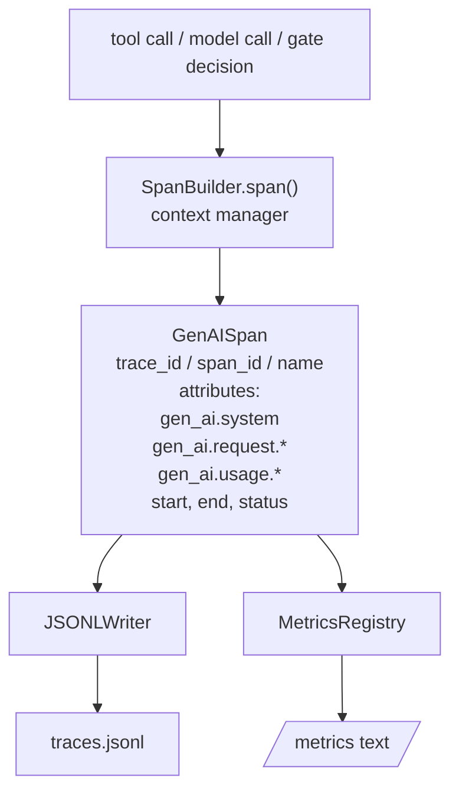
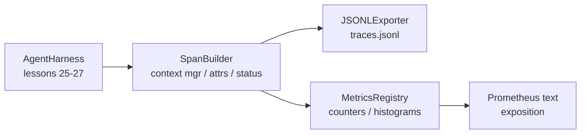

# 顶点项目第 28 课：基于 OTel GenAI Span 和 Prometheus 指标的可观测性

> 没有可观测性的代理框架（Agent Harness）就是一个烧钱的黑盒。本课程手把手构建一个 Span 构建器，它发出的记录符合 OpenTelemetry GenAI 语义约定，每条 Span 单独一行写入 JSON-Lines 文件，并以 Prometheus 文本格式暴露计数器和直方图。全部使用 Python 标准库，可离线运行。

**类型：** 构建  
**语言：** Python（标准库）  
**前置课程：** 第 19 阶段 · 第 25 课（验证门）、第 19 阶段 · 第 26 课（沙箱）、第 19 阶段 · 第 27 课（评估框架）、第 13 阶段 · 第 20 课（OpenTelemetry GenAI）、第 14 阶段 · 第 23 课（OTel GenAI 约定）  
**时长：** 约 90 分钟

## 学习目标

- 构建符合 OpenTelemetry GenAI 语义约定的 Span 数据类。
- 实现一个 JSONL 导出器，每行写入一条自包含的 Span。
- 构建带标签的计数器和直方图，并支持 Prometheus 文本格式暴露。
- 将任意可调用对象包装在 Span 上下文管理器中，记录持续时间、状态和异常。
- 验证发出的 Span 可通过 `json.loads` 往返解析，并符合规范结构。

## 问题描述

生产环境中的编码代理每轮交互会产生三类产物：模型调用、工具执行和验证门决策。如果没有结构化的遥测数据，这些产物毫无用处。

**第一种故障模式：缺失追踪。** 周二出了问题，但唯一的记录是一份 500 行的聊天日志。没有记录显示哪个工具运行过、耗时多久、提示词中使用了多少 token，或者门控是否拒绝了任何操作。代理作者只能靠猜测。

**第二种故障模式：不可解析的追踪。** 框架写了 Span，但使用了自定义的临时字段名。Grafana、Honeycomb、Jaeger 或本地 CLI 都无法读取它们。团队技术栈中已有的工具全部浪费，因为这些 Span 是非标准的。

**第三种故障模式：未聚合的指标。** 你可以在追踪中看到一个慢速工具调用，但无法回答"过去一小时内 `read_file` 调用的 p95 延迟是多少？"，因为没有指标，只有追踪。

OpenTelemetry GenAI 语义约定正是为此而生。它们定义了一小组标准属性，所有 LLM 框架的 Span 发射器都共享这些属性。如果你的框架写入这些属性，任何兼容 OTel 的后端都能读取它们。

## 概念


```mermaid
flowchart TD
  Call[tool call / model call / gate decision] --> Span["SpanBuilder.span()<br/>context manager"]
  Span --> GenAI[GenAISpan<br/>trace_id / span_id / name<br/>attributes:<br/>gen_ai.system<br/>gen_ai.request.*<br/>gen_ai.usage.*<br/>start, end, status]
  GenAI --> Writer[JSONLWriter]
  GenAI --> Metrics[MetricsRegistry]
  Writer --> Traces[traces.jsonl]
  Metrics --> Prom[/metrics text/]
```

框架中的每个操作都会产生一个 Span。一个 Span 包含追踪 ID（整个代理调用）、Span ID（当前操作）、名称（例如 `gen_ai.chat`、`gen_ai.tool.execution`）、遵循 GenAI 约定的属性、开始和结束时间以及状态。

GenAI 约定标准化了以下属性键：`gen_ai.system`（哪个提供商，例如 `anthropic`、`openai`）、`gen_ai.request.model`（模型 ID）、`gen_ai.request.max_tokens`、`gen_ai.usage.input_tokens`、`gen_ai.usage.output_tokens`、`gen_ai.response.model`、`gen_ai.response.id`、`gen_ai.operation.name`，以及工具专用的键 `gen_ai.tool.name` 和 `gen_ai.tool.call.id`。

导出器写入 JSONL，每行一个 JSON 对象。这是最简单的格式，下游工具可以流式处理、grep 和导入。真正的 OTel 导出器会使用 OTLP gRPC 协议；本课程的 JSONL 导出器是其离线等价物，在任何工作站上都能以零退出码运行。

指标与追踪并存。每次工具调用时计数器递增：`tools_called_total{tool="read_file"}`。直方图记录观测到的延迟：`tool_latency_ms{tool="read_file"}`。两者都序列化为 Prometheus 文本暴露格式，这是基于拉取指标的业界事实标准。

```figure
trace-spans
```

## 架构


```mermaid
flowchart LR
  Harness[AgentHarness<br/>lessons 25-27] --> Span[SpanBuilder<br/>context mgr / attrs / status]
  Span --> Exporter[JSONLExporter<br/>traces.jsonl]
  Span --> Metrics[MetricsRegistry<br/>counters / histograms]
  Metrics --> Prom[Prometheus text<br/>exposition]
```

Span 构建器是一个小型类，包含一个 `span(name, attrs)` 方法，该方法返回一个上下文管理器。上下文管理器在进入时记录开始时间，退出时记录结束时间，如果抛出了异常则附加异常信息，并将最终确定好的 Span 推送给导出器。

指标注册表由两个字典组成。计数器是 `{(name, frozen_labels): int}`。直方图在列表中保存原始样本，并在暴露时序列化为 Prometheus 直方图桶（bucket）。

## 你将构建的内容

`main.py` 包含：

1. **`GenAISpan` 数据类**：trace_id、span_id、parent_span_id、name、attributes、start_unix_nano、end_unix_nano、status、status_message、events。
2. **`SpanBuilder` 类**，提供 `span(name, attrs, parent=None)` 上下文管理器。
3. **`JSONLExporter` 类**，提供 `export(span)` 方法，追加一行记录。
4. **`Counter` 和 `Histogram` 类**，以及 `MetricsRegistry`。
5. **`prometheus_exposition(registry)` 函数**，生成文本格式输出。
6. **`wrap_tool_call(name)` 装饰器**，发出 Span 并更新指标。
7. **演示**：合成一次完整的代理调用（围绕工具 Span 的 `gen_ai.chat` Span），写入 `traces.jsonl`，打印 Prometheus 暴露内容，以零退出码结束。

Span ID 和追踪 ID 是 16 字节的十六进制字符串，通过 `os.urandom` 生成。这与 OTel 的 W3C 追踪上下文一致。导出器不会抛出异常；IO 错误会被报告，但框架继续运行。

直方图使用一组固定的桶（OTel 延迟毫秒的默认值：5、10、25、50、100、250、500、1000、2500、5000、10000、+Inf）。样本以列表形式存储；暴露时按需计算每个桶的计数。

## 为什么手动实现而不使用 opentelemetry-sdk

OTel Python SDK 是一个实实在在的依赖项。它包含数千行代码、为 OTLP 导出器启动多个进程，并且运行时成本足以超出课程预算。手动实现的版本教授的是线缆格式（wire format）。在生产环境中，你将相同的属性接入真正的 SDK，即可免费获得 OTLP 导出器、批处理和资源检测。

这些约定是稳定的。本课程发出的线缆格式在 2030 年仍然可以被解析，因为 OTel 不会破坏 GenAI 属性名——它们只会添加新的属性。

## 这与 Track A 其余部分的关系

第 25 课产生了门控链。第 26 课产生了沙箱。第 27 课产生了评估框架。第 28 课让三者都变得可观测。第 29 课将端到端演示的每一步都包装在 Span 中，并在最后打印 Prometheus 文本。

## 运行方式

```bash
cd phases/19-capstone-projects/28-observability-otel-traces
python3 code/main.py
python3 -m pytest code/tests/ -v
```

演示会在课程工作目录中生成 `traces.jsonl`（运行结束时清理），然后打印三个示例 Span，最后打印计数器和直方图的 Prometheus 暴露内容。测试验证了 Span 可以往返序列化、规范的 GenAI 属性存在、计数器正确递增，以及直方图暴露内容包含预期的桶计数。
