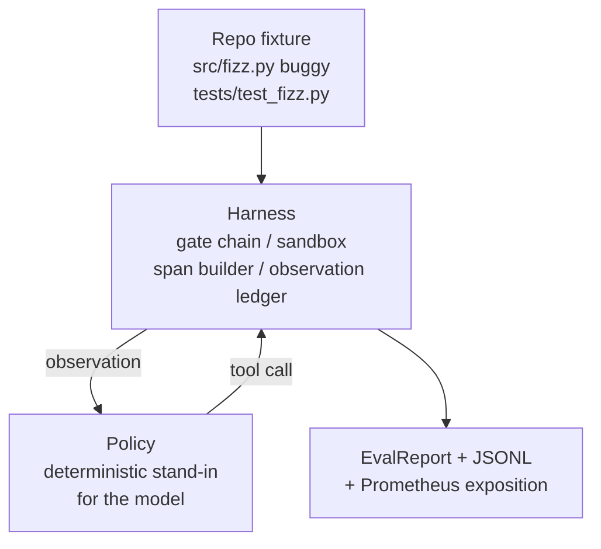
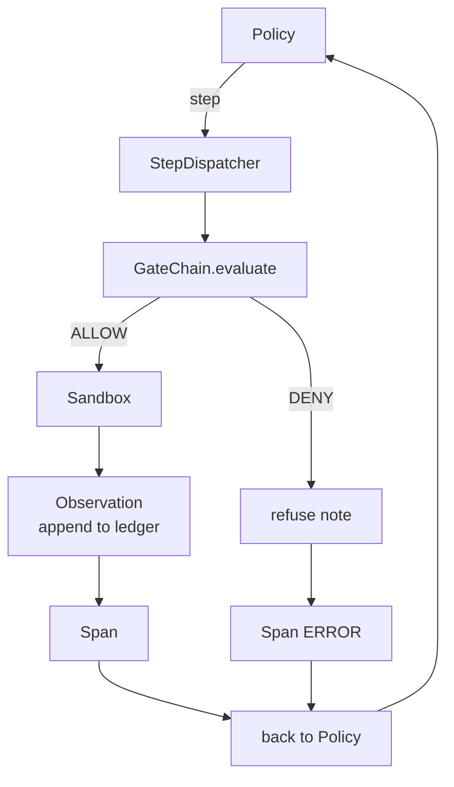

# Capstone Lesson 29: Harness 上の End-to-End Coding Agent

> Track A の payoff です。この lesson は gate chain、sandbox、eval harness、OTel spans を 1 つの working coding agent に縫い合わせ、multi-file Python project 内の実際の小さな fixture-scale bug を直します。agent は LLM ではなく deterministic policy です。この置き換えにより lesson は再現可能になり、面白い部分が最初から harness だったことが見えます。contract は同じです。real model は policy の境界に差し込まれます。

**種別:** 構築
**言語:** Python (stdlib)
**前提条件:** Phase 19 · 25 (verification gates), Phase 19 · 26 (sandbox), Phase 19 · 27 (eval harness), Phase 19 · 28 (observability), Phase 14 · 38 (verification gates), Phase 14 · 41 (workbench for real repos), Phase 14 · 42 (agent workbench capstone)
**所要時間:** 約90分

## 学習目標

- gate chain、sandbox、eval harness、span builder を単一の agent loop に compose する。
- read_file、run_tests、write_file を使って fixture bug を直す deterministic policy を実装する。
- end-to-end run 全体で global step budget と observation token budget を enforce する。
- full run の complete OTel GenAI traces と Prometheus metrics を emit する。
- agent が 12 step 未満、legal tool で gate trip 0 の状態で fixture を解けることを verify する。

## 問題

多くの agent demo は isolated に動きます。sandbox 単体、eval harness 単体、span emitter 単体なら問題なく見えます。compose すると境界が見えます。

gate chain は ALLOW と言ったが、sandbox は chain が予期しなかった reason で refuse する。eval harness は pass を記録したが、OTel span は agent が使ったと主張する tool を gate が拒否したと言っている。Prometheus counter が 1 回であるべきところを 2 回 increment される。observation budget を超えたのに、budget が chain 側で tracking され、sandbox 側が知らなかったため agent が続行する。

この lesson は track 全体の integration test です。agent は順番に 4 つのことをしなければなりません。project を読む、tests を走らせる、test failure から bug を特定する、fix を書く、tests を再実行する、そして止まる。すべての operation は gate chain を通ります。すべての tool execution は sandbox を通ります。すべての step は span で wrap されます。最後に eval harness が全体を採点します。

## コンセプト



agent policy は state machine です。state は 5 つあります。

`SURVEY`: agent は project listing を読みます。次の state は RUN_TESTS です。

`RUN_TESTS`: agent は test command を走らせます。tests が pass すれば success で halt します。そうでなければ次の state は INSPECT です。

`INSPECT`: agent は failing source file を読みます。次の state は FIX です。

`FIX`: agent は corrected file を書きます。次の state は VERIFY です。

`VERIFY`: agent は test command を再実行します。tests が pass すれば halt success。そうでなければ failure で halt します。

各 state は 1 つの tool call に対応します。各 tool call は gate chain を通ります。tool call が deny されたら、agent は trace に refusal を報告して halt します。

fixture bug は `fizz.py` の off-by-one です。deterministic policy は test failure message から regex で bug を検出し、corrected file を emit します。policy を LLM に置き換えても harness contract は変わりません。

## アーキテクチャ



lesson は self-contained です。prior lesson の primitive は `main.py` に minimal scale で再実装されています（gate、sandbox、ledger、span）。sibling lesson を import せずに動くためです。名前は lessons 25-28 と完全に合わせてあり、conceptual mapping が明確です。

## 作るもの

`main.py` には以下が入っています。

1. lessons 25-28 と同じ名前の minimal harness primitive: `GateChain`, `Sandbox`, `ObservationLedger`, `SpanBuilder`, `MetricsRegistry`。
2. `CodingAgentPolicy` class: 5 state の state machine。
3. `Repo` helper: bundled buggy fixture を scratch dir に準備する。
4. `AgentRun` class: policy を drive し、harness 経由で dispatch し、`AgentRunReport` を返す。
5. bundled fixture（`fixture_repo/`）: src/fizz.py、tests/test_fizz.py、eval harness 用 expected tree。
6. demo: policy を end-to-end に走らせ、step-by-step trace を print し、pass を assert し、metrics を print する。

bundled fixture は lesson 27 の task structure と同じ shape です。buggy file と tests file です。test failure message には deterministic policy が fix を特定するのに十分な情報が含まれます。real LLM なら同じ job を、より遅く、より広い recall で行いますが、harness の expectation は変わりません。

## なぜ policy は LLM ではないのか

real LLM には API key、network call、検証しづらい stochasticity が必要です。この lesson が注目するのは harness です。deterministic policy に差し替えることで、external dependency なしに任意の developer laptop で lesson を実行でき、test suite は exact step count を assert できます。

lesson の policy は LLM agent がすることの strict subset です。policy は repo を読み、failing test を見て、line を特定し、fix を emit します。LLM も同じ loop を同じ harness contract で通ります。bookkeeping は同じです。

## demo が assert すること

end-to-end demo は exit 時に 5 つを assert し、test suite も programmatically に再 assert します。

policy は 12 step 未満で fixture を解いた。

observation budget は一度も超えなかった。

legal tool で gate denial は 0 だった。（agent は denied tool name を発明しなかった。）

すべての step に対応する span が traces.jsonl にある。

Prometheus exposition に `tools_called_total{tool="read_file"}` entry と `tool_latency_ms` histogram がある。

## Track A の他 lesson との合成

この lesson は integration です。Lesson 25 が gate chain を書きました。Lesson 26 が sandbox を書きました。Lesson 27 が eval harness を書きました。Lesson 28 が observability を書きました。Lesson 29 は、それらが system として動くことを証明します。real agent harness はここから拡張します。deterministic policy を model に置き換え、bundled fixture を real-repo task に置き換え、JSONL exporter を OTLP に置き換えます。

## 実行方法

```bash
cd phases/19-capstone-projects/29-end-to-end-coding-task-demo
python3 code/main.py
python3 -m pytest code/tests/ -v
```

demo は per-step trace、final eval report、Prometheus exposition を print します。exit code は zero です。tests は policy state transition、synthetic tool call に対する gate refusal、bundled fixture での end-to-end run、step-budget invariant を cover します。
