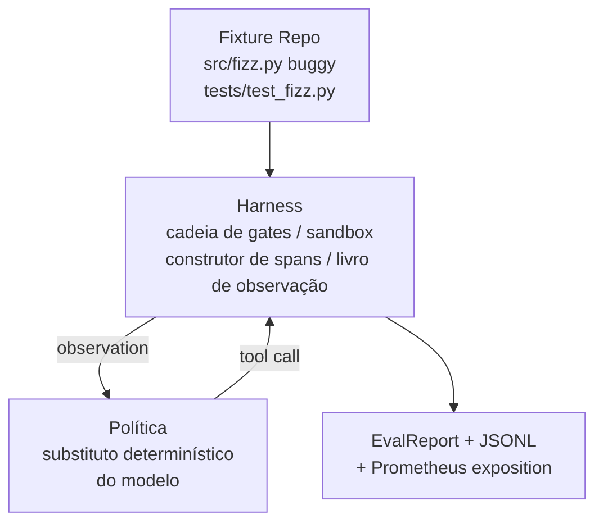
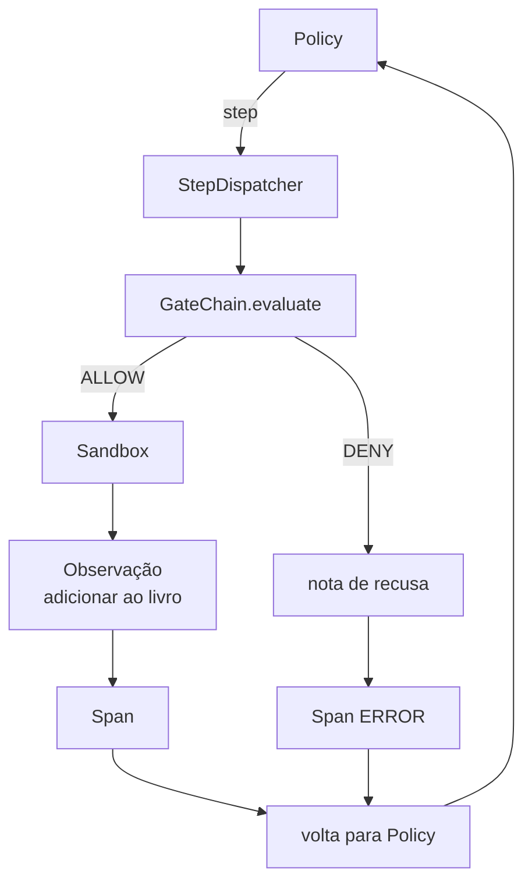

# Lição Capstone 29: Agent de Código End-to-End no Harness

> A recompensa da Trilha A. Esta aula costura a cadeia de gates, o sandbox, o eval harness e os spans OTel em um agente de código funcional que corrige um bug real (pequeno, em escala de fixture) em um projeto Python multi-arquivo. O agente é uma política determinística, não um LLM; a substituição torna a aula reprodutível e mostra que o harness era a parte interessante desde o início. O contrato é idêntico: um modelo real se conecta na junção da política.

**Tipo:** Build
**Linguagens:** Python (stdlib)
**Pré-requisitos:** Fase 19 · 25 (verification gates), Fase 19 · 26 (sandbox), Fase 19 · 27 (eval harness), Fase 19 · 28 (observabilidade), Fase 14 · 38 (verification gates), Fase 14 · 41 (workbench para repos reais), Fase 14 · 42 (capstone de workbench de agent)
**Tempo:** ~90 minutos

## Objetivos de Aprendizagem

- Compor a cadeia de gates, sandbox, eval harness e construtor de spans em um único loop de agent.
- Implementar uma política determinística que usa read_file, run_tests e write_file para corrigir um bug fixture.
- Impor um orçamento global de passos mais um orçamento de tokens de observação em uma execução de ponta a ponta.
- Emitir traces OTel GenAI completos e métricas Prometheus para a execução inteira.
- Verificar que o agente resolve o fixture em menos de 12 passos com zero disparos de gate em ferramentas legais.

## O Problema

A maioria das demos de agente funciona isolada: um sandbox sozinho, um eval harness sozinho, um emissor de spans sozinho. Parecem bem. Componha-as e as junções aparecem.

A cadeia de gates diz ALLOW mas o sandbox recusa por uma razão que a cadeia não antecipou. O eval harness registra um pass mas os spans OTel dizem que o gate recusou uma ferramenta que o agente diz que usou. O contador Prometheus é incrementado duas vezes quando deveria ser uma. O orçamento de observação é excedido mas o agente continuou porque o orçamento era rastreado na cadeia e o sandbox não sabia.

Esta aula é o teste de integração para a trilha inteira. O agente tem que fazer quatro coisas em ordem: ler o projeto, rodar os testes, identificar o bug pela falha do teste, escrever a correção, re-rodar os testes, e parar. Toda operação passa pela cadeia de gates. Toda execução de ferramenta passa pelo sandbox. Todo passo é envolvido em um span. O eval harness pontua tudo no final.

## O Conceito



A política do agente é uma máquina de estados. Cinco estados.

`SURVEY`: o agente lê o listing do projeto. O próximo estado é RUN_TESTS.

`RUN_TESTS`: o agente roda o comando de teste. Se os testes passam, a máquina de estados para com sucesso. Caso contrário o próximo estado é INSPECT.

`INSPECT`: o agente lê o arquivo fonte que falhou. O próximo estado é FIX.

`FIX`: o agente escreve o arquivo corrigido. O próximo estado é VERIFY.

`VERIFY`: o agente roda o comando de teste novamente. Se os testes passam, para com sucesso. Caso contrário para com falha.

Cada estado corresponde a uma chamada de ferramenta. Cada chamada de ferramenta passa pela cadeia de gates. Se uma chamada é negada, o agente reporta a recusa no trace e para.

O bug do fixture é um off-by-one em `fizz.py`. A política determinística detecta o bug da mensagem de falha do teste via regex e emite o arquivo corrigido. Substituir a política por um LLM não muda o contrato do harness.

## Arquitetura



A aula é autocontida. Cada primitiva de aula anterior é reimplementada em escala mínima em `main.py` (gate, sandbox, livro, span) para que a aula rode sem importar irmãos. Os nomes combinam exatamente com as lições 25-28 para que o mapeamento conceitual seja inequívoco.

## O que você vai construir

`main.py` entrega:

1. As primitivas mínimas do harness, copiadas com os mesmos nomes das lições 25-28: `GateChain`, `Sandbox`, `ObservationLedger`, `SpanBuilder`, `MetricsRegistry`.
2. Classe `CodingAgentPolicy`: máquina de estados com cinco estados.
3. Helper `Repo`: prepara um diretório temporário com o fixture bugado empacotado.
4. Classe `AgentRun`: dirige a política, despacha através do harness, retorna um `AgentRunReport`.
5. Um fixture empacotado (`fixture_repo/`) com src/fizz.py, tests/test_fizz.py, e uma árvore expected/ para o eval harness.
6. Demo: roda a política de ponta a ponta, imprime o trace passo-a-passo, afirma pass, imprime métricas.

O fixture empacotado tem a mesma forma que a estrutura de tarefa da lição 27: um arquivo bugado e um arquivo de testes. A mensagem de falha do teste contém informação suficiente para a política determinística identificar a correção. Um LLM real faria o mesmo trabalho, mais lento e com recall mais amplo, mas não mudaria as expectativas do harness.

## Por que a política não é um LLM

Um LLM real requer uma API key, uma chamada de rede, e estocasticidade não verificável. O harness é a parte que a aula se importa. Substituir por uma política determinística permite que a aula rode em qualquer laptop de desenvolvedor com zero dependências externas e permite que a suíte de teste afirme contagens exatas de passos.

A política da aula é um subconjunto estrito do que um agente LLM faz. A política lê o repo, vê o teste falhando, identifica a linha, e emite uma correção. Um LLM passa pelo mesmo loop com o mesmo contrato de harness; o registro é idêntico.

## O que a demo afirma

A demo de ponta a ponta afirma cinco coisas no momento da saída, e a suíte de teste reafirma programaticamente.

A política resolveu o fixture em menos de 12 passos.

O orçamento de observação nunca foi excedido.

Zero negações de gate disparadas em ferramentas legais. (O agente nunca inventou um nome de ferramenta negado.)

Todo passo tem um span correspondente no traces.jsonl.

A exposição Prometheus contém uma entrada `tools_called_total{tool="read_file"}` e um histograma `tool_latency_ms`.

## Como isso compõe com o resto da Trilha A

Esta aula é a integração. A lição 25 escreveu a cadeia de gates. A lição 26 escreveu o sandbox. A lição 27 escreveu o eval harness. A lição 28 escreveu a observabilidade. A lição 29 prova que funcionam como sistema. Um harness de agente real se estende daqui: troque a política determinística por um modelo, troque o fixture empacotado por uma tarefa de repo real, troque o exportador JSONL por OTLP.

## Rodando

```bash
cd phases/19-capstone-projects/29-de ponta a ponta-coding-task-demo
python3 code/main.py
python3 -m pytest code/tests/ -v
```

A demo imprime um trace por passo, o relatório final de eval, e a exposição Prometheus. O exit code é zero. Os testes cobrem as transições de estado da política, as recusas de gate em chamadas de ferramenta sintéticas, a execução de ponta a ponta no fixture empacotado, e as invariantes do orçamento de passos.
