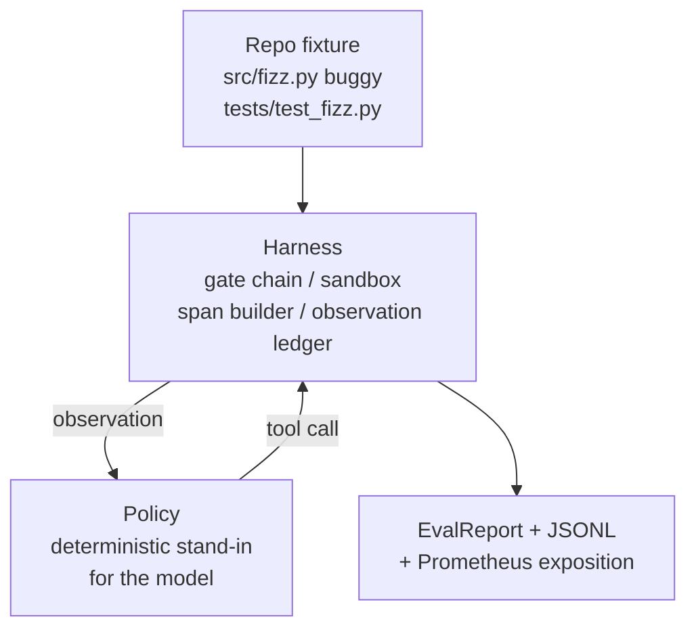
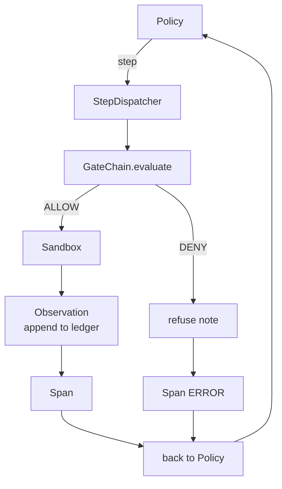

# Bitirme Dersi 29: Kablo Demeti Üzerinde Uçtan Uca Kodlama Agent

> Parça A'nın getirisi. Bu ders, geçit zincirini, sanal alanı, değerlendirme donanımını birleştirir ve OTel, çok dosyalı bir Python projesinde gerçek (küçük, fikstür ölçeğinde) bir hatayı düzelten tek bir çalışan kodlamaya agent yayılır. agent bir Yüksek Lisans değil, deterministik bir politikadır; değişiklik dersi tekrarlanabilir hale getirir ve koşum takımının başından beri ilginç kısım olduğunu gösterir. Sözleşme aynıdır: Poliçe dikişine gerçek bir model takılır.

**Tür:** Yapım
**Diller:** Python (stdlib)
**Önkoşullar:** Aşama 19 · 25 (doğrulama kapıları), Aşama 19 · 26 (korumalı alan), Aşama 19 · 27 (değerlendirme koşum takımı), Aşama 19 · 28 (observability), Aşama 14 · 38 (doğrulama kapıları), Aşama 14 · 41 (gerçek depolar için çalışma tezgahı), Aşama 14 · 42 (agent çalışma tezgahı kapatma taşı)
**Süre:** ~90 dakika

## Öğrenme Hedefleri

- Geçit zincirini, korumalı alanı, değerlendirme donanımını ve yayılma oluşturucuyu tek bir agent loop halinde oluşturun.
- Bir fikstür hatasını düzeltmek için read_file, run_tests ve write_file kullanan deterministik bir politika uygulayın.
- Uçtan uca bir çalışma boyunca küresel bir adım bütçesine ek olarak bir gözlem token bütçesini zorunlu kılın.
- Tam çalıştırma için eksiksiz OTel GenAI izlerini ve Prometheus ölçümlerini yayınlayın.
- agent'ın, yasal araçlarla sıfır kapı hatasıyla 12 adımdan daha az bir sürede fikstürü çözdüğünü doğrulayın.

## Sorun

Çoğu agent demosu yalıtılmış olarak çalışır: kendi başına bir sanal alan, kendi başına bir değerlendirme donanımı, kendi başına bir yayılma yayıcı. İyi görünüyorlar. Onları oluşturun ve dikişler görünecektir.

Geçit zinciri İZİN VERİR diyor ancak sanal alan, zincirin tahmin etmediği bir nedenden dolayı reddediyor. Değerlendirme koşum takımı bir geçişi kaydediyor ancak OTel aralıkları, kapının agent kullandığını iddia ettiği bir aracı reddettiğini söylüyor. Prometheus sayacı bir kez artırılması gerekirken iki kez artırılır. Gözlem bütçesi aşıldı ancak agent bütçenin zincirde takip edilmesi ve sanal alanın bilmemesi nedeniyle yoluna devam etti.

Bu ders tüm parkurun entegrasyon testidir. agent'ın sırayla dört şey yapması gerekir: projeyi okumak, testleri çalıştırmak, test başarısızlığından kaynaklanan hatayı belirlemek, düzeltmeyi yazmak, testleri yeniden çalıştırmak ve durdurmak. Her operasyon geçit zincirinden geçer. Her araç uygulaması korumalı alandan geçer. Her adım bir açıklığa sarılmıştır. Değerlendirme koşum takımı sonunda her şeyi puanlar.

## Konsept



agent'ın politikası bir durum makinesidir. Beş eyalet.

`SURVEY`: agent proje listesini okur. Sonraki durum RUN_TESTS'dir.

`RUN_TESTS`: agent test komutunu çalıştırır. Testler başarılı olursa durum makinesi başarıyla durur. Aksi takdirde bir sonraki durum DENETİM'dir.

`INSPECT`: agent, arızalı kaynak dosyayı okur. Bir sonraki durum DÜZELTME'dir.

`FIX`: agent düzeltilmiş dosyayı yazar. Bir sonraki durum DOĞRULA'dır.

`VERIFY`: agent test komutunu tekrar çalıştırır. Testler başarılı olursa başarıyı durdurun. Aksi takdirde başarısızlıkla durun.

Her durum bir araç çağrısına karşılık gelir. Her takım çağrısı geçit zincirinden geçer. Bir araç çağrısı reddedilirse, agent izlemedeki reddi bildirir ve durur.

Fikstür hatası `fizz.py`'da teker teker meydana geliyor. Deterministik politika, bir regex aracılığıyla test hatası mesajındaki hatayı algılar ve düzeltilmiş dosyayı yayınlar. Politikanın bir LLM ile değiştirilmesi koşum takımı sözleşmesini değiştirmez.

## Mimarlık



Ders kendi kendine yetiyor. Önceki dersteki her ilkel, `main.py` (geçit, sanal alan, defter, açıklık) içinde minimum ölçekte yeniden uygulanır, böylece ders kardeşleri içe aktarmadan çalışır. İsimler 25-28. derslerle tam olarak eşleşiyor, böylece kavramsal haritalama net oluyor.

## Ne inşa edeceksiniz

`main.py` gemileri:

1. Minimal koşum ilkelleri, 25-28. derslerle aynı adlarla kopyalanmıştır: `GateChain`, `Sandbox`, `ObservationLedger`, `SpanBuilder`, `MetricsRegistry`.
2. `CodingAgentPolicy` sınıfı: beş durumlu durum makinesi.
3. `Repo` yardımcı: birlikte verilen buggy donanımıyla bir karalama dizini hazırlar.
4. `AgentRun` sınıfı: politikayı yönlendirir, kablo demeti aracılığıyla gönderir, bir `AgentRunReport` döndürür.
5. Değerlendirme koşum takımı için src/fizz.py, testler/test_fizz.py ve beklenen/ ağaç içeren bir paket fikstür (`fixture_repo/`) .
6. Demo: politikayı uçtan uca çalıştırır, adım adım izlemeyi yazdırır, geçişi onaylar, ölçümleri yazdırır.

Birlikte verilen donanım, ders 27'nin görev yapısıyla aynı şekildedir: bir hata dosyası ve bir test dosyası. Test hatası mesajı, deterministik politikanın düzeltmeyi tanımlamasına yetecek kadar bilgi içerir. Gerçek bir Yüksek Lisans aynı işi daha yavaş ve daha geniş bir geri çağırma ile yapar, ancak koşumun beklentilerini değiştirmez.

## Politika neden Yüksek Lisans değil?

Gerçek bir LLM, bir API anahtarı, bir ağ çağrısı ve doğrulanamayan stokastiklik gerektirir. Emniyet kemeri dersin önemsediği kısımdır. Belirleyici bir politikaya dahil olmak, dersin herhangi bir geliştirici dizüstü bilgisayarında sıfır dış bağımlılıkla çalıştırılmasına ve test paketinin tam adım sayımları yapmasına olanak tanır.

Dersin politikası, LLM agent'ın yaptıklarının katı bir alt kümesidir. Politika repoyu okur, başarısız testi görür, satırı tanımlar ve bir düzeltme yayınlar. Bir LLM aynı koşum takımı sözleşmesiyle aynı döngüden geçer; muhasebe aynı.

## Demonun öne sürdüğü şey

Uçtan uca demo, çıkış zamanında beş şeyi öne sürüyor ve test paketi bunları programlı olarak yeniden öne sürüyor.

Politika, sorunu 12 adımdan daha az bir sürede çözdü.

Gözlem bütçesi hiçbir zaman aşılmadı.

Sıfır kapı inkarları yasal araçlara ateş açtı. (agent asla reddedilen bir araç adı icat etmedi.)

Her adımın traces.jsonl'da karşılık gelen bir aralığı vardır.

Prometheus gösterimi bir `tools_called_total{tool="read_file"}` girişi ve bir `tool_latency_ms` histogramı içerir.

## Bunun A Parçasının geri kalanıyla nasıl birleştiği

Bu ders entegrasyondur. Ders 25 kapı zincirini yazdı. Ders 26 korumalı alanı yazdı. Ders 27 değerlendirme koşum takımını yazdı. Ders 28 observability'yi yazdı. Ders 29 bunların bir sistem olarak çalıştığını kanıtlıyor. Gerçek bir agent koşum takımı buradan itibaren uzanır: deterministik politikayı bir modelle değiştirin, paketlenmiş fikstürü gerçek bir repo göreviyle değiştirin, JSONL aktarıcısını OTLP ile değiştirin.

## Çalıştırıyorum

```bash
cd phases/19-capstone-projects/29-end-to-end-coding-task-demo
python3 code/main.py
python3 -m pytest code/tests/ -v
```

Demo, adım başına izlemeyi, son değerlendirme raporunu ve Prometheus açıklamasını yazdırır. Çıkış kodu sıfırdır. Testler, politika durumu geçişlerini, sentetik araç çağrılarında kapı reddini, birleştirilmiş fikstür üzerinde uçtan uca çalıştırmayı ve adım bütçe değişmezlerini kapsar.
