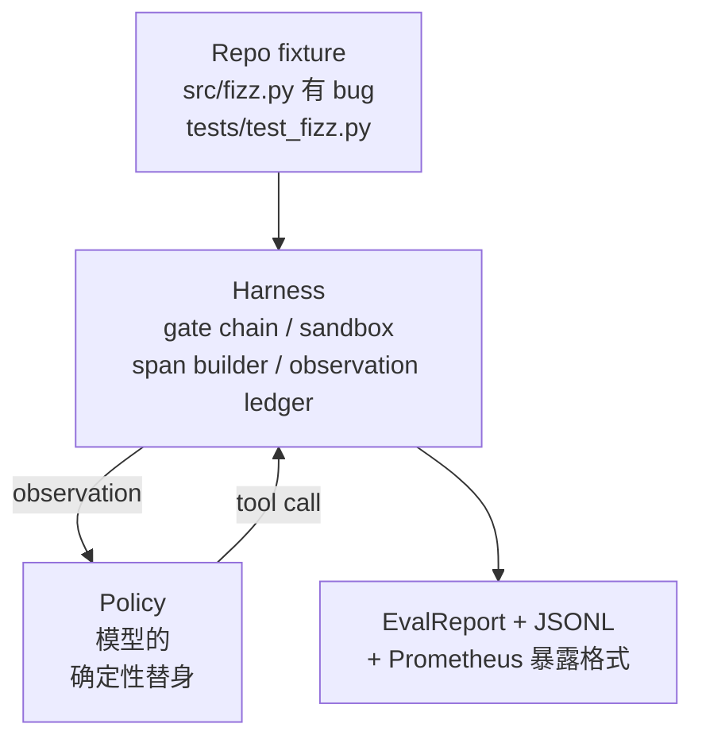
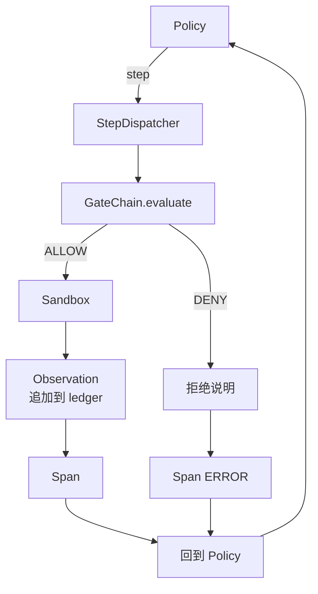

# Capstone Lesson 29：在 harness 上跑通端到端的编码 agent

> 译注：本文译自同目录 [`en.md`](./en.md)。术语遵循仓根 [TRANSLATION_GUIDE.md](../../../../TRANSLATION_GUIDE.md)。

> Track A 的回报兑现。本课把 gate chain（门控链）、sandbox（沙箱）、eval harness（评估骨架）和 OTel span 缝成一个真正能跑的编码 agent，让它去修一个真实的（小规模、fixture 级别的）多文件 Python 项目里的 bug。这里的 agent 是一个确定性策略，不是 LLM；这样替换是为了让本课可复现，同时也能说明：harness 才是这一路真正有意思的部分。契约完全一致：真模型可以从 policy 接缝处直接插进来。

**Type:** Build
**Languages:** Python (stdlib)
**Prerequisites:** Phase 19 · 25（verification gates 验证门）, Phase 19 · 26（sandbox）, Phase 19 · 27（eval harness）, Phase 19 · 28（observability 可观测性）, Phase 14 · 38（verification gates）, Phase 14 · 41（针对真实 repo 的 workbench / 工作台）, Phase 14 · 42（agent workbench capstone）
**Time:** ~90 minutes

## 学习目标（Learning Objectives）

- 把 gate chain、sandbox、eval harness 和 span builder 组合进同一个 agent loop。
- 实现一个确定性策略，使用 read_file、run_tests、write_file 三个工具去修 fixture 里的 bug。
- 在端到端运行中同时强制全局步数预算和观测 token 预算。
- 在整轮运行里发出完整的 OTel GenAI traces 和 Prometheus 指标。
- 验证 agent 能在 12 步以内解决 fixture，且合法工具上零 gate 触发。

## 问题（The Problem）

大多数 agent demo 都是单点运转：sandbox 自己跑、eval harness 自己跑、span emitter 自己跑。看上去都没问题。一旦把它们组合起来，接缝就暴露了。

gate chain 说 ALLOW，但 sandbox 因为某个 chain 没预料到的原因拒绝了。eval harness 记了一个 pass，但 OTel span 显示 gate 拒绝了 agent 声称用过的某个工具。Prometheus 计数器本应加 1，结果加了 2。观测预算已经超了，但 agent 还在继续跑——因为预算只在 chain 里记账，sandbox 根本不知道。

本课就是整条 track 的集成测试。agent 必须按顺序做四件事：读项目、跑测试、从测试失败中识别 bug、写修复、再跑一次测试，然后停。每一次操作都要走 gate chain。每一次工具执行都要走 sandbox。每一步都被 span 包裹。最后由 eval harness 给整件事打分。

## 概念（The Concept）



agent 的 policy 是一个状态机，五个状态。

`SURVEY`：agent 读取项目清单。下一个状态是 RUN_TESTS。

`RUN_TESTS`：agent 跑测试命令。如果测试通过，状态机以成功状态停机。否则下一个状态是 INSPECT。

`INSPECT`：agent 读取出错的源文件。下一个状态是 FIX。

`FIX`：agent 写入修正后的文件。下一个状态是 VERIFY。

`VERIFY`：agent 再次跑测试命令。如果通过，成功停机。否则失败停机。

每个状态对应一次工具调用。每次工具调用都会过 gate chain。如果某次工具调用被拒绝，agent 在 trace 里记下这次拒绝并停机。

fixture 的 bug 是 `fizz.py` 里的一个 off-by-one。确定性策略通过正则从测试失败信息里识别出 bug，然后输出修正后的文件。把这个策略换成 LLM，并不会改变 harness 契约。

## 架构（Architecture）



本课是自包含的。前序课里的每一个 harness 原语，都在 `main.py` 里以最小规模重新实现一遍（gate、sandbox、ledger、span），这样本课不用 import 同级的其他课程也能跑。命名和第 25-28 课完全对齐，让概念映射没有歧义。

## 你将构建什么（What you will build）

`main.py` 提供：

1. 最小化的 harness 原语，命名沿用第 25-28 课：`GateChain`、`Sandbox`、`ObservationLedger`、`SpanBuilder`、`MetricsRegistry`。
2. `CodingAgentPolicy` 类：含五个状态的状态机。
3. `Repo` helper：把内置的有 bug 的 fixture 准备到一个 scratch 目录里。
4. `AgentRun` 类：驱动 policy、把动作分派到 harness、返回一个 `AgentRunReport`。
5. 一个内置 fixture（`fixture_repo/`），包含 src/fizz.py、tests/test_fizz.py，以及一棵 expected/ 树供 eval harness 使用。
6. Demo：端到端跑一次 policy，打印逐步 trace、断言通过、打印指标。

这个内置 fixture 的形态跟第 27 课的 task 结构一样：一份有 bug 的代码 + 一份测试代码。测试失败信息里有足够的线索，让确定性策略定位修复点。换成真的 LLM 也是干同样的活，只是更慢、召回面更广，但不会改变 harness 的预期。

## 为什么 policy 不是 LLM（Why the policy is not an LLM）

真 LLM 需要 API key、需要网络调用、还带不可验证的随机性。本课关心的是 harness 这部分。换成确定性策略，就能在任何开发者的笔记本上零外部依赖跑起来，并且让测试套件可以断言精确的步数。

本课的 policy 是 LLM agent 行为的一个严格子集。policy 读 repo、看到失败的测试、定位行号、输出修复。LLM 走的是同一个 loop、用的是同一份 harness 契约；账本完全一致。

## demo 断言了什么（What the demo asserts）

端到端 demo 在退出时断言五件事，测试套件再用代码把它们重新断言一次。

policy 在 12 步以内解决了 fixture。

观测预算从未超出。

合法工具上零 gate 拒绝。（agent 没有发明出会被拒绝的工具名。）

每一步在 traces.jsonl 里都有对应的 span。

Prometheus 暴露内容里包含一条 `tools_called_total{tool="read_file"}` 和一个 `tool_latency_ms` 直方图。

## 这一课如何与 Track A 的其他部分组合（How this composes with the rest of Track A）

这一课是集成。第 25 课写了 gate chain。第 26 课写了 sandbox。第 27 课写了 eval harness。第 28 课写了可观测性。第 29 课证明它们作为一个系统能跑通。一个真实的 agent harness 就是从这里往外扩：把确定性策略换成模型，把内置 fixture 换成真实 repo 任务，把 JSONL exporter 换成 OTLP。

## 怎么跑（Running it）

```bash
cd phases/19-capstone-projects/29-end-to-end-coding-task-demo
python3 code/main.py
python3 -m pytest code/tests/ -v
```

demo 会打印逐步 trace、最终的 eval 报告，以及 Prometheus 暴露内容。退出码是 0。测试覆盖：policy 的状态转移、对合成工具调用的 gate 拒绝、内置 fixture 上的端到端运行，以及步数预算的不变量。
