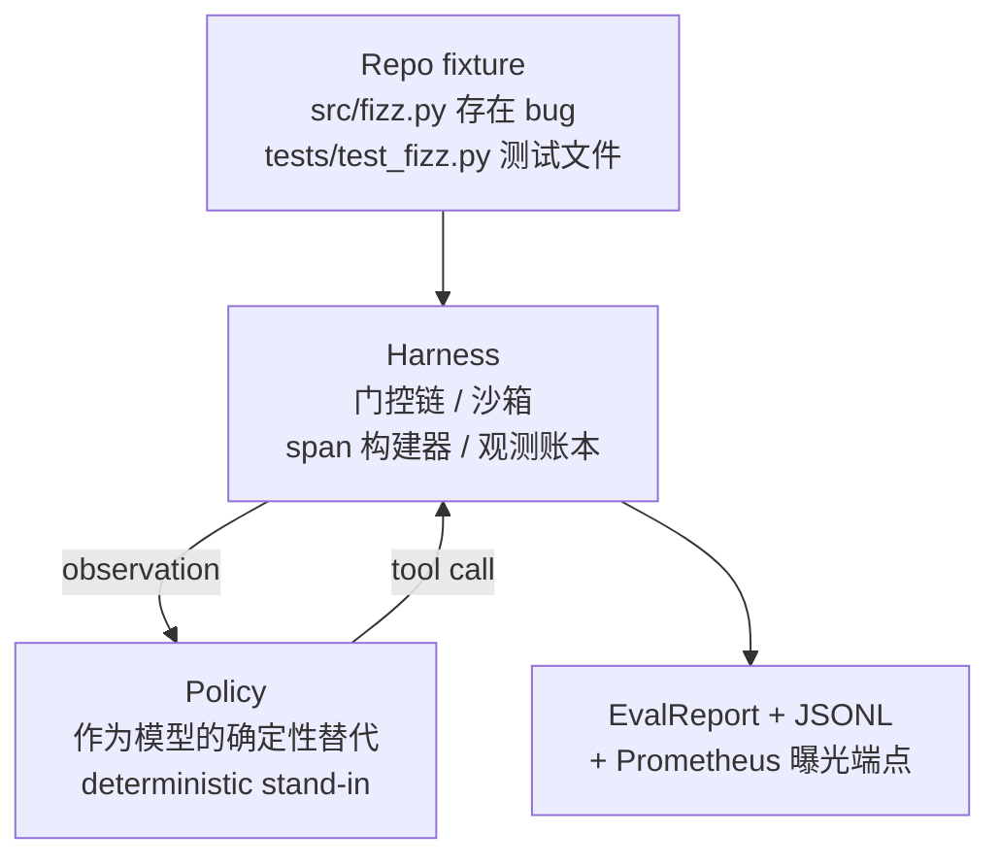
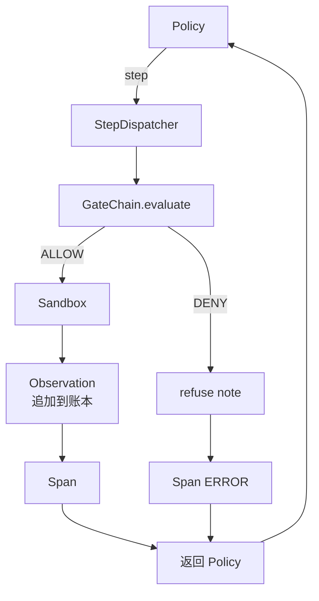

# 29 · 端到端编码智能体的基座集成

> Track A 的终局交付。本课将门控链（gate chain）、沙箱（sandbox）、评测基座（eval harness）和 OTel span 串联成一个可工作的编码智能体，让它在一个多文件 Python 项目中修复一个真实的（小规模、fixture 级别）bug。该智能体采用确定性策略（deterministic policy）而非 LLM；这一替换使课程可复现，同时也表明了真正有意思的部分始终是基座本身。合约完全一致：一个真实模型只需在策略接缝处接入即可。

**类型：** 构建
**语言：** Python（标准库）
**前置：** 第 19 阶段 · 25（验证门控）、第 19 阶段 · 26（沙箱）、第 19 阶段 · 27（评测基座）、第 19 阶段 · 28（可观测性）、第 14 阶段 · 38（验证门控）、第 14 阶段 · 41（真实仓库工作台）、第 14 阶段 · 42（智能体工作台收尾项目）
**时长：** 约 90 分钟

## 学习目标

- 将门控链、沙箱、评测基座和 span 构建器组合成一个完整的智能体循环。
- 实现一个确定性策略，使用 `read_file`、`run_tests` 和 `write_file` 来修复一个 fixture bug。
- 在整个端到端运行中强制执行全局步骤预算（step budget）和观测 token 预算（observation token budget）。
- 为完整运行生成完整的 OTel GenAI trace 和 Prometheus 指标。
- 验证智能体在少于 12 步内解决 fixture，且合法工具上的门控拒绝次数为零。

## 问题

大多数智能体演示都是孤立运行的：沙箱单独跑，评测基座单独跑，span 发射器单独跑。它们看起来都正常。一旦把它们组合在一起，接缝就会暴露出来。

门控链返回 ALLOW，但沙箱却因为链没有预料到的原因拒绝了。评测基座记录了一次通过，但 OTel span 却显示门控拒绝了智能体声称使用过的某个工具。Prometheus 计数器被递增了两次，而它应该只递增一次。观测预算已经超了，但智能体还在继续运行，因为预算是在链中追踪的，而沙箱并不知道。

本课是整个 Track A 的集成测试。智能体需要按顺序完成四件事：读取项目、运行测试、从测试失败中定位 bug、写入修复、重新运行测试，然后停止。每一次操作都经过门控链。每一次工具执行都经过沙箱。每一步都包裹在 span 中。评测基座在最后对整个过程进行评分。

## 概念



智能体的策略是一个状态机，共五个状态。

`SURVEY`：智能体读取项目文件列表。下一状态为 `RUN_TESTS`。

`RUN_TESTS`：智能体运行测试命令。如果测试通过，状态机以成功终止；否则下一状态为 `INSPECT`。

`INSPECT`：智能体读取失败的源文件。下一状态为 `FIX`。

`FIX`：智能体写入修正后的文件。下一状态为 `VERIFY`。

`VERIFY`：智能体再次运行测试命令。如果测试通过，以成功终止；否则以失败终止。

每个状态对应一次工具调用。每次工具调用都会经过门控链。如果某次工具调用被拒绝，智能体在 trace 中记录该拒绝并终止。

fixture 中的 bug 是 `fizz.py` 中的一个差一错误（off-by-one）。确定性策略通过正则表达式从测试失败消息中检测出该 bug，并生成修正后的文件。将策略替换为 LLM 并不会改变基座的合约。

## 架构



本课是自包含的。每个前置课程中的原语（gate、sandbox、ledger、span）都以最小规模在 `main.py` 中重新实现，因此本课无需导入兄弟模块即可运行。命名与第 25-28 课完全一致，因此概念映射是清晰无误的。

## 你将构建什么

`main.py` 包含以下内容：

1. 最小化的基座原语，命名与第 25-28 课保持一致：`GateChain`、`Sandbox`、`ObservationLedger`、`SpanBuilder`、`MetricsRegistry`。
2. `CodingAgentPolicy` 类：具有五个状态的状态机。
3. `Repo` 辅助类：使用内置的有 bug 的 fixture 准备一个临时目录。
4. `AgentRun` 类：驱动策略、通过基座分发、返回 `AgentRunReport`。
5. 一个内置 fixture（`fixture_repo/`），其中包含 `src/fizz.py`、`tests/test_fizz.py` 以及一个供评测基座使用的 `expected/` 目录树。
6. 演示：端到端运行策略，打印逐步 trace，断言通过，打印指标。

内置 fixture 与第 27 课的任务结构形状相同：一个包含 bug 的源文件和一个测试文件。测试失败消息包含足够的信息，使确定性策略能够识别修复方案。真实的 LLM 会做同样的事情，速度更慢、召回范围更广，但这并不会改变基座的预期。

## 为什么策略不是 LLM

真实 LLM 需要 API key、网络调用以及不可验证的随机性。基座才是本课关心的部分。用一个确定性策略来替代，使得本课可以在任何开发者的笔记本电脑上运行，零外部依赖，并且使测试套件能够精确断言步骤数量。

本课的策略是 LLM 智能体行为的严格子集。策略读取仓库、看到失败的测试、定位到那一行、然后生成修复。LLM 在相同的基座合约下走相同的循环；簿记工作完全一致。

## 演示断言了什么

端到端演示在退出时断言五件事，测试套件则以编程方式重新断言。

策略在少于 12 步内解决了 fixture。

观测预算从未被超出。

合法工具上的门控拒绝为零。（智能体从未发明一个被拒绝的工具名称。）

每一步在 `traces.jsonl` 中都有对应的 span。

Prometheus 曝光端点包含一个 `tools_called_total{tool="read_file"}` 条目和一个 `tool_latency_ms` 直方图。

## 本课如何与 Track A 的其他部分组合

本课是集成环节。第 25 课编写了门控链。第 26 课编写了沙箱。第 27 课编写了评测基座。第 28 课编写了可观测性。第 29 课证明了它们作为一个系统能够正常工作。一个真正的智能体基座从这里延伸：将确定性策略替换为模型，将内置 fixture 替换为真实仓库任务，将 JSONL 导出器替换为 OTLP。

## 运行方式

```bash
cd phases/19-capstone-projects/29-end-to-end-coding-task-demo
python3 code/main.py
python3 -m pytest code/tests/ -v
```

演示会打印逐步 trace、最终评测报告以及 Prometheus 曝光端点。退出码为零。测试覆盖了策略状态转移、对合成工具调用的门控拒绝、在内置 fixture 上的端到端运行以及步骤预算不变量。
