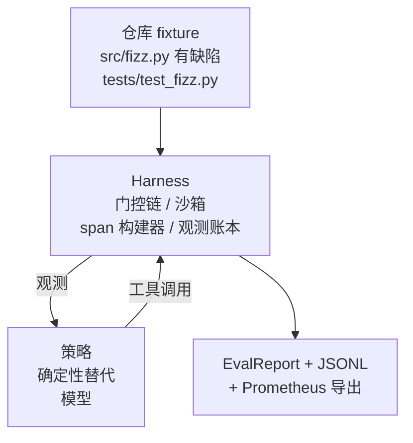
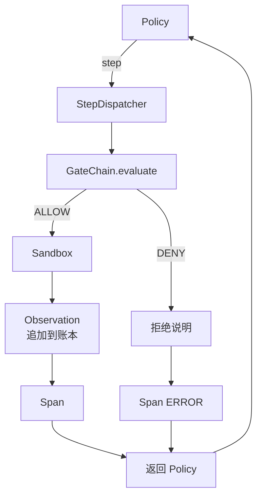

# 顶点课程 29：Harness 上的端到端编码智能体

> 轨道 A 的最终成果。本课程将门控链、沙箱、评估 harness 和 OTel span 整合为一个可工作的编码智能体，用于修复一个多文件 Python 项目中的真实（小型、fixture 级别）缺陷。该智能体是一个确定性策略，而非 LLM；这种替换使课程可重现，并说明 harness 才是始终有趣的部分。其契约完全相同：真正的模型可在策略接口处插入。

**类型：** 构建
**语言：** Python（标准库）
**前置课程：** 阶段 19 · 25（验证门控）、阶段 19 · 26（沙箱）、阶段 19 · 27（评估 harness）、阶段 19 · 28（可观测性）、阶段 14 · 38（验证门控）、阶段 14 · 41（真实仓库的工作台）、阶段 14 · 42（智能体工作台顶点课程）
**时间：** 约 90 分钟

## 学习目标

- 将门控链、沙箱、评估 harness 和 span 构建器组合成一个完整的智能体循环。
- 实现一个使用 read_file、run_tests 和 write_file 修复 fixture 缺陷的确定性策略。
- 在整个端到端运行中强制执行全局步数预算以及观测 token 预算。
- 为完整运行生成完整的 OTel GenAI 追踪和 Prometheus 指标。
- 验证智能体在 12 步以内解决 fixture 问题，且合法工具零门控触发。

## 问题

大多数智能体演示都是孤立运行的：沙箱单独运行、评估 harness 单独运行、span 发射器单独运行。它们看起来都很好。但一旦组合起来，接缝处的问题就会暴露。

门控链说 ALLOW，但沙箱却因门控链未曾预见的某种原因拒绝。评估 harness 记录为通过，但 OTel span 显示门控拒绝了一个智能体声称已使用的工具。Prometheus 计数器被递增了两次，而本应只递增一次。观测预算已超限，但智能体仍在继续运行，因为预算仅在门控链中跟踪，而沙箱并不知情。

本课程是整个轨道的集成测试。智能体必须按顺序完成四件事：读取项目、运行测试、从测试失败中识别缺陷、编写修复、重新运行测试，然后停止。每个操作都经过门控链。每次工具执行都经过沙箱。每一步都封装在一个 span 中。评估 harness 最后对整个运行进行评分。

## 概念


```mermaid
flowchart TD
  Repo[仓库 fixture<br/>src/fizz.py 有缺陷<br/>tests/test_fizz.py] --> Harness
  Policy[策略<br/>确定性替代<br/>模型] -->|工具调用| Harness
  Harness[Harness<br/>门控链 / 沙箱<br/>span 构建器 / 观测账本] -->|观测| Policy
  Harness --> Out[EvalReport + JSONL<br/>+ Prometheus 导出]
```

智能体的策略是一个状态机。包含五个状态。

`SURVEY`：智能体读取项目文件列表。下一个状态是 RUN_TESTS。

`RUN_TESTS`：智能体运行测试命令。如果测试通过，状态机以成功状态终止。否则下一个状态是 INSPECT。

`INSPECT`：智能体读取失败的源文件。下一个状态是 FIX。

`FIX`：智能体写入修正后的文件。下一个状态是 VERIFY。

`VERIFY`：智能体再次运行测试命令。如果测试通过，以成功状态终止。否则以失败状态终止。

每个状态对应一次工具调用。每次工具调用都经过门控链。如果某次工具调用被拒绝，智能体将在追踪中报告拒绝并终止。

fixture 的缺陷是 `fizz.py` 中的一处差一错误。确定性策略通过正则表达式从测试失败消息中检测到该缺陷，并发出更正后的文件。将策略替换为 LLM 不会改变 harness 契约。

## 架构


```mermaid
flowchart TD
  Policy -->|step| Dispatcher[StepDispatcher]
  Dispatcher --> Gate[GateChain.evaluate]
  Gate -->|ALLOW| Sandbox
  Gate -->|DENY| Refuse[拒绝说明]
  Sandbox --> Obs[Observation<br/>追加到账本]
  Obs --> Span
  Refuse --> SpanErr[Span ERROR]
  Span --> Back[返回 Policy]
  SpanErr --> Back
  Back --> Policy
```

本课程是自包含的。每个先修课程中的原语都在 `main.py` 中以最小规模重新实现（门控、沙箱、账本、span），因此本课程可在不导入同级模块的情况下运行。命名与课程 25-28 完全相同，以确保概念映射清晰无误。

## 你将构建的内容

`main.py` 包含：

1. 最小化的 harness 原语，使用与课程 25-28 相同的名称：`GateChain`、`Sandbox`、`ObservationLedger`、`SpanBuilder`、`MetricsRegistry`。
2. `CodingAgentPolicy` 类：包含五个状态的状态机。
3. `Repo` 辅助类：准备一个包含内置有缺陷 fixture 的临时目录。
4. `AgentRun` 类：驱动策略执行，通过 harness 分发请求，返回 `AgentRunReport`。
5. 内置 fixture（`fixture_repo/`），包含 src/fizz.py、tests/test_fizz.py 以及供评估 harness 使用的 expected/ 目录结构。
6. 演示：端到端运行策略，打印逐步追踪，断言通过，打印指标。

内置 fixture 与课程 27 的任务结构形式相同：一个有缺陷的文件和一个测试文件。测试失败消息包含足够的信息，使确定性策略能够识别出修复方法。真正的 LLM 也能完成同样的工作，速度更慢但召回范围更广，但它不会改变 harness 的预期行为。

## 为什么策略不是 LLM

真正的 LLM 需要 API 密钥、网络调用和不可验证的随机性。Harness 才是本课程关注的部分。使用确定性策略作为替代，使得本课程可以在任何开发者笔记本电脑上运行，无需任何外部依赖，并且测试套件可以断言精确的步数计数。

本课程中的策略是 LLM 智能体所做工作的严格子集。该策略读取仓库、查看失败的测试、识别有问题的代码行、并发出修复。LLM 在相同的 harness 契约下执行相同的循环；其记账逻辑完全相同。

## 演示的断言内容

端到端演示在退出时断言五件事，测试套件也以编程方式重新断言。

策略在 12 步以内解决了 fixture 问题。

观测预算从未超限。

合法工具的门控拒绝次数为零。（智能体从未编造出一个被拒绝的工具名称。）

每一步都在 traces.jsonl 中有对应的 span。

Prometheus 导出包含 `tools_called_total{tool="read_file"}` 条目和 `tool_latency_ms` 直方图。

## 如何与轨道 A 的其他部分组合

本课程是集成点。课程 25 编写了门控链。课程 26 编写了沙箱。课程 27 编写了评估 harness。课程 28 编写了可观测性。课程 29 证明了它们作为一个系统协同工作。真正的智能体 harness 从这里开始扩展：将确定性策略替换为模型，将内置 fixture 替换为真实仓库的任务，将 JSONL 导出器替换为 OTLP。

## 运行方法

```bash
cd phases/19-capstone-projects/29-end-to-end-coding-task-demo
python3 code/main.py
python3 -m pytest code/tests/ -v
```

演示会打印逐步追踪、最终评估报告和 Prometheus 导出内容。退出码为零。测试覆盖了策略状态转换、合成工具调用上的门控拒绝、内置 fixture 的端到端运行以及步数预算的不变性约束。
