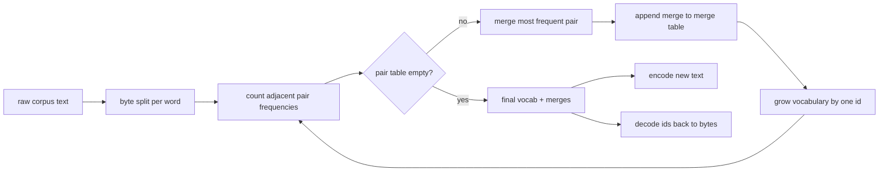
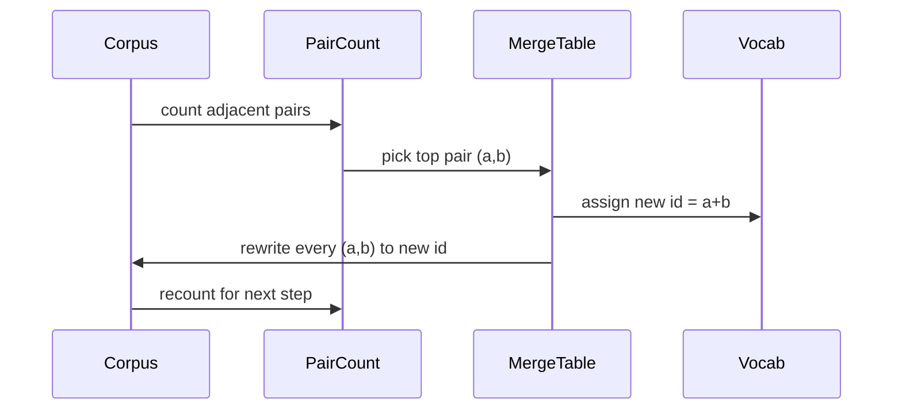

# Scratch から作る BPE Tokenizer

> bytes を入れて ids を出し、その ids から同じ bytes に戻します。modern text model が今でも出発点にしている tokenizer を作ります。

**種別:** 構築
**言語:** Python
**前提条件:** Phase 04 lessons, Phase 07 transformer lessons
**所要時間:** 約90分

## 学習目標
- raw text corpus から Byte-Pair Encoding vocabulary を train する。最頻の adjacent symbol pair を繰り返し merge する。
- deterministic な merge table を実装し、新しい text に適用して subword id stream を生成する。
- 任意の UTF-8 input を information loss なしで ids にし、戻せるようにする。
- special token（`<|endoftext|>`, `<|pad|>`）を reserve し、training と decoding を通じて保護する。
- general-purpose tokenizer の floor として byte-level alphabet が適切な理由を説明できる。

## 枠組み

language model は text を見ません。integer を見ます。string と integer list を相互変換する map が tokenizer です。この layer を誤ると、training run の loss curve はすべて間違ったものを測ります。

general text model の subword tokenizer の主流 family は Byte-Pair Encoding です。idea は小さいです。既知の alphabet から始めます。training corpus 内で最も頻繁に現れる adjacent symbol pair を探します。それを新しい symbol に merge します。vocabulary が target size に達するまで繰り返します。新しい text の encoding は、同じ merge list を同じ順序で再利用します。

ここでは byte-level variant を作ります。alphabet は Unicode code point ではなく 256 個の raw bytes です。この選択により、unknown token に fall back せずに任意の UTF-8 input を扱えます。

## pipeline

training side と inference side は merge table を共有します。その共有が contract です。inference 時に merge order を変えると、別の id stream を decode することになります。

## byte alphabet

最初の 256 ids は raw bytes 0x00 から 0xFF のために reserve します。これにより、どんな input string も merge 前の vocabulary で表現できます。byte block の後に special token 用の小さな range を reserve します。training loop は pretokenized stream から special token を完全に除外するため、これらの id を merge target として提案しません。

pretokenizer は corpus を whitespace と punctuation boundary で分割してから training に渡します。この split がないと、BPE merge step は word boundary をまたぐ merge を喜んで学習し、vocabulary は common phrase 全体で埋まります。split すると merge は word 内に留まり、結果は generalize しやすくなります。

## training loop

各 training step で loop は 3 つのことをします。corpus 内の各 word を歩き、現在の symbol の adjacent pair が何回現れるかを、word 自体の頻度で weight して数えます。count が最大の pair を選びます。その pair のすべての occurrence を、vocabulary の次の free slot である single new symbol に書き換えます。そして merge を記録します。

各 step の cost は、symbol sequence の list として表された corpus size に対して linear です。million words と target vocabulary 10,000 ids でも、merge が入るほど symbol sequence は短くなるので、loop は数秒で完了します。

## fresh text の encoding

inference は merge counter を呼びません。learned order と同じ順序で merge table を適用します。fresh word に対して encoder は byte split から始めます。current sequence に適用できる lowest-ranked merge（最も早く学習された merge）を探します。その merge を行います。また scan します。current sequence に適用できる merge がなくなると loop は終わります。

rank 順であることが encoding を deterministic にし、同じ input に対する training behavior と一致させます。先に学習された merge は table の上にあり、先に適用されます。同じ位置に複数 merge が適用できる場合、lower-rank のものが勝ちます。

## Special tokens

special token は byte stream から絶対に生成できない id です。手で reserve します。この lesson では 2 つで十分です。

- `<|endoftext|>` は pretraining 中に document を分離します。「新しい document がここから始まる。前の document の context を leak させるな」と model に伝えます。
- `<|pad|>` は短い sequence を埋め、batch を rectangular tensor にします。training 中は loss mask がこれを隠します。

encoder は input 内の special token を許可する flag を受け取ります。flag が off の場合、string `<|endoftext|>` と `<|pad|>` はそれを綴る bytes として tokenize されます。flag が on の場合、literal string は reserved id に map され、merge 対象にはなりません。

## round-trip guarantee

encode してから decode すると、input bytes と完全に同じものに戻らなければなりません。decoder は各 id の byte expansion を順に concatenate します。すべての id は raw byte か、すでに known な 2 つの id の concatenation なので、recursive expansion は必ず raw bytes に到達します。その bytes が綴る UTF-8 string を decode して返します。

この lesson の test suite は、その property を unseen sentence、Unicode emoji を含む sentence、literal `<|endoftext|>` token を含む sentence で確認します。

## この lesson がしないこと

largest production tokenizer のような regex-driven pretokenizer は作りません。ここでの pretokenizer は小さな whitespace と punctuation split です。small training corpus 上で sensible merge を作るには十分で、lesson chain の残りとの contract は同じです。次の lesson は tokenizer を black box として扱い、その上に sliding-window dataset を作ります。

pair counter の parallelization もしません。数千 word の corpus を Python loop で回しても 1 秒未満で終わります。大きな corpus では、word ごとに pair を parallel に count して reduce するのが明らかな次の手です。

## code の読み方

`main.py` は 4 つの object を定義します。`BPETokenizer` は vocabulary、merge table、special-token table を保持します。`train` は training loop です。`encode` は inference path です。`decode` は byte concatenation です。bottom の demo は built-in corpus で小さな tokenizer を train し、held-out sentence を encode し、id を decode して戻し、両方を print します。`code/tests/test_bpe.py` の tests は round-trip property、special-token reservation、merge ordering を pin します。

demo を走らせてください。その後、demo の target vocabulary size を 300 から 600 に変え、held-out sentence の encoded length がどう下がるかを見てください。その curve が BPE compression curve です。
