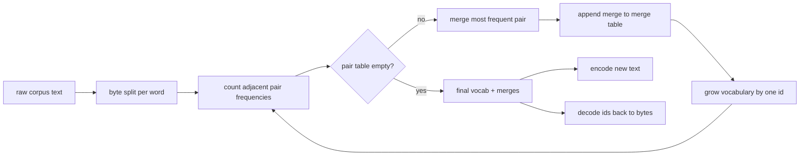
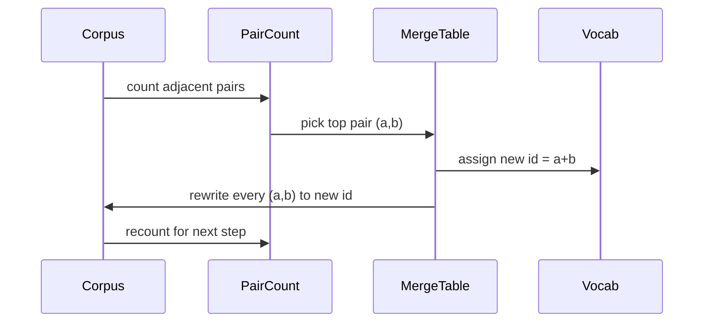

# Tokenizador BPE Do Zero

> Bytes entram, ids saem, ids voltam aos mesmos bytes. Construa o tokenizador que todo modelo de texto moderno ainda começa por ele.

**Tipo:** Construção
**Idiomas:** Python
**Pré-requisitos:** Lições da Fase 04, lições de transformer da Fase 07
**Tempo:** ~90 minutos

## Objetivos de Aprendizado
- Treinar um vocabulário de Byte-Pair Encoding a partir de um corpus de texto bruto, repetidamente mesclando o par de símbolos adjacentes mais frequente.
- Implementar uma tabela de mesclagem determinística e aplicá-la a texto novo para produzir um stream de ids de subpalavras.
- Fazer round-trip de entrada UTF-8 arbitrária para ids e de volta sem perda de informação.
- Reservar e proteger tokens eespecificaçãoiais (``, `<|pad|>`) para que sobrevivam ao treinamento e à decodificação.
- Racionar sobre por que um alfabeto em nível de byte é a base correta para um tokenizador de propósito geral.

## O enquadramento

Um modelo de linguagem nunca vê texto. Vê inteiros. O mapeamento de uma string para uma lista de inteiros e de volta é o tokenizador. Se você errar essa camada, toda curva de loss na execução de treinamento está medindo a coisa errada.

A família dominante de tokenizadores de subpalavras para modelos de texto gerais é o Byte-Pair Encoding. A ideia é simples. Comece de um alfabeto conhecido. Encontre o par de símbolos adjacentes que aparece com mais frequência no corpus de treinamento. Mescle-o em um novo símbolo. Repita até que o vocabulário atinja o tamanho alvo. Codificar novo texto reutiliza a mesma lista de mesclagem na mesma ordem.

Vamos construir a variante em nível de byte. O alfabeto são os 256 bytes brutos, não pontos de código Unicode. Essa escolha é o que permite ao tokenizador lidar com qualquer entrada UTF-8 sem cair em um token desconhecido.

## O pipeline

O lado de treinamento e o lado de inferência compartilham a tabela de mesclagem. Esse compartilhamento é o contrato. Se você mudar a ordem de mesclagem na inferência, decodifica um stream diferente de ids.

## O alfabeto em nível de byte

Os primeiros 256 ids são reservados para os bytes brutos 0x00 até 0xFF. Isso garante que toda string de entrada pode ser expressa no vocabulário antes que qualquer mesclagem aconteça. Após o bloco de bytes, reservamos um pequeno intervalo para tokens eespecificaçãoiais. O loop de treinamento nunca propõe esses ids como alvos de mesclagem porque os mantemos fora do stream pretokenizado inteiramente.

O pretokenizador divide o corpus em limites de espaço em branco e pontuação antes que o treinamento o veja. Sem essa divisão, o passo de mesclagem BPE aprenderia alegremente mesclagens que cruzam limites de palavras e o vocabulário encheria de frases inteiras comuns. Com a divisão, as mesclagens ficam dentro de uma palavra e o resultado generaliza.

## O loop de treinamento

Para cada passo de treinamento, o loop faz três coisas. Ele percorre cada palavra no corpus e conta com que frequência cada par adjacente de símbolos atuais aparece, ponderado pela frequência com que a palavra em si aparece. Ele escolhe o par com a contagem mais alta. Ele reescreve toda ocorrência desse par em um único novo símbolo cujo id é o próximo slot livre no vocabulário. Então registra a mesclagem.

O custo de cada passo é linear no tamanho do corpus expresso como uma lista de sequências de símbolos. Para um milhão de palavras e um vocabulário alvo de dez mil ids, o loop roda até o final em segundos porque as sequências de símbolos encolhem à medida que as mesclagens acontecem.

## Codificando texto novo

A inferência não chama o contador de mesclagem. Ela aplica a tabela de mesclagem na mesma ordem em que foi aprendida. Para uma palavra nova, o codificador começa pela divisão em bytes. Ele escaneia a sequência atual procurando a mesclagem de menor ranking (a primeira que se aplica). Ele realiza aquela mesclagem. Escaneia de novo. O loop termina quando nenhuma mesclagem na tabela se aplica à sequência atual.

A ordenação por ranking é a propriedade que torna a codificação determinística e corresponde ao comportamento de treinamento na mesma entrada. Uma mesclagem que foi aprendida primeiro fica no topo da tabela e é aplicada primeiro. Se duas mesclagens pudessem se aplicar na mesma posição, a de menor ranking vence.

## Tokens eespecificaçãoiais

Tokens eespecificaçãoiais são ids que o stream de bytes jamais produz. Reservamos à mão. Dois são suficientes para esta lição.

- `` separa documentos durante o pré-treinamento. Diz ao modelo "um novo documento começa aqui, não deixe o contexto do anterior vazar."
- `<|pad|>` preenche sequências curtas para que um batch possa ser um tensor retangular. A máscara de loss o esconde durante o treinamento.

O codificador aceita uma flag para permitir tokens eespecificaçãoiais na entrada. Com a flag desligada, as strings `` e `<|pad|>` são tokenizadas como os bytes que as soletram. Com a flag ligada, as strings literais são mapeadas para seus ids reservados e não estão sujeitas a nenhuma mesclagem.

## Garantia de round-trip

Codificar e depois decodificar deve retornar os bytes de entrada exatamente. O decodificador concatena a expansão em bytes de cada id em ordem. Como cada id é ou um byte bruto ou a concatenação de dois ids anteriormente conhecidos, a expansão recursiva sempre termina em bytes brutos. A decodificação então retorna a string UTF-8 que esses bytes soletram.

A suíte de testes nesta lição verifica essa propriedade em uma frase não vista, em uma frase com um emoji Unicode e em uma frase que contém um token literal ``.

## O que esta lição não faz

Ela não constrói um pretokenizador guiado por regex no estilo dos maiores tokenizadores de produção. O pretokenizador aqui é uma pequena divisão por espaço em branco e pontuação. É suficiente para produzir mesclagens sensatas em um corpus pequeno de treinamento e o contrato com o resto da cadeia de lições continua o mesmo. A próxima lição trata o tokenizador como uma caixa-preta e constrói o dataset de janela deslizante sobre ele.

Ela não paraleliza o contador de pares. Um loop em Python sobre um corpus de algumas milhares de palavras termina em menos de um segundo. Para corpora maiores, o movimento óbvio é contar pares por palavra em paralelo e reduzir.

## Como ler o código

`main.py` define quatro objetos. `BPETokenizer` mantém o vocabulário, a tabela de mesclagem e a tabela de tokens eespecificaçãoiais. `train` é o loop de treinamento. `encode` é o caminho de inferência. `decode` é a concatenação de bytes. A demo no final treina um pequeno tokenizador em um corpus embutido, codifica uma frase reservada, decodifica os ids de volta e imprime ambos. Os testes em `code/tests/test_bpe.py` fixam a propriedade de round-trip, a reserva de tokens eespecificaçãoiais e a ordenação de mesclagem.

Rode a demo. Depois mude o tamanho alvo do vocabulário na demo de 300 para 600 e veja como o comprimento codificado da frase reservada cai. Essa curva é a curva de compressão do BPE.
