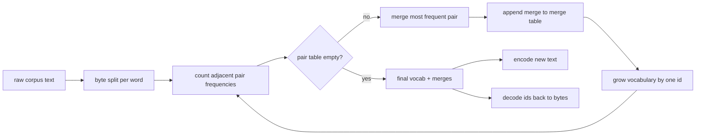
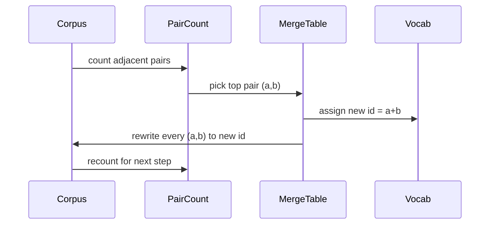

# BPE Tokenizer Sıfırdan

> Baytlar girer, kimlikler çıkar, kimlikler aynı baytlara geri döner. Her modern metin modelinin hâlâ başladığı tokenizer'yı oluşturun.

**Tür:** Yapım
**Diller:** Python
**Önkoşullar:** Aşama 04 dersleri, Aşama 07 transformer dersleri
**Süre:** ~90 dakika

## Öğrenme Hedefleri
- En sık rastlanan bitişik sembol çiftini tekrar tekrar birleştirerek ham metin derleminden bir Bayt Çifti Kodlama kelime dağarcığı eğitin.
- Belirleyici bir birleştirme tablosu uygulayın ve bir alt kelime kimlikleri akışı oluşturmak için bunu yeni metne uygulayın.
- Bilgi kaybı olmadan kimliklere ve geriye gidiş-dönüş keyfi UTF-8 girişi.
- Özel token'lari (`<|endoftext|>`, `<|pad|>`) rezerve edin ve koruyun, böylece eğitim ve kod çözmede hayatta kalabilsinler.
- Bayt düzeyindeki bir alfabenin neden genel amaçlı bir tokenizer için doğru zemin olduğuna ilişkin neden.

## Çerçeve

Bir dil modeli hiçbir zaman metni görmez. Tam sayıları görür. Bir dizeden tam sayılar listesine ve geriye doğru olan harita tokenizer'dır. Bu katmanı yanlış anladığınızda, eğitim çalıştırmasındaki her kayıp eğrisi yanlış şeyi ölçüyor demektir.

Genel metin modelleri için baskın alt kelime tokenizer ailesi Bayt Çifti Kodlamasıdır. Fikir küçük. Bilinen bir alfabeden başlayın. Eğitim külliyatında en sık görülen bitişik sembol çiftini bulun. Onu yeni bir sembolle birleştirin. Kelime dağarcığı hedef boyuta ulaşana kadar tekrarlayın. Yeni metni kodlamak, aynı birleştirme listesini aynı sırayla yeniden kullanır.

Bayt düzeyindeki değişkeni oluşturacağız. Alfabe, Unicode kod noktaları değil, 256 ham bayttır. Bu seçim, tokenizer'nin, bilinmeyen bir token'a geri dönmeden herhangi bir UTF-8 girişini işlemesine olanak tanıyan şeydir.

## Boru hattı

Eğitim tarafı ve inference tarafı birleştirme tablosunu paylaşır. Bu paylaşım sözleşmedir. inference'da birleştirme sırasını değiştirirseniz, farklı bir kimlik akışının kodunu çözersiniz.

## Bayt alfabesi

İlk 256 kimlik, 0x00 ile 0xFF arasındaki ham baytlar için ayrılmıştır. Bu, herhangi bir birleştirme gerçekleşmeden önce her girdi dizisinin sözlükte ifade edilebilmesini garanti eder. Bayt bloğundan sonra özel token'lar için küçük bir aralık ayırırız. Eğitim döngüsü hiçbir zaman bu kimlikleri birleştirme hedefi olarak önermez çünkü onları öncedentokenyayınlanmış akışın tamamen dışında tutarız.

Öntokenizer, eğitim görmeden önce korpusu boşluklara ve noktalama işaretlerine göre böler. Bu bölünme olmadan, BPE birleştirme adımı kelime sınırlarını aşan birleştirmeleri mutlu bir şekilde öğrenir ve kelime dağarcığı tüm ortak ifadelerle dolar. Bölünme ile birleştirmeler bir kelimenin içinde kalır ve sonuç genellenir.

## Eğitim döngüsü

Her eğitim adımı için döngü üç şey yapar. Derlemdeki her kelimeyi inceler ve kelimenin kendisinin ne sıklıkta göründüğüne göre ağırlıklandırılarak her bir bitişik mevcut sembol çiftinin ne sıklıkta göründüğünü sayar. En yüksek sayıya sahip çifti seçer. Bu çiftin her oluşumunu, kimliği sözlükteki bir sonraki boş alan olan tek bir yeni sembol halinde yeniden yazar. Daha sonra birleştirmeyi kaydeder.

Her adımın maliyeti, sembol dizilerinin bir listesi olarak ifade edilen derlemin boyutuna göre doğrusaldır. Bir milyon kelime ve on bin kimliklik bir hedef kelime dağarcığı için döngü saniyeler içinde tamamlanır çünkü sembol dizileri birleştikçe küçülür.

## Yeni metni kodlama

Inference birleştirme sayacını çağırmaz. Birleştirme tablosunu öğrenildiği sırayla uygular. Yeni bir kelime için kodlayıcı bayt bölünmesinden başlar. En düşük sıradaki birleştirme (geçerli olan en eski) için mevcut sırayı tarar. Bu birleştirmeyi gerçekleştirir. Tekrar tarar. Döngü, geçerli diziye tabloda hiçbir birleştirme uygulanmadığında sona erer.

Sıralamaya göre sıralama, kodlamayı belirleyici yapan ve aynı girdideki eğitim davranışını eşleştiren özelliktir. İlk öğrenilen birleştirme tablonun en üstünde yer alır ve ilk önce uygulanır. Aynı konumda iki birleştirme uygulanabiliyorsa, daha düşük sıradaki kazanır.

## Özel token'lar

Özel token'lar bayt akışının asla üretemeyeceği kimliklerdir. Bunları elle ayırıyoruz. Bu ders için iki tane yeterli.

- `<|endoftext|>` ön eğitim sırasında belgeleri ayırır. Modele "burada yeni bir belge başlıyor, önceki belgenin içeriğinin sızmasına izin vermeyin" diyor.
- `<|pad|>` , bir grubun dikdörtgen bir tensör olabilmesi için kısa dizileri doldurur. Kayıp maskesi antrenman sırasında onu gizler.

Kodlayıcı, girişte özel token'lare izin vermek için bir bayrağı kabul eder. İşaret kapalıyken, `<|endoftext|>` ve `<|pad|>` dizeleri, onları açıklayan bayt olarak tokenoluşturulur. Bayrak açıkken, değişmez dizeler ayrılmış kimlikleriyle eşlenir ve herhangi bir birleştirmeye tabi değildir.

## Gidiş-dönüş garantisi

Kodlama ve ardından kod çözme, giriş baytlarını tam olarak döndürmelidir. Kod çözücü, her kimliğin bayt genişlemesini sırayla birleştirir. Her kimlik ya ham bir bayt ya da önceden bilinen iki kimliğin birleşimi olduğundan, özyinelemeli genişleme her zaman ham baytlarda sona erer. Kod çözme daha sonra bu baytların yazdığı UTF-8 dizesini döndürür.

Bu dersteki test paketi, bu özelliği görünmeyen bir cümlede, Unicode emojili bir cümlede ve değişmez bir `<|endoftext|>` token içeren bir cümlede kontrol eder.

## Bu ders ne yapmaz

En büyük üretim tokenizer'ler tarzında normal ifadeye dayalı bir öntokenizer oluşturmaz. Buradaki öntokenizer küçük bir boşluk ve noktalama işaretidir. Küçük bir eğitim derleminde anlamlı birleştirmeler üretmek yeterlidir ve ders zincirinin geri kalanıyla yapılan sözleşme aynı kalır. Bir sonraki ders, tokenizer'yi bir kara kutu olarak ele alır ve onun üzerine dataset kayan penceresini oluşturur.

Çift sayacını paralelleştirmez. Python'da birkaç bin kelimeden oluşan bir derlem üzerindeki döngü bir saniyeden kısa sürede tamamlanır. Daha büyük derlemler için bariz hareket, kelime başına çiftleri paralel olarak saymak ve azaltmaktır.

## Kod nasıl okunur

`main.py` dört nesneyi tanımlar. `BPETokenizer` kelime dağarcığını, birleştirme tablosunu ve özel-token tablosunu içerir. `train` eğitim döngüsüdür. `encode` , inference yoludur. `decode` bayt birleştirmedir. Alttaki demo, yerleşik bir külliyat üzerinde küçük bir tokenizer eğitiyor, uzatılmış bir cümleyi kodluyor, kimliklerin kodunu çözüyor ve her ikisini de yazdırıyor. `code/tests/test_bpe.py` 'deki testler gidiş-dönüş özelliğini, özel-token rezervasyonunu ve birleştirme sırasını sabitler.

Demoyu çalıştırın. Daha sonra demodaki hedef sözcük boyutunu 300'den 600'e değiştirin ve uzatılan cümlenin kodlanmış uzunluğunun nasıl düştüğünü izleyin. Bu eğri BPE sıkıştırma eğrisidir.
