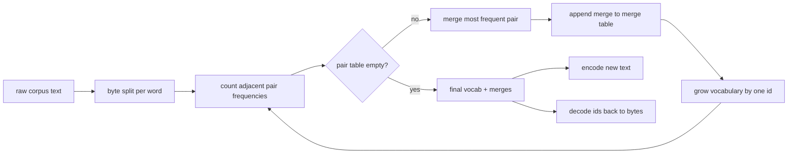
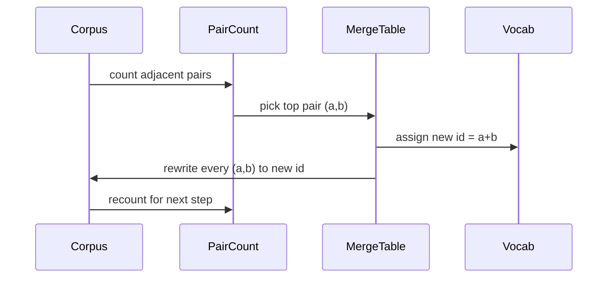

# 30 · 从零构建 BPE 分词器

> 字节进，id 出，id 再变回同样的字节。亲手构建每个现代文本模型仍然以此为起点的分词器。

**类型：** 构建
**语言：** Python
**前置：** 第 04 阶段课程、第 07 阶段 Transformer 课程
**时长：** 约 90 分钟

## 学习目标
- 通过反复合并出现频率最高的相邻符号对，从原始文本语料中训练一个「字节对编码（Byte-Pair Encoding，BPE）」词表。
- 实现一个确定性的合并表（merge table），并将其应用于新文本以生成子词（subword）id 流。
- 将任意 UTF-8 输入转换为 id 并逆向还原，做到信息无损。
- 预留并保护特殊 token（`<|endoftext|>`、`<|pad|>`），使其在训练和解码（decoding）过程中不被破坏。
- 理解为什么字节级字母表（byte-level alphabet）是通用分词器的正确基础。

## 框架

语言模型永远看不到文本。它看到的是整数。将字符串映射为整数列表、再将整数列表映射回字符串的组件，就是分词器（tokenizer）。这一层如果做错了，训练过程中每一条损失曲线测的都是错误的东西。

面向通用文本模型的主流子词分词器家族是字节对编码（BPE）。思路很简单：从一个已知字母表出发，找到训练语料中出现次数最多的相邻符号对，将其合并为一个新符号，不断重复，直到词表大小达到目标值。对新文本进行编码（encoding）时，只需按相同顺序复用同一条合并记录。

我们将构建字节级（byte-level）变体。字母表是 256 个原始字节，而不是 Unicode 码点。正是这个选择让分词器能够处理任意 UTF-8 输入，而无需退回到未知 token。

## 流水线

训练端和推理端共享同一张合并表。这种共享就是契约。如果在推理时改了合并顺序，解码出来的就是另一组 id 流。

## 字节字母表

前 256 个 id 预留给了原始字节 0x00 到 0xFF。这保证了在任何合并发生之前，每个输入字符串都可以在词表中被表达。在字节块之后，我们再预留一小段范围给特殊 token。训练循环永远不会把那些 id 作为合并候选，因为我们从一开始就把它们排除在预分词（pretokenized）序列之外。

预分词器（pretokenizer）在训练看到语料之前，先按空白和标点边界对语料进行切分。如果没有这一步，BPE 合并步骤会高兴地学到跨越词边界的合并，词表中就会塞满常见的整段短语。有了切分之后，合并在词内进行，结果更通用。

## 训练循环

每一步训练，循环做三件事。它遍历语料中的每个词，统计当前符号序列中每个相邻对出现的次数，按该词本身出现的频率加权；选出计数最高的那个对；将该对每次出现的地方重写为一个新符号，其 id 取词表中下一个可用的槽位；然后记录这次合并。

每一步的开销与语料以符号序列列表表示时的大小成线性关系。对于一百万个词、目标词表一万个 id 的情况，循环在几秒内就能跑完，因为随着合并落地，符号序列会不断缩短。

## 编码新文本

推理阶段不调用合并计数器。它按学习时的同一顺序应用合并表。对于一个新词，编码器从字节切分出发，扫描当前序列找到排名最低的合并（最早学到的那个可用的），执行合并，再重新扫描。当合并表中没有任何条目能应用于当前序列时，循环结束。

按排名排序这一性质，使得编码是确定性的，并且对同一输入的行为与训练时保持一致。最先学到的合并排在表的最前面，优先被应用。如果两个合并可以应用于同一位置，低排名的那个胜出。

## 特殊 token

特殊 token 是字节流永远无法产生的 id。我们手动预留它们。本课需要两个就足够了。

- `<|endoftext|>` 在预训练时用于分隔文档。它告诉模型"新文档从这里开始，不要让前一个文档的上下文泄露进来。"
- `<|pad|>` 填充短序列使一个批次成为规整的矩形张量。训练时损失掩码会将其屏蔽。

编码器接受一个标志位，允许输入中包含特殊 token。标志关闭时，字符串 `<|endoftext|>` 和 `<|pad|>` 会被作为拼出它们的字节进行分词。标志打开时，这些字面字符串会被映射到其预留的 id，并且不会参与任何合并。

## 往返保证

编码然后解码必须精确返回输入字节。解码器将每个 id 的字节展开按顺序拼接起来。因为每个 id 要么是一个原始字节，要么是两个之前已知 id 的拼接，递归展开最终一定终止于原始字节。解码过程返回这些字节拼出的 UTF-8 字符串。

本课的测试套件对一个未见过的句子、一个含 Unicode 表情符号的句子，以及一个包含字面 `<|endoftext|>` token 的句子，分别验证了这一性质。

## 本课不做什么

本课不构建像工业界最大分词器那样基于正则的预分词器。这里的预分词器只是一个简单的空白和标点切分。在一个小训练语料上它足以产生合理的合并结果，并且与后续课程链之间的契约保持不变。下一课将把分词器当作黑盒，在其上构建滑动窗口数据集。

本课也不对偶对计数器做并行化。在 Python 中对几千个词的语料跑一遍循环，远不到一秒就结束了。对于更大的语料，显然可以按词并行计数再归并。

## 如何阅读代码

`main.py` 定义了四个对象。`BPETokenizer` 持有词表、合并表和特殊 token 表。`train` 是训练循环。`encode` 是推理路径。`decode` 是字节拼接。底部的演示代码在一个内置语料上训练一个小分词器，对一个留出的句子进行编码，将 id 解码回来并打印。`code/tests/test_bpe.py` 中的测试用例锁定了往返性质、特殊 token 预留和合并顺序。

运行演示代码，然后把演示中的目标词表大小从 300 改为 600，观察留出句子编码后长度的下降。这条曲线就是 BPE 的压缩曲线。
