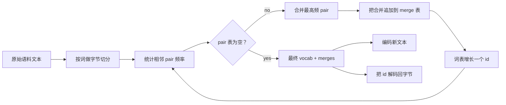
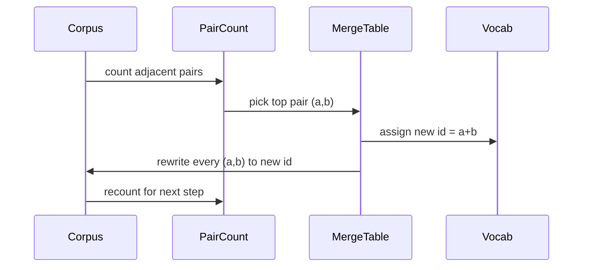

# 从零实现 BPE Tokenizer（BPE Tokenizer From Scratch）

> 译注：本文译自同目录 [`en.md`](./en.md)。术语遵循仓根 [TRANSLATION_GUIDE.md](../../../../TRANSLATION_GUIDE.md)。

> 字节进，id 出，id 再还原回同样的字节。把每个现代文本模型仍在使用的 tokenizer 亲手搭一遍。

**Type:** Build
**Languages:** Python
**Prerequisites:** Phase 04 lessons, Phase 07 transformer lessons
**Time:** ~90 minutes

## 学习目标（Learning Objectives）
- 在原始文本语料上训练一个 Byte-Pair Encoding 词表：反复合并最高频的相邻符号对。
- 实现一张确定性的合并表（merge table），把它应用到新文本上，输出一串子词 id。
- 在任意 UTF-8 输入与 id 序列之间无损往返（round-trip）。
- 预留并保护特殊 token（`<|endoftext|>`、`<|pad|>`），让它们在训练和解码过程中都安然无恙。
- 想清楚为什么字节级（byte-level）字母表是通用 tokenizer 的正确底座。

## 框架（The frame）

语言模型从来看不到文本，它看到的是整数。从字符串映射到整数列表、再映射回来，这一层就是 tokenizer。这一层做错了，整轮训练里所有的 loss 曲线都在测错的东西。

通用文本模型最主流的子词 tokenizer 家族是 Byte-Pair Encoding。思路很小：从一个已知字母表开始；在训练语料里找到出现最频繁的相邻符号对；把它合并成一个新符号；不断重复，直到词表达到目标大小。给新文本做编码时，复用同一份合并列表，按同样的顺序应用一遍即可。

我们要做的是字节级版本（byte-level variant）。字母表是 256 个原始字节，而不是 Unicode 码点。正是这个选择让 tokenizer 在面对任何 UTF-8 输入时都不必退化成未知 token。

## 流水线（The pipeline）

训练侧和推理侧共享同一张合并表，这种共享就是契约。如果你在推理时改了合并顺序，解出来的就是另一串 id 了。

## 字节字母表（The byte alphabet）

前 256 个 id 预留给原始字节 0x00 到 0xFF。这就保证了在任何合并发生之前，任意输入字符串都能用词表表达出来。在字节段之后，我们再预留一小段范围给特殊 token。训练循环永远不会把这些 id 作为合并目标，因为我们根本不让它们出现在 pretokenized 后的流里。

pretokenizer 在训练看到语料之前，先按空白和标点边界切分。如果不切，BPE 的合并步骤会很乐意学到跨词边界的合并，词表里就会塞满一整串常见短语。切了之后，合并都被限制在一个词内部，结果才有泛化能力。

## 训练循环（The training loop）

每个训练步做三件事：遍历语料里的每个词，统计当前每个相邻符号对出现的次数，并按词本身的频次加权；挑出计数最高的那对；把这对每一处出现都改写成一个新符号，其 id 是词表里下一个空闲槽位；然后把这次合并记录下来。

每一步的开销与语料表示成符号序列列表后的总长度成线性关系。对于一百万词、目标词表一万 id 的规模，整个循环在几秒内就能跑完——因为随着合并的落地，符号序列在不断变短。

## 编码新文本（Encoding fresh text）

推理不调用 pair 计数器，而是按照学习时的顺序应用合并表。对一个新词，编码器从字节切分开始；扫描当前序列，找出 rank 最低（也就是最早出现）的、能够命中的合并；执行这次合并；再扫一遍。当合并表里没有任何合并能够命中当前序列时，循环就结束。

按 rank 排序的这条性质，使得编码具有确定性，也保证了在同样输入上的行为与训练时一致。先学到的合并坐在表的最上面，会被最先应用。如果同一位置上有两条合并都能应用，rank 更低的那条胜出。

## 特殊 token（Special tokens）

特殊 token 是字节流永远生成不出来的 id，我们手工预留它们。本课只需要两个就够了。

- `<|endoftext|>` 在预训练中分隔文档。它告诉模型「一个新文档从这里开始，别让上一个文档的上下文渗进来」。
- `<|pad|>` 把短序列补齐，让一个 batch 能凑成一个矩形张量。训练时由 loss mask 把它屏蔽掉。

编码器接受一个开关，决定是否允许特殊 token 出现在输入里。开关关掉时，字符串 `<|endoftext|>` 和 `<|pad|>` 会被当作组成它们的那些字节去 tokenize；开关打开时，这些字面字符串会被映射到它们预留的 id，且不参与任何合并。

## 往返保证（Round-trip guarantee）

先编码再解码，必须精确地还原成原始的输入字节。解码器按顺序把每个 id 的字节展开拼接起来。由于每个 id 要么是一个原始字节，要么是两个此前已知 id 的拼接，递归展开总会终止在原始字节上。解码再把那串字节按 UTF-8 解释成字符串。

本课的测试套件会在三种场景下验证这条性质：一句没见过的句子、一句包含 Unicode emoji 的句子、以及一句字面包含 `<|endoftext|>` 的句子。

## 这一课不做什么（What this lesson does not do）

它不会去搭一个像最大规模生产 tokenizer 那样基于正则的 pretokenizer。这里的 pretokenizer 是一个简单的空白和标点切分，足以在小语料上产出合理的合并，与后续课程链条之间的契约也保持一致。下一课会把 tokenizer 当作黑盒，在它之上搭建滑动窗口数据集。

它也不会把 pair 计数器并行化。在几千词的语料上，Python 的循环远不到一秒就跑完了。语料更大时，明显的优化思路是按词并行计数 pair，再 reduce 起来。

## 如何读这份代码（How to read the code）

`main.py` 定义了四个对象。`BPETokenizer` 持有词表、合并表和特殊 token 表。`train` 是训练循环。`encode` 是推理路径。`decode` 是字节拼接。文件末尾的 demo 在一个内置语料上训练一个小 tokenizer，编码一条留出（held-out）的句子，把 id 解码回来，并把两端都打印出来。`code/tests/test_bpe.py` 中的测试钉死了往返性质、特殊 token 的预留以及合并的顺序。

跑一下这个 demo。然后把 demo 里的目标词表大小从 300 改成 600，观察那条留出句子被编码后的长度是怎么下降的。这条曲线就是 BPE 的压缩曲线。
