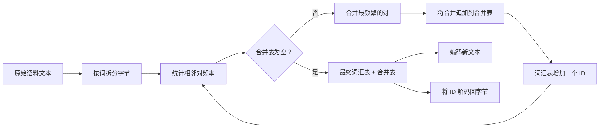
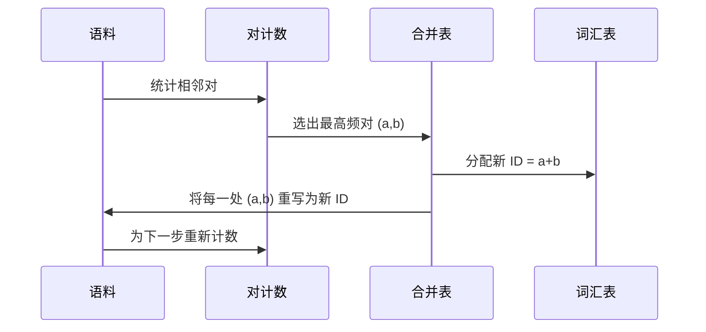

# 从零实现 BPE 分词器

> 字节进，ID 出，ID 回到同样的字节。构建那个每一个现代文本模型仍然起步于它的分词器。

**类型：** 构建
**语言：** Python
**前置知识：** 阶段 04 课程、阶段 07 Transformer 课程
**时长：** ~90 分钟

## 学习目标

- 通过反复合并训练语料中最频繁出现的相邻符号对，从原始文本语料中训练出一个字节对编码（BPE）词汇表。
- 实现一个确定性的合并表，并将其应用于新文本，以生成子词 ID 流。
- 对任意 UTF-8 输入进行 ID 的往返转换，且不丢失任何信息。
- 保留并保护特殊 token（`<|endoftext|>`、`<|pad|>`），使它们在训练和解码过程中不被破坏。
- 论证为什么字节级字母表是通用分词器的正确基础。

## 框架

语言模型从不直接看到文本。它看到的是一串整数。从字符串到整数列表，再返回字符串的映射就是分词器。如果这一层出了问题，那么训练过程中的每一条损失曲线衡量的都是错误的东西。

对于通用文本模型而言，最主流的子词分词器家族是字节对编码（Byte-Pair Encoding）。其想法很简单：从一个已知的字母表开始，找出训练语料中出现次数最多的相邻符号对，将其合并为一个新符号，重复这个过程，直到词汇表达到目标大小。编码新文本时，按照相同的顺序复用相同的合并表。

我们将构建字节级变体。其字母表是 256 个原始字节，而非 Unicode 码点。正是这个选择使得分词器能够处理任意 UTF-8 输入，而无需回退到未知 token。

## 流水线

```mermaid
flowchart LR
    A[原始语料文本] --> B[按词拆分字节]
    B --> C[统计相邻对频率]
    C --> D{合并表为空？}
    D -- 否 --> E[合并最频繁的对]
    E --> F[将合并追加到合并表]
    F --> G[词汇表增加一个 ID]
    G --> C
    D -- 是 --> H[最终词汇表 + 合并表]
    H --> I[编码新文本]
    H --> J[将 ID 解码回字节]
```

训练端和推理端共享同一张合并表。这种共享就是契约。如果在推理时改变了合并顺序，你解码出的将是不同的 ID 流。

## 字节字母表

前 256 个 ID 被保留给原始字节 0x00 至 0xFF。这保证了在任何合并发生之前，每一个输入字符串都可以用词汇表表示。在字节块之后，我们为特殊 token 预留一小段范围。训练循环永远不会将这些 ID 作为合并目标提出，因为我们将其完全排除在预分词流之外。

预分词器在训练看到语料之前，先按空白符和标点边界对语料进行切分。如果没有这种切分，BPE 合并步骤会愉快地学习跨越词边界的合并，词汇表就会被常见的完整短语填满。有了切分，合并保持在词内部，结果更具泛化性。

## 训练循环

每个训练步骤，循环做三件事：遍历语料中的每一个词，统计该词中所有当前符号相邻对出现的频率（按词本身的出现频次加权）；选出频率最高的对；将每一处该对出现重写为一个新符号，其 ID 是词汇表中的下一个空闲位置；然后记录这次合并。

```mermaid
sequenceDiagram
    participant 语料
    participant 对计数
    participant 合并表
    participant 词汇表
    语料->>对计数: 统计相邻对
    对计数->>合并表: 选出最高频对 (a,b)
    合并表->>词汇表: 分配新 ID = a+b
    合并表->>语料: 将每一处 (a,b) 重写为新 ID
    语料->>对计数: 为下一步重新计数
```

每一步的代价与用符号序列列表表示的语料大小呈线性关系。对于一百万词和一万个 ID 的目标词汇表，循环在数秒内即可完成，因为随着合并的发生，符号序列会不断缩短。

## 编码新文本

推理时不调用合并计数器。它按学习顺序应用合并表。对于一个新词，编码器从字节拆分开始，扫描当前序列，找出排名最低（最早适用）的合并，执行该合并，然后再次扫描。当表中没有任何合并适用于当前序列时，循环结束。

按排名排序这一性质使得编码具有确定性，并确保在相同输入上与训练行为一致。最先学习到的合并位于表的顶部，并最先被应用。如果两个合并可以应用于同一位置，排名较低的胜出。

## 特殊 token

特殊 token 是字节流永远无法产生的 ID。我们手动保留它们。本课中两个就足够了。

- `<|endoftext|>` 在预训练期间分隔文档。它告诉模型："一个新文档从这里开始，不要让前一个文档的上下文泄漏进来。"
- `<|pad|>` 填充短序列，使一个批次形成矩形张量。损失掩码在训练期间将其隐藏。

编码器接受一个标志，以允许在输入中使用特殊 token。当该标志关闭时，字符串 `<|endoftext|>` 和 `<|pad|>` 会被分词为拼出它们的字节。当该标志打开时，这些字面字符串被映射到其保留的 ID，并且不受任何合并的影响。

## 往返保证

先编码再解码必须精确返回输入字节。解码器按顺序拼接每个 ID 的字节展开。由于每个 ID 要么是一个原始字节，要么是两个已知 ID 的拼接，递归展开最终总是终止于原始字节。解码后返回这些字节所拼出的 UTF-8 字符串。

本课的测试套件在一个未见过的句子、一个包含 Unicode 表情符号的句子，以及一个包含字面 `<|endoftext|>` token 的句子上检查这一性质。

## 本课不做什么

本课不会构建大型生产分词器风格的正则驱动预分词器。这里的预分词器是一个简单的空白符和标点切分器。它足以在小训练语料上产生合理的合并，并且与本课链中其余部分的契约保持一致。下一课将把分词器视为黑盒，在它之上构建滑动窗口数据集。

本课不会并行化对计数器。用 Python 在数千词的语料上循环，远低于一秒即可完成。对于更大的语料，明显的改进方向是按词并行计数并归并。

## 如何阅读代码

`main.py` 定义了四个对象。`BPETokenizer` 持有词汇表、合并表和特殊 token 表。`train` 是训练循环。`encode` 是推理路径。`decode` 是字节拼接。底部的演示在内置语料上训练一个小型分词器，编码一个保留句子，将 ID 解码回来，并打印两者。`code/tests/test_bpe.py` 中的测试固定了往返性质、特殊 token 保留和合并顺序。

运行演示。然后将演示中的目标词汇表大小从 300 改为 600，观察保留句子的编码长度如何下降。那条曲线就是 BPE 压缩曲线。
