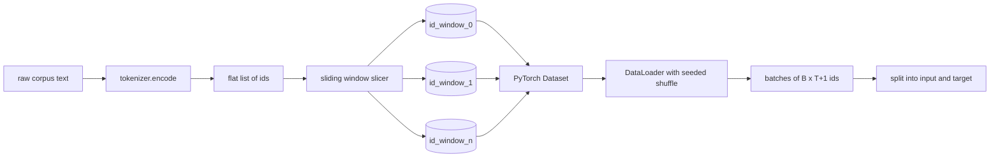
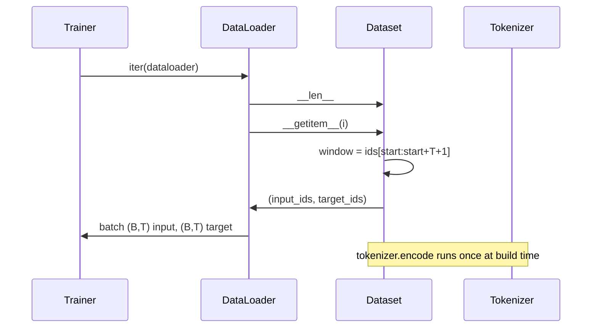

# Sürgülü Pencere ile Tokenözelleştirilmiş Dataset

> Bir ön eğitim çalışması, token kimlikten gradient'ye kadar olan bir fonksiyondur. Bu ders, kimlikleri besleyen konveyörü oluşturur.

**Tür:** Yapım
**Diller:** Python
**Önkoşullar:** Aşama 04 dersleri, Aşama 07 transformer dersleri, bu aşamanın Ders 30'u
**Süre:** ~90 dakika

## Öğrenme Hedefleri
- tokenizer'yi bir kez çağırarak ham bir külliyatı token kimliklerinden oluşan bir akışa dönüştürün.
- Yapılandırılabilir bir örtüşme adımıyla kimlik akışını sabit uzunlukta pencerelere dilimleyin.
- Sonraki-token tahmini için girdi döndüren ve tensörleri hedef alan bir PyTorch Dataset oluşturun.
- dataset'i, çağ başına tohumlanan deterministik bir karıştırma ile bir DataLoader'a sarın.
- Adım, artıklık ve etkin dataset boyutu arasındaki dengenin nedeni.

## Çerçeve

Bir ön eğitim çalıştırması aynı anda bir grup token kimliği okur ve modeli günceller. Her partinin şekli eğitim sözleşmesiyle belirlenir. Nedensel bir dil modeli için, grup, `(B, T)` giriş kimliğini ve `(B, T)` hedef kimliğini tutar; burada hedef, girişin birer birer sola kaydırıldığı yerdir. Veri hattının görevi, talep üzerine bu sözleşmeyi, deterministik ve tekrarlanabilir bir şekilde, birkaç gigabaytlık ham metinden oluşan bir külliyattan üretmektir.

Bu ders boru hattını oluşturur. Önceki dersteki tokenizer, metni uzun, düz bir kimlik listesine dönüştürür. Eğitim örneklerini listeleyen kayan pencere dilimleri. Özel bir Dataset, örnekleri tensör olarak ortaya çıkarır. DataLoader bunları gruplandırır ve bilinen bir tohumla karıştırır.

## Şekil sözleşmesi

Nedensel bir LM, `(B, T)` biçimindeki kimlikleri tüketir; burada `B` toplu iş boyutudur ve `T` bağlam uzunluğudur. `t` konumundaki hedef, `t+1` konumundaki giriştir. Bu, her eğitim örneğinin `T+1` ham kimliği kapsadığı anlamına gelir. Pencere adımı ardışık örnekler arasında ne kadar örtüşmenin mevcut olduğunu kontrol eder.

Dilimleyici hiçbir zaman gövdenin sınırıyla örtüşmez. Son pencerede `T+1` konumu doldurmaya yetecek sayıda kimlik yoksa dilimleyici onu bırakır. Kuyruğun `<|pad|>` ile doldurulması da geçerli bir seçimdir ancak kayıp maskesini karmaşık hale getirir. Bu ders için bırakıyoruz.

## Neden sürgülü pencere

Bir ön eğitim külliyatı uzun bir kimlik akışıdır. Model yalnızca örtüşmeyen pencereler görüyorsa her eğitim örneği ona aynı `T` sınırlarını öğretecektir. Adımın ayarlanması bu sınırları hareket ettirir, böylece model daha çeşitli sonraki-tahmin-token görevlerini görür.

`T` 'lik bir adım, örtüşmeyen pencereler üretir. `T // 2` 'lik bir adım yüzde elli örtüşme üretir ve etkili dataset'i iki katına çıkarır. `1` 'lik bir adım maksimum örtüşmeyi üretir ve dataset'i `T` faktörü kadar artırır. Maliyet, dönem başına daha fazla işlemdir. Faydası daha fazla sınır çeşitliliğidir. Çoğu ön eğitim çalıştırması, bağlam uzunluğuna eşit bir adım kullanır çünkü korpus zaten modelin bir dönemde tamamlayabileceğinden çok daha büyüktür, dolayısıyla sınır çeşitliliği argümanı daha zayıftır.

## Dataset sınıfı

Bir PyTorch Dataset'nun iki gerekli yöntemi vardır. `__len__` örneklerin sayısını döndürür. `__getitem__` bir örneği bir tensör çifti olarak döndürür. Dataset'miz kodlanmış kimlik akışını ve adımı saklar. Buna indeksleme, pencerenin başlangıcını anında hesaplar, böylece bellek maliyeti, adımın kaç örnek ürettiğine bakılmaksızın kimlik akışının bir kopyasıdır.

Tek tek geçiş `__getitem__` içinde gerçekleşir. Dataset, `(input, target)` değerini döndürür; burada `input = window[:-1]` ve `target = window[1:]`. Her ikisi de PyTorch uzun tensörleridir. Eğitim döngüsü bunları temel gerçek olarak ele alır.

## Deterministik karıştırma

`shuffle=True` içeren bir DataLoader, PyTorch rastgele oluşturucusundan okur. Her çağ için tohumlanan açık bir `torch.Generator` 'yi ileterek, çalıştırmanın her yeniden başlatılışında aynı karıştırmayı elde ederiz. Bu özellik, yalnızca tek bir hiperparametrede farklılık gösteren iki çalıştırmayı karşılaştırmak istediğinizde önemlidir. Tohum olmadan, iki çalıştırma verileri farklı sırada görür ve kayıp eğrileri değişiklikle ilgisi olmayan nedenlerden dolayı farklılık gösterir.

Bu dersteki tohum sözleşmesi basittir. `epoch_seed = base_seed + epoch_index`. Temel tohum inşaat sırasında geçirilir. Dönem indeksi, her çağın tepesindeki eğitmen tarafından artırılır. Aynı temel tohumla yeniden çalıştırma, her dönemde her zaman aynı sırayı görür.

## Toplu örnekleyici

PyTorch'taki varsayılan örnekleyici, değiştirme devre dışı bırakılarak endeksleri eşit şekilde rastgele seçer. Ön eğitim için istediğimiz şey budur. Küçük bir dataset üzerinde ince ayar yapmak için sözleşme aynıdır. DataLoader, `__getitem__` `B` kez çağırarak ve sonuçları istifleyerek bir toplu iş oluşturur. Her örnek yapı gereği aynı uzunlukta olduğundan dolgu mantığına gerek yoktur.

Ders basitlik açısından `num_workers=0` değerini koruyor. Bir üretim çalışmasında işçiler `__getitem__` çağrılarını paralelleştirir. İşin yalnızca bir bellek içi tensör dilimi olması nedeniyle çoğunlukla işlem yapılmayan ardışık düzenimizle, ancak aynı Dataset API, çalışanları temiz bir şekilde destekler.

## Örnekleri sayma

Uzunluğu `N`, bağlam uzunluğu `T` ve adım `S` olan bir kimlik akışı için örnek sayısı `max(0, 1 + (N - (T + 1)) // S)`'tır. Ders, bu hesaplamayı Dataset üzerinde statik bir yöntem olarak ortaya koyar, böylece eğitmen yineleme olmadan çağ başına toplam adımları hesaplayabilir.

## Bu ders ne yapmaz

Diskten akış sağlamaz. Korpus tamamen bellekte kodlanır ve tek bir tensör olarak tutulur. Yüz megabaytın oldukça altında olan ve ders için doğru biçime sahip olan birkaç milyon kimlikten oluşan bir derleme için. Disk akışı, depolamayı değiştirerek takılan ancak Dataset sözleşmesini koruyan ayrı bir sorundur.

Birden fazla belgeyi işlemez. Derlem tek bir sürekli kimlik akışı olarak ele alınır. Bir sonraki belge sınırı, derlem birden çok belgeden oluşturulduğunda `<|endoftext|>` kimlikleri eklenerek kodlanır. Model sınır etrafında tahmin yapmayı öğrenir.

## Kod nasıl okunur

`main.py` iki sınıfı ve bir yardımcıyı tanımlar. `SlidingWindowDataset` , PyTorch Dataset'dur. `make_dataloader` , tohum oluşturucuya sahip yapılandırılmış bir DataLoader'ı döndürür. `_encode_corpus_to_ids` tek seferlik tokenizer çağrısıdır. Alttaki demo, süreç içinde küçük bir tokenizer oluşturur, yerleşik bir derlemi kodlar, dataset ve veri yükleyiciyi oluşturur, bir toplu iş yazdırır ve şekil sözleşmesini ileri sürer. `code/tests/test_dataset.py` 'teki testler pencere sayım formülünü, birer birer kaydırma özelliğini, deterministik karıştırmayı ve adım değiş tokuşunu sabitler.

Demoyu çalıştırın. Daha sonra bağlam uzunluğunu 16'dan 32'ye değiştirin ve dönem başına örnek sayısının nasıl düştüğünü izleyin. Bu sayı, dönem başına adım bütçenizdir.
