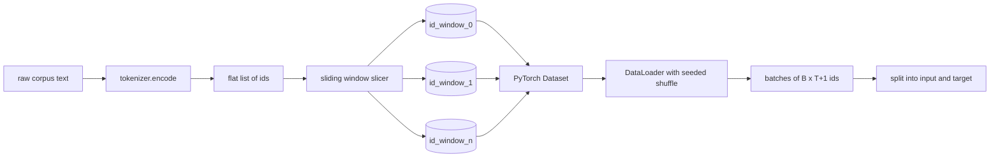
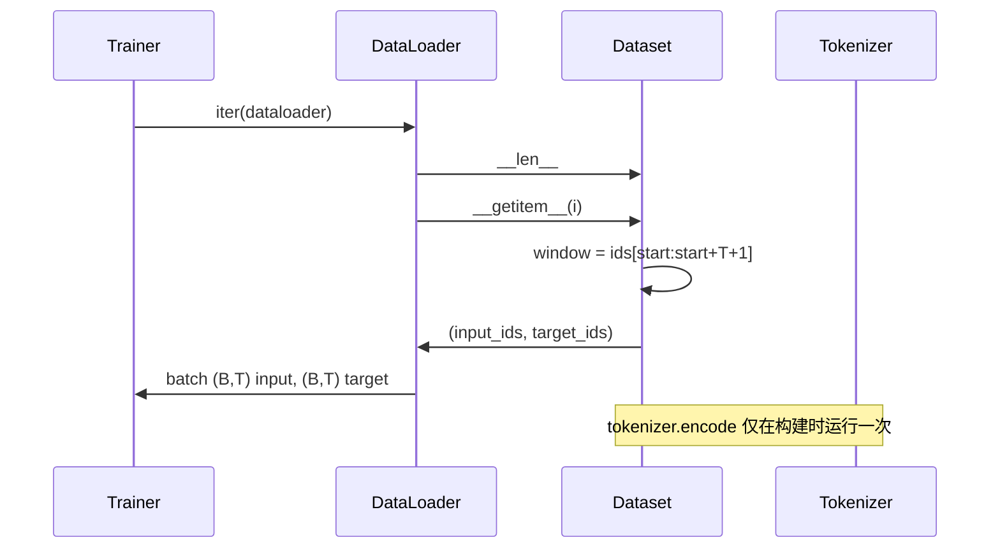

# 31 · 基于滑动窗口的 Token 化数据集

> 一次预训练运行就是从 token ID 到梯度的函数。本课构建的是负责送入这些 ID 的传送带。

**类型：** 构建
**语言：** Python
**前置：** 第 04 阶段各课、第 07 阶段 Transformer 各课、本阶段第 30 课
**时长：** 约 90 分钟

## 学习目标
- 通过一次性调用分词器，将原始语料转换为 token ID 流。
- 将 ID 流切分为固定长度窗口（window），并支持可配置的重叠步长（stride）。
- 构建一个 PyTorch Dataset，返回用于下一 token 预测（next-token prediction）的输入与目标张量。
- 将 Dataset 包装在 DataLoader 中，并按 epoch 设定种子进行确定性随机打乱（deterministic shuffle）。
- 思考步长、冗余度与有效数据集大小之间的权衡。

## 框架

一次预训练运行一次读取一批 token ID 并更新模型。每个批次（batch）的形状由训练契约固定。对于因果语言模型（causal language model），批次包含 `(B, T)` 的输入 ID 和 `(B, T)` 的目标 ID，其中目标是输入向左偏移一位的结果。数据流水线的职责是按需生成该契约，并以确定且可复现的方式，从可能达数 GB 的原始文本语料中产出。

本课就构建这条流水线。前一课的分词器将文本转换为一长串扁平的 ID 列表。滑动窗口将该列表切分为训练样本。自定义 Dataset 将样本暴露为张量。DataLoader 则对它们进行分批，并以已知种子打乱顺序。

## 形状契约

因果语言模型消费形状为 `(B, T)` 的 ID，其中 `B` 为批次大小，`T` 为上下文长度（context length）。位置 `t` 处的目标是位置 `t+1` 处的输入。这意味着每个训练样本覆盖 `T+1` 个原始 ID。窗口步长控制相邻样本之间的重叠程度。

切分器不会越过语料边界。如果最后一个窗口没有足够的 ID 填满 `T+1` 个位置，切分器将其丢弃。用 `<|pad|>` 填充尾部也是可行的选择，但这会使损失掩码（loss mask）变复杂。本课选择丢弃。

## 为什么用滑动窗口

预训练语料是一长串连续的 ID 流。如果模型只能看到不重叠的窗口，那么每个训练样本都将在相同的 `T` 边界处教导模型。调整步长可以移动这些边界，使模型看到更多样化的"预测下一 token"任务。

步长为 `T` 时产生不重叠窗口。步长为 `T // 2` 时产生 50% 重叠，并将有效数据集翻倍。步长为 `1` 时产生最大重叠，使数据集放大 `T` 倍。代价是每个 epoch 的计算量更大，收益则是边界多样性更高。大多数预训练运行将步长设为等于上下文长度，因为语料库通常远大于模型在一个 epoch 内能处理完的量，因此边界多样性的论据并不那么有力。

## Dataset 类

PyTorch Dataset 有两个必需方法。`__len__` 返回样本数量。`__getitem__` 返回一个样本，形式为一对张量。我们的 Dataset 存储编码后的 ID 流和步长。按索引访问时动态计算窗口起始位置，因此无论步长产生多少样本，内存开销仅为一组 ID 流。

偏移一位的操作发生在 `__getitem__` 内部。Dataset 返回 `(input, target)`，其中 `input = window[:-1]`，`target = window[1:]`。二者均为 PyTorch long 类型张量，训练循环将其视为真实标签（ground truth）。

## 确定性随机打乱

设置 `shuffle=True` 的 DataLoader 从 PyTorch 随机生成器中读取数据。通过传入一个按 epoch 设定种子的显式 `torch.Generator`，每次重启运行时都能得到相同的打乱顺序。这一特性在需要比较仅有一个超参数不同的两次运行时非常重要。如果没有种子，两次运行看到的数据顺序不同，损失曲线会因与变更无关的原因而产生分歧。

本课中的种子契约很简单：`epoch_seed = base_seed + epoch_index`。基种子在构造时传入，epoch 索引由训练器在每个 epoch 开始处递增。以相同基种子重新运行时，每个 epoch 中的顺序始终一致。

## 批次采样器

PyTorch 默认采样器（sampler）在不放回的条件下均匀随机选取索引，这正是预训练所需的方式。对于小数据集的微调（finetuning），契约是相同的。DataLoader 通过调用 `B` 次 `__getitem__` 并将结果堆叠起来组装一个批次。由于每个样本构造时长度都相同，不需要任何填充逻辑。

本课为简单起见保持 `num_workers=0`。在生产环境中运行时，worker 进程可并行化 `__getitem__` 调用。对我们的流水线而言，这几乎不起作用，因为实际工作只是对内存中张量做一次切片，但相同的 Dataset API 能够干净地支持 worker。

## 样本计数

对于长度为 `N` 的 ID 流、上下文长度为 `T`、步长为 `S`，样本数量为 `max(0, 1 + (N - (T + 1)) // S)`。本课将该计算暴露为 Dataset 上的一个静态方法，以便训练器无需遍历即可计算每个 epoch 的总步数。

## 本课不涉及的内容

不从磁盘流式读取。语料完全在内存中编码并保存为单个张量。对于几百万个 ID 的语料，这远低于一百兆字节，适合本课的定位。磁盘流式读取是另一项关注点，可通过替换存储来实现，同时保持 Dataset 契约不变。

不处理多个文档。语料被视为一条连续的 ID 流。从多个文档构建语料时，文档边界通过插入 `<|endoftext|>` ID 来编码，模型将学会在边界附近进行预测。

## 如何阅读代码

`main.py` 定义了两个类和一个辅助函数。`SlidingWindowDataset` 是 PyTorch Dataset，`make_dataloader` 返回一个带种子生成器的已配置 DataLoader，`_encode_corpus_to_ids` 是一次性的分词器调用。底部的演示代码在进程内构建一个小型分词器，对内置语料进行编码，构造 Dataset 和 DataLoader，打印一个批次，并断言形状契约。`code/tests/test_dataset.py` 中的测试固化了窗口计数公式、偏移一位的属性、确定性随机打乱以及步长权衡。

运行演示代码。然后将上下文长度从 16 改为 32，观察每个 epoch 的样本数量如何下降。这个数字就是你的"每 epoch 步数预算"。
