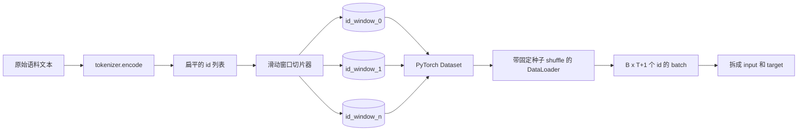
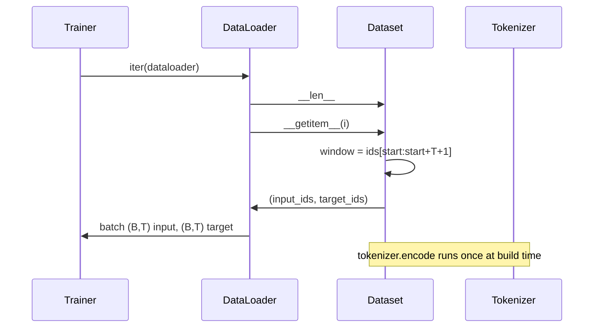

# 带滑动窗口的 Tokenized 数据集（Tokenized Dataset with Sliding Window）

> 译注：本文译自同目录 [`en.md`](./en.md)。术语遵循仓根 [TRANSLATION_GUIDE.md](../../../../TRANSLATION_GUIDE.md)。

> 一次预训练（pretraining）跑批，本质是从 token id 到 gradient 的一个函数。本课要搭的，是把 id 喂进去的那条传送带。

**Type:** Build
**Languages:** Python
**Prerequisites:** Phase 04 lessons, Phase 07 transformer lessons, Lesson 30 of this phase
**Time:** ~90 minutes

## 学习目标（Learning Objectives）
- 通过对 tokenizer 的一次调用，把原始语料转换成一串 token id。
- 把这串 id 切成定长的窗口，步长（stride）的重叠程度可配置。
- 实现一个 PyTorch Dataset，为 next-token prediction 返回输入与目标 tensor。
- 用每个 epoch 都带种子的、确定性的 shuffle，把这个 dataset 包进 DataLoader。
- 想清楚 stride、冗余度与有效数据集大小三者之间的取舍。

## 整体框架（The frame）

一次预训练跑批，每次读入一个 batch 的 token id，更新模型一步。每个 batch 的 shape 由训练契约钉死。对一个因果语言模型（causal LM）来说，batch 装的是 `(B, T)` 的输入 id 和 `(B, T)` 的目标 id，目标就是输入向左平移一位。数据流水线（pipeline）的活儿，就是按需、确定性、可复现地，从一份可能数 GB 大的原始文本语料里产出这份契约。

本课就是搭这条流水线。上一课的 tokenizer 把文本变成一长串扁平的 id list。一个滑动窗口把这串 list 切成训练样本。一个自定义 Dataset 把样本以 tensor 形式暴露出去。一个 DataLoader 把它们打成 batch，并按已知种子做 shuffle。

## Shape 契约（The shape contract）

一个 causal LM 吃的是 shape 为 `(B, T)` 的 id，其中 `B` 是 batch size，`T` 是 context window（上下文窗口）长度。位置 `t` 上的目标，就是位置 `t+1` 上的输入。也就是说每个训练样本要覆盖 `T+1` 个原始 id。窗口的 stride 控制相邻样本之间的重叠程度。

切片器永远不会跨过语料边界。如果最后一个窗口凑不齐 `T+1` 个 id，就直接丢掉。当然，用 `<|pad|>` 把尾巴 padding 起来也是合法做法，但那会把 loss mask 弄复杂。本课选择直接丢。

## 为什么要滑动窗口（Why a sliding window）

一份预训练语料就是一长条 id 流。如果模型只看不重叠的窗口，每个训练样本教给它的，永远是同样那 `T` 个边界。调一下 stride，就能把这些边界挪开，让模型见到更多样的「预测下一个 token」任务。

stride 等于 `T` 时，得到的是不重叠的窗口。stride 等于 `T // 2` 时，重叠 50%，有效数据集翻倍。stride 等于 `1` 时，重叠最大化，数据集大小放大 `T` 倍。代价是每个 epoch 的算力开销更大，收益是边界更多样。大多数预训练跑批选 stride 等于 context length，因为语料本来就比模型一个 epoch 能吃完的多得多，所以「边界多样性」这个论点其实没那么强。

## Dataset 类（The Dataset class）

PyTorch 的 Dataset 有两个必需方法。`__len__` 返回样本数。`__getitem__` 返回一个样本，形式是一对 tensor。我们的 Dataset 持有编码后的 id 流和 stride。索引时再现场算窗口起点，这样不管 stride 切出多少样本，内存里只放一份 id 流。

向左平移一位这件事，就发生在 `__getitem__` 里面。Dataset 返回 `(input, target)`，其中 `input = window[:-1]`，`target = window[1:]`。两者都是 PyTorch 的 long tensor。训练循环把它们当作 ground truth 用。

## 确定性 shuffle（Deterministic shuffle）

DataLoader 设 `shuffle=True` 时，会从一个 PyTorch 随机数生成器里取序。我们显式传入一个每个 epoch 都重新种子化的 `torch.Generator`，这样每次重启训练，看到的 shuffle 顺序都一样。当你想对比两次只差一个超参的跑批时，这一点至关重要。没有种子，两次跑批看到的数据顺序不同，loss 曲线发散的原因就和你改的那个超参没关系了。

本课的种子契约很简单：`epoch_seed = base_seed + epoch_index`。base seed 在构造时传入。epoch 索引由 trainer 在每个 epoch 开头加一。同样的 base seed 重跑一遍，每个 epoch 看到的顺序都和上一次完全一样。

## Batch sampler

PyTorch 的默认 sampler，是从所有索引里均匀随机抽样、不放回。这正是预训练想要的。在小数据集上做 fine-tune 时，契约也一样。DataLoader 会调 `B` 次 `__getitem__`，把结果 stack 起来组装成一个 batch。因为每个样本按构造来说就是等长的，不需要任何 padding 逻辑。

本课为了简单起见用 `num_workers=0`。生产环境里，多 worker 会把 `__getitem__` 并行化。在我们这条流水线里其实意义不大，因为干的活只是从内存中的一个 tensor 上切片，但同一套 Dataset API 切到 worker 模式也能干净跑起来。

## 数样本（Counting examples）

设 id 流长度为 `N`，context length 为 `T`，stride 为 `S`，样本数就是 `max(0, 1 + (N - (T + 1)) // S)`。本课把这个计算暴露成 Dataset 上的一个静态方法，这样 trainer 不用真的迭代就能算出每个 epoch 的总步数。

## 本课不做的事（What this lesson does not do）

不做磁盘流式读取。语料一次性全部编码进内存，作为一个 tensor 整体持有。对几百万 id 这个量级的语料来说，体积远不到一百 MB，对本课来说这是合适的形态。磁盘流式是另外一件事，做法是替换底层存储，但保留 Dataset 契约。

不处理多文档。语料被当作一条连续的 id 流。当语料是从多份文档拼出来时，文档边界靠在拼接处插入 `<|endoftext|>` id 来表示。模型自己会学到怎么在边界附近做预测。

## 怎么读这份代码（How to read the code）

`main.py` 里定义了两个类和一个工具函数。`SlidingWindowDataset` 是 PyTorch Dataset。`make_dataloader` 返回一个带种子化 generator 的、配置好的 DataLoader。`_encode_corpus_to_ids` 是那次一次性的 tokenizer 调用。文件底部的 demo 在进程内构建一个小 tokenizer，把内置语料编码出来，构造 dataset 和 dataloader，打印一个 batch，并断言 shape 契约。`code/tests/test_dataset.py` 中的测试钉死了窗口数公式、向左平移一位的性质、确定性 shuffle 行为，以及 stride 取舍。

跑一下 demo。然后把 context length 从 16 改成 32，看看每个 epoch 的样本数是怎么往下掉的。这个数字就是你每个 epoch 的步数预算。
