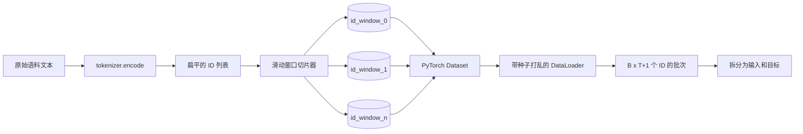
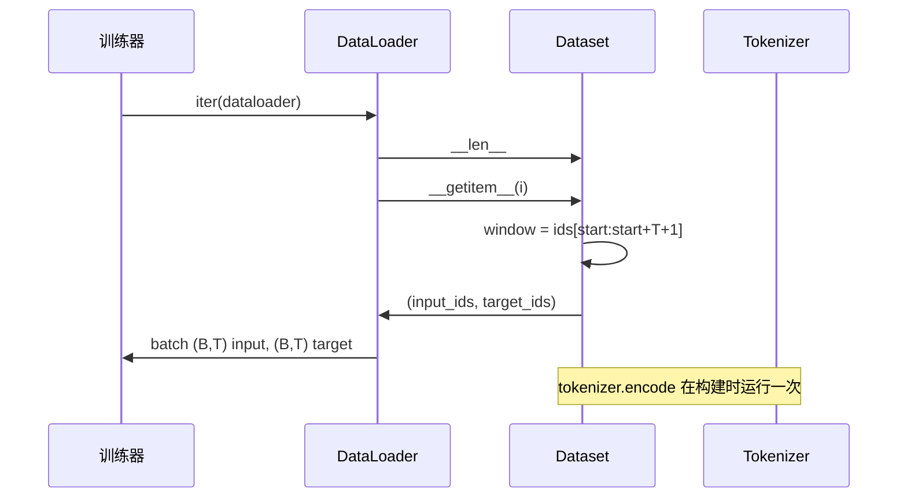

# 带滑动窗口的 Tokenized 数据集

> 预训练运行是一个从 token ID 到梯度的函数。本课程构建了将 ID 送入模型的传送带。

**类型：** 构建
**语言：** Python
**前置要求：** 阶段04课程、阶段07 Transformer 课程、本阶段课程30
**时长：** 约 90 分钟

## 学习目标

- 通过一次调用 tokenizer 将原始语料转换为 token ID 流
- 用可配置的步长将 ID 流切分为固定长度的窗口
- 构建一个返回输入和目标张量的 PyTorch Dataset，用于下一个 token 预测
- 将数据集包装到 DataLoader 中，每轮使用一个确定性种子进行打乱
- 权衡步长、数据冗余与有效数据集大小之间的关系

## 框架

预训练运行每次读取一个批次的 token ID 并更新模型。每个批次的形状由训练约定固定。对于因果语言模型，批次包含 `(B, T)` 个输入 ID 和 `(B, T)` 个目标 ID，其中目标是将输入左移一位后的结果。数据管道的任务是以确定且可复现的方式，从可能数 GB 的原始文本语料中按需产生该约定。

本课程构建了这个管道。上一课的 tokenizer 将文本转换为一长串扁平的 ID 列表。滑动窗口将该列表切分为训练样本。自定义 Dataset 将样本暴露为张量。DataLoader 对它们进行批处理并使用已知种子进行打乱。

## 形状约定

因果语言模型消费形状为 `(B, T)` 的 ID，其中 `B` 是批次大小，`T` 是上下文长度。位置 `t` 的目标是位置 `t+1` 的输入。这意味着每个训练样本需要 `T+1` 个原始 ID。窗口步长控制着连续样本之间的重叠程度。

```mermaid
flowchart LR
    A[原始语料文本] --> B[tokenizer.encode]
    B --> C[扁平的 ID 列表]
    C --> D[滑动窗口切片器]
    D --> E[(id_window_0)]
    D --> F[(id_window_1)]
    D --> G[(id_window_n)]
    E --> H[PyTorch Dataset]
    F --> H
    G --> H
    H --> I[带种子打乱的 DataLoader]
    I --> J[B x T+1 个 ID 的批次]
    J --> K[拆分为输入和目标]
```

切片器不会越出语料的边界。如果最后一个窗口没有足够的 ID 来填满 `T+1` 个位置，切片器会丢弃它。用 `<|pad|>` 填充尾部也是一种有效的选择，但会使损失掩码变得复杂。本课程选择丢弃。

## 为什么使用滑动窗口

预训练语料是一个长长的 ID 流。如果模型只看到非重叠的窗口，每个训练样本都会教给它相同的 `T` 个边界。调整步长可以移动这些边界，使模型看到更多样化的下一个 token 预测任务。

步长为 `T` 时产生非重叠窗口。步长为 `T // 2` 时产生 50% 的重叠，并使有效数据集大小翻倍。步长为 `1` 时产生最大重叠，数据集大小增加 `T` 倍。代价是每轮训练需要更多计算。好处是边界多样性更高。大多数预训练运行使用等于上下文长度的步长，因为语料已经远大于模型在一轮内能完成的量，因此边界多样性的论点相对较弱。

## Dataset 类

PyTorch Dataset 有两个必需的方法。`__len__` 返回样本数量。`__getitem__` 返回一对张量作为样本。我们的 Dataset 存储编码后的 ID 流和步长。通过索引访问时会即时计算窗口的起始位置，因此无论步长产生多少样本，内存成本都只占 ID 流的一份拷贝。

```mermaid
sequenceDiagram
    participant 训练器
    participant DataLoader
    participant Dataset
    participant Tokenizer
    训练器->>DataLoader: iter(dataloader)
    DataLoader->>Dataset: __len__
    DataLoader->>Dataset: __getitem__(i)
    Dataset->>Dataset: window = ids[start:start+T+1]
    Dataset->>DataLoader: (input_ids, target_ids)
    DataLoader->>训练器: batch (B,T) input, (B,T) target
    Note over Tokenizer,Dataset: tokenizer.encode 在构建时运行一次
```

右移一位的操作发生在 `__getitem__` 内部。Dataset 返回 `(input, target)`，其中 `input = window[:-1]`，`target = window[1:]`。两者都是 PyTorch 的长整型张量。训练循环将它们视为真实值。

## 确定性打乱

设置 `shuffle=True` 的 DataLoader 从 PyTorch 的随机生成器中读取数据。通过传入一个显式的 `torch.Generator`（每轮设定种子），我们可以在每次重新运行时得到相同的打乱顺序。当你想比较两个仅超参数不同的运行时，这个特性非常重要。如果没有种子，两个运行会以不同的顺序看到数据，导致损失曲线因与变化无关的原因而发散。

本课程的种子约定很简单：`epoch_seed = base_seed + epoch_index`。基础种子在构造时传入。轮次索引由训练器在每轮开始时递增。使用相同基础种子重新运行时，每轮的顺序始终相同。

## 批次采样器

PyTorch 中的默认采样器无放回地均匀随机选择索引。这正是预训练所需要的。对于小数据集的微调，约定也是相同的。DataLoader 通过调用 `__getitem__` `B` 次并堆叠结果来组装一个批次。由于每个样本的长度相同（由构造保证），不需要填充逻辑。

本课程为了简单起见，保持 `num_workers=0`。在生产运行时，worker 会并行化 `__getitem__` 调用。对于我们的管道来说，这基本上是无操作（no-op），因为工作只是对内存中张量的一次切片，但相同的 Dataset API 可以干净地支持 worker。

## 样本计数

对于长度为 `N` 的 ID 流、上下文长度 `T` 和步长 `S`，样本数量为 `max(0, 1 + (N - (T + 1)) // S)`。本课程将该计算作为 Dataset 上的静态方法暴露出来，以便训练器无需遍历即可计算每轮的总步数。

## 本课程未涉及的内容

它不涉及从磁盘流式读取。语料被完全编码到内存中并保存为单个张量。对于几百万个 ID 的语料来说，这远小于一百兆字节，适合本课程的规模。磁盘流式读取是一个独立的问题，可以通过替换存储但保留 Dataset 约定来接入。

它不处理多个文档。语料被视为一个连续的 ID 流。当语料由多个文档构建时，通过插入 `<|endoftext|>` ID 来编码文档间的边界。模型会学习在边界附近进行预测。

## 如何阅读代码

`main.py` 定义了两个类和一个辅助函数。`SlidingWindowDataset` 是 PyTorch Dataset。`make_dataloader` 返回一个配置好的 DataLoader，带有种子生成器。`_encode_corpus_to_ids` 是一次性的 tokenizer 调用。底部的 demo 在进程中构建一个小型 tokenizer，编码内置语料，构建数据集和 DataLoader，打印一个批次，并断言形状约定。`code/tests/test_dataset.py` 中的测试固定了窗口计数公式、右移一位属性、确定性打乱以及步长权衡。

运行 demo。然后将上下文长度从 16 改为 32，观察每轮的样本数量如何下降。这个数字就是你的每轮步数预算。
