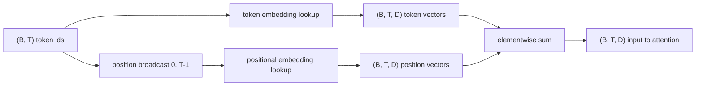
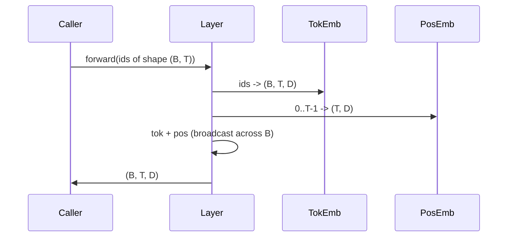

# Embeddings de Token e Posição

> Ids são inteiros. O modelo quer vetores. Duas tabelas de consulta ficam entre eles, e a escolha da posicional molda o que o modelo consegue aprender.

**Tipo:** Construção
**Idiomas:** Python
**Pré-requisitos:** Lições da Fase 04, lições de transformer da Fase 07, Lições 30 e 31 desta fase
**Tempo:** ~90 minutos

## Objetivos de Aprendizado
- Construir uma tabela de consulta de embedding de token que mapeia ids do vocabulário para vetores densos.
- Construir uma tabela de consulta de embedding posicional aprendida indexada por posição.
- Construir um embedding posicional senoidal fixo indexada por posição, sem parâmetros.
- Compor embeddings de token e positionais em uma única entrada para um bloco de attention.
- Contrastar embeddings aprendidos e senoidais em termos de generalização de comprimento e contagem de parâmetros.

## O enquadramento

O primeiro contato do modelo com um id de token é uma consulta de linha na matriz de embedding de token. A matriz tem uma linha por id do vocabulário e uma coluna por dimensão do modelo. A consulta retorna um vetor que o resto do modelo trata como o significado do id. O backprop atualiza as linhas que foram usadas no forward pass. Com o treinamento, a geometria dessas linhas aprende a codificar similaridade em direções.

Ids de token sozinhos não têm ordem. O modelo precisa de um segundo sinal que diga que a posição um é diferente da posição dezessete. As duas escolhas dominantes para esse sinal são um embedding posicional aprendido (uma segunda tabela de consulta, uma linha por posição) e um embedding posicional senoidal fixo (uma fórmula matemática sem parâmetros). A escolha tem consequências. Uma tabela aprendida é um parâmetro e está limitada pelo comprimento máximo de contexto com o qual o modelo foi treinado. Uma tabela senoidal é, em teoria, livre de parâmetros e a fórmula se estende para qualquer posição, mas o `SinusoidalPositionalEmbedding` desta lição pré-calcula uma tabela fixa em `max_context_length` e seu `forward` lança erro acima desse limite; logo, ambos os módulos impõem um comprimento máximo de contexto aqui. O modelo pode ainda ter dificuldade além do comprimento de treinamento mesmo quando a tabela é grande o suficiente para indexar.

Esta lição constrói ambos e os compõe com o embedding de token em uma única entrada para o bloco de attention da próxima lição.

## O contrato de formato

A entrada para a etapa de embedding é um batch de ids de token com formato `(B, T)`. A saída é um tensor com formato `(B, T, D)` onde `D` é a dimensão do modelo. Cada elemento do batch tem o mesmo comprimento de contexto `T`. Cada posição tem a mesma dimensão de vetor `D`.



A composição é uma soma, não uma concatenação. Somar mantém `D` constante pela rede e permite que o modelo decida, por feature, se o significado do token ou a posição domina em cada camada.

## A matriz de embedding de token

O embedding de token é um tensor de parâmetros com formato `(V, D)` onde `V` é o tamanho do vocabulário. PyTorch o expõe como `nn.Embedding(V, D)`. Na inicialização, as entradas são extraídas de uma pequena Gaussiana, tradicionalmente com média zero e desvio padrão em torno de `0.02` para modelos em escala de transformer. A inicialização exata importa menos do que ser consistente entre execuções.

O forward pass é uma única operação de indexação. PyTorch mapeia ids int64 `(B, T)` para floats `(B, T, D)` coletando linhas. O backward pass acumula gradientes apenas nas linhas que foram tocadas no forward pass. Duas linhas que nunca apareceram no batch recebem gradiente zero naquele passo.

Um detalhe sutil. O embedding de token e a projeção de saída no final do modelo frequentemente compartilham pesos (weight tying). Quando isso acontece, todo backward pass toca todas as linhas do embedding pelo lado da saída. Esta lição expõe ambos como módulos separados, mas a mesma matriz poderia desempenhar ambos os papéis em um modelo completo.

## O embedding posicional aprendido

O embedding posicional aprendido é uma segunda `nn.Embedding` com formato `(max_context_length, D)`. A consulta é indexada pelo id de posição `0, 1, 2, ..., T-1`. O forward pass broadcasta esse vetor de posição pela dimensão do batch.

A desvantagem da tabela aprendida é que ela não pode ser consultada na posição `T` se o modelo só foi treinado até a posição `T-1`. A linha não existe. Modelos decoder-only em produção que usam esse esquema incorporam o comprimento máximo de contexto na arquitetura e recusam a processar entradas mais longas.

## O embedding posicional senoidal

O embedding posicional senoidal é uma função de posição para vetor. Posição `p` e funcionalidade `i` produzem

```python
angle = p / (10000 ** (2 * (i // 2) / D))
emb[p, 2k]     = sin(angle)
emb[p, 2k + 1] = cos(angle)
```

A função não tem parâmetros. Cada posição tem um vetor único. O comprimento de onda varia geometricamente entre as dimensões de feature, então as dimensões inferiores codificam posição grosseira e as dimensões superiores codificam posição fina.

A propriedade que segue da escolha de `sin` e `cos` juntos é que o vetor na posição `p + k` é uma função linear do vetor na posição `p`. Isso dá à camada de attention um caminho fácil para aprender offsets de posição relativa. O modelo não precisa de um parâmetro separado para expressar "olhe cinco tokens para trás".

A lição calcula a tabela senoidal completa uma vez na construção e indexa nela no forward.

## A composição

O pipeline de entrada faz três coisas em ordem. Lê os ids de token. Consulta os vetores de token. Soma os vetores de posição. Retorna a soma.



O broadcasting no passo de soma replica o tensor posicional `(T, D)` pela dimensão do batch. PyTorch lida com isso automaticamente porque o tensor posicional tem formato `(1, T, D)` após o unsqueeze.

## Análise comparativa

A lição roda ambas as variantes nas mesmas entradas e imprime dois diagnósticos.

O primeiro é a contagem de parâmetros. A variante aprendida adiciona `max_context_length * D` parâmetros além do embedding de token. A variante senoidal adiciona zero.

O segundo é a similaridade cosseno entre embeddings em posições vizinhas. A variante senoidal tem um decaimento suave e previsível porque a função é contínua. A variante aprendida na inicialização tem similaridade quase aleatória porque as linhas são extraídas independentemente. Após o treinamento, a variante aprendida tipicamente desenvolve uma estrutura suave similar, mas tem que descobrir essa estrutura a partir dos dados.

## O que esta lição não faz

Ela não constrói uma codificação posicional rotativa (RoPE) ou AliBi. Essas são as escolhas modernas em transformers em produção. Ambas seguem o mesmo contrato de formato dos embeddings aqui (aplicam uma transformação dependente da posição a vetores com formato `(B, T, D)`), mas são aplicadas na etapa de projeção de attention ao invés de na entrada. A próxima lição constrói o bloco de attention, e uma das extensões opcionais é incorporar a rotação nas projeções de consulta-key.

Ela não treina o embedding. Treinamento requer uma loss, que requer uma saída do modelo, que requer attention e uma cabeça de LM. Isso é a próxima lição e a seguinte.

## Como ler o código

`main.py` define três módulos. `TokenEmbedding` encapsula `nn.Embedding(V, D)`. `LearnedPositionalEmbedding` encapsula `nn.Embedding(L, D)`. `SinusoidalPositionalEmbedding` pré-calcula a tabela e a expõe como buffer. `EmbeddingComposer` vincula um embedding de token e um embedding posicional. A demo no final imprime os formatos, as contagens de parâmetros e o diagnóstico de similaridade de posições vizinhas. Os testes em `code/tests/test_embeddings.py` fixam o formato, o comportamento de broadcast, a contagem de parâmetros e a fórmula senoidal.

Rode a demo. Depois mude a dimensão do modelo `D` de 64 para 32 e veja como as bandas de comprimento de onda senoidal mudam.
