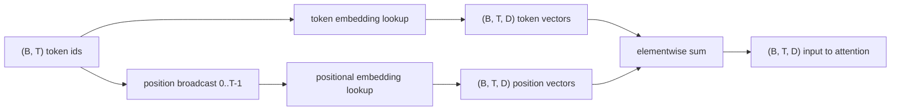
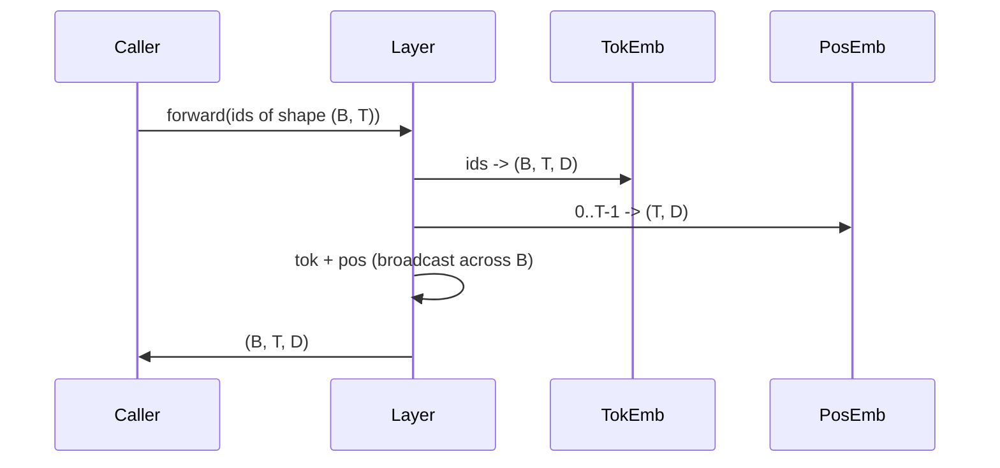

# Token ve Konumsal Embedding'lar

> Kimlikler tamsayılardır. Model vektörler istiyor. Aralarında iki arama tablosu bulunur ve konumsal tablonun seçimi modelin ne öğrenebileceğini şekillendirir.

**Tür:** Yapım
**Diller:** Python
**Önkoşullar:** Aşama 04 dersleri, Aşama 07 transformer dersleri, bu aşamanın 30 ve 31. Dersleri
**Süre:** ~90 dakika

## Öğrenme Hedefleri
- Kelime kimliklerini yoğun vektörlerle eşleştiren bir token-embedding arama tablosu oluşturun.
- Konuma göre indekslenmiş, öğrenilmiş bir konumsal-embedding arama tablosu oluşturun.
- Hiçbir parametre olmadan konuma göre indekslenen sabit bir sinüzoidal konumsal embedding oluşturun.
- Bir transformer bloğu için token ve konumsal embedding'leri tek bir girişte birleştirin.
- Uzunluk genellemesi ve parametre sayımında öğrenilen ve sinüzoidal embedding'lerin kontrastı.

## Çerçeve

Modelin bir token kimliğiyle ilk teması, token-embedding matrisindeki bir satır aramasıdır. Matrisin kelime kimliği başına bir satırı ve model boyutu başına bir sütunu vardır. Arama, modelin geri kalanının kimliğin anlamı olarak kabul ettiği bir vektör döndürür. Backprop ileri geçişte kullanılan satırları günceller. Bu satırların geometrisini fazla eğitmek, yönlerdeki benzerliği kodlamayı öğrenir.

Yalnızca Token kimliklerinin sırası yoktur. Modelin, birinci konumun on yedinci konumdan farklı olduğunu söyleyen ikinci bir sinyale ihtiyacı var. Bu sinyal için iki baskın seçenek öğrenilmiş konumsal embedding (ikinci bir arama tablosu, konum başına bir satır) ve sabit sinüzoidal konumsal embedding'dir (parametresi olmayan bir matematik formülü). Seçimin sonuçları var. Öğrenilen tablo bir parametredir ve modelin üzerinde eğitildiği maksimum bağlam uzunluğuyla sınırlıdır. Sinüsoidal bir tablo teoride parametreden bağımsızdır ve formül herhangi bir konuma uzanır, ancak bu dersin `SinusoidalPositionalEmbedding` 'si `max_context_length` 'de sabit bir tabloyu önceden hesaplar ve onun `forward` 'si bu sınırı aşar; bu nedenle her iki modül de burada maksimum bağlam uzunluğunu zorunlu kılar. Tablo indekslenecek kadar büyük olsa bile model, eğitim uzunluğunu aşmada zorluk yaşayabilir.

Bu ders her ikisini de oluşturur ve bir sonraki dersin dikkat bloğu için bunları token embedding ile tek bir girdi halinde birleştirir.

## Şekil sözleşmesi

embedding aşamasının girişi, `(B, T)` şeklindeki bir token kimlik kümesidir. Çıktı, `(B, T, D)` şeklinde bir tensördür; burada `D` , model boyutudur. Her toplu iş öğesi aynı bağlam uzunluğuna `T` sahiptir. Her konum aynı `D` vektör boyutuna sahiptir.



Kompozisyon bir birleştirme değil, bir toplamdır. Toplama, ağ boyunca `D` 'yi sabit tutar ve modelin, her katmanda token anlamının mı yoksa konumun mu baskın olduğuna özellik bazında karar vermesine olanak tanır.

## token embedding matrisi

token embedding, `(V, D)` şeklinde bir parametre tensörüdür; burada `V` , sözcük boyutudur. PyTorch bunu `nn.Embedding(V, D)` olarak gösterir. Başlangıçta girişler, transformer ölçekli modeller için geleneksel olarak ortalama sıfır ve `0.02` civarında standart sapma ile küçük bir Gaussian'dan alınır. Kesin başlangıç, çalıştırmalar arasında tutarlı kalmasından daha az önemlidir.

İleri geçiş tek bir indeksleme işlemidir. PyTorch, satırları toplayarak `(B, T)` int64 kimliğini `(B, T, D)` kayan noktaya eşler. Geri geçiş, gradient'ları yalnızca ileri geçişte dokunulan satırlarda biriktirir. Grupta hiç görünmeyen iki satır bu adımda sıfır gradient alır.

İnce bir detay. token embedding ve modelin sonundaki çıktı projeksiyonu genellikle ağırlıkları paylaşır (ağırlık bağlama). Bu olduğunda, her geri geçiş çıkış tarafındaki embedding'nin her satırına dokunur. Buradaki ders her ikisini de ayrı modüller olarak ortaya koyuyor ancak aynı matris tam bir modelde her iki rolü de oynayabilir.

## Öğrenilen konumsal embedding

Öğrenilen konumsal embedding, `(max_context_length, D)` şeklinin ikinci bir `nn.Embedding` 'sidir. Arama konum kimliği `0, 1, 2, ..., T-1` ile anahtarlanır. İleri geçiş, vektörü toplu iş boyutu boyunca konumlandıran yayınlar.

Öğrenilen tablonun dezavantajı, model yalnızca `T-1` konumuna kadar eğitilmişse `T` konumunda sorgulanamamasıdır. Satır mevcut değil. Bu şemayı kullanan yalnızca üretim kod çözücü modelleri, mimariye maksimum bağlam uzunluğunu yerleştirir ve daha uzun girdileri işlemeyi reddeder.

## Sinüzoidal konumsal embedding

Sinüzoidal konumsal embedding konumdan vektöre bir fonksiyondur. `p` konumu ve `i` özelliği üretir

```python
angle = p / (10000 ** (2 * (i // 2) / D))
emb[p, 2k]     = sin(angle)
emb[p, 2k + 1] = cos(angle)
```

Fonksiyonun parametresi yoktur. Her konumun benzersiz bir vektörü vardır. Dalga boyu, özellik boyutlarına göre geometrik olarak değişir, dolayısıyla daha düşük boyutlar kaba konumu, yüksek boyutlar ise hassas konumu kodlar.

`sin` ve `cos` 'nin birlikte seçilmesinden çıkan özellik, `p + k` konumundaki vektörün, `p` konumundaki vektörün doğrusal bir fonksiyonu olmasıdır. Bu, dikkat katmanına göreceli konum sapmalarını öğrenmek için kolay bir yol sağlar. Modelin "beş token saniye geriye bak" ifadesini ifade etmek için ayrı bir parametreye ihtiyacı yoktur.

Ders, tam sinüzoidal tabloyu inşaatta bir kez hesaplar ve ileri zamanda buna indeksler.

## Kompozisyon

Giriş boru hattı sırayla üç şey yapar. token kimliklerini okuyun. token vektörlerini arayın. Konumsal vektörleri ekleyin. Toplamı iade edin.



Toplam adımındaki yayın, toplu boyut boyunca `(T, D)` konumsal tensörünü çoğaltır. PyTorch bunu otomatik olarak gerçekleştirir çünkü konumsal tensör, sıkıştırmayı çözdükten sonra `(1, T, D)` şekline sahiptir.

## Karşılaştırmalı analiz

Ders, her iki değişkeni de aynı girişlerde çalıştırır ve iki tanılama yazdırır.

Birincisi parametre sayımıdır. Öğrenilen değişken, token embedding'nin üstüne `max_context_length * D` parametrelerini ekler. Sinüzoidal değişken sıfır ekler.

İkincisi, komşu konumlardaki embedding'lar arasındaki kosinüs benzerliğidir. Sinüzoidal değişken, fonksiyon sürekli olduğundan düzgün ve öngörülebilir bir bozulmaya sahiptir. Başlatma sırasında öğrenilen değişken, satırlar bağımsız olarak çizildiğinden neredeyse rastgele benzerliğe sahiptir. Eğitimden sonra öğrenilen değişken tipik olarak benzer düzgün bir yapı geliştirir ancak bu yapıyı verilerden keşfetmesi gerekir.

## Bu ders ne yapmaz

Döner konumsal kodlama (RoPE) veya AliBi oluşturmaz. Bunlar transformer üretimindeki modern seçimlerdir. Her ikisi de buradaki embedding'lerle aynı şekil sözleşmesini takip eder ( `(B, T, D)` şeklinin vektörlerine konuma bağlı bir dönüşüm uygular) ancak girdi yerine dikkat yansıtma adımında uygulanırlar. Bir sonraki ders dikkat bloğunu oluşturur ve isteğe bağlı uzantılardan biri döner düğmeyi buradaki sorgu anahtarı projeksiyonlarına katlamaktır.

embedding'yı eğitmez. Eğitim bir kayıp gerektirir, bu da bir model çıktısı gerektirir, bu da dikkat gerektirir ve bir LM kafası gerektirir. Bu bir sonraki ders ve ondan sonraki ders.

## Kod nasıl okunur

`main.py` üç modülü tanımlar. `TokenEmbedding` , `nn.Embedding(V, D)`'yi sarar. `LearnedPositionalEmbedding` , `nn.Embedding(L, D)`'yi sarar. `SinusoidalPositionalEmbedding` tabloyu önceden hesaplar ve onu bir arabellek olarak kullanıma sunar. `EmbeddingComposer` , bir token embedding ile konumsal bir embedding'yi birbirine bağlar. Alttaki demo şekilleri, parametre sayımlarını ve komşu konum benzerliği teşhisini yazdırır. `code/tests/test_embeddings.py` pin şekli, yayın davranışı, parametre sayısı ve sinüzoidal formüldeki testler.

Demoyu çalıştırın. Daha sonra `D` model boyutunu 64'ten 32'ye değiştirin ve sinüzoidal dalga boyu bantlarının nasıl değiştiğini izleyin.
