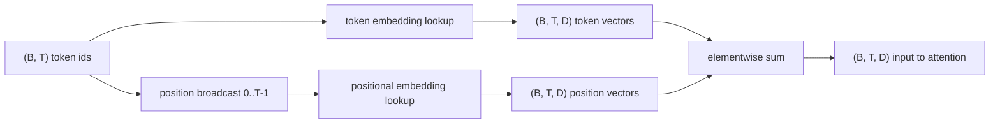
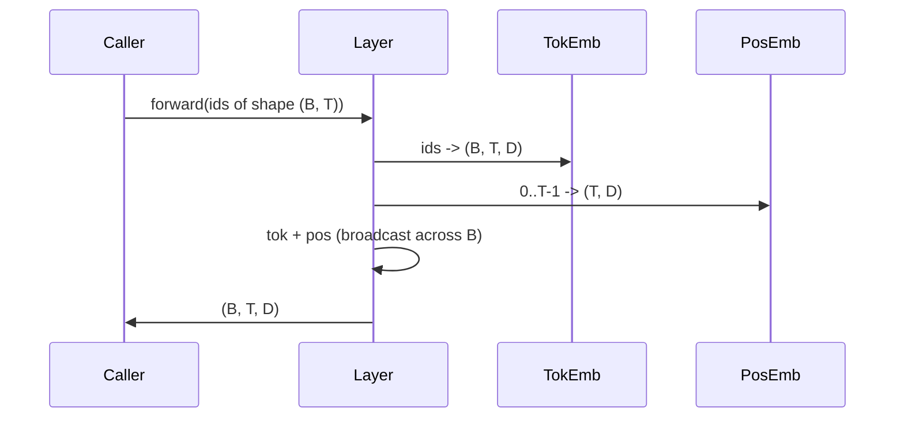

# 32 · 词元与位置嵌入

> ID 是整数。模型要的是向量。两者之间夹着两张查找表，而位置查找表的选择决定了模型能学到什么。

**类型：** 构建
**语言：** Python
**前置：** 第 04 阶段课程、第 07 阶段 Transformer 课程、本阶段第 30 和 31 课
**时长：** 约 90 分钟

## 学习目标
- 构建一张词元嵌入（Token Embedding）查找表，将词汇表 ID 映射为稠密向量。
- 构建一张以位置为索引的可学习位置嵌入（Learned Positional Embedding）查找表。
- 构建一个无参数的固定正弦位置嵌入（Sinusoidal Positional Embedding），同样按位置索引。
- 将词元嵌入与位置嵌入组合为 Transformer 块的单一输入。
- 对比可学习嵌入与正弦嵌入在长度泛化和参数量上的差异。

## 概览

模型首次接触词元 ID 时，实际上是在词元嵌入矩阵中做一次行查找。该矩阵的行数等于词汇表大小，列数等于模型维度。查找返回一个向量，模型的其余部分将其视为该 ID 的语义表示。反向传播（Backprop）会更新在前向传播中被使用的那些行。经过训练，这些行在几何空间中的分布会学习到以方向编码语义相似性。

仅靠词元 ID 无法表达顺序。模型还需要第二个信号来告诉它，位置 1 和位置 17 是不同的。这一信号的两种主流选择是：可学习位置嵌入（第二张查找表，每个位置一行）以及固定正弦位置嵌入（无参数的数学公式）。这个选择会带来不同的后果。可学习表是一个参数，其范围受限于模型训练时的最大上下文长度。正弦表在理论上无参数，而且公式可以扩展到任意位置；但本课中的 `SinusoidalPositionalEmbedding` 会在 `max_context_length` 处预计算一张固定表，其 `forward` 超出该范围会报错；因此本课的两个模块都会强制一个最大上下文长度。即使表足够大以索引超出训练长度的位置，模型在这些位置上仍可能表现不佳。

本课将构建以上两种嵌入，并将它们与词元嵌入组合为一个统一输入，供下一课的注意力（Attention）模块使用。

## 形状约定

嵌入阶段的输入是一批 shape 为 `(B, T)` 的词元 ID，输出是 shape 为 `(B, T, D)` 的张量，其中 `D` 是模型维度。批次中每个元素都具有相同的上下文长度 `T`，每个位置的向量维度均为 `D`。



组合方式是求和，而非拼接。求和使 `D` 在整个网络中保持不变，并让模型能够在每一层按需逐个特征地决定是词元语义占主导还是位置信息占主导。

## 词元嵌入矩阵

词元嵌入是一个 shape 为 `(V, D)` 的参数张量，其中 `V` 是词汇表大小。PyTorch 将其暴露为 `nn.Embedding(V, D)`。初始化时，条目从均值 0、标准差约为 `0.02`（Transformer 规模模型惯用值）的小高斯分布中采样。初始化值具体是多少并不关键，关键在于不同运行之间保持一致。

前向传播就是一次索引操作：PyTorch 通过按行收集（gather）将 `(B, T)` 的 int64 ID 映射为 `(B, T, D)` 的浮点数。反向传播则只对前向传播中触达过的行累积梯度。若某两行从未出现在该批次中，则当前步对它们的梯度为零。

一个值得留意的细节：词元嵌入与模型末端的输出投影常常共享权重（Weight Tying）。这种情况下，每一次反向传播都会通过输出端触达嵌入矩阵的所有行。本课将两者暴露为独立模块，但在完整模型中同一矩阵可以同时承担这两个角色。

## 可学习位置嵌入

可学习位置嵌入是第二个 `nn.Embedding`，shape 为 `(max_context_length, D)`。查找以位置 ID `0, 1, 2, ..., T-1` 为键，前向传播将该位置向量沿批次维度广播。

可学习表的缺点在于：如果模型只在位置 `T-1` 及之前进行过训练，就无法在位置 `T` 处查询——那一行根本不存在。使用这种方案的生产级 Decoder-Only 模型会将最大上下文长度硬编码到架构中，并拒绝处理更长的输入。

## 正弦位置嵌入

正弦位置嵌入是一个将位置映射为向量的函数。对于位置 `p` 和特征 `i`，其计算方式为：

```python
angle = p / (10000 ** (2 * (i // 2) / D))
emb[p, 2k]     = sin(angle)
emb[p, 2k + 1] = cos(angle)
```

该函数没有参数。每个位置都有唯一的向量。波长沿特征维度呈几何级数变化，因此低维度编码粗粒度的位置信息，高维度编码细粒度的位置信息。

同时使用 `sin` 和 `cos` 带来的关键性质是：位置 `p + k` 处的向量是位置 `p` 处向量的线性函数。这为注意力层学习相对位置偏移提供了一条便捷路径——模型无需额外参数即可表达"向前看五个词元"。

本课在构造时一次性计算完整的正弦表，并在前向传播时按索引读取。

## 组合

输入管线按顺序完成三件事：读取词元 ID、查找词元向量、加上位置向量，最后返回求和结果。



求和步骤中的广播机制会将 `(T, D)` 的位置张量沿批次维度复制。PyTorch 会自动处理这一点，因为位置张量经 unsqueeze 后 shape 为 `(1, T, D)`。

## 对比分析

本课在相同输入上运行两种方案，并输出两项诊断指标。

第一项是参数量（Parameter Count）。可学习方案在词元嵌入之上额外增加了 `max_context_length * D` 个参数，而正弦方案的增量为零。

第二项是相邻位置嵌入之间的余弦相似度（Cosine Similarity）。由于函数是连续的，正弦方案表现出平滑且可预测的衰减。可学习方案在初始化时的相似度接近随机——因为各行是独立采样的。训练之后，可学习方案通常也会发展出类似的平滑结构，但它必须从数据中学习出这种结构。

## 本课不涉及的内容

本课不构建旋转位置编码（RoPE）或 AliBi。它们是现代生产级 Transformer 中常用的方案。两者与本课嵌入遵循相同的形状约定（对 shape 为 `(B, T, D)` 的向量施加依赖位置的变换），但它们不是在输入端施加，而是在注意力投影步骤中施加。下一课将构建注意力块，其中一个可选扩展就是将旋转编码集成到那里的查询-键投影中。

本课也不训练嵌入。训练需要损失函数，而损失函数需要模型输出，模型输出又需要注意力和语言模型头（LM Head）——这些是下一课及下下课的内容。

## 如何阅读代码

`main.py` 定义了三个模块：`TokenEmbedding` 封装 `nn.Embedding(V, D)`；`LearnedPositionalEmbedding` 封装 `nn.Embedding(L, D)`；`SinusoidalPositionalEmbedding` 预计算正弦表并将其暴露为 buffer。`EmbeddingComposer` 将词元嵌入和位置嵌入绑定在一起。底部的演示代码会打印形状、参数量以及相邻位置相似度诊断信息。`code/tests/test_embeddings.py` 中的测试锁定了形状、广播行为、参数数量以及正弦公式的正确性。

运行演示。然后将模型维度 `D` 从 64 改为 32，观察正弦波长频段的变化。
