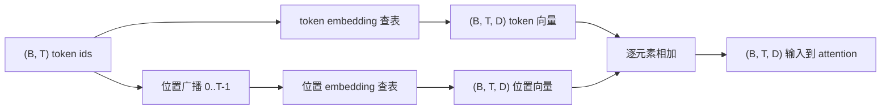
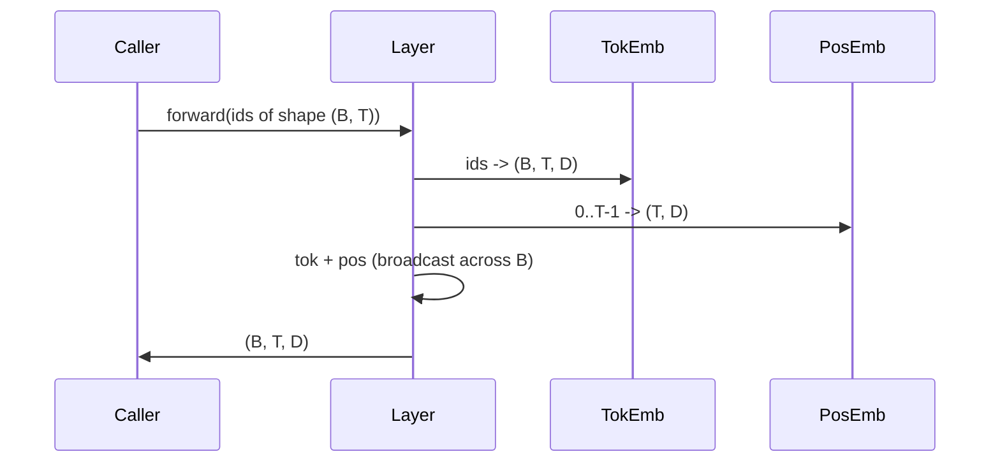

# Token 与位置 Embedding（Token and Positional Embeddings）

> 译注：本文译自同目录 [`en.md`](./en.md)。术语遵循仓根 [TRANSLATION_GUIDE.md](../../../../TRANSLATION_GUIDE.md)。

> id 是整数，模型要的是向量。两张查找表夹在它们中间，而位置那张表怎么选，会决定模型最终能学到什么。

**Type:** Build
**Languages:** Python
**Prerequisites:** Phase 04 lessons, Phase 07 transformer lessons, Lessons 30 and 31 of this phase
**Time:** ~90 minutes

## 学习目标（Learning Objectives）
- 构建一张 token-embedding 查找表，把词表 id 映射成稠密向量。
- 构建一张以位置作为索引的可学习位置 embedding 查找表（learned positional-embedding）。
- 构建一张以位置作为索引、不带任何参数的固定正弦位置 embedding（sinusoidal positional embedding）。
- 把 token embedding 与位置 embedding 组合成一份输入，喂给 transformer block。
- 在长度泛化（length generalization）和参数量两个维度上，对比 learned 与 sinusoidal 两种 embedding。

## 框架（The frame）

模型与 token id 的第一次接触，是在 token-embedding 矩阵里做一次按行查表。这张矩阵的行数等于词表大小，列数等于模型维度。查表返回的是一个向量，模型后面所有部分都把这个向量当作该 id 的"含义"。反向传播会更新前向传播中实际被用到的那些行。训练久了之后，这些行所构成的几何结构，就会沿不同方向编码出语义相似度。

光有 token id，是没有顺序信息的。模型还需要第二种信号，告诉它"位置 1"和"位置 17"是不同的。给这种信号最主流的两种选择：一种是 learned positional embedding（再来一张查找表，每个位置占一行），另一种是固定的 sinusoidal positional embedding（一个不带参数的数学公式）。两种选择各有代价。learned 表本身就是参数，并且会被模型训练时使用的最大上下文长度（context window）卡住上限。理论上，sinusoidal 表是无参数的，且公式可以延展到任意位置；但本课实现的 `SinusoidalPositionalEmbedding` 在构造时会按 `max_context_length` 预先算好一张固定大小的表，`forward` 一旦超过这个上限就直接抛错——所以这里两个模块其实都强制了一个最大上下文长度。即便表足够大、能索引到目标位置，模型在超出训练长度后通常仍会表现下滑。

本课会把两种位置 embedding 都实现一遍，并把它们与 token embedding 组合成一份输入，留给下一课的 attention（注意力）block 使用。

## 形状契约（The shape contract）

embedding 阶段的输入是一批形状为 `(B, T)` 的 token id。输出是形状为 `(B, T, D)` 的张量，其中 `D` 是模型维度。这一批里每条样本的上下文长度都是同一个 `T`，每个位置上的向量维度都是同一个 `D`。



组合方式是相加，不是拼接。相加能让 `D` 在整张网络里始终保持不变，并把"在某一层、某个特征维度上，是 token 含义占主导还是位置占主导"这个决策，交给模型自己按特征逐维去判断。

## token embedding 矩阵（The token embedding matrix）

token embedding 是一个形状为 `(V, D)` 的参数张量，其中 `V` 是词表大小。在 PyTorch 里它就是 `nn.Embedding(V, D)`。初始化时，矩阵里的元素从一个小尺度的高斯分布中采样——transformer 规模的模型里，传统做法是均值 0、标准差大约 `0.02`。具体怎么初始化没那么关键，关键是跨多次运行能保持一致。

前向传播只是一次索引操作：PyTorch 把 `(B, T)` 的 int64 id 通过 gather 行的方式映射成 `(B, T, D)` 的 float。反向传播时，梯度只会累加到那些在前向中被取用过的行上。这一步里没出现过的两行，本步收到的梯度就是 0。

有一个细节。模型最末端的 token embedding 与输出投影矩阵，常常共享权重（weight tying，权重绑定）。一旦绑定，每次反向传播都会通过输出端把 embedding 的所有行都触达一遍。本课把两者作为独立模块暴露出来，但在一个完整模型里，它们完全可以共用同一张矩阵。

## learned 位置 embedding（The learned positional embedding）

learned positional embedding 就是第二个 `nn.Embedding`，形状为 `(max_context_length, D)`。查表时用位置 id `0, 1, 2, ..., T-1` 作为 key。前向传播会把查到的位置向量沿 batch 维广播开。

learned 表的缺点是：如果模型只训练到位置 `T-1`，那就没法在位置 `T` 上查到东西——那一行根本不存在。生产环境里使用这种方案的 decoder-only 模型，通常会把最大上下文长度直接焊死在架构里，对超长输入直接拒绝处理。

## sinusoidal 位置 embedding（The sinusoidal positional embedding）

sinusoidal positional embedding 是一个从位置映射到向量的函数。位置 `p` 和特征维 `i` 共同决定：

```python
angle = p / (10000 ** (2 * (i // 2) / D))
emb[p, 2k]     = sin(angle)
emb[p, 2k + 1] = cos(angle)
```

这个函数没有参数，每个位置都对应唯一一个向量。波长在不同特征维度之间按几何级数变化，因此低维负责编码粗粒度位置，高维负责编码细粒度位置。

把 `sin` 和 `cos` 一起用还带来一个性质：位置 `p + k` 处的向量，是位置 `p` 处向量的一个线性函数。这就给 attention 层留出了一条"学相对位置偏移"的捷径——模型不需要再为"往回看 5 个 token"这种事单独引入一个参数。

本课在构造时把整张 sinusoidal 表一次性算好，前向时就直接对它做索引。

## 组合（The composition）

输入流水线按顺序做三件事：读 token id，查 token 向量，加上位置向量，返回它们之和。



相加时的广播会把 `(T, D)` 的位置张量沿 batch 维复制一份。这一步 PyTorch 会自动处理，因为对位置张量做一次 unsqueeze 之后，它的形状就是 `(1, T, D)`。

## 对比分析（Contrastive analysis）

本课会用同样的输入跑两种实现，并打印两个诊断量。

第一个是参数量。learned 那一版会在 token embedding 之上再加 `max_context_length * D` 个参数，sinusoidal 那一版增加的参数为 0。

第二个是相邻位置之间 embedding 的余弦相似度。sinusoidal 这一版因为底层是连续函数，相似度会平滑、可预测地衰减。learned 这一版在初始化时，由于每一行都是独立采样的，相邻位置的相似度近似随机；训练之后，learned 这一版往往也会发展出一个类似的平滑结构，但这种结构得靠它从数据里自己摸出来。

## 本课不做的事（What this lesson does not do）

不构建 rotary positional encoding（RoPE）和 AliBi。这两种才是当下生产级 transformer 的主流选择。它们和这里的 embedding 遵循同一个形状契约（都是对形状为 `(B, T, D)` 的向量施加一个依赖位置的变换），但施加的位置不同——它们是在 attention 投影那一步动手，而不是在输入端。下一课会去构建 attention block，其中一个可选拓展，就是把 rotary 折进 query/key 的投影里。

不训练 embedding。训练需要 loss，loss 需要模型输出，模型输出需要 attention 和一个 LM head。那是下一课和再下一课的事。

## 怎么读这份代码（How to read the code）

`main.py` 里定义了三个模块。`TokenEmbedding` 包装 `nn.Embedding(V, D)`。`LearnedPositionalEmbedding` 包装 `nn.Embedding(L, D)`。`SinusoidalPositionalEmbedding` 预先算好整张表，并以 buffer 的形式暴露出来。`EmbeddingComposer` 把一个 token embedding 和一个位置 embedding 绑在一起。文件底部的 demo 会打印各张量的形状、参数量，以及相邻位置相似度这个诊断量。`code/tests/test_embeddings.py` 里的测试，则把形状、广播行为、参数量、以及 sinusoidal 公式逐一钉死。

跑一遍 demo。然后把模型维度 `D` 从 64 改成 32，看 sinusoidal 的波长分布会怎么变。
