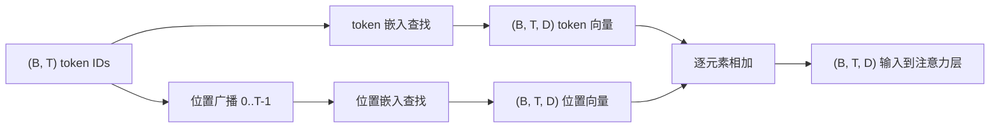
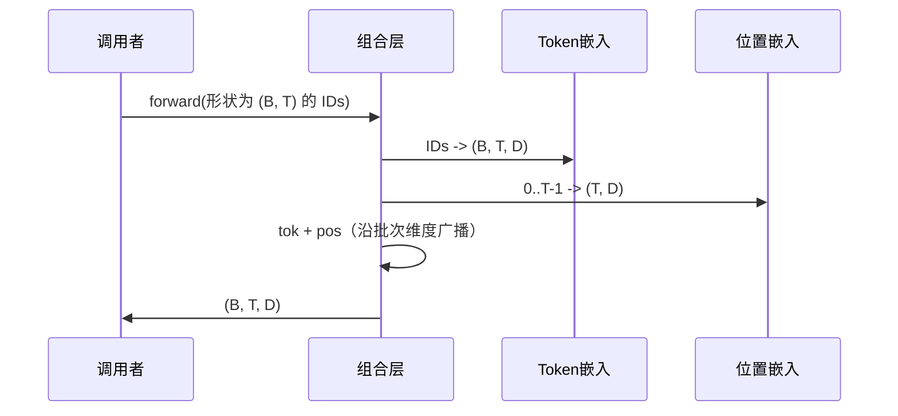

# Token 与位置嵌入

> ID 是整数，模型需要向量。两个查找表架起了桥梁，而位置嵌入的选择决定了模型能学到什么。

**类型：** 构建
**语言：** Python
**前置知识：** 阶段 04 课程、阶段 07 的 Transformer 课程、本阶段的第 30 与 31 课
**时长：** 约 90 分钟

## 学习目标

- 构建一个 token 嵌入查找表，将词汇表 ID 映射为稠密向量。
- 构建一个可学习的位置嵌入查找表，以位置索引作为键。
- 构建一个固定正弦位置嵌入，以位置索引作为键且不含可学习参数。
- 将 token 嵌入与位置嵌入组合成一个整体，输入到 Transformer 块中。
- 在长度泛化能力和参数数量两个维度上对比可学习嵌入与正弦嵌入。

## 框架

模型与 token ID 的首次接触是对 token 嵌入矩阵的行查找。该矩阵每行对应一个词汇表 ID，每列对应一个模型维度。查找返回一个向量，模型将其视为该 ID 的语义。反向传播会更新前向传播中使用过的行。经过训练，这些行的几何结构学会在方向维度上编码相似性。

仅凭 token ID 本身没有顺序。模型需要第二个信号来告诉它位置一与位置十七不同。该信号的两种主流选择是可学习位置嵌入（第二个查找表，每行对应一个位置）和固定正弦位置嵌入（一个不含参数的数学公式）。选择会带来不同的后果。可学习表是参数化的，受限于模型训练时见过的最大上下文长度。正弦表理论上没有参数，其公式可以扩展到任意位置，但本课的 `SinusoidalPositionalEmbedding` 在 `max_context_length` 处预计算了一张固定表，且其 `forward` 方法会在超出该边界时报错；因此两种模块在此都强制规定了最大上下文长度。即使表格大到足以索引，模型在超出其训练长度的序列上仍然可能表现不佳。

本课将构建这两种位置嵌入，并将它们与 token 嵌入组合成单一输入，供下一课的注意力块使用。

## 形状约定

嵌入阶段的输入是一个形状为 `(B, T)` 的 token ID 批次。输出是一个形状为 `(B, T, D)` 的张量，其中 `D` 是模型维度。每个批次元素具有相同的上下文长度 `T`，每个位置具有相同的向量维度 `D`。


```mermaid
flowchart LR
    A["(B, T) token IDs"] --> B[token 嵌入查找]
    B --> C["(B, T, D) token 向量"]
    A --> D[位置广播 0..T-1]
    D --> E[位置嵌入查找]
    E --> F["(B, T, D) 位置向量"]
    C --> G[逐元素相加]
    F --> G
    G --> H["(B, T, D) 输入到注意力层"]
```

组合方式是求和而非拼接。求和使得 `D` 在整条网络中保持不变，并让模型在每个特征维度上自行决定该层中 token 语义与位置信息谁占主导。

## Token 嵌入矩阵

Token 嵌入是一个形状为 `(V, D)` 的参数张量，其中 `V` 是词汇表大小。PyTorch 通过 `nn.Embedding(V, D)` 实现。初始化时，条目从一个小高斯分布中采样，传统上均值为零、标准差约为 `0.02`（适用于 Transformer 规模的模型）。精确的初始化方式不如在多次运行间保持一致来得重要。

前向传播是一个单一的索引操作。PyTorch 通过抽取行将 `(B, T)` int64 ID 映射为 `(B, T, D)` 浮点数。反向传播仅将梯度累积到前向传播中被触及的行上。从未在批次中出现过的行在该步中获得零梯度。

有一个微妙的细节。Token 嵌入和模型末尾的输出投影经常共享权重（权重绑定）。此时，每次反向传播都会通过输出侧触及嵌入矩阵的每一行。本课将两者作为独立模块暴露，但在一个完整模型中，同一个矩阵可以同时扮演两种角色。

## 可学习位置嵌入

可学习位置嵌入是第二个形状为 `(max_context_length, D)` 的 `nn.Embedding`。查找键为位置 ID `0, 1, 2, ..., T-1`。前向传播将该位置向量沿批次维度广播。

可学习表的缺点在于：如果模型只训练到位置 `T-1`，则无法查询位置 `T`——该行不存在。使用此方案的生产级仅解码器模型会将最大上下文长度嵌入架构中，并拒绝处理更长的输入。

## 正弦位置嵌入

正弦位置嵌入是从位置到向量的一个函数。位置 `p` 和特征维度 `i` 的计算方式如下：

```python
angle = p / (10000 ** (2 * (i // 2) / D))
emb[p, 2k]     = sin(angle)
emb[p, 2k + 1] = cos(angle)
```

该函数不含参数。每个位置都有一个唯一的向量。波长随特征维度呈几何级数变化，因此较低维度编码粗略位置，较高维度编码精细位置。

选择 `sin` 和 `cos` 组合所带来的特性是：位置 `p + k` 的向量是位置 `p` 向量的线性函数。这为注意力层提供了一条学习相对位置偏移的便捷路径——模型无需单独的参数来表达"往回看五个 token"。

本课在构造阶段一次性计算完整的正弦表，在前向传播时通过索引取出。

## 组合

输入流水线按顺序执行三步：读取 token ID，查找 token 向量，加上位置向量，返回求和结果。


```mermaid
sequenceDiagram
    participant 调用者
    participant 组合层
    participant Token嵌入
    participant 位置嵌入
    调用者->>组合层: forward(形状为 (B, T) 的 IDs)
    组合层->>Token嵌入: IDs -> (B, T, D)
    组合层->>位置嵌入: 0..T-1 -> (T, D)
    组合层->>组合层: tok + pos（沿批次维度广播）
    组合层->>调用者: (B, T, D)
```

求和步骤中的广播机制将 `(T, D)` 位置张量沿批次维度复制。PyTorch 自动处理这一点——只要在 unsqueeze 之后位置张量的形状为 `(1, T, D)`。

## 对比分析

本课在同一输入上运行两种变体，并输出两项诊断信息。

第一项是参数数量。可学习变体在 token 嵌入之上额外增加了 `max_context_length * D` 个参数，正弦变体则增加零个参数。

第二项是相邻位置嵌入之间的余弦相似度。正弦变体呈现出平滑且可预测的衰减，因为该函数是连续的。可学习变体在初始化时具有近乎随机的相似度，因为各行是独立采样的。经过训练后，可学习变体通常也能形成类似的平滑结构，但它需要从数据中发现这种结构。

## 本课未涵盖的内容

本课不涉及旋转位置编码（RoPE）或 AliBi。它们是现代生产环境 Transformer 中的主流选择。它们遵循与本课嵌入相同的形状约定（对形状为 `(B, T, D)` 的向量应用与位置相关的变换），但它们作用于注意力投影步骤而非输入。下一课将构建注意力块，其中一个可选扩展是将在该处将 RoPE 融入查询-键投影中。

本课不涉及嵌入的训练。训练需要损失函数，而损失函数需要模型输出，模型输出又需要注意力和语言模型头部。这将在下一课及后续课程中展开。

## 如何阅读代码

`main.py` 定义了三个模块：`TokenEmbedding` 封装 `nn.Embedding(V, D)`，`LearnedPositionalEmbedding` 封装 `nn.Embedding(L, D)`，`SinusoidalPositionalEmbedding` 预计算表格并将其暴露为一个 buffer。`EmbeddingComposer` 将 token 嵌入与位置嵌入绑定在一起。底部的演示代码会输出形状、参数数量和相邻位置相似度诊断信息。`code/tests/test_embeddings.py` 中的测试固定了形状、广播行为、参数数量以及正弦公式。

运行演示。然后将模型维度 `D` 从 64 改为 32，观察正弦波长波段如何变化。
