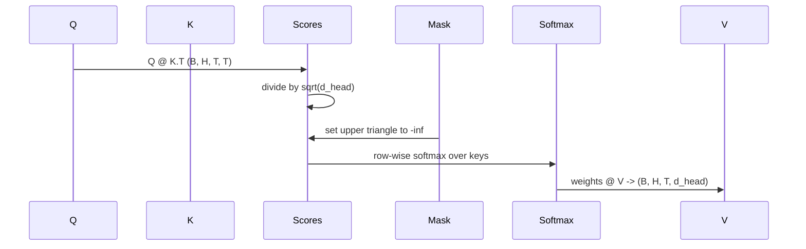

# Attention Multi-Head Self-Attention

> Uma projeção linear, três visões, H cabeças paralelas, uma máscara. O bloco de attention como o modelo realmente usa.

**Tipo:** Construção
**Idiomas:** Python
**Pré-requisitos:** Lições da Fase 04, lições de transformer da Fase 07, Lições 30 a 32 desta fase
**Tempo:** ~90 minutos

## Objetivos de Aprendizado
- Implementar uma projeção batched Query/Key/Value como uma única camada linear dividida em H cabeças.
- Computar attention de produto escalar escalonado com a normalização e tratamento de dtype corretos.
- Aplicar uma máscara causal que impede uma posição de attending a posições futuras.
- Inespecificaçãoionar pesos de attention por cabeça para uma entrada fixa e raciocinar sobre o que cada cabeça observa.
- Treinar um pequeno bloco de attention em uma tarefa simples e ver a loss cair enquanto as cabeças se eespecificaçãoializam.

## O enquadramento

Attention é a função que permite que a representação de um token puxe informação de outros tokens na mesma sequência. Self-attention significa que queries, keys e values são todos derivados da mesma entrada. Multi-head significa que a projeção é dividida em H problemas de attention paralelos cujas saídas são concatenadas e projetadas de volta.

O padrão de implementação eficiente é uma camada linear que projeta de `D` para `3 * D` e é fatiada em três visões, depois remodelada em H cabeças de tamanho `D // H` cada. O matmul, softmax e soma ponderada acontecem como operações de tensor batched, então as cabeças rodam em paralelo no acelerador.

Esta lição constrói esse bloco. Ela também adiciona a máscara causal para que o mesmo código funcione como a camada de attention em um modelo decoder-only. A próxima lição empilha o bloco em um transformer completo e a lição seguinte o treina.

## O contrato de formato

A entrada é `(B, T, D)`. A saída é `(B, T, D)`. A máscara é `(T, T)` ou broadcastável para ela. Dentro do bloco, os tensores intermediários têm formato `(B, H, T, d_head)` onde `d_head = D // H`. A restrição é `D % H == 0`.

```mermaid
flowchart LR
    A["(B, T, D) input"] --> B[Linear D -> 3D]
    B --> C["split into Q, K, V"]
    C --> D["reshape to (B, H, T, d_head)"]
    D --> E["scores = Q @ K.T / sqrt(d_head)"]
    E --> F[apply causal mask]
    F --> G[softmax over keys]
    G --> H["context = weights @ V"]
    H --> I["reshape to (B, T, D)"]
    I --> J[output Linear D -> D]
    J --> K["(B, T, D) output"]
```

As duas camadas lineares (a projeção QKV e a projeção de saída) são os únicos parâmetros no bloco. A máscara, o softmax, os matmuls e os reshapes são todos livres de parâmetros.

## O split QKV

A implementação ingênua tem três camadas lineares separadas, uma para cada Q, K e V. A eficiente tem uma única camada que produz `3 * D` features e fatia o resultado. As duas são matematicamente equivalentes porque três multiplicações de matriz separadas por pesos `(D, D)` são exatamente uma multiplicação de matriz por um peso `(3D, D)` empilhado a partir delas.

A versão eficiente é mais rápida porque o acelerador lança um matmul em vez de três. Também é mais fácil de inicializar porque as três sub-matrizes vivem no mesmo tensor de parâmetros e podem ser inicializadas juntas.

## O reshape de cabeça

Após o split, cada um de Q, K, V é `(B, T, D)`. Para transformar isso em H problemas de attention paralelos, remodelamos para `(B, T, H, d_head)` e transpomos para `(B, H, T, d_head)`. A dimensão de cabeça agora está ao lado da dimensão do batch, então PyTorch trata a attention por cabeça como uma operação batched sobre `B * H` instâncias independentes.

A dimensão d_head fica por último para que o score matmul `Q @ K.transpose(-2, -1)` a contraia. O resultado é scores de attention por cabeça `(B, H, T, T)`.

## Escalonamento

Os scores são divididos por `sqrt(d_head)` antes do softmax. Sem esse escalonamento, os produtos escalares crescem à medida que `d_head` cresce e empurram o softmax para um regime onde uma entrada tem quase toda a massa e as outras são minúsculas. Os gradientes nesse regime são minúsculos e o treinamento trava. Dividir por `sqrt(d_head)` mantém a variância dos scores aproximadamente constante entre tamanhos de cabeça.

## A máscara causal

Um modelo decoder-only só pode se condicionar no passado ao prever o próximo token. A máscara impõe isso. Concretamente, antes do softmax, cada entrada acima da diagonal da matriz de scores `(T, T)` é substituída por infinito negativo. Após o softmax, essas posições recebem peso zero.

Registramos a máscara como buffer na construção para que ela viva no mesmo dispositivo do modelo e não faça parte do grafo de gradiente. A máscara cobre o comprimento máximo de contexto que o bloco jamais verá. No forward, fatiamos o canto superior esquerdo `(T, T)`.

## A projeção de saída

Após os vetores de contexto por cabeça `(B, H, T, d_head)`, transpomos de volta para `(B, T, H, d_head)`, remodelamos para `(B, T, D)` e aplicamos uma projeção linear final `(D, D)`. A projeção de saída permite que o modelo misture as cabeças. Sem ela, as H cabeças só se recombinariam através de camadas posteriores e o bloco ficaria artificialmente restrito.

## Inspeção dos pesos de attention

A lição expõe uma flag `return_weights=True` no forward pass. Quando ativada, o bloco retorna os pesos de attention por cabeça com formato `(B, H, T, T)` junto com a saída. A demo imprime um heatmap dos pesos de uma cabeça em uma entrada curta para que você veja a estrutura de triângulo causal e o foco por posição.

Em um modelo treinado, diferentes cabeças aprendem padrões diferentes. Algumas cabeças attending ao token imediatamente anterior. Algumas attending ao início da sequência. Algumas espalham a attention quase uniformemente. O hook de inspeção é o ponto de entrada para esse trabalho de interpretabilidade.

## A demo de treinamento

A demo no final de `main.py` conecta o bloco de attention a uma pequena cabeça de LM e treina tudo em uma tarefa de repetição. Cada linha da entrada é um id único replicado por todo o contexto. O target é a entrada deslocada por um, então o modelo precisa aprender que o próximo token é igual ao anterior. A loss é cross-entropy. Com H=4, D=32, T=12 e um vocabulário de 64, a loss cai de aleatória (em torno de `log(64) ~ 4.16`) para bem abaixo de `1.0` em três épocas na CPU.

O ponto da demo não é treinar um modelo útil. O ponto é confirmar que os gradientes fluem por cada peça do bloco e que as cabeças aprendem algo em um problema onde a resposta é óbvia.

## O que esta lição não faz

Ela não adiciona um bloco feed-forward. A camada transformer em um modelo real é attention seguida de uma MLP de duas camadas com conexão residual e normalização de camada ao redor de cada uma. A próxima lição adiciona isso.

Ela não implementa codificação posicional rotativa ou AliBi. Ambas são aplicadas na etapa de projeção QKV no mesmo bloco, mas são uma unidade de ensino separada. O bloco aqui construído é compatível com ambas ao transformar Q e K antes do matmul.

Ela não implementa KV cache para inferência. Cache de keys e values entre forward passes é a otimização que torna a decodificação autoregressiva rápida. Ela muda o contrato de formato nos tensores K e V, mas não no Q. Pertence à lição de inferência.

## Como ler o código

`main.py` define `MultiHeadSelfAttention`. A classe mantém duas camadas lineares e um buffer de máscara registrado. O forward pass projeta, remodela, calcula scores, aplica máscara, faz softmax, pondera, remodela e projeta de novo. A demo no final constrói um pequeno modelo que encapsula a attention com embeddings de token e positionais e uma cabeça de LM, treina-o em uma tarefa de cópia por três épocas e imprime a curva de loss e um heatmap de attention por cabeça. Os testes em `code/tests/test_attention.py` fixam o contrato de formato, a propriedade de causalidade, a propriedade de softmax, a propriedade de split de cabeça e o fluxo de gradiente.

Rode a demo. Depois aumente `n_heads` de 4 para 8 (mantendo `d_model=32`, então `d_head=4`) e veja o heatmap mudar.
