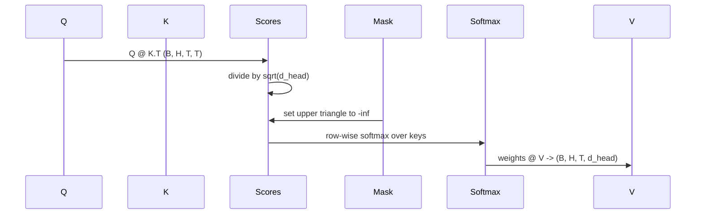

# Çok Kafalı Kişisel Dikkat

> Bir doğrusal projeksiyon, üç görünüm, H paralel kafalar, bir maske. Modelin aslında onu kullandığı şekliyle dikkat bloğu.

**Tür:** Yapım
**Diller:** Python
**Önkoşullar:** Aşama 04 dersleri, Aşama 07 transformer dersleri, Bu aşamanın 30'dan 32'ye kadar olan dersleri
**Süre:** ~90 dakika

## Öğrenme Hedefleri
- Toplu Sorgu/Anahtar/Değer projeksiyonunu H başlıklarına bölünmüş tek bir doğrusal katman olarak uygulayın.
- Doğru normalizasyon ve dtype kullanımıyla ölçekli nokta-çarpım dikkatini hesaplayın.
- Bir pozisyonun gelecekteki pozisyonlara katılmasını önleyen bir nedensellik maskesi uygulayın.
- Her bir kafanın neye baktığına ilişkin sabit bir girdi ve neden açısından kişi başına dikkat ağırlıklarını inceleyin.
- Küçük bir dikkat bloğunu bir oyuncak görevi üzerinde eğitin ve kafalar uzmanlaştıkça kaybın düşüşünü izleyin.

## Çerçeve

Dikkat, bir token temsilinin aynı sırayla diğer token'larden bilgi çekmesini sağlayan fonksiyondur. Kişisel dikkat, sorguların, anahtarların ve değerlerin hepsinin aynı girdiden türetildiği anlamına gelir. Çok kafalılık, projeksiyonun, çıktıları birleştirilen ve geriye yansıtılan H paralel dikkat problemlerine bölünmesi anlamına gelir.

Verimli uygulama modeli, `D` 'dan `3 * D` 'ye uzanan ve üç görünüme bölünen, ardından her biri `D // H` boyutunda H kafalara yeniden şekillendirilen bir doğrusal katmandır. Matmul, softmax ve ağırlıklı toplam toplu tensör işlemleri olarak gerçekleşir, böylece kafalar hızlandırıcı üzerinde paralel olarak çalışır.

Bu ders bu bloğu oluşturur. Aynı kodun yalnızca kod çözücüye yönelik bir dil modelinde dikkat katmanı olarak çalışması için nedensel maskeyi de ekler. Bir sonraki ders bloğu tam bir transformer halinde yığar ve sonraki ders onu eğitir.

## Şekil sözleşmesi

Giriş: `(B, T, D)`. Çıkış `(B, T, D)`'dir. Maske `(T, T)` 'tir veya ona yayınlanabilir. Bloğun içinde ara tensörler `(B, H, T, d_head)` şeklindedir, burada `d_head = D // H`. Kısıtlama `D % H == 0`'tir.

```mermaid
flowchart LR
    A["(B, T, D) input"] --> B[Linear D -> 3D]
    B --> C["split into Q, K, V"]
    C --> D["reshape to (B, H, T, d_head)"]
    D --> E["scores = Q @ K.T / sqrt(d_head)"]
    E --> F[apply causal mask]
    F --> G[softmax over keys]
    G --> H["context = weights @ V"]
    H --> I["reshape to (B, T, D)"]
    I --> J[output Linear D -> D]
    J --> K["(B, T, D) output"]
```

İki doğrusal katman (QKV projeksiyonu ve çıkış projeksiyonu) bloktaki tek parametrelerdir. Maske, softmax, matmuls ve yeniden şekillendirmelerin tümü parametresizdir.

## QKV bölünmesi

Saf uygulama, her biri Q, K ve V için olmak üzere üç ayrı doğrusal katmana sahiptir. Verimli olan, `3 * D` özelliklerini çıkaran ve sonucu bölen tek bir katmana sahiptir. İkisi matematiksel olarak eşdeğerdir çünkü `(D, D)` ağırlıklarla yapılan üç ayrı matris çarpımı, bunlardan istiflenen bir `(3D, D)` ağırlıkla tam olarak bir matris çarpımıdır.

Verimli sürüm daha hızlıdır çünkü hızlandırıcı üç yerine bir matmul başlatır. Üç alt matris aynı parametre tensöründe bulunduğundan ve birlikte başlatılabildiğinden, başlatılması daha kolaydır.

## Kafanın yeniden şekillendirilmesi

Bölünme sonrasında Q, K, V'nin her biri `(B, T, D)` olur. Bunu H paralel dikkat problemine dönüştürmek için, `(B, T, H, d_head)` olarak yeniden şekillendiriyoruz ve `(B, H, T, d_head)` olarak değiştiriyoruz. Kafa boyutu artık toplu boyutun yanında yer alır; böylece PyTorch, kişi başına dikkati `B * H` bağımsız örnekte toplu bir işlem olarak ele alır.

d_head boyutu en sonda kalır, böylece matmul `Q @ K.transpose(-2, -1)` skoru onu daraltır. Sonuç, kişi başına `(B, H, T, T)` dikkat puanıdır.

## Ölçekleme

Softmax'tan önce puanlar `sqrt(d_head)` 'ya bölünür. Bu ölçeklendirme olmadan, nokta ürünler `d_head` büyüdükçe büyür ve softmax'ı bir girişin neredeyse tüm kütleye sahip olduğu ve diğerlerinin yok olacak kadar küçük olduğu bir rejime iter. Bu rejimdeki gradient'ler küçücüktür ve öğrenme duraklarıdır. `sqrt(d_head)` 'ye bölmek, puanların varyansını kafa boyutlarına göre kabaca sabit tutar.

## Nedensel maske

Yalnızca kod çözücüye yönelik bir dil modeli, bir sonraki token'ı tahmin ederken yalnızca geçmişi koşullandırabilir. Maske bunu zorunlu kılıyor. Somut olarak, softmax'tan önce, `(T, T)` puan matrisinin köşegeninin üzerindeki her girdinin yerini negatif sonsuzluk alır. Softmax'tan sonra bu pozisyonların ağırlığı sıfır olur.

Modelle aynı cihazda yaşaması ve gradient grafiğinin bir parçası olmaması için, maskeyi yapım aşamasında bir arabellek olarak kaydederiz. Maske, bloğun görebileceği maksimum içerik uzunluğunu kapsar. İleri zamanda sol üst `(T, T)` köşesini dilimliyoruz.

## Çıkış projeksiyonu

Baş başına bağlam vektörleri `(B, H, T, d_head)`'den sonra, `(B, T, H, d_head)`'ye geri transpoze ederiz, `(B, T, D)`'ye yeniden şekillendiririz ve son bir `(D, D)` doğrusal izdüşüm uygularız. Çıkış projeksiyonu, modelin kafaları karıştırmasını sağlar. O olmasaydı, H kafaları yalnızca daha sonraki katmanlarda yeniden birleşecek ve blok yapay olarak sınırlandırılacaktı.

## Ağırlık kontrolüne dikkat

Ders, ileri geçişte bir `return_weights=True` bayrağını ortaya çıkarır. Ayarlandığında blok, çıktının yanında `(B, H, T, T)` şeklinin kişi başına dikkat ağırlıklarını döndürür. Demo, kısa bir girişte bir kafanın ağırlıklarının ısı haritasını yazdırır, böylece nedensel üçgen yapısını ve konum bazında odağı görebilirsiniz.

Eğitilmiş bir modelde, farklı kafalar farklı kalıpları öğrenir. Bazı kafalar hemen önceki token ile ilgilenir. Bazı kafalar dizinin başlangıcına katılıyor. Bazı kafalar dikkati neredeyse eşit bir şekilde dağıtır. İnceleme kancası bu yorumlanabilirlik çalışmasının giriş noktasıdır.

## Eğitim demosu

`main.py` 'nin altındaki demo, dikkat bloğunu küçük bir LM kafasına bağlar ve her şeyi tekrarlanan bir görev üzerinde eğitir. Girişin her satırı, bağlam boyunca kopyalanan tek bir rastgele kimliktir. Hedef, bir birim kaydırılan girdidir, dolayısıyla modelin bir sonraki token'ın önceki token ile aynı olduğunu öğrenmesi gerekir. Kayıp çapraz entropidir. H=4, D=32, T=12 ve 64 sözcük dağarcığı ile kayıp, CPU'daki üç dönemde rastgele ( `log(64) ~ 4.16` civarında) `1.0` 'nin oldukça altına düşer.

Demonun amacı kullanışlı bir model yetiştirmek değildir. Önemli olan, gradient'ların bloğun her parçası boyunca akışını doğrulamak ve kafaların, cevabın açık olduğu bir problem hakkında bir şeyler öğrenmesini sağlamaktır.

## Bu ders ne yapmaz

İleri besleme bloğu eklemez. Gerçek bir modeldeki transformer katmanı dikkattir ve ardından her birinin etrafında artık bağlantı ve katman normu bulunan iki katmanlı bir MLP gelir. Bir sonraki ders bunları ekler.

Döner veya AliBi konumsal kodlamayı uygulamaz. Her ikisi de aynı bloktaki QKV projeksiyon adımında uygulanır ancak ayrı bir öğretim birimidir. Burada oluşturulan blok, matmul'dan önce Q ve K'yi dönüştürerek her ikisiyle de uyumludur.

inference için KV önbelleğini uygulamaz. İleri geçişlerde anahtarların ve değerlerin önbelleğe alınması, otoregresif kod çözmeyi hızlı hale getiren optimizasyondur. K ve V tensörlerindeki şekil sözleşmesini değiştirir ancak Q'dakini değiştirmez. inference dersine aittir.

## Kod nasıl okunur

`main.py` , `MultiHeadSelfAttention`'yi tanımlar. Sınıf iki doğrusal katmana ve kayıtlı bir maske arabelleğine sahiptir. İleri geçiş projeleri, yeniden şekillendirmeler, puanlar, maskeler, softmax'lar, ağırlıklar, yeniden şekillendirmeler ve yeniden projeler. Alttaki demo, dikkati token ve konumsal embedding'lar ve bir LM kafası ile saran küçük bir model oluşturur, onu üç dönem boyunca bir kopyalama görevi konusunda eğitir ve kayıp eğrisini ve kişi başına dikkat ısı haritasını yazdırır. `code/tests/test_attention.py` 'deki testler şekil sözleşmesini, nedensellik özelliğini, softmax özelliğini, kafa bölme özelliğini ve gradient akışını sabitler.

Demoyu çalıştırın. Daha sonra `n_heads` 'yi 4'ten 8'e çıkarın ( `d_model=32`'i koruyarak, yani `d_head=4`) ve ısı haritası değişimini izleyin.
