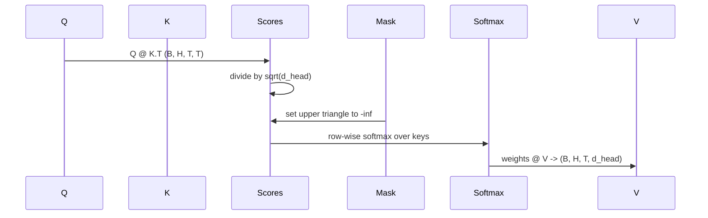

# 多头 self-attention（Multi-Head Self-Attention）

> 译注：本文译自同目录 [`en.md`](./en.md)。术语遵循仓根 [TRANSLATION_GUIDE.md](../../../../TRANSLATION_GUIDE.md)。

> 一次线性投影、三个视图、H 个并行的 head、一个 mask。模型实际用的 attention 块就长这样。

**Type:** Build
**Languages:** Python
**Prerequisites:** Phase 04 lessons, Phase 07 transformer lessons, Lessons 30 through 32 of this phase
**Time:** ~90 minutes

## 学习目标（Learning Objectives）
- 把 Query/Key/Value 的批量投影实现成一个线性层，再切分成 H 个 head。
- 实现 scaled dot-product attention，注意正确的归一化和 dtype 处理。
- 加上 causal mask，防止某个位置 attend 到未来位置。
- 对固定输入查看每个 head 的 attention 权重，分析每个 head 在看什么。
- 在一个 toy 任务上训练这个小 attention 块，看着 loss 下降、看着 head 各自分化。

## 框架（The frame）

attention（注意力）是一个函数，让某个 token 的表示能从同一序列里其他 token 那里拉信息进来。self-attention 意思是 query、key、value 都从同一个输入派生出来。multi-head 则是把投影切分成 H 个并行的 attention 子问题，输出拼接后再投影回去。

高效的实现套路是：用一个线性层把 `D` 投影到 `3 * D`，然后切成三个视图，再 reshape 成 H 个 head，每个大小 `D // H`。matmul、softmax、加权求和都以 batched 张量操作的形式完成，所以 H 个 head 在加速器上并行跑。

本课就来构建这个块。同时加上 causal mask，让同一份代码可以直接用在 decoder-only 语言模型的 attention 层里。下一课会把这个块堆成完整的 transformer，再下一课做训练。

## 形状契约（The shape contract）

输入是 `(B, T, D)`。输出是 `(B, T, D)`。mask 是 `(T, T)` 或可以广播到这个形状。块内部的中间张量形状是 `(B, H, T, d_head)`，其中 `d_head = D // H`。约束条件是 `D % H == 0`。

```mermaid
flowchart LR
    A["(B, T, D) 输入"] --> B[线性层 D → 3D]
    B --> C["拆成 Q、K、V"]
    C --> D["reshape 为 (B, H, T, d_head)"]
    D --> E["scores = Q @ K.T / sqrt(d_head)"]
    E --> F[施加 causal mask]
    F --> G[在 keys 上做 softmax]
    G --> H["context = weights @ V"]
    H --> I["reshape 为 (B, T, D)"]
    I --> J[输出线性层 D → D]
    J --> K["(B, T, D) 输出"]
```

两个线性层（QKV 投影和输出投影）是块里仅有的参数。mask、softmax、matmul、reshape 全都没有参数。

## QKV 切分（The QKV split）

朴素实现是三个独立的线性层，Q、K、V 各一个。高效实现是一个线性层，输出 `3 * D` 维特征再切开。两者数学上完全等价：三次 `(D, D)` 权重的矩阵乘法，等价于把这三个权重堆成 `(3D, D)` 后做一次矩阵乘法。

高效版更快，因为加速器只启动一次 matmul，而不是三次。它也更容易初始化，因为三个子矩阵就住在同一个参数张量里，可以一起初始化。

## head 的 reshape（The head reshape）

切完之后，Q、K、V 各是 `(B, T, D)`。要把它变成 H 个并行的 attention 子问题，我们 reshape 成 `(B, T, H, d_head)`，再 transpose 成 `(B, H, T, d_head)`。head 维度现在挨着 batch 维度，PyTorch 就会把每个 head 的 attention 当成跨 `B * H` 个独立实例的批量操作来处理。

d_head 维度留在最后，这样打分用的 matmul `Q @ K.transpose(-2, -1)` 就会把它收缩掉。结果是每个 head 的 attention 分数 `(B, H, T, T)`。

## 缩放（Scaling）

分数在 softmax 之前要除以 `sqrt(d_head)`。如果不缩放，点积会随 `d_head` 增大而变大，把 softmax 推到一个失衡的状态——某一项几乎占全部质量，其他项小到可以忽略。这种状态下梯度极小，学习就停滞了。除以 `sqrt(d_head)` 能让分数的方差在不同 head 大小之间大致保持不变。

## causal mask（The causal mask）

decoder-only 的语言模型在预测下一个 token 时只能依赖过去。mask 就是来强制这一点的。具体说，softmax 之前，把 `(T, T)` 分数矩阵对角线以上的每一项替换成负无穷。softmax 之后，这些位置的权重就成了零。

我们在构造时把 mask 注册成 buffer，这样它和模型在同一设备上，也不会进入梯度图。mask 覆盖这个块会见到的最大 context window（上下文窗口）。前向时我们切出左上角的 `(T, T)` 子块。

## 输出投影（The output projection）

拿到每个 head 的 context 向量 `(B, H, T, d_head)` 后，transpose 回 `(B, T, H, d_head)`，reshape 成 `(B, T, D)`，再过一层 `(D, D)` 线性投影。输出投影让模型可以混合各个 head。没有它的话，H 个 head 只能靠后续层来重新组合，这个块会被人为约束住。

## attention 权重观察（Attention weight inspection）

本课在 forward 上暴露了一个 `return_weights=True` 标志。打开后，块会在输出旁边一并返回形状 `(B, H, T, T)` 的每个 head 的 attention 权重。demo 会在一个短输入上画一张某个 head 权重的热图，让你看到下三角的 causal 结构以及每个位置在关注哪儿。

在训练好的模型里，不同 head 学到不同的模式。有的 head 关注紧邻的前一个 token；有的 head 关注序列的开头；有的 head 把 attention 几乎均匀铺开。这个观察 hook 就是可解释性研究的入口。

## 训练 demo（The training demo）

`main.py` 底部的 demo 把 attention 块接到一个迷你 LM head 上，整体在一个重复任务上训练。输入的每一行是同一个随机 id 在整个 context 上的复制。目标是输入向后移一位，所以模型要学到下一个 token 等于上一个 token。loss 是 cross-entropy。当 H=4、D=32、T=12、词表大小 64 时，loss 在 CPU 上跑三个 epoch 就从随机水平（约 `log(64) ~ 4.16`）一路降到远低于 `1.0`。

demo 的目的不是训出一个有用的模型。目的是确认梯度能流经块的每个部件，并且在答案显而易见的问题上 head 真的学到了东西。

## 本课不做什么（What this lesson does not do）

不加 feed-forward 块。真实模型里的 transformer 层是 attention 后面接一个两层 MLP，每个子层外面套残差连接和 layer norm。下一课加这些。

不实现 rotary 或 ALiBi 位置编码。两者都在同一个块的 QKV 投影那一步起作用，但属于另外一个教学单元。这里搭好的块通过在 matmul 之前变换 Q 和 K，可以兼容这两种方案。

不实现推理用的 KV cache。在多次 forward 之间缓存 key 和 value 是让 autoregressive 解码变快的关键优化。它会改变 K 和 V 张量的形状契约，但不影响 Q。这部分内容放在推理那一课讲。

## 怎么读这份代码（How to read the code）

`main.py` 定义 `MultiHeadSelfAttention`。这个类持有两个线性层和一个注册过的 mask buffer。forward 依次做：投影、reshape、打分、mask、softmax、加权、reshape、再投影。底部的 demo 搭了一个小模型，把 attention 用 token embedding、位置 embedding 和 LM head 包起来，在一个 copy 任务上训三个 epoch，打印 loss 曲线和每个 head 的 attention 热图。`code/tests/test_attention.py` 里的测试钉住了形状契约、因果性、softmax 性质、head 切分性质和梯度流。

跑一遍 demo。然后把 `n_heads` 从 4 改成 8（保持 `d_model=32`，所以 `d_head=4`），看热图怎么变。
