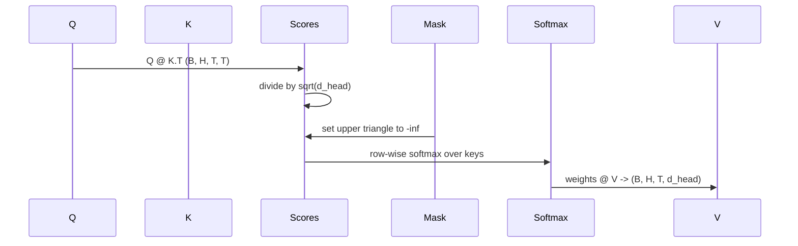

# 33 · 多头自注意力（Multi-Head Self-Attention）

> 一个线性投影，三种视图，H 个并行头，一个掩码。模型实际使用的注意力模块。

**类型：** 构建
**语言：** Python
**前置：** 第 04 阶段课程、第 07 阶段 Transformer 课程、本阶段第 30 至 32 课
**时长：** 约 90 分钟

## 学习目标
- 实现批次化的查询/键/值（Query/Key/Value）投影——使用单个线性层，再拆分为 H 个头。
- 计算缩放点积注意力（scaled dot-product attention），正确处理归一化和 dtype。
- 应用因果掩码（causal mask），阻止某个位置关注未来位置。
- 检查固定输入下每个头的注意力权重，推理每个头关注什么。
- 在一个玩具任务上训练一个小型注意力模块，观察损失随着头分工而下降。

## 框架

注意力是一种函数，它让某个 token 的表示从同一序列中的其他 token 获取信息。自注意力（self-attention）意味着查询、键和值都来自同一输入。多头（multi-head）意味着投影被拆分为 H 个并行的注意力问题，其输出再拼接起来通过投影还原。

高效的实现方式是：一个线性层从 `D` 投影到 `3 * D`，切分为三个视图，再变形为 H 个大小为 `D // H` 的头。矩阵乘法、softmax 和加权求和以批次化张量运算的形式进行，使 H 个头在加速器上并行运行。

本课构建的就是这个模块。它同时添加了因果掩码，使同一段代码可以直接作为仅解码器语言模型（decoder-only language model）中的注意力层。下一课将此模块堆叠为完整的 Transformer，再下一课则进行训练。

## 形状约定

输入为 `(B, T, D)`。输出为 `(B, T, D)`。掩码为 `(T, T)` 或可广播到该形状。模块内部，中间张量的形状为 `(B, H, T, d_head)`，其中 `d_head = D // H`。约束条件为 `D % H == 0`。

```mermaid
flowchart LR
    A["(B, T, D) input"] --> B[Linear D -> 3D]
    B --> C["split into Q, K, V"]
    C --> D["reshape to (B, H, T, d_head)"]
    D --> E["scores = Q @ K.T / sqrt(d_head)"]
    E --> F[apply causal mask]
    F --> G[softmax over keys]
    G --> H["context = weights @ V"]
    H --> I["reshape to (B, T, D)"]
    I --> J[output Linear D -> D]
    J --> K["(B, T, D) output"]
```

模块中仅有的参数是两个线性层（QKV 投影和输出投影）。掩码、softmax、矩阵乘法和变形操作均不包含参数。

## QKV 拆分

简单的实现是三个独立的线性层，分别用于 Q、K 和 V。高效的实现则是单个线性层输出 `3 * D` 个特征再拆分结果。二者在数学上等价，因为三次独立矩阵乘法分别乘以 `(D, D)` 权重，恰好等于一次矩阵乘法乘以由三者堆叠而成的 `(3D, D)` 权重。

高效版本更快，因为加速器只需启动一次矩阵乘法而非三次。它也更容易初始化，因为三个子矩阵位于同一参数张量中，可以一起初始化。

## 头变形

拆分后，Q、K、V 各自是 `(B, T, D)`。要将其变为 H 个并行的注意力问题，我们变形为 `(B, T, H, d_head)`，再转置为 `(B, H, T, d_head)`。头维度现在与批次维度相邻，因此 PyTorch 将每个头的注意力视为跨 `B * H` 个独立实例的批次化运算。

`d_head` 维度保持在最后，使分数矩阵乘法 `Q @ K.transpose(-2, -1)` 能够将其消去。结果是 `(B, H, T, T)` 的每头注意力分数。

## 缩放

分数在 softmax 之前除以 `sqrt(d_head)`。如果不做缩放，点积随 `d_head` 增大而增大，会把 softmax 推入一种状态——其中一项几乎占据全部质量，其他项几乎为零。那么梯度的状态就会极其微小，学习停滞。除以 `sqrt(d_head)` 使分数的方差在不同头大小下大致保持恒定。

## 因果掩码

仅解码器语言模型在预测下一个 token 时只能以前文为条件。掩码就是用来强制执行这一点的。具体来说，在 softmax 之前，`(T, T)` 分数矩阵对角线上方的每个条目都被替换为负无穷。经过 softmax 后，这些位置的权重变为零。

我们在构造时将掩码注册为缓冲区（buffer），使其与模型位于同一设备，且不在梯度计算图中。掩码覆盖该模块可能用到的最大上下文长度。在前向传播时，我们截取左上角的 `(T, T)` 子矩阵。

## 输出投影

在得到每个头的上下文向量 `(B, H, T, d_head)` 之后，我们转置回 `(B, T, H, d_head)`，变形为 `(B, T, D)`，再应用最后一个 `(D, D)` 线性投影。输出投影使模型能够混合各头的信息。没有它，H 个头只能通过后续层来重组，模块会受到人为的限制。

## 注意力权重检查

本课在前向传播时暴露了一个 `return_weights=True` 标志。设置后，模块除了输出外，还会返回形状为 `(B, H, T, T)` 的每头注意力权重。演示代码为短输入的某头权重打印热力图，让你看到因果三角结构和每个位置关注的焦点。

在训练好的模型中，不同的头会学到不同的模式。有些头关注前一个 token。有些头关注序列开头。有些头几乎均匀地分散注意力。检查挂钩正是做这种可解释性工作的入口。

## 训练演示

`main.py` 底部的演示将注意力模块连接到一个微小的 LM 头，并在一项重复任务上训练整个模型。输入的每一行是一个随机 ID，在上下文窗口内复制多份。目标是输入向后平移一位的结果，因此模型必须学会下一个 token 与当前 token 相同。损失函数是交叉熵（cross-entropy）。在 H=4、D=32、T=12、词汇量为 64 的设置下，三轮 CPU 训练后损失从随机水平（约 `log(64) ~ 4.16`）下降到远低于 `1.0`。

该演示的意义不在于训练有用的模型，而在于确认梯度能流经模块的每一个部分，并且在一个答案显而易见的问题上，各个头确实学到了东西。

## 本课不涉及的内容

本课不添加前馈模块。实际模型中的 Transformer 层是注意力后接双层 MLP，每层前后均有残差连接和层归一化。下一课会添加这些。

本课不实现旋转位置编码（RoPE）或 AliBi 位置编码。二者都作用在同一模块的 QKV 投影步骤中，但作为独立的教学单元。这里构建的模块兼容这两种编码——只需在矩阵乘法之前对 Q 和 K 做变换即可。

本课不实现推理用的 KV 缓存。跨前向传播缓存键和值是使自回归解码变快的优化手段。它改变了 K 和 V 张量的形状约定，但不影响 Q。它属于推理课程的内容。

## 如何阅读代码

`main.py` 定义了 `MultiHeadSelfAttention`。该类持有两个线性层和一个注册的掩码缓冲区。前向传播流程为：投影、变形、计算分数、掩码、softmax、加权、变形、再次投影。底部的演示构建了一个小型模型，将注意力包裹在 token 嵌入、位置嵌入和一个 LM 头中，在复制任务上训练三轮，打印损失曲线和每头注意力热力图。`code/tests/test_attention.py` 中的测试覆盖了形状约定、因果性质、softmax 性质、头拆分性质和梯度流动。

运行演示。然后将 `n_heads` 从 4 增加到 8（保持 `d_model=32`，于是 `d_head=4`），观察热力图的变化。
