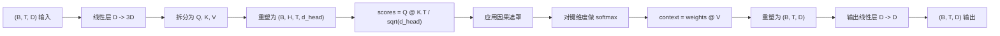
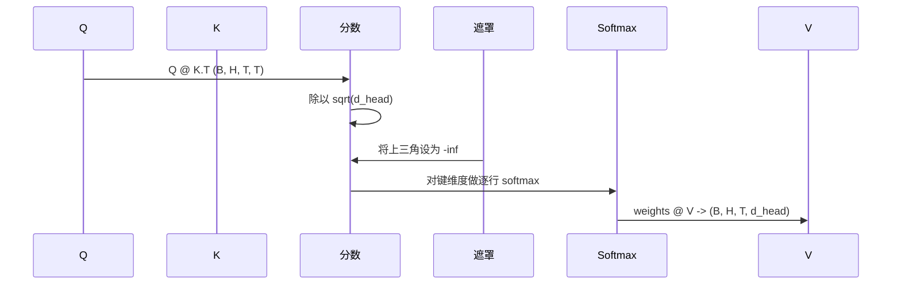

# 多头自注意力

> 一个线性投影，三种视图，H 个并行头，一个遮罩。这就是模型实际使用的注意力模块。

**类型：** 构建
**语言：** Python
**前置知识：** 第 04 阶段的课程，第 07 阶段 Transformer 课程，本阶段第 30 到 32 课
**时长：** ~90 分钟

## 学习目标
- 实现批量化的查询/键/值（QKV）投影，作为单个线性层并拆分为 H 个头。
- 计算缩放点积注意力，并正确处理归一化和数据类型。
- 应用因果遮罩，防止位置关注未来位置。
- 针对固定输入检查每个头的注意力权重，并分析每个头关注的内容。
- 在一个玩具任务上训练一个小型注意力模块，观察损失随着各个头逐渐专化而下降。

## 框架

注意力是一种函数，它让一个 token 的表示能够从同一序列中的其他 token 拉取信息。自注意力意味着查询（Q）、键（K）和值（V）都来自同一个输入。多头意味着投影被拆分为 H 个并行的注意力问题，它们的输出被拼接起来并重新投影回去。

高效的实现模式是一个线性层，将输入从 `D` 投影到 `3 * D`，然后切分为三个视图，再重塑为 H 个头，每个头的大小为 `D // H`。矩阵乘法、softmax 和加权求和都以批量张量运算的形式执行，这样所有头就在加速器上并行运行。

本节课构建了这个模块。它同时还添加了因果遮罩，使得同样的代码可以作为纯解码器语言模型中的注意力层使用。下一课将把这个模块堆叠成一个完整的 Transformer，再下一课将训练它。

## 形状约定

输入是 `(B, T, D)`。输出是 `(B, T, D)`。遮罩是 `(T, T)` 或可广播到该形状。在模块内部，中间张量的形状为 `(B, H, T, d_head)`，其中 `d_head = D // H`。约束条件是 `D % H == 0`。

```mermaid
flowchart LR
    A["(B, T, D) 输入"] --> B[线性层 D -> 3D]
    B --> C["拆分为 Q, K, V"]
    C --> D["重塑为 (B, H, T, d_head)"]
    D --> E["scores = Q @ K.T / sqrt(d_head)"]
    E --> F[应用因果遮罩]
    F --> G[对键维度做 softmax]
    G --> H["context = weights @ V"]
    H --> I["重塑为 (B, T, D)"]
    I --> J[输出线性层 D -> D]
    J --> K["(B, T, D) 输出"]
```

该模块中只有两个线性层（QKV 投影和输出投影）带有参数。遮罩、softmax、矩阵乘法和重塑均不带参数。

## QKV 拆分

朴素实现使用三个独立的线性层，分别用于 Q、K 和 V。高效实现则使用单个层输出 `3 * D` 个特征，然后拆分结果。两者在数学上是等价的，因为三个分别乘以 `(D, D)` 权重的矩阵乘法，正好等于一个乘以由它们堆叠而成的 `(3D, D)` 权重的矩阵乘法。

高效版本更快，因为加速器只启动一次矩阵乘法而不是三次。它也更容易初始化，因为三个子矩阵位于同一个参数张量中，可以一同初始化。

## 头重塑

拆分后，Q、K、V 各自为 `(B, T, D)`。要将其转换为 H 个并行的注意力问题，我们重塑为 `(B, T, H, d_head)`，然后转置为 `(B, H, T, d_head)`。头维度现在位于批次维度旁边，这样 PyTorch 就会将每个头的注意力视为跨 `B * H` 个独立实例的批量操作。

`d_head` 维度保持在最后，这样分数矩阵乘法 `Q @ K.transpose(-2, -1)` 会收缩它。结果是 `(B, H, T, T)` 大小的每个头注意力分数。

## 缩放

分数在 softmax 之前除以 `sqrt(d_head)`。如果没有这个缩放，点积会随着 `d_head` 的增长而变大，将 softmax 推入一个极端区域：一个条目占据几乎所有质量，其他条目变得极其微小。在该区域中梯度极小，学习会停滞。除以 `sqrt(d_head)` 可以保持分数的方差在不同头大小下大致恒定。

## 因果遮罩

纯解码器语言模型在预测下一个 token 时只能依赖于过去的信息。遮罩强制执行这一约束。具体来说，在 softmax 之前，`(T, T)` 分数矩阵中对角线以上的每个条目都被替换为负无穷。经过 softmax 后，这些位置的权重变为零。

```mermaid
sequenceDiagram
    participant Q
    participant K
    participant 分数
    participant 遮罩
    participant Softmax
    participant V
    Q->>分数: Q @ K.T (B, H, T, T)
    分数->>分数: 除以 sqrt(d_head)
    遮罩->>分数: 将上三角设为 -inf
    分数->>Softmax: 对键维度做逐行 softmax
    Softmax->>V: weights @ V -> (B, H, T, d_head)
```

我们在构造时将该遮罩注册为 buffer，这样它就和模型位于同一个设备上，且不参与梯度图。遮罩覆盖该模块可能看到的最大上下文长度。在前向传播时，我们切取左上角的 `(T, T)` 区域。

## 输出投影

在得到每个头的上下文向量 `(B, H, T, d_head)` 之后，我们转置回 `(B, T, H, d_head)`，重塑为 `(B, T, D)`，然后应用一个最终的 `(D, D)` 线性投影。输出投影让模型能够混合各个头的信息。没有它，H 个头只能通过后续层来重新组合，模块的能力会受到人为限制。

## 注意力权重检查

本节课在前向传播中暴露了一个 `return_weights=True` 标志。当设置此标志时，模块会随输出一起返回形状为 `(B, H, T, T)` 的每个头注意力权重。演示程序会在一个短输入上打印某个头权重的热力图，以便你观察因果三角形结构和每个位置的关注模式。

在训练好的模型中，不同的头会学习不同的模式。有些头关注紧邻的前一个 token。有些头关注序列的起始位置。有些头几乎均匀地分配注意力。检查钩子就是进行这种可解释性工作的入口点。

## 训练演示

`main.py` 底部的演示将注意力模块与一个微型语言模型头连接起来，在一个重复任务上训练整个模型。输入的每一行是一个在上下文范围内重复的随机 ID。目标是输入向右偏移一位，因此模型必须学会下一个 token 与前一个 token 相同。损失函数是交叉熵。当 H=4、D=32、T=12、词汇量为 64 时，损失从随机水平（大约 `log(64) ~ 4.16`）下降到远低于 `1.0`，在 CPU 上训练三个周期即可完成。

这个演示的目的不是训练一个有用的模型。目的是确认梯度流经模块的每一个部分，并且各个头在一个答案显而易见的问题上学到了东西。

## 本节课未涉及的内容

本节课未添加前馈模块。真实模型中的 Transformer 层是注意力后接一个两层 MLP，并带有残差连接和层归一化。下一课将添加这些内容。

本节课未实现旋转位置编码（RoPE）或 AliBi 位置编码。两者都是在本模块的 QKV 投影步骤中应用的，但它们属于独立的教学单元。这里构建的模块通过对 Q 和 K 在矩阵乘法之前进行变换，可以兼容任一种方案。

本节课未实现在推理时使用的 KV 缓存。在前向传播之间缓存键和值是使自回归解码变快的优化技术。它会改变 K 和 V 张量的形状约定，但不改变 Q 的。这属于推理课程的内容。

## 如何阅读代码

`main.py` 定义了 `MultiHeadSelfAttention`。该类包含两个线性层和一个注册的遮罩 buffer。前向传播依次进行投影、重塑、计算分数、应用遮罩、softmax、加权、重塑和再次投影。底部的演示构建了一个小型模型，用 token 嵌入和位置嵌入包裹注意力，并加一个语言模型头，在一个复制任务上训练三个周期，然后打印损失曲线和每个头注意力的热力图。`code/tests/test_attention.py` 中的测试固化了形状约定、因果性、softmax 性质、头拆分性质和梯度流通。

运行演示程序。然后将 `n_heads` 从 4 增加到 8（保持 `d_model=32`，因此 `d_head=4`），观察热力图的变化。
