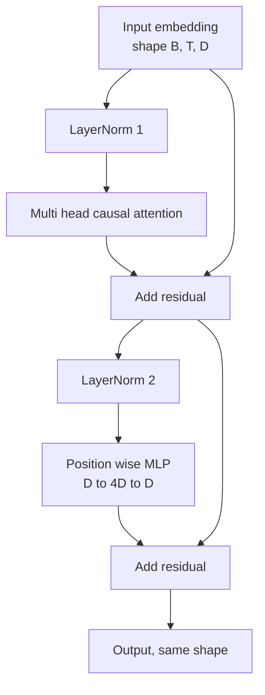
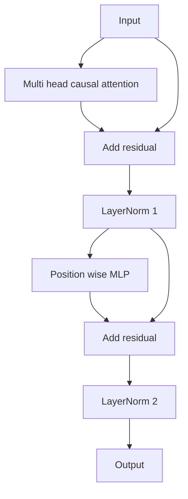

# Transformer Block Do Zero

> Um bloco é a unidade de todo decoder LLM moderno. Normalização de camada, attention multi-head, residual, MLP, residual. A variante pre-LN treina de forma estável sem warmup. A variante post-LN é o que o artigo original publicou. Esta lição constrói ambas, lado a lado, e mostra qual sobrevive a uma pilha de 12 camadas com taxas de aprendizado comuns.

**Tipo:** Construção
**Idiomas:** Python
**Pré-requisitos:** Lições 30 a 33 da Fase 19 (tokenizador, embeddings, matemática de attention, dataloader batched)
**Tempo:** ~90 minutos

## Objetivos de Aprendizado

- Construir um bloco transformer em PyTorch a partir das quatro peças móveis: LayerNorm, attention multi-head causal, conexões residuais, MLP por posição.
- Posicionar as LayerNorms em duas configurações (pre-LN e post-LN) e explicar por que uma treina de forma estável sem warmup.
- Implementar a máscara causal dentro da attention multi-head para que o token `i` não consiga ver tokens `j > i`.
- Rastrear o fluxo de gradiente através de ambas as variantes em uma pilha de 12 camadas e interpretar o resultado sem desculpas.
- Reutilizar o bloco como unidade substituível quando a próxima lição montar um GPT de 124 milhões de parâmetros.

## O Problema

Um transformer é um bloco repetido. Se você errar o bloco uma vez e repetir doze vezes, vai lançar um modelo que diverge na primeira época ou que precisa de hacks de warmup o resto do caminho. Os dois modos de falha que você verá nesta lição não são exóticos. Aparecem na primeira vez que um estudante empilha blocos de forma ingênua. Um é a camada de attention attending ao futuro. O outro é a LayerNorm posicionada onde não consegue domar o sinal residual em profundidade.

A solução é mecânica quando você a vê. O bloco tem exatamente dois caminhos residuais e exatamente duas posições de normalização. Escolha as posições corretamente e o resto da pilha é apenas burocracia.

## O Conceito

Todo bloco transformer decoder-only é uma função que recebe um tensor com formato `(batch, sequence, embedding)` e retorna um tensor do mesmo formato. Dentro, duas sub-camadas fazem o trabalho.



Esta é a variante pre-LN. A LayerNorm fica dentro da ramificação residual, antes da sub-camada. A conexão residual carrega o sinal não-normalizado para frente.

A variante post-LN move a LayerNorm para depois da soma do residual.



O formato é idêntico. O comportamento de treinamento não é. Com post-LN, o gradiente que flui de volta pelo caminho residual deve passar pela LayerNorm. Na décima segunda camada e taxa de aprendizado `3e-4`, esse gradiente encolhe rápido o suficiente para precisar de um schedule de warmup. Pre-LN deixa o caminho residual sem normalização, então os gradientes propagam de forma limpa até a camada de embedding. Pre-LN é a configuração que GPT-2 adiante usa por essa razão.

### Attention multi-head causal

A sub-camada de attention projeta a entrada em três direções para tensores de consulta, key e value. Cada um é remodelado de `(B, T, D)` para `(B, H, T, D/H)` onde `H` é o número de cabeças. Attention de produto escalar escalonado computa `softmax(Q K^T / sqrt(d_k))` por cabeça, mascara o triângulo superior para infinito negativo, aplica a máscara via softmax, depois multiplica por `V`. As cabeças são concatenadas de volta em um único tensor `(B, T, D)` e projetadas mais uma vez. A máscara é a única peça que torna o modelo causal. Esqueça a máscara e você treina um modelo que trapsa.

### A MLP

A MLP por posição aplica a mesma rede de duas camadas a cada token independentemente. A largura oculta é quatro vezes a largura de embedding, a ativação é GELU e um dropout segue a segunda linear. Nenhum token conversa com outro dentro da MLP. Toda mistura de tokens acontece na attention.

### Conexões residuais fazem duas coisas

Elas tornam o caminho de gradiente aditivo em profundidade, o que mantém a norma do gradiente em escala através de doze camadas. Elas também permitem que cada bloco aprenda uma atualização aditiva à representação em andamento ao invés de uma substituição completa. Ambos os efeitos são o motivo de o bloco escalar.

## Construa

`code/main.py` implementa:

- `class LayerNorm` com escala e deslocamento aprendíveis, eps enviesado, aplicado por vetor de token.
- `class MultiHeadAttention` com `num_heads`, `head_dim = d_model // num_heads`, projeção QKV fundida, máscara causal registrada, attention dropout e residual dropout.
- `class FeedForward` com duas camadas lineares, ativação GELU, dropout.
- `class TransformerBlock` com uma flag `pre_ln` que alterna entre as duas variantes.
- Uma demo que constrói uma pilha de 6 camadas pre-LN e uma de 6 camadas post-LN com entradas idênticas e imprime (a) formato de saída, (b) norma do gradiente no embedding após um backward pass.

Execute:

```bash
python3 code/main.py
```

Saída: verificação de formato em ambas as pilhas, normas de gradiente lado a lado. A norma de gradiente do embedding da pilha pre-LN é uma ordem de grandeza maior que a da pilha post-LN na mesma taxa de aprendizado, que é o sinal empírico de que pre-LN treina sem warmup.

## Stack

- `torch` para a matemática de tensores, autograd e infraestrutura de `nn.Module`.
- Sem `transformers`, sem pesos pré-treinados. O bloco é implementado a partir de primitivos.

## Padrões de produção no mundo real

Três padrões transformam o bloco de livro didático em algo que você pode lançar.

**Projeção QKV fundida.** Três camadas lineares separadas custam três lançamentos de kernel e três matmuls. Uma camada linear de largura `3 * d_model` faz o mesmo trabalho em um lançamento, depois fatia a saída ao longo do último eixo. O caminho fundido é mais rápido em todo acelerador e corresponde ao que implementações de referência de GPT-2, LLaMA e Mistral todas lançam.

**Buffer de máscara causal registrado.** A máscara depende apenas do comprimento máximo de contexto. Aloque uma vez na construção com `register_buffer`, fatie a janela ativa por forward pass e pule a alocação por chamada. Esquecer isso transforma a máscara em um ponto quente de alocação em contexto longo.

**Dropout em dois lugares, não em três.** Dropout pertence depois do softmax da attention (attention dropout) e depois da segunda linear da MLP (residual dropout). Um dropout no residual em si quebra a identidade aditiva que permite o fluxo de gradiente em profundidade. Algumas implementações iniciais erraram isso e pagaram com treinamento frágil.

## Use

- O bloco desta lição se encaixa direto na montagem do GPT na lição 35 sem modificação.
- A variante pre-LN é o que todo LLM moderno de pesos abertos usa. A variante post-LN é o que o artigo original de attention de 2017 usou. Conhecer ambas é suficiente para ler qualquer arquitetura decoder que você encontrar.
- Troque GELU por SiLU e você tem a família de ativações LLaMA. Troque LayerNorm por RMSNorm e você tem a normalização da família LLaMA. Mesmo esqueleto.

## Exercícios

1. Adicione uma flag `bias=False` a cada linear no bloco. LLMs modernos de pesos abertos lançam sem biases nas camadas lineares. Meça quantos parâmetros você economiza em um modelo de 12 camadas e 768 de dimensão.
2. Substitua `nn.LayerNorm` por uma RMSNorm implementada à mão e verifique que o formato de saída não muda.
3. Adicione uma flag que retorne os pesos de attention da primeira cabeça como um tensor `(B, T, T)`. Plote o triângulo superior para confirmar que é zero após o softmax.
4. Construa um teste de sanidade que alimenta um tensor `(2, 16, 384)` com `H=6` por ambas as variantes e verifica que as saídas forward são diferentes (por exemplo, `not torch.allclose`) quando os pesos são inicializados identicamente e o dropout é zero.

## Termos-Chave

| Termo | O que as pessoas dizem | O que realmente significa |
|-------|----------------------|--------------------------|
| Pre-LN | "Pré-normalização" | LayerNorm dentro da ramificação residual, antes de cada sub-camada; o residual carrega o sinal não-normalizado |
| Post-LN | "Pós-normalização" | LayerNorm após a soma do residual; o que o artigo de 2017 publicou e que precisa de warmup |
| Máscara causal | "Máscara triangular" | O triângulo superior dos logits de attention definido como infinito negativo para que o token i não consiga ler o token j quando j é maior que i |
| QKV fundido | "Projeção combinada" | Uma linear de largura 3D em vez de três lineares de largura D; um kernel, um matmul |
| Fluxo residual | "Conexão skip" | O tensor não-normalizado que flui de cima para baixo por cada bloco; o que cada bloco adiciona |

## Leitura Complementar

- Fase 7 lição 02 (self-attention do zero) para a matemática de attention por baixo deste bloco.
- Fase 7 lição 05 (transformer completo) para a versão encoder-decoder do mesmo esqueleto.
- Fase 10 lição 04 (pré-treinamento mini GPT) para o procedimento de treinamento no qual este bloco se encaixa.
- Fase 19 lição 35 (esta trilha) que empilha doze desses blocos em um modelo GPT.
