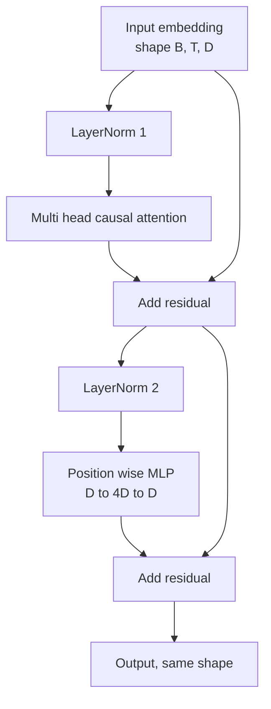
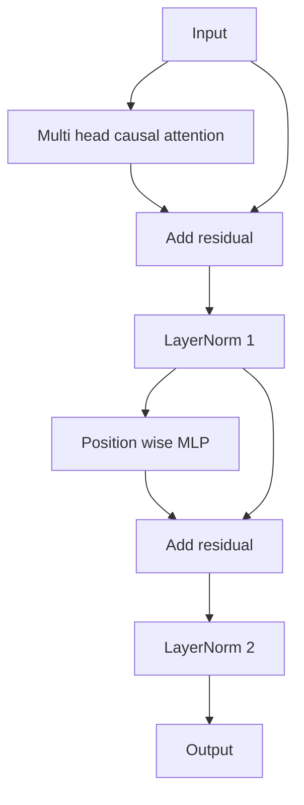

# Transformer Sıfırdan Blok

> Bir blok her modern kod çözücü LLM'nin birimidir. Katman normu, çoklu kafa dikkati, artık, MLP, artık. LN öncesi varyant, ısınmaya gerek kalmadan stabil bir şekilde antrenman yapar. LN sonrası varyant, orijinal kağıdın gönderdiği şeydir. Bu ders her ikisini de yan yana oluşturur ve hangisinin ortak öğrenme oranlarında 12 katmanlı bir yığında hayatta kaldığını gösterir.

**Tür:** Yapım
**Diller:** Python
**Önkoşullar:** Aşama 19 dersleri 30 - 33 (tokenizer, embeddings, dikkat matematiği, toplu veri yükleyici)
**Süre:** ~90 dakika

## Öğrenme Hedefleri

- PyTorch'ta dört hareketli parçadan bir transformer bloğu oluşturun: LayerNorm, çok başlı nedensel dikkat, artık bağlantılar, konum açısından MLP.
- LayerNorm'ları iki konfigürasyona (LN öncesi ve LN sonrası) yerleştirin ve neden ısınma olmadan stabil bir şekilde antrenman yapıldığını açıklayın.
- Çoklu kafa dikkatinin içine nedensel maskeleme uygulayın, böylece token `i` , token'ın `j > i`'sini göremez.
- 12 katmanlı bir yığın üzerinde her iki değişken boyunca gradient akışını izleyin ve sonucu el sallamadan okuyun.
- Bir sonraki ders 124 milyon parametreli GPT'yi birleştirdiğinde bloğu bir giriş birimi olarak yeniden kullanın.

## Sorun

Bir transformer tekrarlanan bir bloktur. Bloğu bir kez yanlış yapın, on iki kez tekrarlayın ve ilk aşamada farklılaşan veya yolun geri kalanında ısınma hilelerine ihtiyaç duyan bir model gönderirsiniz. Bu derste göreceğiniz iki başarısızlık modu egzotik değil. Bir öğrencinin blokları safça istiflediği ilk seferde ortaya çıkarlar. Bunlardan biri geleceğe bakan dikkat katmanıdır. Diğeri, derinlikteki artık sinyali evcilleştiremeyeceği yere yerleştirilen LayerNorm'dur.

Gördüğünüzde düzeltme mekaniktir. Bloğun tam olarak iki artık yolu ve tam olarak iki normalizasyon konumu vardır. Pozisyonları doğru seçin ve yığının geri kalanı sadece muhasebe tutmaktan ibarettir.

## Konsept

Yalnızca kod çözücünün her transformer bloğu, `(batch, sequence, embedding)` şeklinde bir tensör alan ve aynı şekilde bir tensör döndüren bir fonksiyondur. İçeride işi iki alt katman yapıyor.



Bu, LN öncesi varyanttır. LayerNorm, alt katmandan önce kalan dalın içinde bulunur. Artık bağlantı normalleştirilmemiş sinyali ileri taşır.

LN sonrası değişken, LayerNorm'u kalan eklemenin sonrasına taşır.



Şekil aynıdır. Eğitim davranışı değildir. LN sonrası ile, kalan yoldan geri akan gradient, LayerNorm'dan geçmelidir. On iki derinlikte ve `3e-4` öğrenme oranında, gradient bir ısınma planı gerektirecek kadar hızlı daralır. LN öncesi kalan yolu normalleştirilmemiş halde bırakır, dolayısıyla gradient'ler temiz bir şekilde embedding katmanına yayılır. Ön LN, bu nedenle GPT-2'den sonraki yapılandırmayla birlikte gelir.

### Nedensel çoklu kafa dikkati

Dikkat alt katmanı, girdiyi sorgu, anahtar ve değer tensörlerine üç şekilde yansıtır. Her biri `(B, T, D)` 'dan `(B, H, T, D/H)` 'ye yeniden şekillendirilir; burada `H` kafa sayısıdır. Ölçeklendirilmiş nokta çarpım dikkati kişi başına `softmax(Q K^T / sqrt(d_k))` değerini hesaplar, üstteki üçgeni negatif sonsuza kadar maskeler, maskeyi softmax aracılığıyla uygular ve ardından `V` ile çarpar. Başlar tek bir `(B, T, D)` tensörde birleştirilir ve bir kez daha yansıtılır. Modeli nedensel kılan tek parça maskedir. Maskeyi unutursanız hile yapan bir model yetiştirirsiniz.

### MLP

Konum açısından MLP, aynı iki katmanlı ağı her token'a bağımsız olarak uygular. Gizli genişlik, embedding genişliğinin dört katıdır, aktivasyon GELU'dur ve ikinci doğrusal çizgiyi bir bırakma takip eder. MLP'de hiçbir token birbiriyle konuşmaz. Tüm token karışımlar dikkat içinde gerçekleşir.

### Artık bağlantılar iki şey yapar

Derinlik boyunca gradient yolunu eklerler, bu da gradient normunu on iki katman boyunca ölçekte tutar. Ayrıca her bloğun, tam bir değiştirme yerine, çalışan gösterime ek bir güncelleme öğrenmesine izin veriyorlar. Her iki etki de bloğun ölçeklenmesinin nedenidir.

## Build It — Kendin Geliştir

`code/main.py` şunu uygular:

- token vektörüne uygulanan, öğrenilebilir ölçek ve kaydırmalı, önyargılı eps'li `class LayerNorm` .
- `num_heads` ile `class MultiHeadAttention` , `head_dim = d_model // num_heads`, kaynaşmış QKV projeksiyonu, kayıtlı nedensel maske, dikkat ve kalan okulu bırakma.
- İki doğrusal katmanlı `class FeedForward` , GELU aktivasyonu, bırakma.
- İki değişken arasında geçiş yapan `pre_ln` bayrağına sahip `class TransformerBlock` .
- Aynı girişlere sahip 6 katmanlı LN öncesi yığın ve 6 katmanlı LN sonrası yığın oluşturan ve bir geri geçişten sonra (a) çıktı şeklini, (b) embedding'da gradient normunu yazdıran bir demo.

Çalıştır:

```bash
python3 code/main.py
```

Çıktı: her iki yığında da şekil kontrolü, gradient normları yan yana. LN öncesi yığının embedding gradient değeri, aynı öğrenme oranındaki LN sonrası yığından büyüklük mertebesinde daha büyüktür; bu, ısınma olmadan LN trenleri öncesi ampirik sinyaldir.

## Yığın

- Tensör matematiği, otomatik derecelendirme ve `nn.Module` tesisatı için `torch` .
- `transformers` yok, önceden eğitilmiş ağırlık yok. Blok ilkellerden uygulanır.

## Vahşi doğada üretim modelleri

Üç desen, ders kitabı bloğunu gönderebileceğiniz bir şeye dönüştürür.

**Birleştirilmiş QKV projeksiyonu.** Üç ayrı doğrusal katman, üç çekirdek başlatmaya ve üç matmul'a mal olur. `3 * d_model` genişliğindeki bir doğrusal katman aynı işi tek bir başlatmada yapar, ardından çıktıyı son eksen boyunca böler. Birleştirilmiş yol her hızlandırıcıda daha hızlıdır ve GPT-2, LLaMA ve Mistral'in tümünün gönderdiği referans uygulamalarıyla eşleşir.

**Kayıtlı nedensel maske arabelleği.** Maske yalnızca maksimum bağlam uzunluğuna bağlıdır. İnşaat sırasında `register_buffer` ile bir kez tahsis edin, aktif pencereyi ileri geçiş başına dilimleyin ve çağrı başına tahsisi atlayın. Bunu unutmak, maskeyi uzun bağlamda tahsis edici bir etkin noktaya dönüştürür.

**Bırakma üç değil, iki yerde.** Bırakma dikkat softmax'ından (dikkat bırakma) ve MLP'nin ikinci doğrusalından (artık bırakma) sonrasına aittir. Artık üzerindeki bir bırakma, gradient'nin derinlikte akmasına izin veren toplamsal kimliği bozar. Bazı ilk uygulamalar bunu yanlış anladı ve bunun bedelini kırılgan eğitimle ödedi.

## Use It — Hazır Araçla Uygula

- Bu dersteki blok, değişiklik yapılmadan ders 35'teki GPT derlemesine doğrudan takılır.
- LN öncesi varyant, LLM'nin tüm modern açık ağırlıkların kullandığı şeydir. LN sonrası varyant, 2017'deki orijinal dikkat belgesinde kullanılan şeydir. Her ikisini de bilmek, karşılaşacağınız herhangi bir kod çözücü mimarisini okumak için yeterlidir.
- GELU'yu SiLU ile değiştirin ve LLaMA ailesi aktivasyonuna sahip olun. LayerNorm'u RMSNorm ile değiştirin ve LLaMA ailesi normalleştirmesine sahip olun. Aynı iskelet.

## Egzersizler

1. Bloktaki her doğrusala bir `bias=False` bayrağı ekleyin. Modern açık ağırlık LLM'leri doğrusal katmanlarda önyargı olmadan gönderilir. 12 katmanlı 768 dim modelinde kaç parametre kaydettiğinizi ölçün.
2. `nn.LayerNorm` 'yi elle haddelenmiş RMSNorm ile değiştirin ve çıktı şeklinin değişmediğini doğrulayın.
3. İlk baş için dikkat ağırlıklarını `(B, T, T)` tensörü olarak döndüren bir bayrak ekleyin. Softmax'tan sonra sıfır olduğunu doğrulamak için üstteki üçgeni çizin.
4. Her iki değişken aracılığıyla bir `(2, 16, 384)` tensörünü `H=6` ile besleyen ve ağırlıklar aynı şekilde başlatıldığında ve bırakma sıfıra ayarlandığında ileri çıkışların farklı olduğunu (örneğin, `not torch.allclose`) ileri süren bir akıl sağlığı kontrolü oluşturun.

## Anahtar Terimler

| Dönem | İnsanlar ne diyor | Aslında ne anlama geliyor |
|------|-----------------|------------------------|
| LN Öncesi | "Ön norm" | Her alt katmandan önce kalan dalın içindeki LayerNorm; artık normalleştirilmemiş sinyali taşır |
| LN sonrası | "Post norm" | Kalan eklemeden sonra LayerNorm; 2017 makalesinde neler yer alıyor ve nelerin ısınmaya ihtiyacı var |
| Nedensel maske | "Üçgen maske" | Dikkat logitlerinin üst üçgeni negatif sonsuza ayarlanmıştır, böylece j, i'den büyük olduğunda token i, token j'yi okuyamaz.
| Sigortalı QKV | "Birleşik projeksiyon" | D genişliğinde üç doğrusal yerine 3D genişlikte bir doğrusal; bir çekirdek, bir matmul |
| Artık akış | "Bağlantıyı atla" | Her blokta yukarıdan aşağıya doğru akan normalleştirilmemiş tensör; her blok neye katkıda bulunur |

## Daha Fazla Okuma

- Bu bloğun altındaki dikkat matematiği için Aşama 7 ders 02 (sıfırdan kişisel dikkat).
- Aynı iskeletin kodlayıcı kod çözücü versiyonu için Aşama 7 ders 05 (tam transformer).
- Bu bloğun takılacağı eğitim prosedürü için Aşama 10 ders 04 (eğitim öncesi mini GPT).
- Bu bloklardan on ikisini bir GPT modelinde istifleyen Aşama 19 ders 35 (bu parça).
