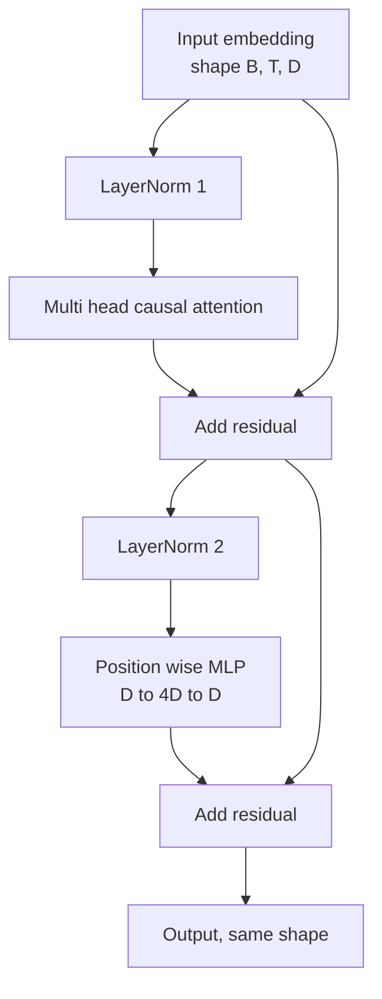
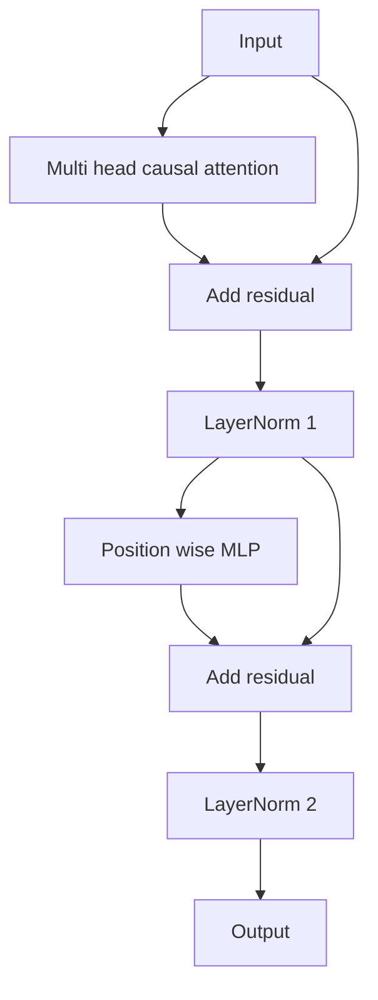

# 34 · 从零构建 Transformer 块

> 一个块（block）是所有现代解码器大语言模型（decoder LLM）的基本单元。层归一化（LayerNorm）、多头注意力（Multi-Head Attention）、残差连接（residual）、多层感知机（MLP）、再残差。前置层归一化（pre-LN）变体无需预热（warmup）即可稳定训练。后置层归一化（post-LN）变体是原论文发布的版本。本课将两者并排构建，并展示在常规学习率下，哪一个能在 12 层的堆叠中存活下来。

**类型：** 构建
**语言：** Python
**前置：** 第 19 阶段第 30 至 33 课（分词器、嵌入、注意力数学、批量化数据加载器）
**时长：** 约 90 分钟

## 学习目标

- 在 PyTorch 中从四个活动部件构建一个 Transformer 块：LayerNorm、多头因果注意力（multi-head causal attention）、残差连接、逐位置多层感知机（position-wise MLP）。
- 以两种配置（pre-LN 和 post-LN）放置 LayerNorm，并解释为什么其中一种无需预热即可稳定训练。
- 在多头注意力内部实现因果掩码（causal masking），使 token `i` 看不到 token `j > i`。
- 在 12 层的堆叠上追踪两种变体的梯度流动，并以实证方式读取结果，不靠含糊其辞。
- 在下一课组装一个 1.24 亿参数的 GPT 时，将该块作为即插即用的单元复

用。

## 问题

一个 Transformer 就是一个块的重复。把块搞错一次，重复十二次，你发布出来的模型将在第一个 epoch 中发散，或者之后每一步都需要预热黑魔法（warmup hack）。你将在本课中看到的两种失败模式并不奇葩，它们会在学习者初次天真地堆叠块时出现。一种是注意力层关注到了未来。另一种是 LayerNorm 放在了一个无法在深层抑制残差信号的位置。

一旦看清楚，修复是机械性的。该块恰好有两条残差路径和两个归一化位置。选对位置之后，其余堆叠只是记账工作而已。

## 概念

每一个纯解码器 Transformer 块都是一个函数，接收形状为 `(batch, sequence, embedding)` 的张量，返回相同形状的张量。内部由两个子层完成工作。



这是 pre-LN 变体。LayerNorm 位于残差分支内部，在子层之前。残差连接将未经归一化的信号向前传递。

post-LN 变体将 LayerNorm 移到残差加法之后。



形状完全相同。训练行为不同。在 post-LN 中，通过残差路径回传的梯度必须经过 LayerNorm。在深度 12 和学习率 `3e-4` 下，该梯度衰减得足够快，以至于需要预热调度（warmup schedule）。pre-LN 使残差路径保持未归一化状态，因此梯度能够干净地传播到嵌入层。正因如此，GPT-2 及之后的版本都采用 pre-LN 配置。

### 因果多头注意力

注意力子层将输入按三种方式投影为 query、key、value 张量。每个张量从 `(B, T, D)` 重塑为 `(B, H, T, D/H)`，其中 `H` 是头数。缩放点积注意力（scaled dot-product attention）按头计算 `softmax(Q K^T / sqrt(d_k))`，将上三角掩码为负无穷，通过 softmax 应用掩码，然后乘以 `V`。各头拼接回一个 `(B, T, D)` 张量并再做一次投影。掩码是使模型成为因果模型的唯一组件。忘记掩码，你训练出来的模型就是在作弊。

### MLP

逐位置 MLP 对每个 token 独立应用相同的两层网络。隐藏宽度是嵌入宽度的四倍，激活函数为 GELU，第二个线性层后跟一个 dropout。MLP 内部没有 token 之间的交互。所有 token 混合都发生在注意力中。

### 残差连接做两件事

它们使梯度路径在深度上呈加法累加，从而将梯度范数在十二层中保持在合理尺度。它们还让每个块学习对当前表示的一个加法更新，而非完全替换。这两种效果是块能够扩展的原因。

## 构建

`code/main.py` 实现了：

- `class LayerNorm`：具有可学习的缩放（scale）和平移（shift），带偏置的 epsilon，按 token 向量应用。
- `class MultiHeadAttention`：包含 `num_heads`、`head_dim = d_model // num_heads`、融合 QKV 投影（fused QKV projection）、注册的因果掩码、注意力 dropout 和残差 dropout。
- `class FeedForward`：两层线性层、GELU 激活、dropout。
- `class TransformerBlock`：带 `pre_ln` 标志位，在两种变体之间切换。
- 一个演示：用相同的输入构建一个 6 层 pre-LN 堆叠和一个 6 层 post-LN 堆叠，并打印 (a) 输出形状、(b) 一次反向传播后嵌入层的梯度范数。

运行它：

```bash
python3 code/main.py
```

输出：两个堆叠的形状检查，并排显示梯度范数。pre-LN 堆叠的嵌入梯度比相同学习率下的 post-LN 堆叠大一个数量级——这是 pre-LN 无需预热即可训练的经验信号。

## 技术栈

- `torch` 用于张量计算、自动微分和 `nn.Module` 基础设施。
- 不使用 `transformers`，不使用预训练权重。该块完全从原语实现。

## 生产环境中的实战模式

三种模式将教科书式的块转变为可以交付的东西。

**融合 QKV 投影。** 三个独立的线性层需要三次内核启动和三次矩阵乘法。一个宽度为 `3 * d_model` 的线性层在一次启动中完成相同工作，然后沿最后一个轴拆分输出。融合路径在每个加速器上都更快，并且与 GPT-2、LLaMA 和 Mistral 的参考实现一致。

**注册的因果掩码缓冲区。** 掩码仅依赖于最大上下文长度。在构造时用 `register_buffer` 分配一次，每次前向传播时切片出当前窗口，跳过每次调用重新分配的开销。忘记这一点会使掩码在长上下文场景中成为内存分配的热点。

**在两个位置使用 dropout，而非三个。** dropout 应放在注意力 softmax 之后（注意力 dropout）和 MLP 的第二个线性层之后（残差 dropout）。在残差本身上加 dropout 会破坏使梯度在深度上流动的加法恒等性。一些早期实现在这里犯了错，并为此付出了训练不稳的代价。

## 使用

- 本课的块不经修改即可直接插入第 35 课的 GPT 组装中。
- pre-LN 变体是每个现代开源权重 LLM 所采用的方案。post-LN 变体是 2017 年原始注意力论文采用的方案。了解两者足以阅读你将遇到的任何解码器架构。
- 将 GELU 换成 SiLU，你就得到了 LLaMA 家族的激活函数。将 LayerNorm 换成 RMSNorm，你就得到了 LLaMA 家族的归一化方式。骨架相同。

## 练习

1. 为块中的每个线性层添加 `bias=False` 标志。现代开源权重 LLM 在线性层中不带偏置。测量在 12 层、768 维的模型中节省了多少参数。
2. 用手写的 RMSNorm 替换 `nn.LayerNorm`，并验证输出形状不变。
3. 添加一个标志位，将第一个头的注意力权重作为 `(B, T, T)` 张量返回。绘制上三角以确认 softmax 后为零。
4. 构建一个健全性检查：将 `(2, 16, 384)` 的张量以 `H=6` 送入两种变体，并断言在相同初始化权重且 dropout 设为零时，前向输出不同（例如 `not torch.allclose`）。

## 关键术语

| 术语 | 人们怎么说 | 实际含义 |
|------|-----------------|------------------------|
| Pre-LN | "前置归一化" | LayerNorm 位于残差分支内部，在每

个子层之前；残差传递未经归一化的信号 |
| Post-LN | "后置归一化" | LayerNorm 在残差加法之后；2017 年论文发布的方案，需要预热 |
| Causal mask | "三角掩码" | 注意力 logits 的上三角设为负无穷，使 token i 不能读取 token j（当 j 大于 i 时） |
| Fused QKV | "合并投影" | 一个宽度为 3D 的线性层代替三个宽度为 D 的线性层；一次内核、一次矩阵乘法 |
| Residual stream | "跳跃连接" | 未经归一化的张量，自上而下流经每个块；每个块向其中累加内容 |

## 扩展阅读

- 第 7 阶段第 02 课（从零实现自注意力），了解本块背后的注意力数学。
- 第 7 阶段第 05 课（完整 Transformer），了解同骨架的编码器-解码器版本。
- 第 10 阶段第 04 课（预训练迷你 GPT），了解本块所接入的训练流程。
- 第 19 阶段第 35 课（本轨道），将十二个这样的块堆叠成一个 GPT 模型。
