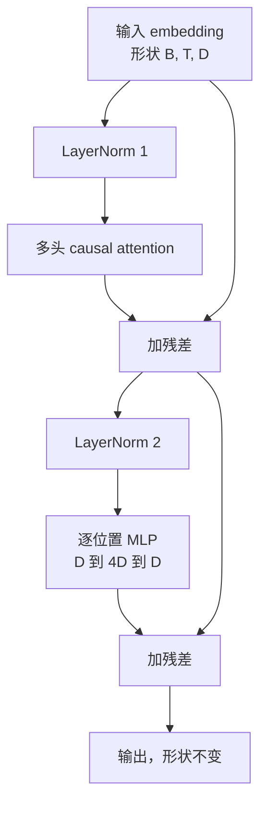
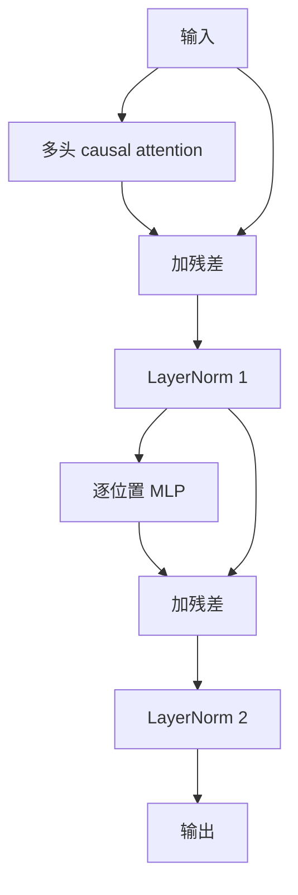

# 从零实现 Transformer Block

> 译注：本文译自同目录 [`en.md`](./en.md)。术语遵循仓根 [TRANSLATION_GUIDE.md](../../../../TRANSLATION_GUIDE.md)。

> 一个 block 就是现代每一个 decoder LLM 的最小单元。layer norm、multi-head attention、residual、MLP、residual。pre-LN 版本不用 warmup 就能稳定训练；post-LN 版本则是当年原论文实际发布的形态。本节课把两种结构并排实现，看看在常用学习率下，哪一种能撑过 12 层堆叠。

**Type:** Build
**Languages:** Python
**Prerequisites:** Phase 19 第 30 到 33 课（tokenizer、embedding、attention 数学、批量数据加载器）
**Time:** ~90 minutes

## 学习目标（Learning Objectives）

- 用四个组件——LayerNorm、multi-head causal attention、residual 连接、position-wise MLP——在 PyTorch 里搭出一个 transformer block。
- 把 LayerNorm 摆成两种位置（pre-LN 和 post-LN），并解释为什么其中一种不用 warmup 就能稳定训练。
- 在 multi-head attention 内部实现 causal mask，让 token `i` 看不到 `j > i` 的 token。
- 在 12 层堆叠下追踪两种变体的梯度流动，不靠手势比划，直接读出结果。
- 把这个 block 当成即插即用的单元，下一节课用它拼出一个 1.24 亿参数的 GPT。

## 问题（Problem）

一个 transformer 就是同一个 block 不断重复。block 写错一次，重复十二次，你交付的模型要么第一个 epoch 就发散，要么剩下的训练全程都得靠 warmup 之类的小补丁救。本节课你会看到的两种翻车模式都不稀奇，凡是新手第一次朴素地堆 block，几乎都会撞上。一种是 attention 层偷看了未来。另一种是 LayerNorm 摆错了位置，没法在深层把 residual 信号驯服住。

只要你看明白原理，修起来很机械。block 里恰好有两条 residual 路径、恰好两个归一化位置。把位置选对，剩下的整个 stack 都只是抄写记账。

## 概念（Concept）

每一个 decoder-only 的 transformer block 都是这样一个函数：吃进一个形状为 `(batch, sequence, embedding)` 的张量，吐出一个形状一模一样的张量。内部由两个子层（sublayer）干活。



这是 pre-LN 版本。LayerNorm 蹲在 residual 分支里，子层之前。residual 连接把没归一化过的信号直接往后送。

post-LN 版本则把 LayerNorm 挪到了 residual 加法之后。



形状完全一样。训练行为不一样。post-LN 下，沿 residual 路径反传的梯度必须穿过 LayerNorm。深度 12、学习率 `3e-4` 时，那个梯度衰减得够快，需要靠 warmup 调度才能撑住。pre-LN 把 residual 路径留作未归一化，梯度可以干净地一路传到 embedding 层。这也正是为什么 GPT-2 之后的开源模型一律采用 pre-LN。

### Causal multi-head attention

attention（注意力）子层把输入投影成三份：query、key、value 张量。每一份都从 `(B, T, D)` reshape 成 `(B, H, T, D/H)`，其中 `H` 是 head 数。Scaled dot-product attention 在每个 head 上算 `softmax(Q K^T / sqrt(d_k))`，把上三角 mask 成负无穷，通过 softmax 让 mask 生效，然后乘以 `V`。所有 head 拼回成一个 `(B, T, D)` 张量，再做一次投影。整个模型变 causal 全靠这个 mask——你忘了加 mask，训出来的就是个会作弊的模型。

### MLP

position-wise MLP 在每个 token 上独立地跑同一个两层网络。隐藏维度是 embedding 维度的四倍，激活函数是 GELU，第二个线性层之后跟一个 dropout。MLP 内部 token 之间互不通气。所有 token 之间的混合都发生在 attention 里。

### residual 连接干两件事

它让梯度路径在深度方向上变成加法叠加，这样 12 层下来梯度范数还能保持在合理量级。它也让每个 block 学到一个对正在流动的表示做加法更新，而不是整个换掉。这两个效果就是 block 能 scale 起来的原因。

## 动手实现（Build It）

`code/main.py` 实现了：

- `class LayerNorm`，带可学习的 scale 和 shift、带偏置的 eps，按每个 token 向量逐个做归一化。
- `class MultiHeadAttention`，参数有 `num_heads`、`head_dim = d_model // num_heads`，融合 QKV 投影，注册了 causal mask buffer，带 attention dropout 和 residual dropout。
- `class FeedForward`，两层线性、GELU 激活、dropout。
- `class TransformerBlock`，带一个 `pre_ln` 开关，用来切换两种结构。
- 一个 demo：用相同的输入分别搭一个 6 层 pre-LN 堆叠和一个 6 层 post-LN 堆叠，打印 (a) 输出形状，(b) 一次 backward 之后 embedding 处的梯度范数。

跑一下：

```bash
python3 code/main.py
```

输出：两个 stack 的形状校验、并列展示的梯度范数。在同一学习率下，pre-LN 堆叠在 embedding 处的梯度比 post-LN 大一个数量级，这就是 pre-LN 不需要 warmup 也能训练的实证信号。

## 技术栈（Stack）

- `torch`：负责张量运算、autograd、`nn.Module` 周边。
- 不用 `transformers`，不用预训练权重。block 完全从基本组件搭起。

## 真实世界中的工程化模式（Production patterns in the wild）

有三个模式能把课本里那个 block 变成你真正能上线的东西。

**融合 QKV 投影。** 三个独立的线性层意味着三次 kernel 启动、三次矩阵乘。一个宽度为 `3 * d_model` 的线性层一次 launch 就能干完同样的活，然后沿最后一个轴切开输出。融合路径在所有加速器上都更快，也是 GPT-2、LLaMA、Mistral 参考实现里的通用做法。

**注册的 causal mask buffer。** mask 只取决于最大上下文长度。在构造时用 `register_buffer` 一次分配好，每次 forward 切出当前活动窗口，省掉每次调用都重新分配的开销。忘了这一步，长上下文场景下 mask 就会变成内存分配器的热点。

**dropout 放两个位置就够，不要放三个。** dropout 应该跟在 attention 的 softmax 后面（attention dropout），以及 MLP 的第二个线性层后面（residual dropout）。在 residual 本身上加 dropout 会破坏那个让梯度在深层还能流动的加法恒等性。一些早期实现就栽在这上面，代价是训练极其脆弱。

## 用起来（Use It）

- 本节课实现的 block 直接就能塞进第 35 课的 GPT 装配，不需要任何修改。
- pre-LN 变体是当代每一个开源 LLM 都在用的版本。post-LN 变体则是 2017 年那篇 attention 原论文用的。两个都懂了，你就能读懂将来遇到的任何 decoder 架构。
- 把 GELU 换成 SiLU，你就有了 LLaMA 系列的激活函数。把 LayerNorm 换成 RMSNorm，你就有了 LLaMA 系列的归一化。骨架是一样的。

## 练习（Exercises）

1. 给 block 里每个线性层加一个 `bias=False` 开关。当代开源 LLM 都不在线性层上挂 bias。算一下在 12 层、768 维的模型里能省多少参数。
2. 把 `nn.LayerNorm` 换成你自己手搓的 RMSNorm，验证输出形状不变。
3. 加一个开关，把第一个 head 的 attention 权重作为 `(B, T, T)` 张量返回出来。画出上三角部分，确认 softmax 之后那里是零。
4. 写一个 sanity check：让一个 `(2, 16, 384)` 张量在 `H=6` 下分别穿过两种变体，断言两次 forward 的输出不同（比如用 `not torch.allclose`）——前提是初始权重相同、dropout 设为零。

## 关键术语（Key Terms）

| 术语 | 大家嘴上怎么说 | 实际指什么 |
|------|-----------------|------------------------|
| Pre-LN | "Pre norm" | LayerNorm 放在 residual 分支里、子层之前；residual 携带的是未归一化的信号 |
| Post-LN | "Post norm" | LayerNorm 放在 residual 加法之后；2017 年原论文的版本，需要 warmup |
| Causal mask | "Triangle mask" | attention logits 的上三角被置为负无穷，让 token i 在 j > i 时读不到 token j |
| Fused QKV | "Combined projection" | 一个宽度为 3D 的线性层，取代三个宽度为 D 的线性层；一次 kernel、一次矩阵乘 |
| Residual stream | "Skip connection" | 自上而下贯穿每个 block 的未归一化张量；每个 block 都是往它身上加一笔 |

## 延伸阅读（Further Reading）

- Phase 7 第 02 课（从零写 self-attention），本 block 底下那套 attention 数学。
- Phase 7 第 05 课（完整 transformer），同一骨架的 encoder-decoder 版本。
- Phase 10 第 04 课（预训练 mini GPT），把这个 block 接进去的训练流程。
- Phase 19 第 35 课（本轨道下一课），把十二个这样的 block 堆成一个 GPT 模型。
