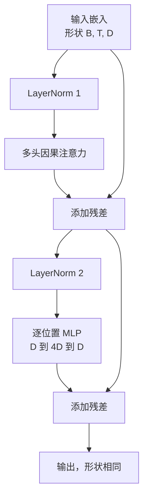
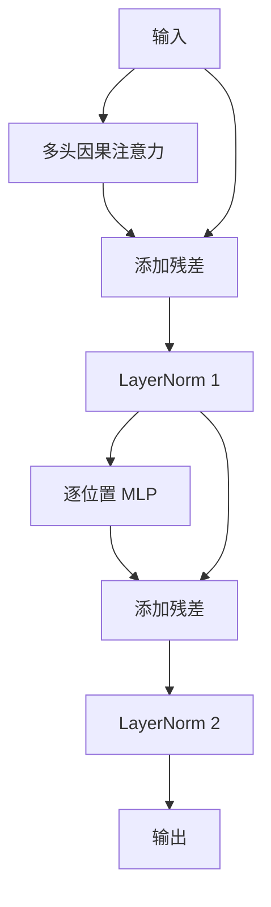

# 从零构建 Transformer 块

> 一个块是每个现代解码器 LLM 的基本单元。层归一化、多头注意力、残差连接、MLP、残差连接。Pre-LN 变体无需预热即可稳定训练。Post-LN 变体是原始论文发布时采用的方案。本课将同时构建两种变体，并展示在常用学习率下，12 层堆叠中哪一种能够存活。

**类型：** 构建
**语言：** Python
**前置知识：** 阶段 19 第 30 至 33 课（分词器、嵌入、注意力数学、批量数据加载器）
**时长：** 约 90 分钟

## 学习目标

- 使用四个关键组件在 PyTorch 中构建 Transformer 块：LayerNorm、多头因果注意力、残差连接、逐位置 MLP。
- 以两种配置（pre-LN 和 post-LN）放置 LayerNorm，并解释为什么其中一种无需预热即可稳定训练。
- 在多头部注意力中实现因果掩码，使 token `i` 无法看到 token `j > i`。
- 追踪两种变体在 12 层堆叠中的梯度流，并以确凿的数据而非泛泛而谈得出结论。
- 在下一课组装 1.24 亿参数 GPT 时，将该块作为可直接插入的单元复用。

## 问题

Transformer 是一个不断重复的块。一旦块构建错误，再重复十二次，你发布的模型就会在第一个 epoch 发散，或者需要全程依赖预热技巧来维持训练。本课中你将看到的两种失败模式并非罕见情况。它们是学习者初次以朴素方式堆叠块时就会遇到的。其一是注意力层关注到了未来信息。其二是 LayerNorm 被放在了无法在深层抑制残差信号的位置。

一旦你看清问题所在，修复方法就变得机械而直接。该块恰好有两条残差路径和两个归一化位置。正确选择归一化位置后，堆叠的其余部分仅仅是记账工作。

## 概念

每个仅解码器 Transformer 块都是一个函数，接收形状为 `(batch, sequence, embedding)` 的张量，并返回相同形状的张量。内部由两个子层完成工作。


```mermaid
flowchart TB
  X[输入嵌入<br/>形状 B, T, D] --> N1[LayerNorm 1]
  N1 --> MHA[多头因果注意力]
  MHA --> R1[添加残差]
  X --> R1
  R1 --> N2[LayerNorm 2]
  N2 --> MLP[逐位置 MLP<br/>D 到 4D 到 D]
  MLP --> R2[添加残差]
  R1 --> R2
  R2 --> Y[输出，形状相同]
```

这是 pre-LN 变体。LayerNorm 位于残差分支内部、子层之前。残差连接将未归一化的信号向前传递。

Post-LN 变体将 LayerNorm 移动到残差相加之后。


```mermaid
flowchart TB
  X[输入] --> MHA[多头因果注意力]
  MHA --> R1[添加残差]
  X --> R1
  R1 --> N1[LayerNorm 1]
  N1 --> MLP[逐位置 MLP]
  MLP --> R2[添加残差]
  N1 --> R2
  R2 --> N2[LayerNorm 2]
  N2 --> Y[输出]
```

形状完全相同，但训练行为截然不同。使用 post-LN 时，沿残差路径反向传播的梯度必须经过 LayerNorm。在深度为十二、学习率为 `3e-4` 的情况下，该梯度衰减得足够快，以至于需要预热调度。Pre-LN 则让残差路径保持未归一化状态，使梯度能够干净地传播到嵌入层。正因如此，GPT-2 及之后的模型都采用 pre-LN 配置。

### 因果多头注意力

注意力子层将输入投影为三组张量：查询（query）、键（key）、值（value）。每个张量从 `(B, T, D)` 重塑为 `(B, H, T, D/H)`，其中 `H` 是注意力头数。缩放点积注意力在每个头上计算 `softmax(Q K^T / sqrt(d_k))`，将上三角矩阵掩码为负无穷，通过 softmax 应用掩码，然后乘以 `V`。各头部的结果拼接回一个 `(B, T, D)` 张量，再进行一次投影。掩码是使模型具备因果性的唯一关键。忘记掩码，你训练出的模型就会作弊。

### MLP

逐位置 MLP 对每个 token 独立应用相同的两层网络。隐藏层宽度是嵌入宽度的四倍，激活函数为 GELU，第二个线性层后接 dropout。在 MLP 内部，token 之间不会互相通信。所有 token 之间的信息混合都在注意力层中完成。

### 残差连接的两个作用

残差连接使梯度路径在深度上保持加性，从而在十二层中保持梯度范数在合理范围内。同时，它们让每个块学习对当前表示的增量更新，而非完全替换。这两个效果共同构成了块能够扩展的原因。

## 动手构建

`code/main.py` 实现了：

- `class LayerNorm` —— 包含可学习的缩放和平移参数、带偏置的 eps，对每个 token 向量独立应用。
- `class MultiHeadAttention` —— 包含 `num_heads`、`head_dim = d_model // num_heads`、融合的 QKV 投影、注册的因果掩码、注意力和残差 dropout。
- `class FeedForward` —— 包含两个线性层、GELU 激活、dropout。
- `class TransformerBlock` —— 包含一个 `pre_ln` 标志，用于在两种变体之间切换。
- 一个演示程序，构建一个 6 层 pre-LN 堆叠和一个 6 层 post-LN 堆叠，使用相同的输入，并打印 (a) 输出形状，(b) 一次反向传播后嵌入层的梯度范数。

运行方式：

```bash
python3 code/main.py
```

输出：两个堆叠的形状检查，以及梯度范数的并排对比。在相同学习率下，pre-LN 堆叠的嵌入层梯度比 post-LN 堆叠大一个数量级，这正是 pre-LN 无需预热即可训练的经验证据。

## 技术栈

- `torch` —— 张量运算、自动求导和 `nn.Module` 基础设施。
- 不使用 `transformers` 库，不使用预训练权重。该块完全从基础组件实现。

## 生产环境中的常见模式

以下三种模式能将教科书中的块转化为可实际交付的代码。

**融合 QKV 投影。** 三个独立的线性层需要三次内核启动和三次矩阵乘法。一个宽度为 `3 * d_model` 的线性层在一次启动中完成相同的工作，然后沿最后一个维度分割输出。融合路径在所有加速器上都更快，并且与 GPT-2、LLaMA 和 Mistral 的参考实现一致。

**注册因果掩码缓冲区。** 掩码仅依赖于最大上下文长度。在构造时使用 `register_buffer` 一次性分配，每次前向传播时切片出当前活动窗口，避免每次调用都重新分配。忘记这一点会使掩码在长上下文场景下成为内存分配的热点。

**在两个位置使用 Dropout，而不是三个。** Dropout 应放在注意力 softmax 之后（注意力 dropout）和 MLP 的第二个线性层之后（残差 dropout）。在残差连接本身上使用 dropout 会破坏让梯度在深层流动的加性恒等映射。一些早期实现在这方面犯了错误，并为此付出了训练不稳定的代价。

## 使用方式

- 本课中的块无需修改即可直接插入第 35 课的 GPT 组装中。
- Pre-LN 变体是所有现代开源权重 LLM 使用的方案。Post-LN 变体是 2017 年原始注意力论文使用的方案。了解这两种变体足以让你读懂将来遇到的任何解码器架构。
- 将 GELU 替换为 SiLU，你就得到了 LLaMA 系列的激活函数。将 LayerNorm 替换为 RMSNorm，你就得到了 LLaMA 系列的归一化方案。同样的骨架，不同的配件。

## 练习

1. 为块中的每个线性层添加 `bias=False` 标志。现代开源权重 LLM 的线性层不带偏置。测量在一个 12 层、768 维的模型中你能节省多少参数。
2. 将 `nn.LayerNorm` 替换为手写的 RMSNorm，并验证输出形状不变。
3. 添加一个标志，使第一个注意力头的注意力权重以 `(B, T, T)` 张量的形式返回。绘制上三角部分以确认 softmax 后其值为零。
4. 构建一个合理性检查：将 `(2, 16, 384)` 张量（`H=6`）分别输入两种变体，当权重初始化相同且 dropout 设为零时，断言前向输出不同（例如，使用 `not torch.allclose`）。

## 关键术语

| 术语 | 人们常说的 | 实际含义 |
|------|-----------|---------|
| Pre-LN | "前归一化" | LayerNorm 位于残差分支内部、每个子层之前；残差路径传递未归一化的信号 |
| Post-LN | "后归一化" | LayerNorm 位于残差相加之后；2017 年论文采用的方案，需要预热 |
| 因果掩码 | "三角掩码" | 将注意力 logits 的上三角设置为负无穷，使 token i 无法读取 j 大于 i 的 token j |
| 融合 QKV | "合并投影" | 一个宽度为 3D 的线性层代替三个宽度为 D 的线性层；一次内核启动，一次矩阵乘法 |
| 残差流 | "跳跃连接" | 从上到下流经每个块的未归一化张量；每个块向其中添加增量更新 |

## 延伸阅读

- 阶段 7 第 02 课（从零实现自注意力）—— 本块底层注意力机制的基础数学。
- 阶段 7 第 05 课（完整 Transformer）—— 同一骨架的编码器-解码器版本。
- 阶段 10 第 04 课（预训练迷你 GPT）—— 本块所接入的训练流程。
- 阶段 19 第 35 课（本系列）—— 将十二个本课构建的块堆叠成一个 GPT 模型。
