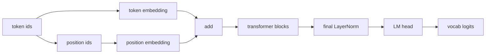

# GPT Model Assembly

> token embedding、learned position embedding、12個の block、final LayerNorm、重み共有された LM head を組み合わせると、124M parameter の GPT-2 small 形状になります。

**種別:** Build
**言語:** Python
**前提条件:** Phase 19 lessons 30-34
**所要時間:** 約90分

## 学習目標
- Lesson 34 の block を token/position embedding と LM head で包み、完全な GPT model を作る。
- GPT-2 small の構成 `vocab=50257, context=1024, d_model=768, heads=12, layers=12` を再現する。
- LM head と token embedding の weight tying を実装し、約3800万 parameter を節約する理由を説明する。
- temperature、top-k、multinomial sampling で autoregressive generation を行う。
- parameter count と forward shape を 124M 目標と比較する。

## モデル構成
入力 token ids は token embedding と position embedding に変換され、足し合わされて block stack に入ります。最後に final LayerNorm を通し、LM head が vocabulary logits を出します。LM head の重みを token embedding と同じ tensor にすると weight tying になります。

## generation
各 step で最後の位置の logits だけを取り出し、temperature で割り、必要なら top-k 以外を `-inf` に mask して softmax し、multinomial で次 token を sampling します。生成列が context length を超えたら古い token を捨て、active window を保ちます。

## production pattern
residual add に直接入る attention output projection と MLP の2つ目の linear は、標準偏差を `1 / sqrt(2 * num_layers)` で小さく初期化します。深さとともに residual stream が膨らむのを防ぐためです。position ids は毎回 `torch.arange` せず、buffer にして slice します。

## 実装
`GPTConfig`、`GPTModel`、`count_parameters`、`top_k_filter`、`generate` を実装します。デモは 124M config の parameter count と tiny config の generation を表示し、weight tying が storage を共有していることを確認します。
