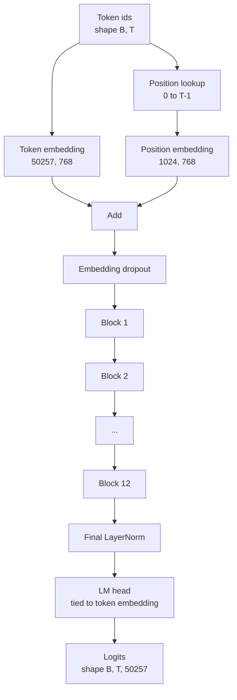
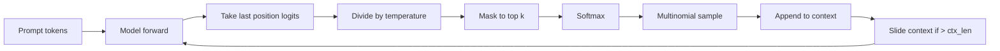

# GPT Model Montajı

> Yığılmış on iki blok, bir token embedding, öğrenilmiş bir konum embedding, son bir LayerNorm ve bağlı bir dil modeli kafası. 124 milyon parametreli GPT modelinin tamamı budur. Bu ders, bu parçaları bir işçi sınıfı halinde birleştirir, modelin referans 124M şekliyle eşleştiğini doğrulamak için parametreleri sayar ve çok terimli örnekleme, sıcaklık ve top-k ile metin üretir.

**Tür:** Yapım
**Diller:** Python
**Önkoşullar:** Aşama 19 dersleri 30'dan 34'e
**Süre:** ~90 dakika

## Öğrenme Hedefleri

- Ders 34'teki transformer bloğunu tam bir GPT modeline birleştirin: token embedding, konum embedding, N bloklar, son LayerNorm, dil modeli başlığı.
- 124 milyon parametre konfigürasyonunu yeniden oluşturun: vocab 50257, bağlam 1024, embedding 768, on iki başlık, on iki katman.
- Dil modeli kafa ağırlıklarını token embedding'ye bağlayın ve bunun neden bu ölçekte ~38 milyon parametre tasarrufu sağladığını açıklayın.
- Çok terimli örnekleme, sıcaklık ölçekleme ve üst-k kesme ile bir prompt'dan metin oluşturun ve bağlam uzunluğunu kayan bir pencereyle koruyun.
- 124M hedefine göre parametre sayısını ve ileri geçiş maliyetini ölçün.

## Sorun

Bir transformer bloğu kendi başına hiçbir şey yapmaz. token kimliklerini vektörlere dönüştürmeniz, konumsal bilgileri karıştırmanız, bunları yığında çalıştırmanız ve sözcük logitlerine geri yansıtmanız gerekir. Bu dört adımdan herhangi birini unutun; model ya ilerleyemez, konum bilgisinde sürüklenir ya da konuşamaz.

Modelin şekli de önemlidir. Referans GPT-2 küçük, tam olarak yukarıdaki konfigürasyonda 124 milyon parametredir. Rakamlar sihirli değil. Vocab 50257 çarpı embedding 768 token tablosudur. Pozisyon 1024 çarpı 768 pozisyon tablosudur. Her biri kabaca 7 milyon parametreden oluşan on iki bloğun değeri 84 milyondur. Son kafa, ağırlık bağlama yoluyla token tablasını yeniden kullanır. Parçaları toplayınca 124 milyona ulaşıyorsunuz. Parametre sayısı referansla eşleşmeyen bir model oluşturmak, bir şeyleri yanlış bağladığınızın işaretidir.

## Konsept



Token kimlikleri token vektörüne dönüşür. Konum kimlikleri konum vektörleri haline gelir. İkisi eklenir ve yığına gönderilir. Son LayerNorm, blokların dışında her modern varyanttan sağ çıkan tek parçadır. LM kafası, ağırlık bağlamanın anlamı olan token embedding matrisini yeniden kullanır.

### Ağırlık bağlama

token embedding, `(vocab, d_model)` şekline sahiptir. Dil modeli kafasının `d_model` 'den `vocab`'ye geri yansıtması gerekiyor. Bunlar birbirinin devriğidir. İkisini bağlamak, kelimenin tam anlamıyla aynı parametre tensörünün iki kez kullanılması anlamına gelir. Vocab 50257 ve d_model 768'de matris 38 milyon parametredir. Çözüldüğünde, bunun bedelini iki kez ödersiniz. Bağlandığında, bunun için bir kez ödeme yaparsınız ve ayrıca biraz daha temiz bir gradient sinyali alırsınız çünkü embedding ve başlık birlikte güncellenir.

### embedding konumu öğrenilir, sinüzoidal değil

GPT-2 öğrenilmiş bir konum embedding gönderir. Konum tablosu `(1024, 768)` şeklindeki bir parametre tensörüdür. Model, her ileriye doğru 0'dan T-1'e kadar olan konumu arar ve aramayı token embedding'ye ekler. Bu, konum şemalarının en basitidir (RoPE, ALiBi, T5 göreceli önyargı alternatiflerdir) ve 124M referansının kullandığı şeydir.

### Nesil: sıcaklık, üst-k, çok terimli

Nesil otoregresiftir. Model, her adımda, her konumdaki tüm kelime dağarcığının logitlerini döndürür. Yalnızca son konumu alırsınız, sıcaklığa bölersiniz, isteğe bağlı olarak üst k logitleri hariç tümünü negatif sonsuza kadar maskelersiniz, olasılıkları elde etmek için softmax'ı kullanırsınız ve elde edilen dağılımdan bir token örneği alırsınız.



Üç düğme, üç farklı davranış. Sıfıra yakın sıcaklık açgözlülüğe dönüşür. Birinci sıcaklık modelin doğal dağılımına uyuyor. Top-k açgözlüdür. Top-k kırk uzun kuyruğu filtreler. Kombinasyonlar önemlidir; Eğitimle ilgili bir sonraki ders, üretimi niteliksel bir değerlendirme sinyali olarak kullanıyor.

## Build It — Kendin Geliştir

`code/main.py` şunu uygular:

- 124M varsayılanlarına sahip `class GPTConfig` veri sınıfı: `vocab_size=50257`, `context_length=1024`, `d_model=768`, `num_heads=12`, `num_layers=12`, `mlp_expansion=4`, `dropout=0.1`, `use_bias=True`, `weight_tying=True`.
- token embedding, konum embedding, embedding bırakma, on iki `TransformerBlock`, son LayerNorm ve bayrak ayarlandığında token embedding'ye bağlanan bir `lm_head` ile `class GPTModel` .
- Benzersiz parametre sayısını döndüren bir `count_parameters` yardımcı (böylece sayımda ağırlık bağlama dikkate alınır).
- Sıcaklık, üst-k, çok terimli ve kayan pencere bağlamını yapan bir `generate` işlevi.
- Modeli oluşturan, parametre sayısını referans 124M'nin yanına yazdıran ve boru hattını uçtan uca göstermek için sabit bir prompt'dan kısa bir dizi oluşturan bir demo.

Çalıştır:

```bash
python3 code/main.py
```

Çıktı: 124M referansının yanı sıra parametre sayımı, rastgele bir prompt'den oluşturulan token kimlikleri ve bağlama açıkken LM kafası ve token embedding depolamayı paylaştığının onayı.

Demoyu hızlı tutmak için, komut dosyası ayrıca küçük bir yapılandırmayı (`d_model=64`, `num_layers=2`) uçtan uca çalıştırır ve oluşturulan token dizisini satır içi olarak yazdırır. 124M yapılandırması oluşturuldu ancak yalnızca parametre sayımı ve bir ileri geçiş uygulandı.

## Yığın

- Tensör matematiği, otograd ve modül tesisatı için `torch` .
- `code/main.py` , 34. dersteki aynı blok modelini yerel olarak yeniden uygular.

## Vahşi doğada üretim modelleri

Çalışan bir model ile gönderilen bir model arasındaki farkı üç desen oluşturur.

**Artık projeksiyonları küçük başlatın.** Dikkatin çıktı projeksiyonu ve MLP'nin ikinci doğrusalının her ikisi de doğrudan bir artık eklemeyi besler. Bunların diğer tüm doğrusallarla aynı standart sapmaya sahip olarak başlatılması, derinlikle birlikte büyüyen ve son LayerNorm'u sıcak bir rejime iten artık bir akış sağlar. Bu iki projeksiyon için std'yi `1 / sqrt(2 * num_layers)` kadar ölçeklendirin; kalan akış on iki katman boyunca makul bir aralıkta kalır.

**Konum kimliği tensörünü önbelleğe alın, yeniden hesaplamayın.** `torch.arange(T)` her iletmede yeni bellek ayırır. Maksimum bağlam için `__init__` 'de bir kez tahsis edin, çağrı başına ilk T girişini dilimleyin ve tahsis edici gidiş dönüşünü atlayın.

**Ağırlıkları yalnızca kopyalayarak değil, parametre düzeyinde bağlayın.** `lm_head.weight = token_embedding.weight` ayarı tensörü paylaşır; kopyalama işe yaramaz. Optimize edicinin bir parametreyi güncellemesi gerekir ve otograd grafiğin bir birikime ihtiyacı vardır. Kopyalarsanız kafanız embedding'dan uzaklaşır ve ağırlık bağlamak size hiçbir şey kazandırmaz.

## Use It — Hazır Araçla Uygula

- Bu dersteki model sınıf, bir sonraki derste işlenecek olanla aynı şekildedir.
- Öğrenilen embedding pozisyonunu RoPE ile değiştirmek, bloğa veya kafaya dokunmadan LLaMA ailesini elde etmenizi sağlar.
- GELU'yu SiLU ve LayerNorm'u RMSNorm ile değiştirmek, LLaMA ailesi değişikliklerinin geri kalanını elde etmenizi sağlar.
- Oluşturma işlevi yalnızca bu modelle değil, herhangi bir logits kaynağıyla çalışır. 37. derste önceden eğitilmiş bir GPT-2 dosyasından logitleri çekebilir ve aynı nesil döngüyü yeniden kullanabilirsiniz.

## Egzersizler

1. LM kafasını token embedding'dan çözün ve parametreleri yeniden sayın. Deltanın 50257 çarpı 768 = 38 milyon olduğunu doğrulayın.
2. Öğrenilen konumu embedding inşaat sırasında hesaplanan sinüzoidal tabloyla değiştirin. Modelin hala ileri olduğunu doğrulayın ve parametre sayısı 786.432'ye düşer.
3. Üretime örneklemeyi atlayan ve argmax'ı seçen bir `greedy=True` bayrağı ekleyin. Sıranın çalıştırmalar arasında deterministik olduğunu doğrulayın.
4. prompt veya oluşturulan geçmiş içindeki herhangi bir token'ın logitini softmax'tan önceki bir sabite bölen bir `repetition_penalty` düğmesi ekleyin. Birin üzerindeki değerlerin çıktıdaki tekrar sayısını azalttığını sabit bir prompt üzerinde gösterin.
5. `top_k`'nin yanına `top_p` (çekirdek) örneklemesini ekleyin. Tutulan token'ların olasılık toplamının `top_p`'yi aşıp aşmadığını iki satırlı kontrol edin.

## Anahtar Terimler

| Dönem | İnsanlar ne diyor | Aslında ne anlama geliyor |
|------|-----------------|------------------------|
| Ağırlık bağlama | "Berabere embedding'lar" | LM kafası ve token embedding aynı parametre tensörünü paylaşır; d_model parametrelerinin sözcük sürelerini kaydeder ve GPT-2 referansıyla eşleşir |
| Konum embedding | "Öğrenilen pozisyonlar" | token vektörlerine ayrı bir şekil tablosu (bağlam uzunluğu, d_model) eklendi; uçtan uca öğrendim |
| Kayar pencere bağlamı | "Bağlam başlığı" | prompt artı oluşturulan token'lar bağlam uzunluğunu aştığında, en eski token'lari bırakın, böylece aktif pencere |
| En iyi örnekleme | "K kesme" | K logitlerini en yüksek değerlerde tutun, geri kalanını negatif sonsuza maskeleyin, kalanın üzerinde softmax |
| Sıcaklık | "Örnekleme sıcaklığı" | Softmax'tan önce logitleri T'ye bölün; T'nin 1'den küçük olması keskinleştirir, T'nin 1'e eşit olması doğal dağılımı korur, T 1'den büyük olması düzleştirir |

## Daha Fazla Okuma

- Bu modelin yığınladığı blok için Aşama 19 ders 34.
- Bu modeli çapraz entropi kaybıyla çalıştıran eğitim döngüsü için Aşama 19 ders 36.
- Önceden eğitilmiş GPT-2 ağırlıklarının tam olarak bu mimariye yüklenmesi için Aşama 19 ders 37.
- Sonraki token tahmininin matematiği için Aşama 7 ders 07 (GPT nedensel dil modelleme).
- Aynı mimari üzerinde orijinal eğitim prosedürü için Aşama 10 ders 04 (eğitim öncesi mini GPT).
