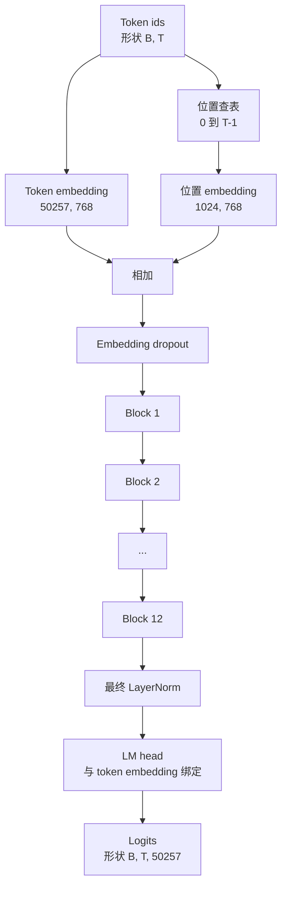

# GPT 模型组装（GPT Model Assembly）

> 译注：本文译自同目录 [`en.md`](./en.md)。术语遵循仓根 [TRANSLATION_GUIDE.md](../../../../TRANSLATION_GUIDE.md)。

> 十二个 block 堆叠起来，加上一个 token embedding（词嵌入）、一个学习得到的 position embedding（位置嵌入）、一个最终的 LayerNorm，再加上一个权重绑定（weight tying）的 language model head（语言模型头）。这就是整个 1.24 亿参数的 GPT 模型的全部内容。本节课把这些零件组装成一个能跑的类，统计参数量来确认模型形状与参考的 124M 一致，并使用多项式采样、temperature 和 top-k 来生成文本。

**Type:** Build
**Languages:** Python
**Prerequisites:** Phase 19 lessons 30 to 34
**Time:** ~90 分钟

## 学习目标（Learning Objectives）

- 把第 34 课的 transformer block 组装成完整的 GPT 模型：token embedding、position embedding、N 个 block、最终的 LayerNorm、language model head。
- 复现 1.24 亿参数的配置：vocab 50257、context 1024、embedding 768、十二个 head、十二层。
- 把 language model head 的权重绑定到 token embedding 上，并解释为什么这能在这一规模上节省约 3800 万参数。
- 使用多项式采样、temperature 缩放和 top-k 截断从 prompt 生成文本，并用滑动窗口控制上下文长度。
- 测量参数量和一次前向传播的开销，与 124M 这一目标对照。

## 问题（The Problem）

一个 transformer block 单独是什么也做不了的。你得把 token id 变成向量、把位置信息混进去、让它们跑过整个 block 栈、再投影回到词表的 logits。这四步少做任何一步，模型要么前向都跑不通，要么位置信息漂移，要么压根说不出话。

模型的形状也很关键。参考的 GPT-2 small 在上面给出的那一组配置下恰好是 1.24 亿参数。这些数字不是凭空冒出来的。Vocab 50257 乘以 embedding 768 是 token 表。Position 1024 乘以 768 是位置表。十二个 block 每个大约 700 万参数，合起来 8400 万。最终的 head 通过权重绑定（weight tying）复用 token 表。把这些零件加起来正好是 1.24 亿。如果你搭出来的模型参数量对不上参考值，那就是哪里接错线的信号。

## 概念（The Concept）



Token id 变成 token 向量。Position id 变成位置向量。两者相加之后送进整个 block 栈。最终的 LayerNorm 是 block 之外、几乎所有现代变体都保留下来的那一块。LM head 复用 token embedding 矩阵，这就是 weight tying 的含义。

### 权重绑定（Weight tying）

Token embedding 的形状是 `(vocab, d_model)`。Language model head 需要把 `d_model` 投影回 `vocab`。这俩是彼此的转置。把它们绑定起来，意思就是字面意义上同一份参数张量，被使用了两次。在 vocab 50257、d_model 768 的情况下，这个矩阵有 3800 万参数。不绑，你要为它付两次费。绑了，你只付一次费，并且因为 embedding 和 head 一起更新，梯度信号还会更干净一点。

### 位置嵌入是学出来的，不是正弦函数（Position embedding is learned, not sinusoidal）

GPT-2 用的是学习得到的位置嵌入。位置表是一个形状为 `(1024, 768)` 的参数张量。模型在每次前向时查表取出位置 0 到 T-1，加到 token embedding 上。这是位置方案里最简单的一种（其他可选方案有 RoPE、ALiBi、T5 相对偏置），也是 124M 参考所用的那种。

### 生成：temperature、top-k、多项式采样（Generation: temperature, top-k, multinomial）

生成是 autoregressive 的。每一步，模型对全词表、每个位置都返回 logits。你只取最后一个位置的 logits、除以 temperature、可选地把除了 top k 之外的 logits 全 mask 成负无穷、softmax 得到概率，然后从这个分布里采样一个 token。


三个旋钮，三种不同行为。Temperature 趋近 0 会塌缩到贪心。Temperature 等于 1 与模型本来的分布一致。Top-k 等于 1 就是贪心。Top-k 取 40 会把长尾过滤掉。这些组合很重要；下一节关于训练的课会用生成来做定性的评估信号。

## 动手实现（Build It）

`code/main.py` 实现：

- `class GPTConfig` 数据类，包含 124M 的默认值：`vocab_size=50257`、`context_length=1024`、`d_model=768`、`num_heads=12`、`num_layers=12`、`mlp_expansion=4`、`dropout=0.1`、`use_bias=True`、`weight_tying=True`。
- `class GPTModel`，包含 token embedding、position embedding、embedding dropout、十二个 `TransformerBlock`、最终的 LayerNorm，以及当 flag 打开时绑定到 token embedding 的 `lm_head`。
- 一个 `count_parameters` 辅助函数，返回去重后的参数量（这样 weight tying 在计数中就被尊重了）。
- 一个 `generate` 函数，做 temperature、top-k、多项式采样和滑动窗口上下文。
- 一段 demo：构建模型、把参数量与参考的 124M 并排打印、从一个固定 prompt 出发生成一小段序列，端到端地展示整条流水线。

跑一下：

```bash
python3 code/main.py
```

输出：参数量与 124M 参考并排显示、从一个随机 prompt 生成的 token id，以及当 tying 开启时 LM head 与 token embedding 共享存储的确认。

为了让 demo 跑得快，脚本还会用一个微型配置（`d_model=64`、`num_layers=2`）端到端跑一遍，并把生成的 token 序列内联打印出来。124M 那个配置会被构建，但只会被用来统计参数量和跑一次前向。

## Stack

- `torch` 提供张量数学、autograd 和 module 管线。
- `code/main.py` 在本地复刻了第 34 课里同样的 block 模式。

## 真实世界中的生产模式（Production patterns in the wild）

有三个模式决定了「能跑的模型」和「能上线的模型」之间的差距。

**把残差投影初始化得小一些。** Attention 的输出投影和 MLP 的第二个 linear 都是直接接到一个残差加法上。如果你用和其他 linear 一样的标准差初始化它们，残差流会随深度增长，把最终的 LayerNorm 推到一个过热的状态。把这两个投影的 std 缩放成 `1 / sqrt(2 * num_layers)`；残差流穿过十二层之后还能保持在一个合理的范围里。

**缓存 position id 张量，不要重新计算。** `torch.arange(T)` 在每次前向都会分配新内存。在 `__init__` 里按最大 context 一次性分配好，每次调用时切前 T 项，省掉走分配器一圈。

**在参数层面绑权重，而不是仅仅靠拷贝。** `lm_head.weight = token_embedding.weight` 是共享同一个张量；拷贝不是。optimizer 只需要更新一份参数，autograd 图也只需要一次累积。如果你用拷贝，head 会从 embedding 漂走，weight tying 也就什么都没买到。

## 用起来（Use It）

- 这节课里的 model 类，形状和下一课要训练的那个一模一样。
- 把学习得到的 position embedding 换成 RoPE，你就得到了 LLaMA 系列，而不需要动 block 或者 head。
- 把 GELU 换成 SiLU、把 LayerNorm 换成 RMSNorm，你就得到了 LLaMA 系列剩下的那些改动。
- 这个 generation 函数对任何 logits 源都能用，不只是这个模型。在第 37 课你可以从 GPT-2 预训练文件里把 logits 拉出来，复用同一个生成循环。

## 练习（Exercises）

1. 把 LM head 从 token embedding 上解绑，重新数参数。验证差值是 50257 乘以 768 = 3800 万。
2. 把学习得到的 position embedding 换成在构建时计算好的正弦表。确认模型仍然能前向，参数量减少 786,432。
3. 给 generation 加一个 `greedy=True` flag，跳过采样、直接取 argmax。确认序列在多次运行间是确定的。
4. 加一个 `repetition_penalty` 旋钮，在 softmax 之前把 prompt 或者已生成历史里出现过的任何 token 的 logit 除以一个常数。在固定 prompt 上展示：取大于 1 的值能减少输出里的重复次数。
5. 在 `top_k` 旁边再加一个 `top_p`（nucleus）采样。用两行检查保留下来的 token 的概率之和超过 `top_p`。

## 关键术语（Key Terms）

| 术语 | 大家的说法 | 它实际的意思 |
|------|-----------------|------------------------|
| Weight tying | 「Tied embeddings」 | LM head 和 token embedding 共享同一个参数张量；省下 vocab 乘以 d_model 个参数，并且与 GPT-2 参考一致 |
| Position embedding | 「Learned positions」 | 一个独立的、形状为 (context length, d_model) 的表，加到 token 向量上；端到端学出来 |
| Sliding window context | 「Context cap」 | 当 prompt 加上已生成的 token 超过 context length 时，丢掉最旧的 token，让活动窗口能放得下 |
| Top-k sampling | 「K 截断」 | 保留 K 个最高的 logit、把其余的 mask 成负无穷、对剩下的做 softmax |
| Temperature | 「采样温度」 | 在 softmax 之前把 logits 除以 T；T 小于 1 锐化、T 等于 1 保持自然分布、T 大于 1 摊平 |

## 延伸阅读（Further Reading）

- Phase 19 lesson 34，本模型堆叠的那个 block。
- Phase 19 lesson 36，用交叉熵 loss 驱动这个模型的训练循环。
- Phase 19 lesson 37，把 GPT-2 预训练权重加载到这个完全相同的架构里。
- Phase 7 lesson 07（GPT causal language modeling），下一 token 预测的数学。
- Phase 10 lesson 04（pre training mini GPT），同一架构上的最初训练流程。
