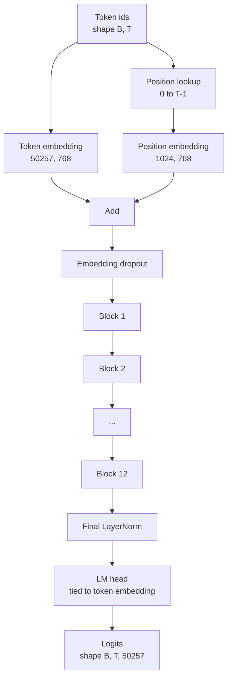
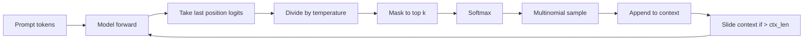

# 35 · GPT 模型组装

> 十二个 Block 叠在一起，一个 Token 嵌入，一个可学习的位置嵌入，一个最后的 LayerNorm，再加上一个与 Token 嵌入权重绑定的语言模型头。这就是完整的 1.24 亿参数 GPT 模型。本课将这些组件组装成一个可运行的类，统计参数数量以确认模型与参考的 124M 规模一致，并用多项分布采样（Multinomial Sampling）、温度（Temperature）与 Top-k 来生成文本。

**类型：** 构建
**语言：** Python
**前置：** 第十九阶段第 30 至 34 课
**时长：** 约 90 分钟

## 学习目标

- 将第 34 课的 Transformer Block 组装成完整的 GPT 模型：Token 嵌入、位置嵌入、N 个 Block、最后的 LayerNorm、语言模型头。
- 复现 1.24 亿参数配置：词表大小 50257、上下文长度 1024、嵌入维度 768、十二个注意力头、十二层。
- 将语言模型头权重与 Token 嵌入绑定（Tie），并解释为什么在此规模下能节省约 3800 万参数。
- 从提示词（Prompt）出发，使用多项分布采样、温度缩放与 Top-k 截断来生成文本，并以滑动窗口保持上下文长度。
- 测量参数数量与前向传播开销，与 124M 目标做对比。

## 问题

一个 Transformer Block 本身什么也做不了。你需要将 Token ID 转为向量、混入位置信息、将它们送入堆叠的 Block，再投影回词表 Logits。这四步哪怕漏掉一个，模型要么无法前向传播，要么位置信息发生漂移，要么根本无法输出。

模型的形状同样关键。参考 GPT-2 Small 精确地以上述配置达到 1.24 亿参数。这些数字并非魔法：词表 50257 乘嵌入 768 就是 Token 表；位置 1024 乘 768 就是位置表；十二个 Block 各约 700 万参数，合计 8400 万；最后的 LM Head 通过权重绑定复用 Token 表。把这些加在一起就是 1.24 亿。如果你构建出的模型参数数量与参考值对不上，说明你接错了某条线。

## 概念



Token ID 变成 Token 向量。位置 ID 变成位置向量。两者相加后送入堆叠的 Block。最后的 LayerNorm 是唯一存在于 Block 之外、且在各类现代变体中都得以保留的组件。LM Head 复用 Token 嵌入矩阵，这就是权重绑定（Weight Tying）的含义。

### 权重绑定

Token 嵌入的形状是 `(vocab, d_model)`，而语言模型头需要从 `d_model` 投影回 `vocab`。两者互为转置。权重绑定意味着它们共享同一个参数张量，被使用了两次。在词表 50257、d_model 768 的情况下，这个矩阵是 3800 万参数。如果不绑定，你需要为它付出两份参数的代价；绑定了，只需一份，并且梯度信号会更干净，因为嵌入和 LM Head 是同步更新的。

### 位置嵌入是可学习的，而非正弦式

GPT-2 使用的是可学习的位置嵌入（Learned Position Embedding）。位置表是形状为 `(1024, 768)` 的一个参数张量。每次前向传播时，模型查找位置 0 到 T-1 的嵌入并将其加到 Token 嵌入上。这是所有位置编码方案中最简单的一种（RoPE、ALiBi、T5 相对偏置是其他替代方案），也是 124M 参考实现所采用的方案。

### 生成：温度、Top-k、多项分布

生成过程是自回归的。每一步，模型返回所有位置上完整词表的 Logits。你只取最后一个位置的 Logits，除以温度，可选地将 Top-k 之外的所有 Logits 掩码为负无穷，做 Softmax 得到概率，然后从结果分布中采样一个 Token。



三个旋钮，三种不同的行为。温度趋近于零时退化为贪心解码（Greedy）。温度等于 1 时匹配模型的自然分布。Top-k 为 1 就是贪心。Top-k 为 40 则过滤掉长尾。这些组合很关键；下一课关于训练的章节中，生成将被用作定性的评估信号。

## 动手构建

`code/main.py` 实现了：

- `class GPTConfig` 数据类，包含 124M 默认值：`vocab_size=50257`、`context_length=1024`、`d_model=768`、`num_heads=12`、`num_layers=12`、`mlp_expansion=4`、`dropout=0.1`、`use_bias=True`、`weight_tying=True`。
- `class GPTModel`，包含 Token 嵌入、位置嵌入、Embedding Dropout、十二个 `TransformerBlock`、最后的 LayerNorm，以及一个在标志位开启时与 Token 嵌入绑定的 `lm_head`。
- 一个 `count_parameters` 辅助函数，返回唯一参数数量（这样权重绑定会在统计中得到体现）。
- 一个 `generate` 函数，实现了温度、Top-k、多项分布采样以及滑动窗口上下文。
- 一个 Demo：构建模型、打印参数数量并与 124M 参考值对比、从固定 Prompt 生成一段短序列，以展示端到端流程。

运行方式：

```bash
python3 code/main.py
```

输出：与 124M 参考值并列的参数数量、从随机 Prompt 生成的 Token ID 序列，以及一个确认信息——当权重绑定开启时 LM Head 与 Token 嵌入共享存储。

为了保持 Demo 的运行速度，脚本还会用一个小配置（`d_model=64`、`num_layers=2`）做端到端运行，并将生成的 Token 序列内联打印出来。124M 配置会被构建，但只执行参数计数和一次前向传播。

## 技术栈

- `torch` 用于张量运算、自动微分和模块搭建。
- `code/main.py` 在本地重新实现了第 34 课中相同的 Block 模式。

## 生产环境中的模式

以下三个模式决定了模型是"能跑"还是"能上线"。

**用较小的标准差初始化残差投影。** 注意力层的输出投影和 MLP 的第二层线性变换都直接馈入残差加法。如果以与其他线性层相同的标准差初始化它们，残差流会随着深度增长，将最后的 LayerNorm 推入不稳定的工作区间。对这两个投影以 `1 / sqrt(2 * num_layers)` 缩放标准差，残差流就能在十二层中保持在合理范围内。

**缓存位置 ID 张量，不要重复计算。** `torch.arange(T)` 每次前向传播都会分配新内存。在 `__init__` 中为最大上下文长度分配一次，每次调用时截取前 T 项，避免内存分配器的往返开销。

**在参数层面绑定权重，而不是靠复制。** 设置 `lm_head.weight = token_embedding.weight` 是共享张量；复制则不是。优化器需要更新同一份参数，自动微分的计算图也需要同一个累积节点。如果只是复制，LM Head 就会与嵌入渐行渐远，权重绑定变得毫无意义。

## 使用场景

- 本课的模型类在形状上与下一课将要训练的模型完全相同。
- 将可学习的位置嵌入替换为 RoPE，就能在不改动 Block 和 LM Head 的前提下得到 LLaMA 系列模型。
- 将 GELU 替换为 SiLU、将 LayerNorm 替换为 RMSNorm，就能完成 LLaMA 系列余下的改动。
- 生成函数适用于任意 Logits 来源，不仅限于这个模型。你可以在第 37 课中从预训练的 GPT-2 文件拉取 Logits，并复用相同的生成循环。

## 练习

1. 将 LM Head 与 Token 嵌入解绑，重新统计参数。验证差值恰好为 50257 乘 768 = 3800 万。
2. 将可学习的位置嵌入替换为在构造时计算的正弦位置表。确认模型仍能前向传播，且参数数量减少 786,432。
3. 为生成函数添加一个 `greedy=True` 标志位，跳过采样直接取 argmax。确认同一 Prompt 在多次运行中产生的序列是确定性的。
4. 添加一个 `repetition_penalty` 旋钮：在 Softmax 之前，将 Prompt 或已生成历史中出现的 Token 的 Logit 除以一个常数。用固定 Prompt 展示当该值大于 1 时输出中的重复次数降低。
5. 在 `top_k` 旁边添加 `top_p`（核采样，Nucleus Sampling）。用两行代码检查保留 Token 的概率之和是否超过 `top_p`。

## 关键术语

| 术语 | 常见说法 | 实际含义 |
|------|---------|---------|
| 权重绑定（Weight Tying） |「绑定嵌入」 | LM Head 与 Token 嵌入共享同一个参数张量；节省 vocab × d_model 个参数，与 GPT-2 参考实现一致 |
| 位置嵌入（Position Embedding） |「可学习的位置」 | 一个形状为 (上下文长度, d_model) 的独立表，加到 Token 向量上；端到端学习 |
| 滑动窗口上下文（Sliding Window Context） |「上下文上限」 | 当 Prompt 加已生成 Token 超出上下文长度时，丢弃最旧的 Token，使活动窗口不越界 |
| Top-k 采样（Top-k Sampling） |「K 截断」 | 保留 Logits 值最高的 K 项，其余掩码为负无穷，在剩余项上做 Softmax |
| 温度（Temperature） |「采样温度」 | 在 Softmax 前将 Logits 除以 T；T < 1 使分布更尖锐，T = 1 保持自然分布，T > 1 使分布更平坦 |

## 扩展阅读

- 第十九阶段第 34 课：本模型所堆叠的 Block。
- 第十九阶段第 36 课：使用交叉熵损失驱动本模型的训练循环。
- 第十九阶段第 37 课：将预训练的 GPT-2 权重加载到这一完全相同的架构中。
- 第七阶段第 07 课（GPT 因果语言建模）：下一个 Token 预测的数学原理。
- 第十阶段第 04 课（预训练 Mini GPT）：在同一架构上的原始训练流程。
