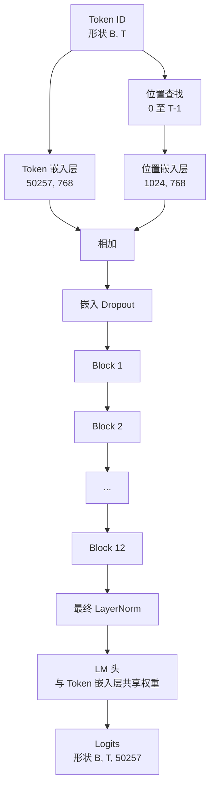

# GPT 模型组装

> 十二个 Transformer 块堆叠、一个 Token 嵌入层、一个可学习的位置嵌入层、一个最终 LayerNorm 层，以及一个共享权重的语言模型头。这就是完整的 1.24 亿参数 GPT 模型。本课将这些部件组装成一个可工作的类，统计参数数量以确认模型符合参考的 124M 规格，并通过多项式采样、温度和 top-k 策略生成文本。

**类型：** 构建
**语言：** Python
**前置要求：** 阶段 19 第 30 至 34 课
**时长：** ~90 分钟

## 学习目标

- 将第 34 课的 Transformer 块组装成完整的 GPT 模型：Token 嵌入层、位置嵌入层、N 个块、最终 LayerNorm、语言模型头。
- 复现 1.24 亿参数配置：词表 50257、上下文长度 1024、嵌入维度 768、12 个注意力头、12 层。
- 将语言模型头权重与 Token 嵌入层绑定（权重共享），并解释为何在此规模下能节省约 3800 万参数。
- 从提示词出发，通过多项式采样、温度缩放和 top-k 截断生成文本，并用滑动窗口维持上下文长度。
- 衡量参数量和前向传播成本，对标 124M 目标。

## 问题

一个 Transformer 块自身无法完成任何工作。你需要将 Token ID 转换为向量、融入位置信息、让它们通过堆叠的模块，再投影回词表上的 logits。上述四个步骤中遗漏任何一步，模型要么无法前向传播，要么丢失位置信息，要么无法输出语言。

模型的尺寸同样重要。参考的 GPT-2 small 在上述配置下恰好是 1.24 亿参数。这些数字并非魔法。词表大小 50257 乘以嵌入维度 768 就是 Token 表。位置长度 1024 乘以 768 是位置表。十二个块，每个大约 700 万参数，合计 8400 万。最终的输出头通过权重共享复用了 Token 表。把各部分加起来，你正好得到 1.24 亿。如果构建出来的模型参数数量与参考值不匹配，说明某个地方接错了。

## 概念


```mermaid
flowchart TB
  T[Token ID<br/>形状 B, T] --> E[Token 嵌入层<br/>50257, 768]
  T --> P[位置查找<br/>0 至 T-1]
  P --> PE[位置嵌入层<br/>1024, 768]
  E --> A[相加]
  PE --> A
  A --> D[嵌入 Dropout]
  D --> B1[Block 1]
  B1 --> B2[Block 2]
  B2 --> Bk[...]
  Bk --> B12[Block 12]
  B12 --> L[最终 LayerNorm]
  L --> H[LM 头<br/>与 Token 嵌入层共享权重]
  H --> O[Logits<br/>形状 B, T, 50257]
```

Token ID 变成 Token 向量。位置 ID 变成位置向量。两者相加后送入堆叠的块。最终 LayerNorm 是唯一一个存在于块外、在所有现代变体中都被保留的组件。LM 头复用了 Token 嵌入矩阵——这就是权重共享的含义。

### 权重共享

Token 嵌入层的形状为 `(vocab, d_model)`。语言模型头需要从 `d_model` 投影回 `vocab`。两者互为转置。将两者绑定意味着使用同一个参数张量两次。词表大小为 50257、d_model 为 768 时，该矩阵有 3800 万参数。如果不绑定，你需要为它付两次代价。绑定之后，你只需付一次，并且由于嵌入层和输出头一起更新，你还能得到一个略微更干净的梯度信号。

### 位置嵌入是可学习的，而非正弦函数

GPT-2 采用可学习的位置嵌入。位置表是一个形状为 `(1024, 768)` 的参数张量。模型在每次前向传播时查找位置 0 到 T-1，并将查找结果加到 Token 嵌入上。这是最简单的位置方案（RoPE、ALiBi、T5 的相对偏置是替代方案），也是 124M 参考模型所使用的方案。

### 生成：温度、top-k、多项式采样

生成是自回归的。在每一步，模型返回完整词表上每个位置的 logits。你只取最后一个位置，除以温度，可以选择性地将除 top k 之外的所有 logits 掩码为负无穷，通过 softmax 得到概率，然后从该分布中采样一个 token。


```mermaid
flowchart LR
  P[提示词 Token] --> M[模型前向传播]
  M --> Last[取最后一个位置的 logits]
  Last --> T[除以温度]
  T --> K[掩码至 top k]
  K --> S[Softmax]
  S --> MN[多项式采样]
  MN --> A[追加到上下文]
  A --> Slide[超出上下文长度时滑动]
  Slide --> M
```

三个旋钮，三种不同的行为。温度接近 0 时退化为贪心策略。温度为 1 时与模型的自然分布一致。Top-k 为 1 时也是贪心。Top-k 为 40 时过滤掉长尾部分。这些组合很重要；下一节关于训练的课程将把生成作为定性的评估信号。

## 构建

`code/main.py` 实现了：

- `class GPTConfig` 数据类，包含 124M 默认配置：`vocab_size=50257`、`context_length=1024`、`d_model=768`、`num_heads=12`、`num_layers=12`、`mlp_expansion=4`、`dropout=0.1`、`use_bias=True`、`weight_tying=True`。
- `class GPTModel`，包含 Token 嵌入层、位置嵌入层、嵌入 Dropout、十二个 `TransformerBlock`、最终 LayerNorm，以及一个在设定标志时与 Token 嵌入层绑定的 `lm_head`。
- 一个 `count_parameters` 辅助函数，返回独立的参数量（因此权重共享在计数中得到体现）。
- 一个 `generate` 函数，实现温度、top-k、多项式采样和滑动窗口上下文。
- 一个演示程序：构建模型，打印参数量并与参考的 124M 进行对比，然后从一个固定提示词生成短序列以展示完整的端到端流程。

运行方式：

```bash
python3 code/main.py
```

输出：参数量及与 124M 参考值的对比、从随机提示词生成的 Token ID，以及 LM 头与 Token 嵌入层在启用权重共享时共享存储的确认。

为了让演示保持快速，脚本还会使用一个微型配置（`d_model=64`、`num_layers=2`）运行端到端流程，并内联打印生成的 Token 序列。124M 配置会被构建，但只执行参数计数和一次前向传播。

## 技术栈

- `torch`：张量计算、自动求导和模块基础设施。
- `code/main.py`：本地复现第 34 课相同的块模式。

## 生产环境中的实用模式

以下三个模式决定了模型是仅仅能跑起来还是能够真正交付使用。

**将残差投影的初始化设小。** 注意力的输出投影和 MLP 的第二个线性层都直接馈入残差相加。如果使用与其他线性层相同的标准差来初始化这两个投影，残差流会随着深度增长而膨胀，将最终 LayerNorm 推向一个不稳定的高值区间。对于这两个投影，将标准差缩放 `1 / sqrt(2 * num_layers)`；残差流就能在十二层中保持在一个合理的范围内。

**缓存位置 ID 张量，不要重复计算。** `torch.arange(T)` 在每次前向传播时都会分配新的内存。在 `__init__` 中为最大上下文长度一次性分配好，每次调用时切片取出前 T 个条目，从而跳过分配器的往返开销。

**在参数级别绑定权重，而不仅仅是复制。** 设置 `lm_head.weight = token_embedding.weight` 是共享张量；复制则不是。优化器需要更新一个参数，自动求导图也只需要一次累加。如果复制了，输出头会逐渐偏离嵌入层，权重共享就失去了意义。

## 使用

- 本课的模型类与下一课进行训练的模型具有相同的形态。
- 将可学习的位置嵌入替换为 RoPE，无需改动块或输出头，即可获得 LLaMA 系列的一部分改动。
- 将 GELU 替换为 SiLU、LayerNorm 替换为 RMSNorm，即可获得 LLaMA 系列的其余改动。
- 生成函数适用于任何 logits 来源，而不仅限于本模型。你可以从第 37 课的预训练 GPT-2 文件中取出 logits，复用同一个生成循环。

## 练习

1. 将 LM 头与 Token 嵌入层解绑，重新统计参数。验证差值为 50257 × 768 = 3800 万。
2. 将可学习位置嵌入替换为构建时计算的正弦位置表。确认模型仍能前向传播，且参数数量减少 786,432。
3. 在生成函数中添加 `greedy=True` 标志，跳过采样并直接取 argmax。确认序列在多次运行间是确定性的。
4. 添加一个 `repetition_penalty` 旋钮，在 softmax 之前将提示词或已生成历史中出现的任何 token 的 logit 除以一个常数。在固定提示词上展示：系数大于 1 时，输出中的重复次数减少。
5. 在 `top_k` 旁边添加 `top_p`（核采样）。用两行代码检查保留 token 的概率之和是否超过 `top_p`。

## 关键术语

| 术语 | 常见说法 | 实际含义 |
|------|----------|----------|
| 权重共享 (Weight tying) | "绑定嵌入" | LM 头与 Token 嵌入层共享同一个参数张量；节省词表大小乘以 d_model 个参数，并与 GPT-2 参考实现一致 |
| 位置嵌入 (Position embedding) | "可学习位置" | 一个形状为（上下文长度，d_model）的独立参数表，加到 Token 向量上；从头到尾端到端学习 |
| 滑动窗口上下文 (Sliding window context) | "上下文上限" | 当提示词加上已生成 token 超出上下文长度时，丢弃最旧的 token，使活动窗口保持适配 |
| Top-k 采样 (Top-k sampling) | "K 截断" | 保留数值最高的 K 个 logits，将其余掩码为负无穷，对剩余部分做 softmax |
| 温度 (Temperature) | "采样温度" | 在 softmax 之前将 logits 除以 T；T 小于 1 时分布更尖锐，T 等于 1 时保持自然分布，T 大于 1 时分布更平坦 |

## 扩展阅读

- 阶段 19 第 34 课：了解本模型堆叠的 Transformer 块。
- 阶段 19 第 36 课：使用交叉熵损失驱动本模型的训练循环。
- 阶段 19 第 37 课：将预训练的 GPT-2 权重加载到本精确架构中。
- 阶段 7 第 07 课（GPT 因果语言建模）：下一个 token 预测的数学原理。
- 阶段 10 第 04 课（预训练迷你 GPT）：同一架构上的原始训练流程。
