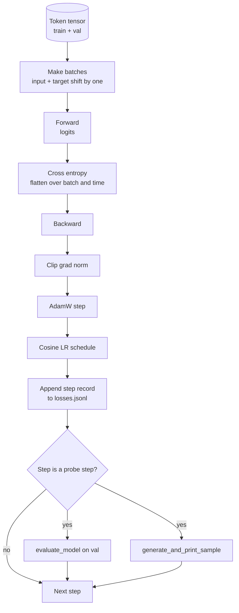

# Eğitim Döngüsü ve Değerlendirme

> Ölçmeyen bir döngü, yalan söyleyen bir döngüdür. Bu ders, GPT modelini yönlendiren eğitim döngüsünü oluşturur: ağırlık azalması bölmesine sahip AdamW, ısınma artı kosinüs öğrenme oranı çizelgesi, bir `calc_loss_batch` yardımcı, bekletilen verileri aktaran bir `evaluate_model` geçişi, her K adımda bir `generate_and_print_sample` nitel araştırma ve sonrasında grafiğini çizebileceğiniz bir JSONL kayıp günlüğü. Aynı iskelet, oluşturacağınız her LLM kod çözücüyü eğitir.

**Tür:** Yapım
**Diller:** Python
**Önkoşullar:** Aşama 19 dersleri 30 - 35
**Süre:** ~90 dakika

## Öğrenme Hedefleri

- Bir sonraki token tahmini için doğru girdi ve hedef hizalaması ile çapraz entropi kaybını hesaplayan bir eğitim döngüsü oluşturun.
- AdamW'ı, LayerNorm veya önyargı tensörlerine değil, ağırlık tensörlerine uygulanan ağırlık azalmasıyla yapılandırın.
- Doğrusal ısınma ve kosinüs azalması ile bir öğrenme hızı çizelgesi uygulayın ve sonuçta ortaya çıkan LR'yi zaman içinde okuyun.
- Değerlendirme kaybının çalıştırmalar arasında karşılaştırılabilir olması için `evaluate_model` ile uzatılmış bir bölünmeyi değerlendirin.
- Kayıp eğrisi yakalanmadan önce sapmayı yakalamak için her K adımda `generate_and_print_sample` ile niteliksel bir örnek oluşturun.
- JSONL'de adım başına kaybın devam etmesi sayesinde eğitim günlüğünü yeniden yükleyebilir, planlayabilir ve teslim edilebilir olarak gönderebilirsiniz.

## Sorun

Kaybı yazdıran ancak başka hiçbir şey yapmayan bir eğitim komut dosyası üç şekilde başarısız olur. Doğru nedenden dolayı kaybın azalıp azalmadığını size söyleyemez (model eğitim setine gereğinden fazla sığabilir ve asla öğrenemez). Bir ayrışmanın başlayıp başlamadığını size söyleyemez (kayıp bir adım yükselip iyileşebilir veya bir adım olup çökebilir). Modelin ne öğrendiğini size söyleyemez (kayıp bir skalerdir; oluşturulan örnek bir paragraftır). Döngü ölçüm yapmadığı sürece her üç hata da gizlenir.

Bu dersteki döngü üç yolu ölçer. Her adımda eğitim partisinde kayıp. Her K adımda bir uzatılan partide kayıp. Her K adımda bir sabit prompt'den oluşturulmuş bir devam. Eğitim günlüğü JSONL'ye ulaşır, böylece artifact döngünün ifadesi olur.

## Konsept



Belirgin olmayan iki parça, kayıp hizalaması ve AdamW bozunum bölünmesidir.

### Kayıp hizalaması

Model her konumda bir sonraki token'ı tahmin eder. Giriş grubu tokens `[t0, t1, t2, t3]` ise, hedef grup `[t1, t2, t3, t4]` olmalıdır. Çapraz entropi, düz hedefe `(batch * seq,)` karşı düz şekil `(batch * seq, vocab)` üzerinde hesaplanır. Değişimi unutun ve modeli kendisini tahmin edecek şekilde eğitirsiniz; bu da sıfır kayba yaklaşırken yararlı hiçbir şey öğrenmez.

### AdamW bozunum bölünmesi

Ağırlık azalması, ağırlık tensörlerini düzenler ancak normalleştirme ölçeklerini veya önyargılarını düzenlemez. LayerNorm ölçeğine çürüme koymak, ölçeği yavaş yavaş sıfıra sürükler ve normalleştirmeyi bozar. Çürümeyi önyargıya bağlamak matematiksel olarak zararsızdır ancak döngü israfıdır. Standart bölünme şu şekildedir: matris şeklindeki tensörler (doğrusal ağırlıklar, embedding tablolar) bozulmaya uğrar, ölçeğe veya kaymaya benzeyen herhangi bir şey bozulmaz.

### Isınma artı kosinüs programı

Isınma, öğrenme oranını birkaç yüz adımda sıfırdan hedefe yükseltir, böylece optimize edici durumunun doldurulması için zaman olur. Kosinüs bozunması, kalan adımlarda öğrenme oranını sıfıra doğru düşürür, böylece son aşama, ağırlıkları küçük bir adım boyutunda ince ayarlar. Kombinasyon, açık ağırlıklar LLM eğitiminde en yaygın programdır çünkü ilk bin adımdaki ve son bin adımdaki kırılgan anların çoğunu ortadan kaldırır.

### Yapılan değerlendirme

`evaluate_model` , doğrulama bölümünden sabit sayıda grup çalıştırır, kayıpları biriktirir, parti sayısına böler ve geri döner. Hayır gradient. Okuldan ayrılmak yok. Sayı, aynı tohum ve aynı bölünme verildiğinde çalıştırmalar arasında tekrarlanabilir. Eğitim kaybının yanında ertelenen kaybın raporlanması, aşırı uyumu nasıl tespit ettiğinizi gösterir.

### Erken bir sinyal olarak nitel örnekleme

Eğitim kaybı iyi bir şekilde düşen ancak oluşturulan örneklerin tümü aynı olan token bir model bozuldu. Kayıp eğrisi düz görünen ancak oluşturulan örnekleri tutarlı kelimelere dönüşen bir model öğrenmedir. Niteliksel prob, eğrinin tamamını okumaktan daha hızlı çalışır ve skalerin kaçırdığı modları yakalar.

## Build It — Kendin Geliştir

`code/main.py` şunu uygular:

- Uzun bir token tensörünü giriş ve hedef çiftlerine bölen `make_batches(token_ids, batch_size, context_length)` .
- `calc_loss_batch(model, inputs, targets)` skaler çapraz entropiyi iletir, düzleştirir ve döndürür.
- `evaluate_model(model, val_loader, max_batches)` , herhangi bir derece olmadan sabit sayıda doğrulama grubunu yineler ve ortalama kaybı döndürür.
- `generate_and_print_sample(model, prompt, max_new_tokens)` , ders 35 oluşturma fonksiyonunu sabit bir prompt üzerinde çalıştırır ve sonucu yazdırır.
- İki gruplu AdamW parametre listesini üreten `build_param_groups(model, weight_decay)` .
- `cosine_with_warmup(step, warmup_steps, total_steps, max_lr, min_lr)` , belirli bir adımda LR'yi döndürür.
- Döngüyü çalıştıran `train(...)` , `outputs/losses.jsonl` değerini sürdürür ve her `eval_every` adımda değerlendirme kaybını ve bir örneği yazdırır.
- Küçük bir modeli az sayıda adım için sentetik veriler üzerinde eğiten, bir JSONL günlüğü yazan ve değerlendirme kaybını ve araştırma noktalarında bir örneği yazdıran bir demo. Demo CPU'da bir dakikadan kısa sürede çalışır.

Çalıştır:

```bash
python3 code/main.py
```

Çıktı: adım kaybı hattı başına, her prob adımında kaybı değerlendirin, her prob adımında oluşturulan bir örnek ve satır başına `json.loads` ile yükleyebileceğiniz son bir `outputs/losses.jsonl` .

## Yığın

- Otomatik derecelendirme, optimize edici ve modüller için `torch` .
- `main.py` , 35. dersi `GPTModel` ve destekleyici modülleri yerel olarak yeniden uygular.

## Vahşi doğada üretim modelleri

Üç model, ders kitabı döngüsünü gece boyunca çalışır durumda bırakabileceğiniz bir şeye dönüştürür.

**Gradient norm kırpılması tartışılamaz.** Kötü bir grup (anormal veriler, LR artışı, sayısal uç durum), saatler süren eğitimi silip süpüren devasa bir gradient üretir. `backward` 'den sonra ve `step` 'den önce `torch.nn.utils.clip_grad_norm_(params, max_norm=1.0)` , optimize ediciyi güvenli bir aralıkta tutar. Kırpma değeri serbest bir parametredir; biri çoğu kurulumda hayatta kalan varsayılandır.

**Sürdürülebilir JSONL günlük kaydı, seçilmiş durum değil.** JSONL'deki `{"step": int, "train_loss": float, "lr": float}` satırı olarak adım başına kayıp kayıtları dayanıklıdır: herhangi bir kilitlenme okunabilir bir artifact bırakır, grep yapabilir, Python'un otuz satırıyla çizim yapabilir ve son adımı okuyarak eğitime devam edebilirsiniz. Turşu durumu, sizi, refactor'lar arasında kırılgan olan, dosyayı üreten tam modül düzenine bağlar.

**Sabit bir dilimden alınan toplu değerlendirmeleri yapın.** Doğrulama token'lar, anında değil, komut dosyası başlangıcında gruplara bölünür. Tekrarlanabilirlik, değerlendirme serilerinin çalışmadan çalışmaya aynı olmasına bağlıdır; aksi halde iki çalışma arasındaki değerlendirme kaybını karşılaştırmak, toplu karışıklığı model kadar ölçer.

## Use It — Hazır Araçla Uygula

- Bu dersteki döngü, 124M modelini gerçek veriler üzerinde eğiten iskeletin aynısıdır. Sentetik token tensörünü `datasets` tarzı bir yükleyiciyle değiştirin; döngü değişmeden çalışır.
- JSONL günlüğü, bir eğitim çalışmasını kanıta dönüştüren çıktıdır. Bir sonraki derste yeni eğitilmiş bir kontrol noktasını önceden eğitilmiş bir kontrol noktasıyla karşılaştırmak için bir tane kullanılacak.
- Niteliksel numune probu, skaler kaybın yerini alamayacağı her şeyi kapsar.

## Egzersizler

1. Ölçek ve önyargı parametrelerinin bozunma olmayan grupta yer aldığını ve doğrusal ve embedding ağırlıkların bozunma grubunda yer aldığını doğrulayan `weight_decay_groups()` birim testlerini ekleyin.
2. Demonun okunaklı bir şey üzerinde eğitilmesi için sentetik rastgele token'lari küçük bir metin dosyasındaki baytlarla değiştirin. Oluşturulan örneğin dosyada bulunan karakterleri kullandığını doğrulayın.
3. Kosinüs planına `max_lr` 'nin yüzde 10'luk bir `min_lr` tabanını ekleyin ve yeniden çizin.
4. JSONL günlüğüne ek olarak her `eval_every` adımda bir kontrol noktası kaydedin. Model durumunu ve optimize edici durumunu yeniden yükleyen bir `resume_from` bayrağı ekleyin.
5. Kaybın yanındaki adım başına verimi (saniyede tokens) günlüğe kaydedin ve sabit bir bantta kaldığını doğrulayın.

## Anahtar Terimler

| Dönem | İnsanlar ne diyor | Aslında ne anlama geliyor |
|------|-----------------|------------------------|
| Kayıp hizalaması | "Birer birer kaydır" | 0..T-1 konumlarına token'ları girin, 1..T konumlarına token'ları hedefleyin; çapraz entropi düzleştirilmiş şekillerde hesaplanır |
| Çürüme bölünmüş | "İki grup" | AdamW, ağırlık azalmasına ve ölçek veya önyargı tensörlerine sahip matris şekilli tensörler alır |
| Isınma | "Rampa" | Öğrenme oranı, optimize edici durumunun doldurulabilmesi için sabit sayıda adımla sıfırdan hedefine tırmanır |
| Grupları değerlendir | "Toplu partiler dağıtıldı" | Doğrulama token tensörünün sabit bir dilimi, komut dosyası başlangıcında bir kez dilimlenir ve her sondada aynı şekilde kullanılır |
| Niteliksel araştırma | "Örnek baskı" | Sabit bir prompt'dan kısa bir nesil, başarısızlık modlarını yakalamak için her K adımı yazdırdı; tek başına kayıp gizlenir |

## Daha Fazla Okuma

- Döngünün çalıştırdığı model için Aşama 19 ders 35.
- Önceden eğitilmiş ağırlıkların aynı modele yüklenmesi için Aşama 19 ders 37.
- Gerçek verilerle ilgili prosedür için Aşama 10 ders 04 (eğitim öncesi mini GPT).
- Çapraz entropi kaybının ötesinde daha geniş değerlendirme yüzeyi için Aşama 10 ders 10 (değerlendirme).
