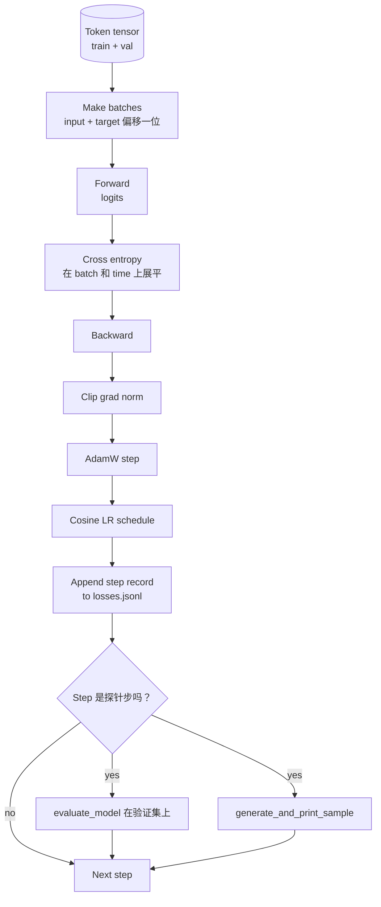

# 36 · 训练循环与评估

> 一个不度量的循环是一个会撒谎的循环。本课构建驱动 GPT 模型的训练循环：带权重衰减分组的 AdamW、热身加余弦学习率调度、`calc_loss_batch` 辅助函数、在留出数据上的 `evaluate_model` 评估环节、每 K 步一次的 `generate_and_print_sample` 定性探针，以及可供后续绘图的 JSONL 损失日志。同一套骨架可以训练你未来构建的任何解码器 LLM。

**类型：** 构建
**语言：** Python
**前置：** 第 19 阶段第 30 至 35 课
**时长：** 约 90 分钟

## 学习目标

- 构建训练循环，在正确的输入与目标对齐下为下一词元预测计算交叉熵（cross entropy）损失。
- 配置 AdamW，使权重衰减仅作用于权重张量，而不作用于 LayerNorm 或偏置张量。
- 实现带线性热身和余弦衰减的学习率调度，并读出任一步骤对应的学习率。
- 使用 `evaluate_model` 在留出验证集上评估，使评估损失在不同运行间可比较。
- 每 K 步用 `generate_and_print_sample` 生成定性样本，在损失曲线察觉之前就捕捉发散。
- 将每步损失持久化到 JSONL，以便重新加载、绘图并将训练日志作为交付件交付。

## 问题

只打印损失的训练脚本会在三个方面失效。它无法告诉你损失是否因为正确的原因在下降（模型可能只是过拟合训练集而从未真正学到东西）。它无法告诉你是否正在发生发散（损失可能在某一步飙升后又恢复，或者某一步之后彻底崩溃）。它无法告诉你模型学到了什么（损失是一个标量；生成的样本则是一段文字）。这三种失效都会隐匿，除非循环进行度量。

本课的循环用三种方式进行度量。每一步的训练批次损失。每 K 步在留出批次上的损失。每 K 步从固定提示词生成的续写文本。训练日志落地为 JSONL，这个产物就是循环的证词。

## 概念



有两个不那么显而易见的要点：损失对齐和 AdamW 衰减分组。

### 损失对齐

模型在每个位置预测下一词元。如果输入批次是词元 `[t0, t1, t2, t3]`，那么目标批次必须是 `[t1, t2, t3, t4]`。交叉熵在展平形状 `(batch * seq, vocab)` 上对展平目标 `(batch * seq,)` 计算。忘记这种位移，你就会让模型去预测自己，损失收敛到零却什么有用的东西都没学到。

### AdamW 衰减分组

权重衰减对权重张量进行正则化，但不对归一化的缩放因子或偏置生效。在 LayerNorm 的缩放因子上施加衰减会将其逐渐推向零，从而破坏归一化。在偏置上施加衰减在数学上无害，但纯属浪费算力。标准的分组是：矩阵形状的张量（线性层的权重、嵌入表）获得衰减，任何看起来像缩放或位移的参数不获得衰减。

### 热身加余弦调度

热身（warmup）在前几百步将学习率从零逐步提升到目标值，让优化器状态有时间建立起来。余弦衰减在剩余步数中将学习率逐渐降回接近零，使最后阶段以较小的步长微调权重。这一组合是开源权重 LLM 训练中最常见的调度，因为它消除了前一千步和最后一千步中大部分脆弱的时刻。

### 留出评估

`evaluate_model` 从验证划分中运行固定数量的批次，累积损失，除以批次数量并返回。没有梯度。没有 dropout。在相同的随机种子和相同的数据划分下，这个数值在不同运行间可复现。将留出损失与训练损失并排报告，是你发现过拟合的方式。

### 定性采样作为早期信号

一个训练损失平稳下降但生成样本全都是同一词元的模型是坏掉的。一个损失曲线看似平缓但生成样本逐渐锐化成连贯文字的模型正在学习。定性探针比读取完整曲线运行得更快，并能捕捉到标量损失遗漏的模式。

## 动手构建

`code/main.py` 实现：

- `make_batches(token_ids, batch_size, context_length)` — 将长词元张量切片为输入与目标对。
- `calc_loss_batch(model, inputs, targets)` — 前向传播、展平，并返回标量交叉熵。
- `evaluate_model(model, val_loader, max_batches)` — 在无梯度下迭代固定数量的验证批次，返回平均损失。
- `generate_and_print_sample(model, prompt, max_new_tokens)` — 对标第 35 课中的生成函数，在固定提示词上运行并打印结果。
- `build_param_groups(model, weight_decay)` — 生成两组 AdamW 参数列表。
- `cosine_with_warmup(step, warmup_steps, total_steps, max_lr, min_lr)` — 返回给定位步的学习率。
- `train(...)` — 运行循环，将 `outputs/losses.jsonl` 持久化，并每隔 `eval_every` 步打印评估损失和一次样本。
- 一个演示，在合成数据上训练一个小模型、运行少量步数、写出 JSONL 日志，并在各探针点打印评估损失和样本。该演示在 CPU 上不到一分钟就能跑完。

运行方式：

```bash
python3 code/main.py
```

输出：每步的损失行、每个探针步的评估损失、每个探针步的生成样本，以及一个最终的 `outputs/losses.jsonl` 文件，你可以按行用 `json.loads` 加载。

## 技术栈

- `torch` — 提供自动微分、优化器和模块。
- `main.py` — 在本地重新实现了第 35 课的 `GPTModel` 及其支撑模块。

## 真实世界中的生产级模式

三种模式将教科书式的循环变成你可以放着跑一晚上的东西。

**梯度范数裁剪不可省略。** 一个差的批次（异常数据、学习率尖峰、数值边界情况）会产生巨大的梯度，毁掉数小时的训练成果。在 `backward` 之后、`step` 之前调用 `torch.nn.utils.clip_grad_norm_(params, max_norm=1.0)` 可以将优化器保持在一个安全范围内。裁剪值是一个自由参数；1.0 是大多数场景下的默认值。

**可恢复的 JSONL 日志，而非 pickle 存储的状态。** 每步损失记录为 JSONL 中的 `{"step": int, "train_loss": float, "lr": float}` 行，它们是持久且耐用的：任何崩溃都会留下可读的产物，你可以用 grep 搜索，用三十行 Python 绘图，还可以通过读取最后一步来恢复训练。Pickle 存储的状态将你绑定在生成该文件时的确切模块布局上，这在重构时是脆弱的。

**评估批次从固定切片中抽取。** 验证词元在脚本启动时就被切片成批次，而不是在运行中动态切分。可复现性依赖于评估批次在每次运行时完全相同；否则，比较两次运行的评估损失度量的与其说是模型，不如说是批次打乱带来的差异。

## 实际使用

- 本课的循环就是训练一个 124M 模型在真实数据上所用的同一套骨架。将合成词元张量替换为 `datasets` 风格的加载器，循环保持不变即可运行。
- JSONL 日志是将一次训练运行变成证据的交付件。下一课会用它来比较刚训练出的检查点与预训练检查点。
- 定性采样探针是标量损失无法替代的全能探测器。

## 练习

1. 为 `weight_decay_groups()` 添加单元测试，确认缩放和偏置参数位于无衰减组，而线性层权重和嵌入权重位于衰减组。
2. 将合成随机词元替换为来自一个小文本文件的字节数据，使演示在可读数据上训练。验证生成的样本使用的字符确实出现在该文件中。
3. 为余弦调度添加一个 `min_lr` 下限（设为 `max_lr` 的 10%），并重新绘图。
4. 除 JSONL 日志外，每隔 `eval_every` 步保存一个检查点。添加 `resume_from` 标志以重新加载模型状态和优化器状态。
5. 在损失旁边记录每步吞吐量（每秒词元数），并确认它保持在一个稳定区间内。

## 关键术语

| 术语 | 人们怎么说 | 它到底是什么意思 |
|------|-----------|------------------|
| 损失对齐（Loss alignment） | "偏移一位" | 输入词元在位置 0..T-1，目标词元在位置 1..T；交叉熵在展平的形状上计算 |
| 衰减分组（Decay split） | "两组" | AdamW 接收矩阵形状的张量（带权重衰减），以及缩放或偏置张量（不带衰减） |
| 热身（Warmup） | "爬坡" | 学习率在固定的步数内从零爬升至目标值，让优化器状态得以建立 |
| 评估批次（Eval batches） | "留出批次" | 验证词元张量的一个固定切片，在脚本启动时切片一次，每次探针使用相同的数据 |
| 定性探针（Qualitative probe） | "采样打印" | 每隔 K 步从固定提示词生成的一小段文本，用于捕捉仅靠损失无法发现的故障模式 |

## 延伸阅读

- 第 19 阶段第 35 课，了解本循环所驱动的模型。
- 第 19 阶段第 37 课，了解将预训练权重加载到同一模型的方法。
- 第 10 阶段第 04 课（预训练迷你 GPT），了解在真实数据上的完整流程。
- 第 10 阶段第 10 课（评估），了解交叉熵损失之外更广泛的评估面。
