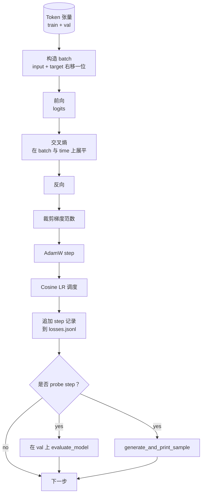

# 训练循环与评估（Training Loop and Evaluation）

> 译注：本文译自同目录 [`en.md`](./en.md)。术语遵循仓根 [TRANSLATION_GUIDE.md](../../../../TRANSLATION_GUIDE.md)。

> 不做测量的循环就是一个会撒谎的循环。本课构建驱动 GPT 模型的训练循环：带 weight decay（权重衰减）拆分的 AdamW、warmup 加 cosine 学习率调度、`calc_loss_batch` 辅助函数、在留出数据上跑的 `evaluate_model`、每 K 步一次的 `generate_and_print_sample` 定性探针，以及一份事后可以拿来画图的 JSONL loss 日志。同一套骨架可以训练你以后会写的每一个 decoder LLM。

**Type:** Build
**Languages:** Python
**Prerequisites:** Phase 19 lessons 30 to 35
**Time:** ~90 minutes

## 学习目标（Learning Objectives）

- 构建一个训练循环，按 next token 预测的正确输入与目标对齐方式计算 cross entropy（交叉熵）loss。
- 配置 AdamW，把 weight decay 只施加到权重张量上，而不施加到 LayerNorm 或 bias 张量上。
- 实现一个带线性 warmup 与 cosine 衰减的学习率调度，并随时间读出实际 LR。
- 用 `evaluate_model` 在留出的 split 上做评估，使 eval loss 在不同 run 之间可比。
- 每 K 步用 `generate_and_print_sample` 生成一个定性样本，赶在 loss 曲线之前发现 divergence（发散）。
- 把每步的 loss 持久化到 JSONL，方便重新加载、画图，并把训练日志当作交付物发布。

## 问题（Problem）

一个只打印 loss、其他什么都不做的训练脚本，会从三个方面失败。它无法告诉你 loss 是不是因为正确的原因在下降（模型可能过拟合训练集，却什么都没学到）。它无法告诉你是不是开始 diverge（一个 step 上 loss 飙升然后恢复，或者一个 step 飙升然后崩掉）。它无法告诉你模型到底学到了什么（loss 是个标量；生成的样本却是一段话）。这三种失败，除非循环主动测量，否则都会被掩盖。

本课的循环从三个方向测量。每一步在训练 batch 上的 loss。每 K 步在留出 batch 上的 loss。每 K 步从一个固定 prompt 出发的续写。训练日志落到 JSONL 里，让这个产物成为循环自己的证词。

## 概念（Concept）



两个不显然的点是 loss 对齐和 AdamW 的 decay 拆分。

### Loss 对齐（Loss alignment）

模型在每个位置都预测下一个 token。如果输入 batch 是 tokens `[t0, t1, t2, t3]`，那么目标 batch 必须是 `[t1, t2, t3, t4]`。Cross entropy 在扁平化后的形状 `(batch * seq, vocab)` 上对扁平化的目标 `(batch * seq,)` 计算。如果忘了这个 shift，你就在训练模型预测它自己——loss 会收敛到零，但什么有用的东西都没学到。

### AdamW 的 decay 拆分（AdamW decay split）

Weight decay 用于正则化权重张量，但不针对 normalization 的 scale 或 bias。把 decay 加在 LayerNorm 的 scale 上，会慢慢把 scale 推向零，从而破坏 normalization。把 decay 加在 bias 上数学上无害，但纯属浪费算力。标准做法是：矩阵形状的张量（linear 的权重、embedding table）施加 decay，凡是看起来像 scale 或 shift 的都不加。

### Warmup 加 cosine 调度（Warmup plus cosine schedule）

Warmup 在最初几百步里把学习率从零线性升到目标值，给 optimizer state 时间填充。Cosine 衰减在剩下的步数里把学习率重新降回零附近，让最后阶段以小步长精修权重。这种组合是开放权重 LLM 训练里最常见的调度，因为它消除了前一千步和最后一千步里大多数脆弱时刻。

### 留出评估（Held out evaluation）

`evaluate_model` 从 validation split 跑固定数量的 batch，累加 loss，除以 batch 数后返回。不算梯度。不开 dropout。在相同 seed 和相同 split 下，这个数字在不同 run 之间是可复现的。把留出 loss 与训练 loss 并排报告，是发现 overfitting（过拟合）的方式。

### 定性采样作为早期信号（Qualitative sampling as an early signal）

一个训练 loss 降得很漂亮、但生成样本全是同一个 token 的模型，是坏掉的。一个 loss 曲线看起来很平、但生成样本逐渐凝聚成连贯单词的模型，则是在学。定性探针比把整条曲线读一遍要快，能抓到标量漏掉的失败模式。

## 动手实现（Build It）

`code/main.py` 实现了：

- `make_batches(token_ids, batch_size, context_length)`：把一长串 token tensor 切成 input 和 target 对。
- `calc_loss_batch(model, inputs, targets)`：前向、扁平化，返回标量 cross entropy。
- `evaluate_model(model, val_loader, max_batches)`：在 no grad 下迭代固定数量的 validation batch，返回平均 loss。
- `generate_and_print_sample(model, prompt, max_new_tokens)`：在固定 prompt 上跑第 35 课的生成函数并打印结果。
- `build_param_groups(model, weight_decay)`：生成两组 AdamW 参数列表。
- `cosine_with_warmup(step, warmup_steps, total_steps, max_lr, min_lr)`：返回给定步的 LR。
- `train(...)`：跑循环，把 `outputs/losses.jsonl` 持久化下来，并每 `eval_every` 步打印 eval loss 与一个样本。
- 一个 demo：在合成数据上训练一个微型模型几步，写出 JSONL 日志，并在探针点打印 eval loss 与样本。Demo 在 CPU 上不到一分钟就能跑完。

运行：

```bash
python3 code/main.py
```

输出：每步一行 loss、每个探针步一次 eval loss、每个探针步一个生成样本，以及最终的 `outputs/losses.jsonl`，每行可以用 `json.loads` 加载。

## Stack

- `torch` 提供 autograd、optimizer 和各类模块。
- `main.py` 在本地重新实现第 35 课的 `GPTModel` 及相关模块。

## 真实世界里的工程化模式（Production patterns in the wild）

有三种模式，能把教科书里的循环变成可以放着跑通宵的东西。

**Gradient norm clipping 不可妥协。** 一个糟糕的 batch（异常数据、LR 飙升、数值边界场景）会产生一个巨大的梯度，把几小时训练的成果一笔勾销。在 `backward` 之后、`step` 之前调用 `torch.nn.utils.clip_grad_norm_(params, max_norm=1.0)`，能把 optimizer 保持在安全区间。clipping 值是一个自由参数；1 是大多数配置里都能活下来的默认值。

**用可恢复的 JSONL 日志，而不是 pickle 的状态。** 把每步 loss 记录成 JSONL 里的 `{"step": int, "train_loss": float, "lr": float}` 一行，是耐用的：任何 crash 都会留下一份可读产物，你可以 grep，可以用三十行 Python 画图，还可以通过读取最后一步来恢复训练。Pickle 状态会把你和生成那份文件的精确模块布局绑死，重构时极易破裂。

**Eval batch 来自一个固定切片。** validation tokens 在脚本启动时就被切成 batch，而不是临时切。可复现性依赖于 eval batch 在不同 run 间完全一致；否则比较两次 run 的 eval loss，测的就既是模型，也是 batch 顺序。

## 用起来（Use It）

- 本课的循环正是用真实数据训练一个 124M 模型时所用的同一套骨架。把合成 token tensor 换成 `datasets` 风格的 loader，循环原封不动也能跑。
- JSONL 日志是把一次训练变成证据的交付物。下一课会用它来对比一个新训出来的 checkpoint 与一个预训练好的 checkpoint。
- 定性样本探针是 scalar loss 替代不了的兜底。

## 练习（Exercises）

1. 给 `weight_decay_groups()` 加单元测试，确认 scale 和 bias 参数落入 no decay 组，而 linear 与 embedding 权重落入 decay 组。
2. 把合成的随机 token 换成一个小文本文件的字节，让 demo 在可读的东西上训练。验证生成样本用到的字符确实出现在文件中。
3. 给 cosine 调度加一个 `min_lr` 下限，设为 `max_lr` 的 10%，并重新画图。
4. 除了 JSONL 日志，每 `eval_every` 步还保存一个 checkpoint。加一个 `resume_from` 标志，重新加载模型状态与 optimizer 状态。
5. 在 loss 旁边记录每步吞吐（tokens per second），确认它稳定在一个区间。

## 关键术语（Key Terms）

| 术语 | 大家怎么说 | 实际含义 |
|------|-----------------|------------------------|
| Loss 对齐（Loss alignment） | "Shift by one" | 输入 token 在位置 0..T-1，目标 token 在位置 1..T；cross entropy 在扁平化形状上计算 |
| Decay 拆分（Decay split） | "Two groups" | AdamW 接收两组参数：矩阵形状的张量带 weight decay，scale 或 bias 张量不带 |
| Warmup | "Ramp" | 学习率在固定步数内从零升到目标值，让 optimizer state 有时间填充 |
| Eval batch（Eval batches） | "Held out batches" | validation token tensor 的一个固定切片，脚本启动时切一次，每个探针都用同一份 |
| 定性探针（Qualitative probe） | "Sample print" | 每 K 步从固定 prompt 做一次短生成并打印，用来捕捉单看 loss 看不到的失败模式 |

## 延伸阅读（Further Reading）

- Phase 19 lesson 35 介绍了循环所驱动的模型。
- Phase 19 lesson 37 介绍如何把预训练权重加载进同一个模型。
- Phase 10 lesson 04（pre training mini GPT）介绍真实数据上的训练流程。
- Phase 10 lesson 10（evaluation）介绍 cross entropy loss 之外更广的评估面。
